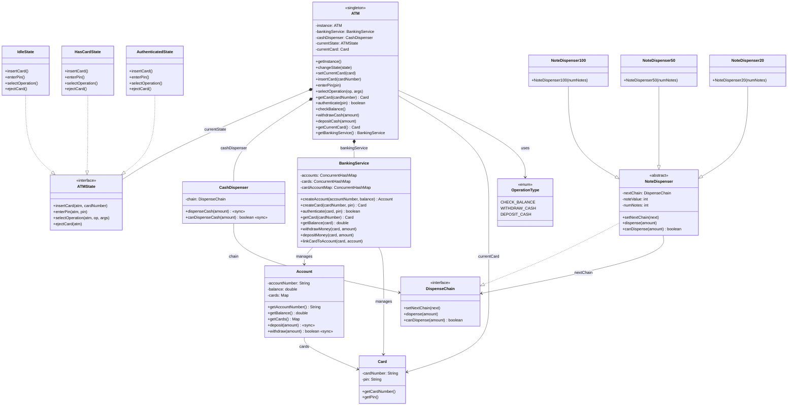

# ATM System — Low Level Design

A complete object-oriented design and Java implementation of an **ATM (Automated Teller Machine)** showcasing State and Chain of Responsibility patterns.

---

## Problem Statement

Design an ATM system that can:
- Authenticate users via card number and PIN
- Support balance inquiry, cash withdrawal, and cash deposit operations
- Dispense cash in optimal denominations ($100, $50, $20 notes)
- Interact with a banking service to validate accounts and process transactions
- Handle concurrent access with thread-safe operations
- Transition through well-defined states (Idle → HasCard → Authenticated)
- Gracefully handle errors (wrong PIN, insufficient balance, ATM out of cash)

---

## High-Level Flow

```
User approaches ATM
    │
    ▼
[IdleState] ── insertCard(cardNumber) ─────────────────────────────────┐
    │                                                                  │
    │   1. Look up Card via BankingService                             │
    │   2. Card found → setCurrentCard → transition to HasCardState    │
    │      Card not found → eject card, stay idle                      │
    │                                                                  │
    ▼                                                                  │
[HasCardState] ── enterPin(pin) ───────────────────────────────────────┤
    │                                                                  │
    │   1. Authenticate PIN via BankingService                         │
    │      ├── SUCCESS → transition to AuthenticatedState              │
    │      └── FAILURE → eject card → IdleState                        │
    │                                                                  │
    ▼                                                                  │
[AuthenticatedState] ── selectOperation(type, args) ───────────────────┤
    │                                                                  │
    │   CHECK_BALANCE  → display balance                               │
    │   WITHDRAW_CASH  → validate balance → CashDispenser chain        │
    │                     ├── $100 notes first                         │
    │                     ├── $50 notes next      ← Chain of           │
    │                     └── $20 notes last         Responsibility    │
    │   DEPOSIT_CASH   → credit account                                │
    │                                                                  │
    │   After any operation → eject card → IdleState                   │
    │                                                                  │
    ▼                                                                  │
[IdleState] ── waiting for next customer ──────────────────────────────┘
```

---

## Class Diagram

> **Interactive:** Open [`class-diagram.excalidraw`](class-diagram.excalidraw) at [excalidraw.com](https://excalidraw.com) (File → Open) for the full interactive diagram with colors and layout.


<details>
<summary>Mermaid Class Diagram (click to expand)</summary>


</details>

---

## Project Structure

```
atm/
├── pom.xml
├── README.md
└── src/main/java/com/atm/
    ├── ATMDemo.java                     # Entry point (main)
    │
    ├── model/                           # Domain models & entities
    │   ├── ATM.java                     # Singleton — main controller, delegates to state
    │   ├── Account.java                 # Bank account with synchronized balance ops
    │   ├── Card.java                    # ATM card (card number + PIN)
    │   ├── BankingService.java          # Manages accounts, cards, and authentication
    │   └── CashDispenser.java           # Delegates dispensing to chain of responsibility
    │
    ├── enums/                           # Enumerations
    │   └── OperationType.java           # CHECK_BALANCE, WITHDRAW_CASH, DEPOSIT_CASH
    │
    ├── state/                           # State pattern — ATM states
    │   ├── ATMState.java                # State interface
    │   ├── IdleState.java               # No card inserted, waiting
    │   ├── HasCardState.java            # Card inserted, waiting for PIN
    │   └── AuthenticatedState.java      # PIN verified, can perform operations
    │
    └── chain/                           # Chain of Responsibility — cash dispensing
        ├── DispenseChain.java           # Chain interface
        ├── NoteDispenser.java           # Abstract base — dispense logic
        ├── NoteDispenser100.java        # $100 denomination handler
        ├── NoteDispenser50.java         # $50 denomination handler
        └── NoteDispenser20.java         # $20 denomination handler
```

---

## Design Patterns Used

| Pattern | Where | Why |
|---------|-------|-----|
| **Singleton** | `ATM` | One ATM instance per system — shared state across all operations |
| **State** | `ATMState` + `IdleState`, `HasCardState`, `AuthenticatedState` | ATM behavior changes based on state — avoids complex if/else chains for card/PIN/operation flow |
| **Chain of Responsibility** | `DispenseChain` + `NoteDispenser` + denomination subclasses | Cash dispensing cascades through denominations ($100 → $50 → $20) — each handler takes what it can and passes the remainder |

---

## SOLID Principles Applied

| Principle | How |
|-----------|-----|
| **SRP** | `ATM` orchestrates flow, `BankingService` handles account logic, `CashDispenser` manages dispensing, each `ATMState` handles its own transitions |
| **OCP** | New denomination = new `NoteDispenser` subclass added to chain. New operation = new enum value + case in `AuthenticatedState`. New state = new `ATMState` implementation. |
| **LSP** | All `ATMState` implementations are interchangeable — `ATM` works with any state. All `NoteDispenser` subclasses are substitutable for `DispenseChain`. |
| **ISP** | `ATMState` has exactly 4 methods matching ATM interactions. `DispenseChain` has only 3 chain-specific methods. No bloated interfaces. |
| **DIP** | `ATM` depends on `ATMState` interface, not concrete states. `CashDispenser` depends on `DispenseChain` interface, not specific denomination classes. |

---

## Thread Safety

- `Account.deposit()` and `Account.withdraw()` are `synchronized` to prevent race conditions on balance
- `CashDispenser.dispenseCash()` and `canDispenseCash()` are `synchronized` — prevents concurrent dispensing from double-spending notes (single outer lock guards the entire chain)
- `BankingService` uses `ConcurrentHashMap` for thread-safe account/card lookups
- `ATM` Singleton uses double-checked locking with `volatile`

---

## Extensibility

- **New denomination** → create `NoteDispenser500` extending `NoteDispenser`, add to chain in `ATM` constructor
- **New operation** → add enum value in `OperationType`, add case in `AuthenticatedState.selectOperation()`
- **New state** → implement `ATMState` (e.g., `MaintenanceState`, `OutOfCashState`)
- **New authentication method** → extend `BankingService.authenticate()` (e.g., biometric, OTP)
- **Transaction logging** → add observer pattern to notify on each transaction event
