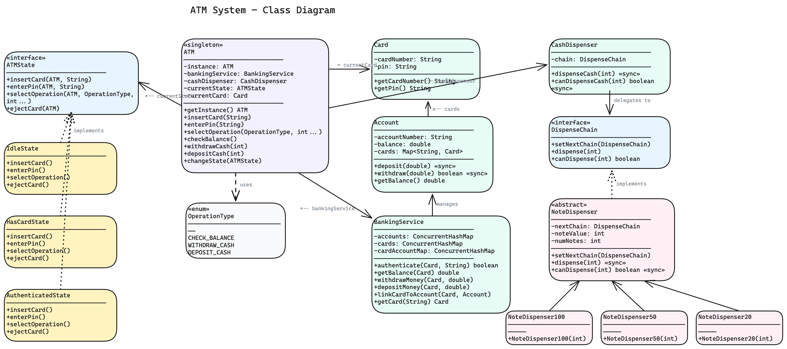

# ATM System — Low Level Design

A complete object-oriented design and Java implementation of an **ATM (Automated Teller Machine)** showcasing State and Chain of Responsibility patterns.

---

## Problem Statement

Design an ATM system that can:
- Authenticate users via card number and PIN
- Support balance inquiry, cash withdrawal, and cash deposit operations
- Dispense cash in optimal denominations ($100, $50, $20 notes)
- Interact with a banking service to validate accounts and process transactions
- Handle concurrent access with thread-safe operations
- Transition through well-defined states (Idle → HasCard → Authenticated)
- Gracefully handle errors (wrong PIN, insufficient balance, ATM out of cash)

---

## High-Level Flow

```
User approaches ATM
    │
    ▼
[IdleState] ── insertCard(cardNumber) ─────────────────────────────────┐
    │                                                                  │
    │   1. Look up Card via BankingService                             │
    │   2. Card found → setCurrentCard → transition to HasCardState    │
    │      Card not found → eject card, stay idle                      │
    │                                                                  │
    ▼                                                                  │
[HasCardState] ── enterPin(pin) ───────────────────────────────────────┤
    │                                                                  │
    │   1. Authenticate PIN via BankingService                         │
    │      ├── SUCCESS → transition to AuthenticatedState              │
    │      └── FAILURE → eject card → IdleState                        │
    │                                                                  │
    ▼                                                                  │
[AuthenticatedState] ── selectOperation(type, args) ───────────────────┤
    │                                                                  │
    │   CHECK_BALANCE  → display balance                               │
    │   WITHDRAW_CASH  → validate balance → CashDispenser chain        │
    │                     ├── $100 notes first                         │
    │                     ├── $50 notes next      ← Chain of           │
    │                     └── $20 notes last         Responsibility    │
    │   DEPOSIT_CASH   → credit account                                │
    │                                                                  │
    │   After any operation → eject card → IdleState                   │
    │                                                                  │
    ▼                                                                  │
[IdleState] ── waiting for next customer ──────────────────────────────┘
```

---

## Class Diagram

> **Interactive:** Open [`class-diagram.excalidraw`](class-diagram.excalidraw) at [excalidraw.com](https://excalidraw.com) (File → Open) for the full interactive diagram with colors and layout.



<details>
<summary>Mermaid Class Diagram (click to expand)</summary>


</details>

---

## How to Approach This Problem (Smallest → Biggest)

### Layer 1: The Atoms — Enum

Start with the simplest question: **"What can a user do at an ATM?"**

**`OperationType`** — `CHECK_BALANCE`, `WITHDRAW_CASH`, `DEPOSIT_CASH`. That's it. Three operations. Every ATM interaction in the world boils down to one of these (transfers are just a withdraw + deposit under the hood).

This enum is tiny, but it matters — it becomes the "instruction set" that the authenticated state switches on. Nail this first and the rest of the design has a clear vocabulary.

### Layer 2: The Value Objects — Card and Account

**`Card`** — `cardNumber + pin`. An immutable value object, just two `private final` strings. Think of it as the physical plastic card — it doesn't *do* anything, it just *is* an identity token. The Card never validates itself; it's just data that gets handed to a service for verification.

**`Account`** — `accountNumber + balance + cards`. This is the real money holder. A Card points to an Account, not the other way around conceptually — one account can have multiple cards (joint accounts, replacement cards).

The critical detail: `deposit()` and `withdraw()` are both `synchronized`. Two ATMs could be hitting the same account simultaneously (imagine a joint checking account). Without synchronization, you get classic race conditions — two $500 withdrawals from a $700 balance both succeeding.

**Interview power move**: "Card is a read-only identity token. Account is the mutable entity with synchronized balance operations. I separate them because a card *identifies* the user, but the account *holds* the state."

### Layer 3: The Banking Service — the bank behind the ATM

**`BankingService`** — manages accounts, cards, and the mapping between them. Think of this as the bank's backend that the ATM connects to over a network.

It does four things:
1. **Create** accounts and cards (and link them together)
2. **Authenticate** — compare the PIN on the card with what the user typed
3. **Query** — get the balance for a given card
4. **Transact** — withdraw or deposit money for a given card

All its internal maps use `ConcurrentHashMap` — because in a real system, many ATMs hit the same banking service concurrently.

**Why this is its own class**: The ATM doesn't know about accounts or balances directly. It asks the BankingService. This means if authentication changes (biometrics, OTP), you modify BankingService, not ATM. If you switch from in-memory to a database, same story — BankingService is the seam.

### Layer 4: The Chain of Responsibility — how cash gets dispensed

This is the most elegant part of the design. When you withdraw $570, the ATM doesn't just hand you 570 one-dollar bills. It picks the **optimal combination of denominations**: 5 x $100 + 1 x $50 + 1 x $20.

**`DispenseChain`** interface — 3 methods: `setNextChain()`, `dispense()`, `canDispense()`.

**`NoteDispenser`** (abstract) — holds a `noteValue`, a count of available notes (`numNotes`), and a pointer to the `nextChain`. The `dispense()` logic is beautifully simple:
1. How many of *my* notes can I use? `Math.min(amount / noteValue, numNotes)`
2. Dispense them, decrement my stock
3. If there's a remainder, pass it to the next handler in the chain

**`NoteDispenser100` → `NoteDispenser50` → `NoteDispenser20`** — three one-liner subclasses, each just calling `super(denomination, count)`. The chain is wired up in the ATM constructor: `c1 → c2 → c3`.

**Mental model**: Think of three cashiers sitting in a row. The first one only has $100 bills — she takes as many as she can from the amount and slides the remainder to the next cashier who only has $50s, who does the same and slides the remainder to the $20s cashier. If they collectively can't make exact change, `canDispense()` returns false *before* any money leaves the machine.

**Why Chain of Responsibility, not just a loop?** Because each handler can have its own inventory (`numNotes`), and adding a new denomination (say $500 or $10) means creating one new class and inserting it into the chain. No switch statements, no modification to existing dispensers.

### Layer 5: The Cash Dispenser — synchronized wrapper

**`CashDispenser`** — wraps the chain with two `synchronized` methods: `dispenseCash()` and `canDispenseCash()`.

Why a separate class instead of calling the chain directly? Two reasons:
1. **Single lock point** — both the "can I?" check and the actual dispensing are synchronized on the same object. Without this, you could have a TOCTOU race: Thread A checks "can I dispense $500?" (yes), Thread B checks "can I dispense $500?" (yes), then both dispense and the ATM runs dry.
2. **Validation gate** — `canDispenseCash()` rejects amounts not divisible by the smallest denomination before even touching the chain.

### Layer 6: The ATM State — the heart of the design

Ask yourself: should an ATM let you select an operation before you've entered your PIN? Should it let you insert a second card while one is already in? **No.** Different phases of the interaction have completely different rules. This is a textbook **State Pattern**.

**`ATMState`** interface — 4 methods: `insertCard()`, `enterPin()`, `selectOperation()`, `ejectCard()`. Every action the user can take passes through the current state.

**`IdleState`** — no card, waiting for a customer.
- **insertCard()**: Look up the card via BankingService. Found? Save it, transition to HasCardState. Not found? Eject and stay idle.
- **enterPin() / selectOperation()**: Print an error — "insert a card first." The *state* enforces the protocol, not a bunch of boolean flags.

**`HasCardState`** — card is in, waiting for PIN.
- **enterPin()**: Authenticate via BankingService. Success? Transition to AuthenticatedState. Failure? Eject card, go back to Idle.
- **insertCard()**: Error — card already inserted. **selectOperation()**: Error — enter PIN first.

**`AuthenticatedState`** — PIN verified, user can operate.
- **selectOperation()**: Switch on `OperationType` — check balance, withdraw (with balance + dispenser validation), or deposit. After *any* operation, automatically eject the card and return to Idle.
- **insertCard() / enterPin()**: Error — already authenticated.

**Interview power move**: "Each state rejects invalid actions and only allows the one valid next step. The state machine is *self-documenting* — you can read IdleState and immediately see that the only valid action is insertCard(). Want to add a MaintenanceState where nothing works? One new class, no changes to existing states."

### Layer 7: The ATM — the Singleton orchestrator

**`ATM`** ties everything together:
- **Singleton** (double-checked locking with `volatile`) — one physical ATM = one instance
- Owns a `BankingService`, a `CashDispenser`, a `currentState`, and the `currentCard`
- Public methods (`insertCard()`, `enterPin()`, `selectOperation()`) simply **delegate to the current state** — the ATM itself has no conditional logic about what phase it's in
- Banking operations (`checkBalance()`, `withdrawCash()`, `depositCash()`) are called *by* the states — the ATM acts as a mediator between state logic and banking logic

The `withdrawCash()` method shows a nice defensive pattern: debit the account first, attempt to dispense, and if dispensing fails, **rollback** by re-crediting the account. This is a poor man's transaction — in a real system you'd use actual DB transactions, but the intent is what matters in an interview.

### Interview Summary (say this to your interviewer)

> "I start with the OperationType enum — the vocabulary of what users can do. Then Card and Account — Card is an immutable identity token, Account is the mutable balance holder with synchronized operations. BankingService sits between the ATM and accounts, handling auth and transactions. For cash dispensing, I use Chain of Responsibility — each denomination handler takes what it can and passes the remainder down. CashDispenser wraps the chain with a single synchronized lock to prevent TOCTOU races. For the interaction flow, I use State Pattern — IdleState, HasCardState, AuthenticatedState — each state enforces what actions are valid and transitions to the next. Finally, ATM is a Singleton that delegates every user action to its current state."

Each layer only knows about the layer below it. State Pattern controls the *flow*, Chain of Responsibility controls the *dispensing*.

---

## Project Structure

```
atm/
├── pom.xml
├── README.md
└── src/main/java/com/atm/
    ├── ATMDemo.java                     # Entry point (main)
    │
    ├── model/                           # Domain models & entities
    │   ├── ATM.java                     # Singleton — main controller, delegates to state
    │   ├── Account.java                 # Bank account with synchronized balance ops
    │   ├── Card.java                    # ATM card (card number + PIN)
    │   ├── BankingService.java          # Manages accounts, cards, and authentication
    │   └── CashDispenser.java           # Delegates dispensing to chain of responsibility
    │
    ├── enums/                           # Enumerations
    │   └── OperationType.java           # CHECK_BALANCE, WITHDRAW_CASH, DEPOSIT_CASH
    │
    ├── state/                           # State pattern — ATM states
    │   ├── ATMState.java                # State interface
    │   ├── IdleState.java               # No card inserted, waiting
    │   ├── HasCardState.java            # Card inserted, waiting for PIN
    │   └── AuthenticatedState.java      # PIN verified, can perform operations
    │
    └── chain/                           # Chain of Responsibility — cash dispensing
        ├── DispenseChain.java           # Chain interface
        ├── NoteDispenser.java           # Abstract base — dispense logic
        ├── NoteDispenser100.java        # $100 denomination handler
        ├── NoteDispenser50.java         # $50 denomination handler
        └── NoteDispenser20.java         # $20 denomination handler
```

---

## Design Patterns Used

| Pattern | Where | Why |
|---------|-------|-----|
| **Singleton** | `ATM` | One ATM instance per system — shared state across all operations |
| **State** | `ATMState` + `IdleState`, `HasCardState`, `AuthenticatedState` | ATM behavior changes based on state — avoids complex if/else chains for card/PIN/operation flow |
| **Chain of Responsibility** | `DispenseChain` + `NoteDispenser` + denomination subclasses | Cash dispensing cascades through denominations ($100 → $50 → $20) — each handler takes what it can and passes the remainder |

---

## SOLID Principles Applied

| Principle | How |
|-----------|-----|
| **SRP** | `ATM` orchestrates flow, `BankingService` handles account logic, `CashDispenser` manages dispensing, each `ATMState` handles its own transitions |
| **OCP** | New denomination = new `NoteDispenser` subclass added to chain. New operation = new enum value + case in `AuthenticatedState`. New state = new `ATMState` implementation. |
| **LSP** | All `ATMState` implementations are interchangeable — `ATM` works with any state. All `NoteDispenser` subclasses are substitutable for `DispenseChain`. |
| **ISP** | `ATMState` has exactly 4 methods matching ATM interactions. `DispenseChain` has only 3 chain-specific methods. No bloated interfaces. |
| **DIP** | `ATM` depends on `ATMState` interface, not concrete states. `CashDispenser` depends on `DispenseChain` interface, not specific denomination classes. |

---

## Thread Safety

- `Account.deposit()` and `Account.withdraw()` are `synchronized` to prevent race conditions on balance
- `CashDispenser.dispenseCash()` and `canDispenseCash()` are `synchronized` — prevents concurrent dispensing from double-spending notes (single outer lock guards the entire chain)
- `BankingService` uses `ConcurrentHashMap` for thread-safe account/card lookups
- `ATM` Singleton uses double-checked locking with `volatile`

---

## Extensibility

- **New denomination** → create `NoteDispenser500` extending `NoteDispenser`, add to chain in `ATM` constructor
- **New operation** → add enum value in `OperationType`, add case in `AuthenticatedState.selectOperation()`
- **New state** → implement `ATMState` (e.g., `MaintenanceState`, `OutOfCashState`)
- **New authentication method** → extend `BankingService.authenticate()` (e.g., biometric, OTP)
- **Transaction logging** → add observer pattern to notify on each transaction event
