# Coffee Vending Machine — Low Level Design

A complete object-oriented design and Java implementation of a **Coffee Vending Machine** showcasing five design patterns working together.

---

## Problem Statement

Design a coffee vending machine that can:
- Offer multiple coffee types (Espresso, Latte, Cappuccino)
- Support optional toppings (Extra Sugar, Caramel Syrup) that modify price and recipe
- Track ingredient inventory and reject orders when stock is insufficient
- Accept money, calculate change, and support cancellation with refunds
- Transition through well-defined states (Ready → Selecting → Paid → Dispensing)

---

## High-Level Flow

```
User interacts with machine
    │
    ▼
[ReadyState] ── selectCoffee(type, toppings) ──────────────────────────┐
    │                                                                  │
    │   1. CoffeeFactory.createCoffee(type)         ← Factory Pattern  │
    │   2. Wrap with Decorator(s) for toppings      ← Decorator Pattern│
    │   3. machine.setSelectedCoffee(wrappedCoffee)                    │
    │                                                                  │
    ▼                                                                  │
[SelectingState] ── insertMoney(amount) ───────────────────────────────┤
    │                                                                  │
    │   Accumulate money. If total >= price → transition to PaidState  │
    │                                                                  │
    ▼                                                                  │
[PaidState] ── dispenseCoffee() ───────────────────────────────────────┤
    │                                                                  │
    │   1. Check Inventory.hasIngredients(recipe)                      │
    │      ├── NO  → OutOfIngredientState → refund → ReadyState        │
    │      └── YES → deductIngredients(recipe)                         │
    │                                                                  │
    │   2. coffee.prepare()                          ← Template Method │
    │      ├── grindBeans()                                            │
    │      ├── brew()                                                  │
    │      ├── addCondiments()   ← hook (milk, foam, etc.)             │
    │      └── pourIntoCup()                                           │
    │                                                                  │
    │   3. Return change if overpaid                                   │
    │   4. Reset → ReadyState                                          │
    │                                                                  │
    ▼                                                                  │
[ReadyState] ── waiting for next customer ─────────────────────────────┘

    At any point during Selecting/Paid:
        cancel() → refund money → reset → ReadyState
```

---

## Class Diagram

> **Interactive:** Open [`class-diagram.excalidraw`](class-diagram.excalidraw) at [excalidraw.com](https://excalidraw.com) (File → Open) for the full interactive diagram with colors and layout.

```mermaid
classDiagram
    direction TB

    class CoffeeType {
        <<enum>>
        ESPRESSO
        LATTE
        CAPPUCCINO
    }

    class Ingredient {
        <<enum>>
        COFFEE_BEANS
        WATER
        MILK
        SUGAR
        CARAMEL_SYRUP
    }

    class ToppingType {
        <<enum>>
        EXTRA_SUGAR
        CARAMEL_SYRUP
    }

    class VendingMachineState {
        <<interface>>
        +selectCoffee(machine, coffee)
        +insertMoney(machine, amount)
        +dispenseCoffee(machine)
        +cancel(machine)
    }

    class ReadyState {
        +selectCoffee()
        +insertMoney()
        +dispenseCoffee()
        +cancel()
    }

    class SelectingState {
        +selectCoffee()
        +insertMoney()
        +dispenseCoffee()
        +cancel()
    }

    class PaidState {
        +selectCoffee()
        +insertMoney()
        +dispenseCoffee()
        +cancel()
    }

    class OutOfIngredientState {
        +selectCoffee()
        +insertMoney()
        +dispenseCoffee()
        +cancel()
    }

    class CoffeeVendingMachine {
        <<singleton>>
        -INSTANCE: CoffeeVendingMachine
        -state: VendingMachineState
        -selectedCoffee: Coffee
        -moneyInserted: int
        +getInstance()
        +selectCoffee(type, toppings)
        +insertMoney(amount)
        +dispenseCoffee()
        +cancel()
        +setState(state)
        +getState() VendingMachineState
        +setSelectedCoffee(coffee)
        +getSelectedCoffee() Coffee
        +setMoneyInserted(amount)
        +getMoneyInserted() int
        +reset()
    }

    class Inventory {
        <<singleton>>
        -INSTANCE: Inventory
        -stock: Map~Ingredient, Integer~
        +getInstance()
        +addStock(ingredient, qty)
        +hasIngredients(recipe) boolean
        +deductIngredients(recipe) «sync»
        +printInventory()
    }

    class CoffeeFactory {
        +createCoffee(type) Coffee «static»
    }

    class Coffee {
        <<abstract>>
        #coffeeType: String
        +getCoffeeType() String
        +prepare() «template method»
        -grindBeans()
        -brew()
        -pourIntoCup()
        #addCondiments()*
        +getPrice()* int
        +getRecipe()* Map
    }

    class Espresso {
        +getPrice() int → 150
        +getRecipe() Map
        +addCondiments()
    }

    class Cappuccino {
        +getPrice() int → 250
        +getRecipe() Map
        +addCondiments()
    }

    class Latte {
        +getPrice() int → 220
        +getRecipe() Map
        +addCondiments()
    }

    class CoffeeDecorator {
        <<abstract>>
        #decoratedCoffee: Coffee
        +getPrice() int
        +getRecipe() Map
        +prepare()
    }

    class ExtraSugarDecorator {
        -COST: int = 10
        -RECIPE_ADDITION: Map
        +getCoffeeType() String
        +getPrice() int
        +getRecipe() Map
        +prepare()
    }

    class CaramelSyrupDecorator {
        -COST: int = 30
        -RECIPE_ADDITION: Map
        +getCoffeeType() String
        +getPrice() int
        +getRecipe() Map
        +prepare()
    }

    ReadyState ..|> VendingMachineState
    SelectingState ..|> VendingMachineState
    PaidState ..|> VendingMachineState
    OutOfIngredientState ..|> VendingMachineState

    Espresso --|> Coffee
    Cappuccino --|> Coffee
    Latte --|> Coffee

    CoffeeDecorator --|> Coffee
    ExtraSugarDecorator --|> CoffeeDecorator
    CaramelSyrupDecorator --|> CoffeeDecorator

    CoffeeVendingMachine *-- VendingMachineState : state
    CoffeeVendingMachine *-- Coffee : selectedCoffee
    CoffeeDecorator *-- Coffee : decoratedCoffee

    CoffeeVendingMachine --> Inventory : uses
    CoffeeVendingMachine --> CoffeeFactory : uses
    CoffeeFactory ..> Coffee : creates

    Inventory --> Ingredient : tracks
    CoffeeVendingMachine --> CoffeeType : uses
    CoffeeVendingMachine --> ToppingType : uses
```


<details>
<summary>Mermaid Class Diagram (click to expand)</summary>


</details>

---

## How to Approach This Problem (Smallest → Biggest)

### Layer 1: The Atoms — Enums

Start with three tiny questions: **"What kinds of coffee exist?"**, **"What raw materials does a machine hold?"**, and **"What optional extras can a customer add?"**

**`CoffeeType`** — `ESPRESSO`, `LATTE`, `CAPPUCCINO`. This is your menu. Each value maps to a completely different recipe, price, and preparation behavior. In a real Starbucks, this is the menu board.

**`Ingredient`** — `COFFEE_BEANS`, `WATER`, `MILK`, `SUGAR`, `CARAMEL_SYRUP`. These are the physical things inside the machine's canisters. Every coffee is just a combination of these in different quantities. Think of them as the periodic table for coffee — everything is built from these elements.

**`ToppingType`** — `EXTRA_SUGAR`, `CARAMEL_SYRUP`. These are the *customer-facing* add-ons. Notice this is separate from `Ingredient` on purpose — a topping is a concept (something the customer asks for), while an ingredient is a physical resource (something the machine consumes). This separation matters because one topping might require multiple ingredients in the future.

**Interview power move**: "I start with enums because they define the vocabulary of the domain. Before writing a single class, I want the bounded language — what coffee types, what raw materials, what add-ons. Everything else speaks in these terms."

### Layer 2: The Product — Coffee as an abstract concept

Ask yourself: what do Espresso, Latte, and Cappuccino have in common? They all have a **price**, a **recipe** (Map of Ingredient to quantity), and a **preparation sequence**. But each one differs in those details. That screams abstract class.

**`Coffee`** — the abstract base class with two roles baked in:

1. **Template Method** — `prepare()` defines the skeleton: `grindBeans()` → `brew()` → `addCondiments()` → `pourIntoCup()`. The first three steps are identical for every coffee. Only `addCondiments()` varies — Espresso does nothing, Latte adds steamed milk, Cappuccino adds milk and foam. The subclass only overrides the *hook*, not the whole algorithm.

2. **Decorator Component** — `Coffee` is also the component interface for the Decorator pattern. Decorators will wrap it to add toppings. This dual role is elegant: any `Coffee` — whether base or decorated — exposes `getPrice()`, `getRecipe()`, and `prepare()`.

**`Espresso`**, **`Latte`**, **`Cappuccino`** — concrete coffees. Each one sets its own `coffeeType` name, returns its own price (150, 220, 250), defines its recipe as an immutable `Map.of(...)`, and overrides `addCondiments()`.

**Mental model**: A Coffee is like a blueprint card in the machine — "to make a Latte, you need 7g beans, 30ml water, 150ml milk, it costs 220, and during prep you add steamed milk." The machine reads this card and follows it.

### Layer 3: The Decorator Layer — toppings without touching base classes

Here's the key design question: how do you add Extra Sugar to a Latte without modifying `Latte.java`? You could add boolean flags like `hasExtraSugar`, but then every new topping means modifying every coffee class. That violates OCP.

**`CoffeeDecorator`** — abstract class that extends `Coffee` and wraps another `Coffee`. It delegates `getPrice()`, `getRecipe()`, and `prepare()` to the wrapped coffee by default. Concrete decorators override these to *add* behavior.

**`ExtraSugarDecorator`** — wraps any coffee, adds 10 to the price, merges `{SUGAR: 1}` into the recipe, and after calling `super.prepare()` (which prepares the base coffee), prints "Stirring in Extra Sugar."

**`CaramelSyrupDecorator`** — same pattern, adds 30 to price, merges `{CARAMEL_SYRUP: 10}` into the recipe, prints "Drizzling Caramel Syrup on top."

The beauty: `new CaramelSyrupDecorator(new ExtraSugarDecorator(new Latte()))` is a valid `Coffee`. You can stack arbitrarily. The machine doesn't know or care how many layers of decoration exist — it just calls `getPrice()`, `getRecipe()`, and `prepare()` on whatever `Coffee` it's holding.

**Interview power move**: "I use Decorator here instead of subclassing because toppings are combinatorial. With 3 coffees and 2 toppings, subclassing gives you 3 x 4 = 12 classes (Latte, LatteWithSugar, LatteWithCaramel, LatteWithBoth, ...). Decorator gives you 3 + 2 = 5 classes, and handles any combination at runtime."

### Layer 4: The Factory — decoupling creation from use

**`CoffeeFactory`** — a static factory method that takes a `CoffeeType` enum and returns the right `Coffee` subclass. `ESPRESSO → new Espresso()`, `LATTE → new Latte()`, `CAPPUCCINO → new Cappuccino()`.

This seems simple, but it has a critical purpose: the `CoffeeVendingMachine` never says `new Latte()`. It says `CoffeeFactory.createCoffee(type)`. When you add a new coffee type (say Americano), you add the enum value, create the class, and add one case in the factory. The machine code doesn't change.

**Mental model**: The factory is like the machine's internal lookup table — "customer pressed button 2, that maps to Latte, here's a fresh Latte object."

### Layer 5: The State Machine — behavior that changes with context

This is where most candidates either shine or stumble. A vending machine behaves **completely differently** depending on what phase of the transaction it's in:
- In Ready state, you can select coffee but can't dispense
- In Selecting state, you can insert money but can't select again
- In Paid state, you can dispense but can't insert more money
- In OutOfIngredient state, everything fails gracefully and triggers a refund

Instead of `if (state == READY) { ... } else if (state == SELECTING) { ... }` in every method, you make each state a separate class. This is the **State Pattern**.

**`VendingMachineState`** — interface with exactly 4 methods: `selectCoffee()`, `insertMoney()`, `dispenseCoffee()`, `cancel()`. These are the 4 buttons on the machine. Every state must respond to all 4 — even if the response is "you can't do that right now."

**`ReadyState`** — idle. `selectCoffee()` stores the coffee and transitions to SelectingState. Everything else prints an error message.

**`SelectingState`** — coffee chosen, waiting for money. `insertMoney()` accumulates the amount. Once total >= price, it transitions to PaidState. `cancel()` refunds and resets to ReadyState.

**`PaidState`** — money sufficient, ready to make coffee. `dispenseCoffee()` is where the magic happens: check inventory → deduct ingredients → call `coffee.prepare()` (Template Method runs) → return change → reset to ReadyState. If inventory is insufficient, it transitions to OutOfIngredientState and auto-cancels.

**`OutOfIngredientState`** — a transient error state. `cancel()` refunds money and resets to ReadyState. Everything else is rejected.

**Interview power move**: "Each state only knows about legal transitions from itself. ReadyState knows it can go to SelectingState, PaidState knows it can go to ReadyState or OutOfIngredientState. The state machine is distributed across state objects rather than centralized in a giant switch statement — this makes it trivially extensible. Need a MaintenanceState? One new class, zero changes to existing states."

### Layer 6: The Inventory — resource management as a Singleton

**`Inventory`** — a Singleton holding a `ConcurrentHashMap<Ingredient, Integer>`. It knows three things: how to add stock, how to check if a recipe can be fulfilled (`hasIngredients`), and how to atomically deduct ingredients (`deductIngredients`, which is `synchronized`).

The Inventory is separate from the machine because SRP — the machine orchestrates the transaction flow, the inventory manages physical resources. In a real system, you might have one inventory shared across multiple dispensing units.

### Layer 7: The Machine — the Singleton orchestrator

**`CoffeeVendingMachine`** — ties everything together. It's a Singleton (one machine per system). It holds:
- The current **state** (delegation target)
- The currently **selected coffee** (a `Coffee` object, possibly decorated)
- The **money inserted** so far

When `selectCoffee(CoffeeType, List<ToppingType>)` is called, the machine does two things before delegating to the state: (1) uses `CoffeeFactory` to create the base coffee, and (2) wraps it with decorator(s) for each topping. The result is a fully-configured `Coffee` object that knows its own total price, combined recipe, and full preparation sequence. Then the state takes over.

**Mental model**: The machine is the cashier at a coffee shop. It doesn't know how to make coffee (that's the `Coffee` object). It doesn't know about inventory levels (that's `Inventory`). It doesn't know the rules of the transaction flow (that's the current `State`). It just coordinates — "customer wants X, here's the order, pass it along."

### Interview Summary (say this to your interviewer)

> "I start with three enums — CoffeeType, Ingredient, ToppingType — to define the domain vocabulary. Then I model Coffee as an abstract class with Template Method for preparation (grind, brew, condiments, pour) and abstract getPrice/getRecipe. Concrete coffees override the hook and define their recipe. For toppings, I use Decorator — each decorator wraps a Coffee and adds to the price, recipe, and prep steps, so toppings are combinatorial without a class explosion. CoffeeFactory decouples creation from the machine. The machine itself is a state machine — Ready, Selecting, Paid, OutOfIngredient — each state handles all 4 actions differently, making transitions explicit and extensible. Inventory is a separate Singleton for resource management with synchronized deduction. The CoffeeVendingMachine Singleton orchestrates everything: factory creates, decorators wrap, state delegates, inventory checks."

Each layer only knows about the layer below it. Five patterns — Singleton, State, Factory, Decorator, Template Method — each solving exactly one problem.

---

## Project Structure

```
coffee-vending-machine/
├── pom.xml
├── README.md
└── src/main/java/com/coffeevendingmachine/
    ├── CoffeeVendingMachineDemo.java        # Entry point (main)
    │
    ├── model/                                # Domain models & entities
    │   ├── CoffeeVendingMachine.java         # Singleton — orchestrates states
    │   ├── Inventory.java                    # Singleton — tracks ingredient stock
    │   ├── Coffee.java                       # Abstract base (Template Method + Decorator component)
    │   ├── Espresso.java                     # Concrete coffee — no condiments
    │   ├── Latte.java                        # Concrete coffee — steamed milk
    │   └── Cappuccino.java                   # Concrete coffee — milk + foam
    │
    ├── enums/                                # Enumerations
    │   ├── CoffeeType.java                   # ESPRESSO, LATTE, CAPPUCCINO
    │   ├── Ingredient.java                   # COFFEE_BEANS, WATER, MILK, SUGAR, CARAMEL_SYRUP
    │   └── ToppingType.java                  # EXTRA_SUGAR, CARAMEL_SYRUP
    │
    ├── decorator/                            # Decorator pattern — toppings
    │   ├── CoffeeDecorator.java              # Abstract decorator base
    │   ├── ExtraSugarDecorator.java          # Adds sugar cost + recipe
    │   └── CaramelSyrupDecorator.java        # Adds caramel cost + recipe
    │
    ├── factory/                              # Factory pattern — coffee creation
    │   └── CoffeeFactory.java                # Creates coffee by CoffeeType enum
    │
    └── state/                                # State pattern — machine states
        ├── VendingMachineState.java           # State interface
        ├── ReadyState.java                    # Idle, waiting for selection
        ├── SelectingState.java                # Coffee selected, waiting for payment
        ├── PaidState.java                     # Paid, ready to dispense
        └── OutOfIngredientState.java          # Insufficient stock, refund & reset
```

---

## Design Patterns Used

| Pattern | Where | Why |
|---------|-------|-----|
| **Singleton** | `CoffeeVendingMachine`, `Inventory` | One machine and one inventory per system |
| **State** | `VendingMachineState` + 4 concrete states | Machine behavior changes with state — avoids complex if/else chains |
| **Factory** | `CoffeeFactory` | Centralized coffee creation from enum type — decouples caller from concrete classes |
| **Decorator** | `CoffeeDecorator` + topping decorators | Dynamically adds toppings (price, recipe, preparation) without modifying base coffee classes |
| **Template Method** | `Coffee.prepare()` | Common preparation skeleton (grind → brew → condiments → pour); each coffee only overrides `addCondiments()` |

---

## SOLID Principles Applied

| Principle | How |
|-----------|-----|
| **SRP** | `Inventory` manages stock, `CoffeeFactory` handles creation, each `State` handles its own transitions, `Coffee` subclasses define their own recipe/price |
| **OCP** | New coffee type = new subclass + enum + factory case. New topping = new decorator. New state = new state class. Zero changes to existing code. |
| **LSP** | All `Coffee` subclasses (Espresso, Latte, Cappuccino) and decorators are interchangeable wherever `Coffee` is expected |
| **ISP** | `VendingMachineState` has exactly the 4 operations the machine supports — no extras |
| **DIP** | `CoffeeVendingMachine` depends on `VendingMachineState` interface, not concrete states. Works with `Coffee` abstraction, not specific types. |

---

## Thread Safety

- `Inventory.deductIngredients()` is `synchronized` to prevent race conditions on stock
- `Inventory` uses `ConcurrentHashMap` for thread-safe stock reads
- Singleton instances use eager initialization (class-loading guarantees thread safety)

---

## Extensibility

- **New coffee type** → add enum value in `CoffeeType`, create subclass extending `Coffee`, add case in `CoffeeFactory`
- **New topping** → add enum value in `ToppingType`, create decorator extending `CoffeeDecorator`, add case in `selectCoffee()`
- **New state** → implement `VendingMachineState` (e.g., `MaintenanceState`)
- **New payment method** → can be added without modifying existing state logic

---

## Common Interview Questions (Rapid Fire)

### Concurrency questions (asked whenever your code uses `synchronized` or a `Concurrent*` collection)

> Interviewers treat these keywords as an invitation. The moment they spot `Inventory.deductIngredients()` marked `synchronized` and the `private final Map<Ingredient, Integer> stock = new ConcurrentHashMap<>()` field, they ask *"why that and not the alternative?"* See **[CONCURRENCY-GUIDE.md](../CONCURRENCY-GUIDE.md)** for full explanations; the rapid-fire versions:

### Q1. Why is `Inventory.deductIngredients()` marked `synchronized` — isn't `ConcurrentHashMap` already thread-safe?

Because the method is a **check-then-act** sequence, not a single map operation. It first calls `hasIngredients(recipe)` (read) and *then* does `stock.put(ingredient, stock.get(ingredient) - qty)` (write) for each ingredient. `ConcurrentHashMap` makes each individual `get`/`put` atomic, but it can't make the *check* and the *act* atomic together — two threads could both pass `hasIngredients` for the last shot of milk, then both deduct, driving stock negative (a **lost update / oversell**). `synchronized` makes the whole verify-and-deduct block atomic so only one order mutates `stock` at a time.

### Q2. Why is the deduct loop itself unsafe without the lock, even though each `put` is atomic?

`stock.put(ingredient, stock.get(ingredient) - qty)` is a **read-modify-write**: read the count, subtract, write it back. If two threads interleave between the `get` and the `put`, one update is silently lost. Atomicity of a single `put` only guarantees the *write* lands cleanly — it does nothing to protect the compute-then-store gap. The fix is either the surrounding `synchronized` (what this code does) or an atomic compute like `stock.merge(...)` / `stock.compute(...)`.

### Q3. Why `ConcurrentHashMap` for `stock` instead of a plain `HashMap` or `Collections.synchronizedMap`?

A plain `HashMap` is *not* safe under concurrent writes — interleaved `put`s can corrupt internal buckets or, on older JDKs, spin into an infinite loop on resize. `Collections.synchronizedMap` is safe but locks the *entire* map on every single operation, so concurrent reads (e.g. `hasIngredients` streaming over entries, `printInventory`) serialize needlessly. `ConcurrentHashMap` gives lock-free reads and fine-grained (per-bin) write locking, so the high-frequency reads stay fast while writes remain safe — the right default for a shared, read-heavy stock map.

### Q4. If the deduct path is already `synchronized`, why not just use a `HashMap` and rely on the lock?

Because not every access to `stock` goes through the lock. `addStock()` (via `merge`), `hasIngredients()`, and `printInventory()` all touch the map *without* `synchronized`. With a plain `HashMap`, a restock or a read happening concurrently with a deduct would be an unguarded data race. `ConcurrentHashMap` keeps those un-synchronized accessors safe on their own, while `synchronized` is reserved only for the compound check-then-act in `deductIngredients()` that the map alone can't protect.
