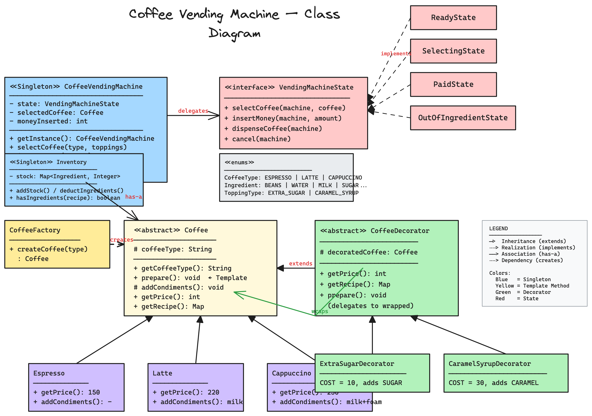

# Coffee Vending Machine — Low Level Design

A complete object-oriented design and Java implementation of a **Coffee Vending Machine** showcasing five design patterns working together.

---

## Problem Statement

Design a coffee vending machine that can:
- Offer multiple coffee types (Espresso, Latte, Cappuccino)
- Support optional toppings (Extra Sugar, Caramel Syrup) that modify price and recipe
- Track ingredient inventory and reject orders when stock is insufficient
- Accept money, calculate change, and support cancellation with refunds
- Transition through well-defined states (Ready → Selecting → Paid → Dispensing)

---

## High-Level Flow

```
User interacts with machine
    │
    ▼
[ReadyState] ── selectCoffee(type, toppings) ──────────────────────────┐
    │                                                                  │
    │   1. CoffeeFactory.createCoffee(type)         ← Factory Pattern  │
    │   2. Wrap with Decorator(s) for toppings      ← Decorator Pattern│
    │   3. machine.setSelectedCoffee(wrappedCoffee)                    │
    │                                                                  │
    ▼                                                                  │
[SelectingState] ── insertMoney(amount) ───────────────────────────────┤
    │                                                                  │
    │   Accumulate money. If total >= price → transition to PaidState  │
    │                                                                  │
    ▼                                                                  │
[PaidState] ── dispenseCoffee() ───────────────────────────────────────┤
    │                                                                  │
    │   1. Check Inventory.hasIngredients(recipe)                      │
    │      ├── NO  → OutOfIngredientState → refund → ReadyState        │
    │      └── YES → deductIngredients(recipe)                         │
    │                                                                  │
    │   2. coffee.prepare()                          ← Template Method │
    │      ├── grindBeans()                                            │
    │      ├── brew()                                                  │
    │      ├── addCondiments()   ← hook (milk, foam, etc.)             │
    │      └── pourIntoCup()                                           │
    │                                                                  │
    │   3. Return change if overpaid                                   │
    │   4. Reset → ReadyState                                          │
    │                                                                  │
    ▼                                                                  │
[ReadyState] ── waiting for next customer ─────────────────────────────┘

    At any point during Selecting/Paid:
        cancel() → refund money → reset → ReadyState
```

---

## Class Diagram

> **Interactive:** Open [`class-diagram.excalidraw`](class-diagram.excalidraw) at [excalidraw.com](https://excalidraw.com) (File → Open) for the full interactive diagram with colors and layout.


<details>
<summary>Mermaid Class Diagram (click to expand)</summary>


</details>

---

## Project Structure

```
coffee-vending-machine/
├── pom.xml
├── README.md
└── src/main/java/com/coffeevendingmachine/
    ├── CoffeeVendingMachineDemo.java        # Entry point (main)
    │
    ├── model/                                # Domain models & entities
    │   ├── CoffeeVendingMachine.java         # Singleton — orchestrates states
    │   ├── Inventory.java                    # Singleton — tracks ingredient stock
    │   ├── Coffee.java                       # Abstract base (Template Method + Decorator component)
    │   ├── Espresso.java                     # Concrete coffee — no condiments
    │   ├── Latte.java                        # Concrete coffee — steamed milk
    │   └── Cappuccino.java                   # Concrete coffee — milk + foam
    │
    ├── enums/                                # Enumerations
    │   ├── CoffeeType.java                   # ESPRESSO, LATTE, CAPPUCCINO
    │   ├── Ingredient.java                   # COFFEE_BEANS, WATER, MILK, SUGAR, CARAMEL_SYRUP
    │   └── ToppingType.java                  # EXTRA_SUGAR, CARAMEL_SYRUP
    │
    ├── decorator/                            # Decorator pattern — toppings
    │   ├── CoffeeDecorator.java              # Abstract decorator base
    │   ├── ExtraSugarDecorator.java          # Adds sugar cost + recipe
    │   └── CaramelSyrupDecorator.java        # Adds caramel cost + recipe
    │
    ├── factory/                              # Factory pattern — coffee creation
    │   └── CoffeeFactory.java                # Creates coffee by CoffeeType enum
    │
    └── state/                                # State pattern — machine states
        ├── VendingMachineState.java           # State interface
        ├── ReadyState.java                    # Idle, waiting for selection
        ├── SelectingState.java                # Coffee selected, waiting for payment
        ├── PaidState.java                     # Paid, ready to dispense
        └── OutOfIngredientState.java          # Insufficient stock, refund & reset
```

---

## Design Patterns Used

| Pattern | Where | Why |
|---------|-------|-----|
| **Singleton** | `CoffeeVendingMachine`, `Inventory` | One machine and one inventory per system |
| **State** | `VendingMachineState` + 4 concrete states | Machine behavior changes with state — avoids complex if/else chains |
| **Factory** | `CoffeeFactory` | Centralized coffee creation from enum type — decouples caller from concrete classes |
| **Decorator** | `CoffeeDecorator` + topping decorators | Dynamically adds toppings (price, recipe, preparation) without modifying base coffee classes |
| **Template Method** | `Coffee.prepare()` | Common preparation skeleton (grind → brew → condiments → pour); each coffee only overrides `addCondiments()` |

---

## SOLID Principles Applied

| Principle | How |
|-----------|-----|
| **SRP** | `Inventory` manages stock, `CoffeeFactory` handles creation, each `State` handles its own transitions, `Coffee` subclasses define their own recipe/price |
| **OCP** | New coffee type = new subclass + enum + factory case. New topping = new decorator. New state = new state class. Zero changes to existing code. |
| **LSP** | All `Coffee` subclasses (Espresso, Latte, Cappuccino) and decorators are interchangeable wherever `Coffee` is expected |
| **ISP** | `VendingMachineState` has exactly the 4 operations the machine supports — no extras |
| **DIP** | `CoffeeVendingMachine` depends on `VendingMachineState` interface, not concrete states. Works with `Coffee` abstraction, not specific types. |

---

## Thread Safety

- `Inventory.deductIngredients()` is `synchronized` to prevent race conditions on stock
- `Inventory` uses `ConcurrentHashMap` for thread-safe stock reads
- Singleton instances use eager initialization (class-loading guarantees thread safety)

---

## Extensibility

- **New coffee type** → add enum value in `CoffeeType`, create subclass extending `Coffee`, add case in `CoffeeFactory`
- **New topping** → add enum value in `ToppingType`, create decorator extending `CoffeeDecorator`, add case in `selectCoffee()`
- **New state** → implement `VendingMachineState` (e.g., `MaintenanceState`)
- **New payment method** → can be added without modifying existing state logic
