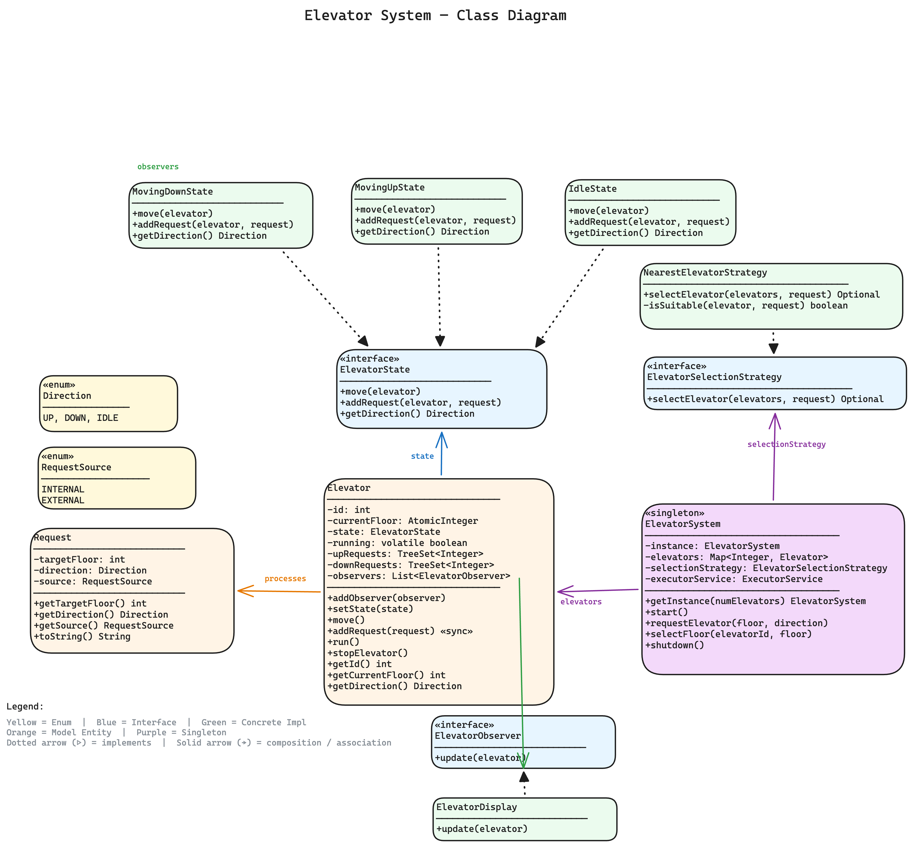
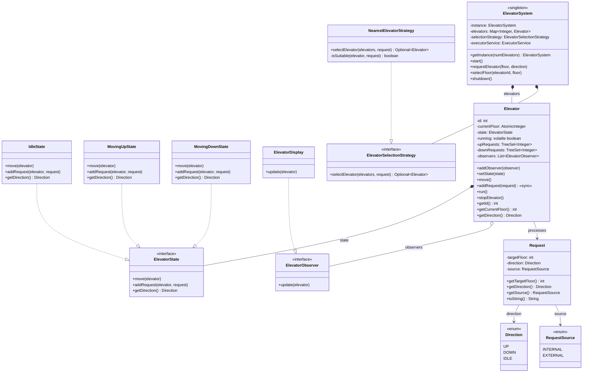

# Elevator System — Low Level Design

A complete object-oriented design and Java implementation of a **multi-elevator system** showcasing State, Strategy, and Observer patterns with thread-safe concurrent elevator operation.

---

## Problem Statement

Design an elevator system that can:
- Manage multiple elevators serving multiple floors in a building
- Handle **external requests** (hall calls — user presses UP/DOWN on a floor)
- Handle **internal requests** (cabin calls — user selects a destination floor inside the elevator)
- Dispatch the optimal elevator using a pluggable selection strategy (nearest-first)
- Move elevators floor-by-floor, stopping at requested floors in the current direction of travel
- Notify display boards in real-time as elevators move (Observer pattern)
- Transition elevator behavior cleanly between Idle, MovingUp, and MovingDown states (State pattern)
- Handle concurrent requests across multiple elevator threads safely

---

## High-Level Flow

```
User at floor 5 presses UP button (External Request)
    │
    ▼
[ElevatorSystem] ── requestElevator(5, UP) ────────────────────────────────┐
    │                                                                      │
    │   1. Create Request(floor=5, direction=UP, source=EXTERNAL)          │
    │   2. ElevatorSelectionStrategy.selectElevator(elevators, request)    │
    │      └── NearestElevatorStrategy: find idle/same-direction nearest   │
    │   3. Selected elevator.addRequest(request)                           │
    │                                                                      │
    ▼                                                                      │
[ElevatorState] ── addRequest() ───────────────────────────────────────────┤
    │                                                                      │
    │   IdleState:                                                         │
    │     floor > current → upRequests.add(floor)                          │
    │     floor < current → downRequests.add(floor)                        │
    │                                                                      │
    │   MovingUpState / MovingDownState:                                   │
    │     INTERNAL → add to appropriate queue based on direction            │
    │     EXTERNAL → add to same-direction queue if ahead, else opposite   │
    │                                                                      │
    ▼                                                                      │
[Elevator.run()] ── move() loop (1s per floor) ────────────────────────────┤
    │                                                                      │
    │   IdleState.move():                                                  │
    │     upRequests not empty → transition to MovingUpState               │
    │     downRequests not empty → transition to MovingDownState           │
    │                                                                      │
    │   MovingUpState.move():                                              │
    │     currentFloor++ → if reached target → stop, remove from queue     │
    │     queue empty → transition to IdleState                            │
    │                                                                      │
    │   MovingDownState.move():                                            │
    │     currentFloor-- → if reached target → stop, remove from queue     │
    │     queue empty → transition to IdleState                            │
    │                                                                      │
    │   Each floor change → notifyObservers() → ElevatorDisplay updates    │
    │                                                                      │
    ▼                                                                      │
User enters elevator, presses floor 10 (Internal Request)                  │
    │                                                                      │
    ▼                                                                      │
[ElevatorSystem] ── selectFloor(elevatorId=1, floor=10) ───────────────────┘
    │
    │   Create Request(floor=10, direction=IDLE, source=INTERNAL)
    │   elevator.addRequest(request) → added to upRequests
    │   Elevator continues serving in current direction
```

---

## Class Diagram

> **Interactive:** Open [`class-diagram.excalidraw`](class-diagram.excalidraw) at [excalidraw.com](https://excalidraw.com) (File → Open) for the full interactive diagram with colors and layout.



<details>
<summary>Mermaid Class Diagram (click to expand)</summary>


</details>

---

## How to Approach This Problem (Smallest → Biggest)

### Layer 1: The Atoms — Enums

Start with the two simplest questions: **"What directions can an elevator go?"** and **"Where can a request come from?"**

**`Direction`** — `UP`, `DOWN`, `IDLE`. Think of the arrow indicators above any real elevator. At any moment, an elevator is either going up, going down, or just sitting there idle.

**`RequestSource`** — `INTERNAL`, `EXTERNAL`. This is the key insight most people miss early. There are **two fundamentally different ways** someone interacts with an elevator:
- **EXTERNAL** (hall button): "I'm on floor 5, I want to go DOWN" — you don't know *where* they're going yet, just the direction
- **INTERNAL** (cabin button): "I'm inside elevator 2, take me to floor 8" — you know the exact destination, but direction is implicit

This distinction drives a LOT of the design. In an interview, if you start by recognizing these two request types, you immediately look sharp.

### Layer 2: The Request — what someone is asking for

`Request = targetFloor + direction + source` — one immutable value object.

For an **external** request, `targetFloor` is where the person is standing (floor 5) and `direction` is which way they want to go (DOWN). For an **internal** request, `targetFloor` is where they want to reach (floor 8), and direction is `IDLE` (because we figure it out by comparing to current floor).

**Mental model**: A Request is like a sticky note — "come to floor X" or "go to floor X". It gets created and handed off. It never changes.

### Layer 3: The Elevator State — how the elevator *behaves*

Ask yourself: does an idle elevator respond to a new request the same way a moving elevator does? **No.** So instead of writing `if (state == IDLE) { ... } else if (state == MOVING_UP) { ... }` spaghetti everywhere, you make each state its own class. This is the **State Pattern**.

**`ElevatorState` interface** — 3 methods:
- `move(elevator)` — "what should I do on the next tick?"
- `addRequest(elevator, request)` — "a new request came in, what do I do with it?"
- `getDirection()` — "which way am I going?"

**`IdleState`** — the elevator is just sitting there.
- **move()**: Check if there are pending up-requests or down-requests. If yes, transition to that state. If not, do nothing.
- **addRequest()**: Simple — if target is above me, put it in `upRequests`. Below me, put it in `downRequests`.

**`MovingUpState`** — going upward.
- **move()**: Move one floor up. If we've reached a requested floor, stop and remove it from the set. If no more up-requests, go back to Idle.
- **addRequest()**: Can I pick this up along the way? Internal requests always go to the right queue. External requests going UP and ahead of me? Add to upRequests (I'll get them on the way). Going DOWN? Queue them for later in downRequests.

**`MovingDownState`** — mirror of MovingUpState.

**Why this matters in interviews**: The interviewer asks "what if a new request comes while the elevator is moving?" — you say "the current state object decides how to handle it — each state has its own logic." Want to add a `DoorOpenState` or `MaintenanceState` later? Just add a new class. No existing code changes.

### Layer 4: The Elevator — the physical car

`Elevator = id + currentFloor + state + upRequests (TreeSet) + downRequests (TreeSet)`

Two key data structures:
- **`upRequests`** — a `TreeSet` (sorted ascending). When going up, you serve the nearest floor above you first. `first()` = lowest = nearest above.
- **`downRequests`** — a `TreeSet` with reverse comparator (sorted descending). When going down, you serve the nearest floor below you first. `first()` = highest = nearest below.

This is the **SCAN/LOOK algorithm** — like a disk head sweeping in one direction, serving all requests along the way, then reversing. The two sorted sets make this trivial.

The Elevator implements `Runnable` — it runs in its own thread, calling `move()` every 1 second. It **delegates** everything to its current state. It also holds a list of **observers** — every state change or floor change triggers a notification.

### Layer 5: The Observer — side effects without coupling

**`ElevatorObserver`** interface with a single `update(elevator)` method. **`ElevatorDisplay`** implements it to print current floor and direction.

In a real building, every floor has a display showing where each elevator is. The elevator shouldn't know about displays. It just says "something changed" and whoever is listening reacts. Want to add logging, analytics, or a mobile app feed? Just add another observer. No elevator code changes.

### Layer 6: The Strategy — which elevator to send

When someone presses the hall button on floor 5, and you have 3 elevators, **which one do you send?**

**`ElevatorSelectionStrategy`** interface → `selectElevator(elevators, request) → Optional<Elevator>`

**`NearestElevatorStrategy`** — pick the closest *suitable* one. "Suitable" means:
1. **Idle** elevators are always suitable (they're free)
2. **Moving in the same direction AND haven't passed the floor yet** — e.g., elevator going UP at floor 3 is suitable for an UP request at floor 5. But NOT for an UP request at floor 2 (already passed it).

If no elevator is suitable, return `Optional.empty()` — "system busy, please wait."

**Interview power move**: "This is where I'd use Strategy pattern because the selection algorithm is a business decision — you might want nearest-first for speed, or load-balanced to distribute wear, or zone-based where each elevator owns certain floors. Swapping the strategy is one line of code."

### Layer 7: The ElevatorSystem — the Singleton coordinator

This is the entry point for all requests:
1. Holds all elevators in a `Map<Integer, Elevator>`
2. Starts each elevator in its own thread via `ExecutorService`
3. Routes **external requests** through the strategy to pick an elevator
4. Routes **internal requests** directly to the specified elevator (user is already inside)
5. Singleton because one building = one elevator system

### Interview Summary (say this to your interviewer)

> "First I need Direction and RequestSource enums — they define the vocabulary. Then Request — an immutable value object. Then I realize the elevator behaves differently when idle vs moving, so I reach for State Pattern. The Elevator itself holds two TreeSets (the SCAN algorithm) and delegates behavior to its current state. For display boards, Observer pattern — decouples the UI from the car. For 'which elevator to send', Strategy pattern — decouples the selection policy from the system. Finally ElevatorSystem ties it all together as a Singleton."

Each layer only knows about the layer below it. Each design pattern solves exactly one problem.

---

## Project Structure

```
elevator-system/
├── pom.xml
├── README.md
├── class-diagram.excalidraw
└── src/main/java/com/elevatorsystem/
    ├── ElevatorSystemDemo.java              # Entry point (main) — simulation scenarios
    │
    ├── model/                               # Domain models & entities
    │   ├── Request.java                     # Immutable request (target floor + direction + source)
    │   ├── Elevator.java                    # Runnable elevator — state delegation, request queues, observer notifications
    │   └── ElevatorSystem.java              # Singleton — facade for dispatching requests to elevators
    │
    ├── enums/                               # Enumerations
    │   ├── Direction.java                   # UP, DOWN, IDLE
    │   └── RequestSource.java              # INTERNAL (cabin), EXTERNAL (hall)
    │
    ├── state/                               # State pattern — elevator movement states
    │   ├── ElevatorState.java               # State interface (move, addRequest, getDirection)
    │   ├── IdleState.java                   # No pending requests — transitions to MovingUp/Down
    │   ├── MovingUpState.java               # Serving upRequests — moves floor-by-floor ascending
    │   └── MovingDownState.java             # Serving downRequests — moves floor-by-floor descending
    │
    ├── observer/                            # Observer pattern — real-time display updates
    │   ├── ElevatorObserver.java            # Observer interface
    │   └── ElevatorDisplay.java             # Console display — logs elevator id, floor, direction
    │
    └── strategy/                            # Strategy pattern — elevator selection algorithm
        ├── ElevatorSelectionStrategy.java   # Strategy interface
        └── NearestElevatorStrategy.java     # Picks nearest idle/same-direction elevator
```

---

## Design Patterns Used

| Pattern | Where | Why |
|---------|-------|-----|
| **Singleton** | `ElevatorSystem` | One system controller per building — shared state across all requests |
| **State** | `ElevatorState` + `IdleState`, `MovingUpState`, `MovingDownState` | Elevator behavior (how it moves, how it queues requests) changes based on direction — eliminates complex if/else on direction |
| **Strategy** | `ElevatorSelectionStrategy` + `NearestElevatorStrategy` | Elevator dispatching algorithm is swappable — can add round-robin, least-loaded, zone-based strategies without changing `ElevatorSystem` |
| **Observer** | `ElevatorObserver` + `ElevatorDisplay` | Decouples UI/logging from elevator logic — display boards auto-update on every floor change and state transition |

---

## SOLID Principles Applied

| Principle | How |
|-----------|-----|
| **SRP** | `Elevator` manages movement and requests, `ElevatorSystem` handles dispatching, `ElevatorState` implementations handle direction-specific logic, `ElevatorDisplay` handles presentation |
| **OCP** | New selection algorithm = new `ElevatorSelectionStrategy` impl. New state = new `ElevatorState` impl. New display = new `ElevatorObserver` impl. No existing code modified. |
| **LSP** | All `ElevatorState` implementations are interchangeable — `Elevator` delegates without knowing concrete type. All `ElevatorSelectionStrategy` implementations return `Optional<Elevator>`. |
| **ISP** | `ElevatorState` has exactly 3 methods. `ElevatorObserver` has a single `update()`. `ElevatorSelectionStrategy` has a single `selectElevator()`. No bloated interfaces. |
| **DIP** | `Elevator` depends on `ElevatorState` interface, not concrete states. `ElevatorSystem` depends on `ElevatorSelectionStrategy` interface, not `NearestElevatorStrategy`. |

---

## Thread Safety

- `Elevator.addRequest()` is `synchronized` — prevents race conditions when multiple threads submit requests to the same elevator concurrently
- `currentFloor` uses `AtomicInteger` — thread-safe reads across observer notifications and strategy comparisons
- `running` flag is `volatile` — ensures visibility of shutdown signal across threads
- `ElevatorSystem` Singleton uses double-checked locking with `volatile`
- Each `Elevator` runs in its own thread via `ExecutorService` — truly concurrent operation
- `TreeSet` for request queues is accessed only under the synchronized `addRequest()` or the single elevator thread's `move()` — no concurrent modification

---

## Extensibility

- **New selection strategy** → implement `ElevatorSelectionStrategy` (e.g., `ZoneBasedStrategy`, `LeastLoadedStrategy`), inject into `ElevatorSystem`
- **New elevator state** → implement `ElevatorState` (e.g., `MaintenanceState`, `EmergencyStopState`) — elevator transitions to it like any other state
- **New observer** → implement `ElevatorObserver` (e.g., `MobileAppNotifier`, `FloorIndicatorPanel`), attach via `elevator.addObserver()`
- **Capacity limit** → add `maxCapacity` field to `Elevator`, check before accepting requests
- **Priority requests** → extend `Request` with priority, use `PriorityQueue` instead of `TreeSet`
- **Floor range per elevator** → add min/max floor to `Elevator`, filter in selection strategy

---

## Common Interview Questions (Rapid Fire)

### Concurrency questions (asked whenever your code uses `volatile`, `Atomic*`, `synchronized`, or an `ExecutorService`)

> Interviewers treat these keywords as an invitation. The moment they spot `Elevator.running` declared `volatile` (the flag the elevator's own thread reads in `run()` while another thread flips it in `stopElevator()`) they ask *"why that and not the alternative?"* See **[CONCURRENCY-GUIDE.md](../CONCURRENCY-GUIDE.md)** for full explanations; the rapid-fire versions:

### Q1. `Elevator.running` is `volatile` — why, and what does it guarantee?

`volatile` gives the **visibility guarantee**: the write in `stopElevator()` (`running = false`) is flushed to main memory and the elevator thread's `while (running)` loop in `run()` reads it fresh instead of from a stale CPU-cache copy — without it the thread could spin forever. It is a **single-writer, no read-modify-write** flag, so we get correctness without the cost of `synchronized`; the keyword guarantees visibility, **not** atomicity, but a plain boolean flag never needs atomicity.

### Q2. `Elevator.currentFloor` is an `AtomicInteger` — why not a plain `int` or `synchronized`?

`currentFloor` is written by the **owning elevator thread** in `setCurrentFloor()` but read concurrently by **observer notifications** and the `NearestElevatorStrategy` comparing distances on the request thread. `AtomicInteger` provides a **lock-free, atomic, visible** read/write (`get()`/`set()`) — a plain `int` would risk stale reads across cores, and a full `synchronized` block would be heavier than needed for a single counter. It is the right tool because the floor is a frequently-read shared scalar, not a compound structure.

### Q3. `Elevator.addRequest()` is `synchronized` — why is `volatile`/`Atomic*` not enough here?

`addRequest()` performs a **compound mutation**: it delegates to the current state which inspects `currentFloor` and then adds to `upRequests` or `downRequests` (non-thread-safe `TreeSet`s). Multiple threads (external dispatch via `requestElevator()` and internal calls via `selectFloor()`) can hit the same elevator at once, so the whole read-decide-mutate sequence must be **atomic** — that needs a lock. `volatile`/`AtomicInteger` only make a single field visible/atomic; they cannot guard a multi-step update to a `TreeSet`, which is exactly why `synchronized` is used instead.

### Q4. Why an `ExecutorService` (`Executors.newFixedThreadPool`) instead of raw `new Thread()` per elevator?

`ElevatorSystem` holds a `fixedThreadPool(numElevators)` and `submit()`s each `Elevator` (a `Runnable`) in `start()`. A **managed pool** gives clean lifecycle control — `shutdown()` stops accepting work and lets running elevators finish — plus thread reuse, bounded thread count, and a single ownership point, whereas raw `new Thread().start()` scatters unmanaged threads with no coordinated shutdown and no reuse. Fixed-size is the natural fit because the elevator count is known and constant.

### Q5. The `ElevatorSystem` Singleton uses double-checked locking with a `volatile instance` — why both?

The `synchronized (ElevatorSystem.class)` block makes the *creation* atomic so two threads can't both build an instance; the outer null-check avoids paying for the lock on every `getInstance()` call after construction. The `instance` field **must be `volatile`** so other threads see a fully-constructed object — without it, instruction reordering could publish a non-null reference before the constructor finishes, handing out a half-initialized system.
