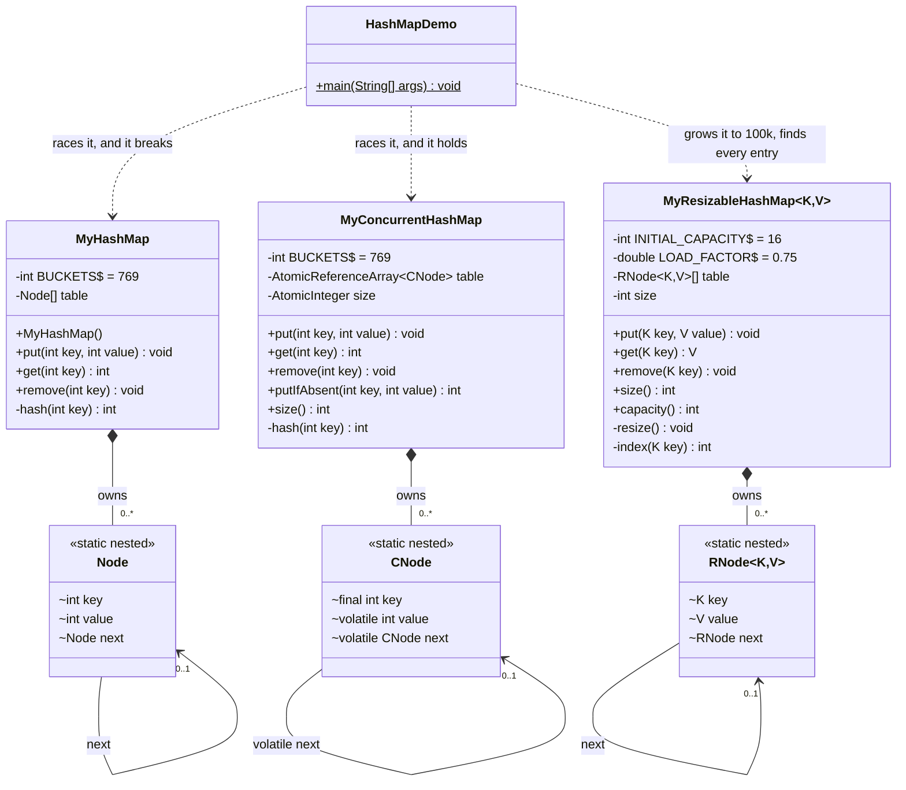

# HashMap — Low Level Design

Design a HashMap from scratch (LeetCode 706), grow it into a generic map that resizes, then make it
thread-safe by changing three things.

## Problem Statement

```java
class MyHashMap {
    public MyHashMap() { }
    public void put(int key, int value) { }
    public int get(int key) { }        // -1 if the key isn't there
    public void remove(int key) { }
}
```

- `put`, `get`, `remove` in **O(1) average**
- Two keys can land in the same slot — handle it without losing either
- `put` on a key that already exists **overwrites**, it does not add a second copy
- Constraints: `0 <= key <= 10⁶`, `0 <= value <= 10⁶`, up to 10⁴ calls

**Follow-up 1 (the LLD-round framing):** drop the call limit and the `int` keys. Make it
`MyResizableHashMap<K, V>` — any key type via `hashCode` / `equals`, `null` for "absent", and a table
that doubles once it is 75% full so operations stay O(1) however many entries arrive. In an LLD round
this is usually where the interviewer *expects* you to end up; the fixed-size version is the opener.

**Follow-up 2 (usually the second half of the round):** what breaks with two threads, and how you fix it.

**Not asked for:** iterators, tree bins, shrinking, the `java.util.Map` interface.
Knowing where the question stops is part of answering it.

## High-Level Flow

```
put(key, value)                     get(key)                  remove(key)
      |                                 |                          |
      v                                 v                          v
 i = key % 769                    i = key % 769             i = key % 769
      |                                 |                          |
      v                                 v                          v
 walk chain at table[i]           walk chain at table[i]    put a dummy node in front
      |                                 |                   of the chain
      +-- key found?                    +-- key found?             |
      |     yes -> overwrite            |     yes -> return value  v
      |            return               |                    walk with prev
      |                                 +-- ran out           |
      v                                       -> return -1    +-- prev.next is the key?
 prepend a new node                                           |     yes -> prev.next = prev.next.next
 as the new head                                              |
                                                              v
                                                        table[i] = dummy.next
```

`MyResizableHashMap.put` is the same picture with one step bolted on the end:

```
put(key, value)
      |
      v
 i = |key.hashCode() % capacity|
 walk chain at table[i] -- key found? -- yes --> overwrite, return   (size unchanged, so never resizes)
      |
      no
      v
 prepend a new node, size++
      |
      v
 size > capacity * 0.75 ?
      |
      yes --> resize(): new table of 2 x capacity, size = 0,
              put() every old entry again
```

The whole design is those pictures. Everything below explains why each one looks like that.

## Class Diagram

[Interactive Excalidraw source](class-diagram.excalidraw)


<details>
<summary>Mermaid Class Diagram (click to expand)</summary>



</details>

## How to Approach This Problem (Smallest → Biggest)

### Layer 1: A hash map is an array, and the hash is just an index

If the keys were `0..768` you would not write a hash map. You would write `int[769]` and index it
directly — that is where O(1) comes from. Array indexing.

The keys here go up to a million, so you cannot have a slot per key. So you squash the key into a
legal index: `key % 769`. Now the array works again. Everything else in this problem exists to fix
the one thing that squashing broke — **two different keys can now get the same index.**

### Layer 2: Two keys, one slot — so a slot holds a list, not a value

`1` and `770` both give index 1. If a slot holds one value, the second `put` destroys the first.

So each slot holds the **head of a linked list**, and colliding keys queue up in it. Nothing is ever
lost; the chain just gets longer.

```
table[0] -> null
table[1] -> [1539] -> [770] -> [1]     three keys, all congruent to 1 mod 769
table[2] -> [2]
```

The other option is *open addressing* — on a collision, walk to the next free slot. It is worth
naming, but chaining is the right choice to write, and the reason is `remove`: with open addressing
you cannot just blank a slot, because that breaks the search path for every key that walked past it.
You would need tombstones. Chaining makes `remove` a pointer splice.

### Layer 3: A key appears once, so `put` must look before it inserts

This is the line that fails people. A map has no duplicate keys, so `put` walks the chain first:

- key already in the chain → **overwrite the value and return**
- walked the whole chain, not there → **prepend a new node**

Skip the walk and you get two nodes for key 7. `get` returns the first one it hits, so a later `put`
looks ignored, and one `remove` deletes one copy and uncovers a stale one.

Prepending (rather than appending) is deliberate: the new node's `next` is the old head, so insert is
O(1) with no tail pointer and no second traversal.

### Layer 4: `remove` — a dummy node dissolves both awkward cases

Removing from a linked list normally needs two branches: *is it the head?* (re-point `table[i]`) or
*is it deeper?* (re-point `prev.next`). Plus a check for an empty bucket.

Put a throwaway node in front of the chain and all three collapse into one loop:

```java
Node dummy = new Node(-1, -1, table[i]);        // dummy -> [old head] -> ...
for (Node prev = dummy; prev.next != null; prev = prev.next) {
    if (prev.next.key == key) { prev.next = prev.next.next; break; }
}
table[i] = dummy.next;                          // the head may be what we just removed
```

Now the real head has a `prev` like everything else. An empty bucket needs no special case either —
`dummy.next` is null, the loop never runs, and `table[i] = null` puts it back unchanged. That last
line is not optional: if we unlinked the head, `dummy.next` is the *new* head.

### Layer 5: `-1` for "missing" is a bug the problem statement pays for

`get` returns `-1` when the key is absent — but `-1` would also be a perfectly good value to store.
`get(k) == -1` cannot tell "not there" from "there, holding -1".

It is safe here **only because the problem pins `0 <= value <= 10⁶`**, so `-1` is never a real value.
Say that out loud. It is exactly why `java.util.HashMap` returns `null` and offers `containsKey`, and
why `ConcurrentHashMap` bans null entirely.

### Layer 6: Why 769, and what the JDK does instead

769 is **prime**. Real keys are rarely random — they come in strides (multiples of 10, of 16, ids
spaced by a constant). A composite bucket count shares factors with those strides and packs them
into a few buckets. A prime shares a factor with almost nothing, so strided keys spread out.

The JDK goes the other way: capacity is always a **power of two**, so the index is `hash & (n-1)` —
a one-cycle bitmask instead of a ~20-cycle division. But a mask only reads the *low* bits, so it
needs `h ^ (h >>> 16)` first to mix the high bits down. Two valid designs:

| | this solution | `java.util.HashMap` |
|---|---|---|
| bucket count | prime (769) | power of two |
| index | `key % 769` | `hash & (n - 1)` |
| cost | one division | one AND |
| needs bit-mixing? | no, the prime does it | yes, `h ^ (h >>> 16)` |

With 10⁴ calls over 769 buckets the expected chain is ~13, so all three ops are O(1) average and
O(n) worst case — every key congruent mod 769.

### Layer 7: Grow it — `MyResizableHashMap<K, V>`

769 fixed buckets is fine *only* because of the 10⁴-call limit. In an LLD round there is no limit:
put a million entries in and every chain is ~1,300 long, so "O(1) average" quietly became O(n / 769).
O(1) average is a promise about **entries per bucket**, and you can only keep it by growing the table.

It is `MyHashMap` with three changes — nothing else moves:

| | `MyHashMap` | `MyResizableHashMap<K, V>` |
|---|---|---|
| keys | `int`, compared with `==` | any `K`: bucket from `hashCode()`, match with `equals()` |
| table | 769 buckets forever | starts at 16, **doubles** once `size > capacity * 0.75` |
| "absent" | `-1` (safe only because values are pinned ≥ 0) | `null` |

The growth is one check at the end of `put` and one short method:

```java
size++;
if (size > table.length * LOAD_FACTOR) resize();   // 13th entry into 16 buckets -> 32

private void resize() {
    Node<K, V>[] old = table;
    table = new Node[old.length * 2];
    size = 0;                                       // put() counts them back up
    for (Node<K, V> head : old)
        for (Node<K, V> cur = head; cur != null; cur = cur.next)
            put(cur.key, cur.value);
}
```

**Why every entry has to move:** the index is `key.hashCode() % capacity` — it depends on the capacity.
Double the capacity and the same key can land in a different bucket. Leave it where it was and `get`
looks in the new bucket and never finds it. Re-`put`ting everything is the simplest way to re-place them.

**Why 0.75:** it's the space/time knob. Lower wastes empty buckets; higher lengthens chains. 0.75 is the
JDK default.

**Why double, and why that keeps `put` O(1):** a resize is O(n) — every entry moves. But doubling means
the next resize is n puts away, so the total work over n puts is n + n/2 + n/4 + … < 2n. Each put pays
a constant share: **amortized O(1)**. Growing by a fixed +16 instead would make it O(n) per put.

**Why `Math.abs`:** `hashCode()` can be negative, and `%` keeps the sign — `-7 % 16` is `-7`, not a valid
index. `MyHashMap` never needed this because its keys were pinned ≥ 0.

**What the JDK does on top (say it, don't write it):** it caches each key's hash on the node so a
resize never calls `hashCode()` again, keeps the capacity a power of two so the index is a fast
bitmask `hash & (n - 1)`, and relinks the existing nodes instead of re-putting them.

### Layer 8: Two threads — three changes, and that is genuinely all

Hand `MyHashMap` to two threads and it silently loses data. Two threads prepending to the same
bucket both read the old head, and the second write erases the first's node. The demo loses a few
dozen entries out of 16,000 on every run.

Do not try to recall the JDK's 500 lines. Take *this* class and change three things:

| | `MyHashMap` | `MyConcurrentHashMap` |
|---|---|---|
| the array | `Node[] table` | `AtomicReferenceArray<Node> table` |
| a counter, if you add one | `int size; size++` | `AtomicInteger; incrementAndGet()` |
| **empty bucket** | `table[i] = node` | `table.compareAndSet(i, null, node)` — **no lock** |
| **non-empty bucket** | walk and mutate | `synchronized (head) { walk and mutate }` |
| `get` | walk the chain | **exactly the same, and lock-free** |

**Why `size++` needs an atomic:** it is three operations — read, add, write. Two threads interleave
and an increment vanishes.

**Why CAS on an empty bucket:** `compareAndSet(i, null, node)` publishes the node *only if* the slot
is still null. The loser's CAS fails, it loops, and on the retry the bucket is no longer empty so it
takes the locked path. A whole class of lost writes fixed with no lock at all.

**Why lock the head and not the map:** `synchronized (this)` is correct but serialises everything —
two reads of unrelated keys in unrelated buckets queue behind one monitor for no reason. The head
node is a free, already-existing lock object, one per bucket:

```
synchronized (this)              synchronized (head)
T1 -> LOCKS WHOLE MAP            T1 -> bucket 1 -> locks that head
T2 -> WAITS                      T2 -> bucket 5 -> locks a different head
                                 (both run at once)
```

That is the Java 8 insight: **the bucket array already partitions the keys**, so it is already a set
of locks. Java 7 used 16 fixed segments; Java 8 dropped them because per-bucket is finer and free.

### Layer 9: Two details the short version gets wrong

**The lock can go stale.** Between reading `head` and acquiring its monitor, another thread can
*remove* that node. You now hold a lock on a detached node, and the next writer reads the new head
and locks a different object — two threads in one chain. Fix, three lines, and it is what the JDK
does (`if (tabAt(tab, i) == f)`):

```java
synchronized (head) {
    if (table.get(i) != head) continue;   // stale, start over
    ...
}
```

**The concurrent version appends, it does not prepend.** Prepending replaces the head — which is the
lock object — so a thread holding the old head and a thread reading the new one would both mutate
the same chain. The head must stay put while it is locked.

Volunteering either of these is the strongest thing you can do at this point in the round.

### Layer 10: The bug that survives thread safety

```java
if (map.get(k) == -1) map.put(k, v);   // still broken, on a perfectly thread-safe map
```

Both calls are atomic. The **pair** is not — the lock is released in between, so two threads can both
pass the check and both insert. No amount of internal locking fixes this, because the map cannot see
that you meant one operation.

That is why `putIfAbsent` has to live *inside* the map, and why `computeIfAbsent` and `merge` exist.
**Thread safety does not compose.**

### Interview summary (say this verbatim)

> A hash map is an array plus a plan for collisions. I keep 769 buckets — prime, so strided keys
> don't cluster — and index with `key % 769`. Two keys can share a bucket, so each bucket is the head
> of a linked chain; I chose chaining over open addressing because `remove` is then just a pointer
> splice, whereas open addressing needs tombstones so it doesn't break the probe path. A key appears
> at most once in its chain, which is why `put` scans the chain before it prepends — if it finds the
> key it overwrites and returns, otherwise the new node's `next` is the old head, so insert is O(1).
> In `remove` I put a dummy node in front of the chain, which dissolves both awkward cases: removing
> the head, and an empty bucket where `dummy.next` is null and the loop never runs — then I reassign
> `table[i] = dummy.next`, because the node I removed may have *been* the head. With 10⁴ calls over
> 769 buckets the expected chain is about 13, so all three ops are O(1) average and O(n) worst case.
> Returning `-1` for a missing key is only safe because the problem pins values non-negative — real
> maps return null and offer `containsKey`, which is the same ambiguity. Without the call limit I make
> it `MyResizableHashMap<K, V>`: the bucket comes from `hashCode`, a match is `equals`, `null` means
> absent, and I track size — once it passes 0.75 of the capacity I double the table and put every entry
> back in, because the index depends on the capacity. A resize is O(n), but doubling makes `put`
> amortized O(1). For two threads, this map loses entries — two threads
> prepending to one bucket both read the old head and one write erases the other. The fix is three
> changes to this exact code: any counter becomes an `AtomicInteger`, because `size++` is read-add-
> write; claiming an *empty* bucket becomes a `compareAndSet`, so there's no lock at all and the
> loser just retries; and mutating a *non-empty* bucket takes `synchronized` on the bucket head,
> which gives one lock per bucket instead of one for the whole map. `get` doesn't change and takes no
> lock — it's safe because the slots and node fields are volatile, so a reader sees a stale chain but
> never a torn one. Two subtleties I'd add: after locking the head you must re-check it's still the
> head, since it may have been removed while you waited; and the concurrent version has to append
> rather than prepend, because prepending would swap out the object you're locking on. And the trap
> that survives all of it — `if (map.get(k) == -1) map.put(k, v)` is still racy on a thread-safe map,
> because each call is atomic but the pair isn't. That's why `putIfAbsent` lives inside the map.

## Project Structure

```
hashmap/
├── pom.xml
├── README.md
├── class-diagram.excalidraw
└── src/main/java/com/hashmap/
    ├── HashMapDemo.java                # Entry point — 7 sections, incl. the race run live
    └── model/
        ├── MyHashMap.java              # ★ 65 lines. The one you write on the board first.
        ├── MyResizableHashMap.java     # ★ The LLD-round version: <K, V> + resize at 0.75
        └── MyConcurrentHashMap.java    # MyHashMap + the three thread-safety changes
```

| File | What's in it |
|---|---|
| `MyHashMap` | `put` / `get` / `remove`, `hash`, nested `Node`. Fixed 769 buckets, separate chaining, prepend on insert, dummy node in `remove`. |
| `MyResizableHashMap<K, V>` | `MyHashMap` plus generic keys (`hashCode` / `equals`), a `size` counter, and `resize()` doubling the table past 0.75 by re-putting every entry. `null` for absent. |
| `MyConcurrentHashMap` | `AtomicReferenceArray` table, `AtomicInteger` size, CAS on empty buckets, `synchronized (head)` with the stale-head re-check, lock-free `get`, `putIfAbsent`. |
| `HashMapDemo` | The stated API; 4 keys colliding in one bucket; overwrite not duplicating; removal from head/middle/tail/absent; 8 threads losing entries on `MyHashMap` and none on the concurrent one; 16 threads racing `putIfAbsent` with exactly one winner; `MyResizableHashMap` resizing at the 13th put and holding all 100,000 entries, plus negative and `String` keys. |

## Design Patterns Used

This is a data-structure question, so it is thin on Gang-of-Four patterns on purpose. Inventing a
`BucketStrategy` here would be a red flag, not a plus.

| Pattern | Where | Why |
|---|---|---|
| **Sentinel / dummy node** | `remove` | Removes the special case for the head and for an empty bucket, so one loop handles every position |
| **Optimistic concurrency (CAS + retry)** | `compareAndSet(i, null, node)` inside `for(;;)` | Claiming an empty bucket needs no mutual exclusion — only a guarantee that exactly one thread wins. The loser retries instead of blocking |
| **Immutable key** | `final int key` on the concurrent `Node` | A key can never change after linking, so a node can never end up in the wrong bucket |

## SOLID Principles Applied

| Principle | How it shows up here |
|---|---|
| **SRP** | `hash` decides the bucket, `Node` holds one entry and its link, `put`/`get`/`remove` sequence them. Changing the hash touches one method |
| **OCP** | `BUCKETS` is a named constant and the hash lives in one place — changing either touches no call site |
| **LSP** | Not exercised, deliberately: there is no inheritance. `MyConcurrentHashMap` is a separate class rather than a "thread-safe subclass", because a subclass adding `synchronized` to overrides leaks — internal self-calls in the parent bypass the lock |
| **ISP** | `MyHashMap`'s public surface is exactly the three methods asked for. `MyResizableHashMap` adds only `size` and `capacity`. No `entrySet`, no `keySet`, no views |
| **DIP** | Nothing to invert — the map depends only on JDK primitives. Adding an interface for two classes that are never swapped at runtime would be abstraction for its own sake |

## Thread Safety

**`MyHashMap` is not thread safe, and the demo proves it.** 8 threads inserting 16,000 distinct keys
typically lose 50-100 of them:

| Race | What happens |
|---|---|
| Lost node | Two threads prepend to one bucket, both read the old head, the second write erases the first's node |
| Lost increment | If you add a `size` field, `size++` is read → add → write, and interleaved threads drop increments |

**`MyResizableHashMap` is not thread safe either, and `resize` makes it worse.** Two threads can both
cross the threshold and resize at once, each relinking the same nodes into its own new table, and one
table wins. Java 7's `HashMap` prepended while relinking nodes during a resize, and concurrent resizes
could link a chain into a **cycle** — a later `get` then looped forever. Java 8 keeps chain order,
which removed the cycle but not the lost entries. Concurrent use needs `MyConcurrentHashMap`.

**`MyConcurrentHashMap` is safe** for `put` / `get` / `remove` / `putIfAbsent`:

| Concern | Mechanism |
|---|---|
| Counter | `AtomicInteger` |
| Empty bucket | `compareAndSet(i, null, node)` in a retry loop — exactly one thread wins, no lock taken |
| Non-empty bucket | `synchronized (head)` — one monitor per bucket, so unrelated buckets never contend |
| Stale lock object | After locking, `if (table.get(i) != head) continue;` — closes the window where the head was removed while we waited |
| Reader visibility | `AtomicReferenceArray.get` is a volatile read; `Node.value` and `Node.next` are `volatile`; `remove` republishes the head with `table.set`. Readers see a stale chain, never a torn one |
| Read path | No lock, no CAS, no retry — readers contend with nobody, which is why it beats a synchronized map on read-heavy loads |
| Multi-step atomicity | `putIfAbsent` holds the check and the write under one lock — a caller cannot assemble it from `get` + `put` |

**Out of scope on purpose:** `MyConcurrentHashMap` has no resize, so no cooperative resize to make concurrent (`ForwardingNode`,
`helpTransfer`). And the single `AtomicInteger` is the one remaining global contention point — the
real JDK stripes it across `CounterCell`s and accepts a `size()` that is an estimate.

## Extensibility

| Change | How |
|---|---|
| More or fewer buckets | `MyHashMap`: `BUCKETS` — one constant, and keep it prime. `MyResizableHashMap`: `INITIAL_CAPACITY` |
| Different hash | Rewrite `hash(int)`; every operation routes through it |
| Negative keys | `Math.floorMod(key, BUCKETS)` — `%` alone returns a negative index |
| Generic `<K, V>` + resizing | Done — `MyResizableHashMap`. Chaining and `remove` are unchanged from `MyHashMap` |
| Caller-chosen initial capacity | A constructor taking the expected size. Pre-sizing skips the early resizes when the size is known |
| `containsKey` | Same chain walk as `get`, returning `true` on a match — needed once `null` can be a stored value, since `get` then can't tell "absent" from "stored null" |
| Null keys | Bucket 0 for a `null` key, and compare with `Objects.equals` instead of `equals` |
| Shrinking | Halve the table when `size < capacity * 0.25`. The gap between 0.25 and 0.75 is deliberate — shrink at 0.375 and a put/remove pair at the boundary would resize on every call |
| Tree bins | Past 8 nodes in one bucket, swap the chain for a balanced tree — O(log n) worst case instead of O(n). ~400 lines that teach nothing about map design; describe it, don't write it |

## Common Interview Questions (Rapid Fire)

### Q1. Why 769 and not 1000?
769 is prime. Real keys arrive in strides — multiples of 10, of 16, ids spaced by a constant — and a
composite bucket count shares factors with those strides, packing them into a few buckets. A prime
shares a factor with almost nothing.

### Q2. Then why does `java.util.HashMap` use a power of two?
Speed: the index becomes `hash & (n-1)`, one cycle, instead of a division. The cost is that a mask
only reads the low bits, so it needs `h ^ (h >>> 16)` first to fold the high bits down. Both designs
are valid — a prime does the mixing for you, a power of two does the indexing faster.

### Q3. Why chaining and not open addressing?
`remove`. With open addressing you cannot blank a slot — that breaks the search path for every key
that probed past it — so you need tombstones and then tombstone compaction. Chaining makes `remove` a
pointer splice. Open addressing does win on cache locality.

### Q4. Why does `put` scan the chain first?
A map holds no duplicate keys. Without the scan you get two nodes for one key: `get` returns whichever
it hits first, so a later `put` looks ignored, and one `remove` uncovers a stale copy.

### Q5. Why prepend instead of append?
The new node's `next` is the old head, so insert is O(1) with no tail pointer. `put` already walked
the chain to check for the key, but that walk can stop early on a hit; prepending never needs a
second pass.

### Q6. What is the dummy node for?
It gives the real head a `prev`, so removing the head is not a special case. It also handles an empty
bucket for free — `dummy.next` is null, the loop never runs. You just have to reassign
`table[i] = dummy.next` afterwards, because the head may be what you removed.

### Q7. What's the complexity?
O(1) average for all three, O(n) worst case when every key is congruent mod 769. With 10⁴ calls over
769 buckets the expected chain is ~13.

### Q8. Is returning `-1` for a missing key safe?
Only because the problem pins `0 <= value <= 10⁶`. In general `-1` is a storable value, so
`get(k) == -1` is ambiguous — which is why `HashMap` returns `null` and offers `containsKey`, and why
`ConcurrentHashMap` bans null outright.

### Q9. What breaks with two threads?
Two threads prepending to the same bucket both read the old head and the second write erases the
first's node. Any `size` field loses increments too, since `size++` is read-add-write.

### Q10. Make it thread-safe. What do you change?
Three things. The counter becomes an `AtomicInteger`. Claiming an empty bucket becomes
`compareAndSet(i, null, node)` in a retry loop — no lock. Mutating a non-empty bucket takes
`synchronized (head)`. `get` doesn't change.

### Q11. Why not just `synchronized` on every method?
It is correct, and it is what `Hashtable` does. It is also slow for a reason unrelated to lock speed:
two reads of unrelated keys in unrelated buckets serialise behind one monitor. Throughput is capped at
one core and gets worse as you add threads. The fix is fewer things per lock, not a faster lock.

### Q12. Why lock the bucket head specifically?
It already exists, so it costs zero extra memory — a `ReentrantLock` per bucket would be an extra
object per bucket. And it gives you as many locks as there are buckets. That is the Java 8 insight:
the bucket array already partitions the keys, which is why the Java 7 segments were dropped.

### Q13. What's the bug in `synchronized (head)` as usually written?
`head` can be removed between reading the slot and acquiring its monitor. You then hold a lock on a
detached node while the next writer locks the new head — two threads in one chain. Re-read the slot
under the lock and retry if it changed.

### Q14. How can `get` be lock-free and still correct?
Because writes publish safely: the slot read is volatile, `Node.value` and `Node.next` are volatile,
and `remove` republishes the head with a volatile write. Those edges let a reader see a chain that is
possibly stale but never torn. Without the `volatile`s the same code is merely lucky.

### Q15. `map` is thread-safe, so is `if (map.get(k) == -1) map.put(k, v)` safe?
No. Each call is atomic; the pair is not, because the lock is released in between. Both threads can
pass the check. Use `putIfAbsent`. **Thread safety does not compose.**

### Q16. Why must map keys be immutable?
The bucket is chosen from the key at insert time. Mutate a field the hash reads and the entry is now
in the wrong bucket — `get` looks in the new bucket and never finds it. The entry is unreachable but
still occupying memory.

### Q17. When does `MyResizableHashMap` resize, exactly?
When `size > capacity * 0.75` right after an insert. Starting at 16, the threshold is 12, so the **13th** put triggers
16 → 32; then the 25th (→ 64), the 49th (→ 128). An overwrite doesn't change `size`, so it never resizes.

### Q18. A resize is O(n). How is `put` still O(1)?
Amortized. Doubling means each resize is paid for by the n puts since the last one: the total
copying over n puts is n + n/2 + n/4 + … < 2n, so each put carries a constant share. Grow by a fixed
amount instead (+16 buckets) and resizes come every 16 puts — O(n) per put.

### Q19. Why can't entries stay where they are after a resize?
The index is `key.hashCode() % capacity`. Change the capacity and the same hash can map to a different
bucket. A node left in its old position is unreachable — `get` looks in the new bucket.

### Q20. Why re-`put` every entry in `resize` instead of relinking the nodes?
It's the version you can't get wrong on a whiteboard, and still O(n). It does allocate a new node per
entry; the JDK avoids that by relinking existing nodes, and caches each key's hash on the node so it
never calls `hashCode()` again. Mention both as optimisations.

### Q21. What's the `hashCode` / `equals` contract, and what breaks without it?
Equal objects **must** have equal hash codes. Override `equals` but not `hashCode` and two equal keys
get different hashes — they land in different buckets, so `get` with an equal-but-different instance
misses, and `put` stores a duplicate. The reverse (equal hashes, unequal objects) is just a collision,
and chaining handles it.

### Q22. Does it ever shrink?
No, and neither does `java.util.HashMap` — removing everything leaves the big table. If asked: halve
below 0.25 load. Keep that well apart from the 0.75 grow threshold so a put/remove pair at the boundary
doesn't resize on every call.
