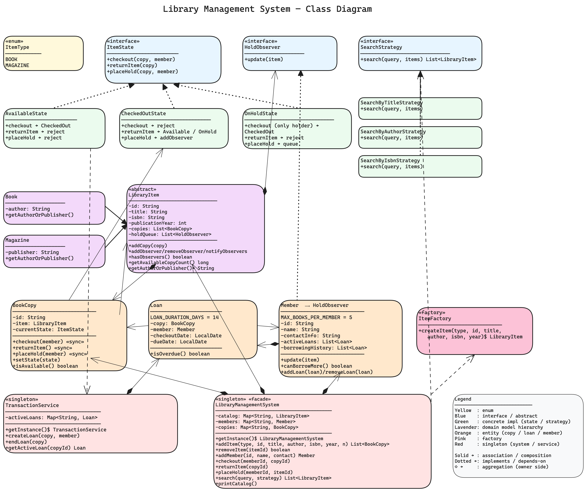
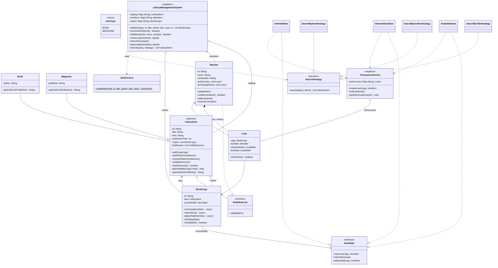

# Library Management System — Low Level Design

A complete object-oriented design and Java implementation of a **library management system** showcasing State, Strategy, Observer, Factory, and Singleton patterns with thread-safe concurrent access to the catalog and member records.

---

## Problem Statement

Design a library management system that supports:
- Adding, updating, and removing books (and other items) from the catalog
- Each book entry has **title, author, ISBN, publication year, availability**
- Members can borrow and return books
- Each member has **name, member ID, contact info, borrowing history**
- Enforce a **max borrow limit** per member and a **loan duration**
- Handle **concurrent access** safely
- Be **extensible** to new item types, search algorithms, hold policies, etc.

Plus interview-grade nuances:
- Multiple physical copies of the same logical book — search hits the book, checkout binds a specific copy
- A member can place a **hold** on a checked-out item and get notified when it returns
- The next person in line gets priority — outsiders can't steal a reserved copy

---

## High-Level Flow

```
Librarian adds an item                                Member checks out / returns / holds
       │                                                          │
       ▼                                                          ▼
[LibraryManagementSystem]  ◄────── singleton facade ──────►  [LibraryManagementSystem]
       │                                                          │
       │ ItemFactory.createItem(type,…)                            │
       │  └─► Book / Magazine                                      │
       │ For i in 1..numCopies: new BookCopy(item)                 │
       │                                                          │
       └─► catalog[id] = item, copies[copyId] = copy               │
                                                                  │
                                  ┌───────────────────────────────┘
                                  ▼
                          [BookCopy] ── currentState ──► [ItemState]
                                  │
                                  │   AvailableState
                                  │     checkout() → TransactionService.createLoan
                                  │                  → state = CheckedOut
                                  │     placeHold() → reject (it's available)
                                  │
                                  │   CheckedOutState
                                  │     checkout() → reject
                                  │     returnItem() → TransactionService.endLoan
                                  │                    → if hasObservers
                                  │                         state = OnHold
                                  │                         notifyObservers() ─► [Member.update]
                                  │                       else
                                  │                         state = Available
                                  │     placeHold() → item.addObserver(member)
                                  │
                                  │   OnHoldState
                                  │     checkout() → only if member is the next observer
                                  │                  → create loan, remove observer
                                  │                  → state = CheckedOut
                                  │     placeHold() → queue behind existing holds
                                  │
                                  ▼
                          [TransactionService]
                              activeLoans: copyId → Loan(member, dueDate)
                              enforces "one active loan per copy"
                              also updates Member.activeLoans + history
```

---

## Class Diagram

> **Interactive:** Open [`class-diagram.excalidraw`](class-diagram.excalidraw) at [excalidraw.com](https://excalidraw.com) (File → Open) for the full interactive diagram with colors and layout.



<details>
<summary>Mermaid Class Diagram (click to expand)</summary>


</details>

---

## How to Approach This Problem (Smallest → Biggest)

### Layer 1: The first design decision — *item vs copy*

The single most important insight, and the one most candidates miss: a "book" is **two things**.

- **`LibraryItem`** — the *logical* book. "The Hobbit by Tolkien, ISBN 978-..." There is **one** of these in the catalog regardless of how many physical copies the library owns.
- **`BookCopy`** — a *physical* copy. The library owns 2 copies of The Hobbit, so 2 `BookCopy` instances exist, both pointing to the same `LibraryItem`.

Why does this matter? When Alice **searches**, she searches over `LibraryItem` ("does the library have Tolkien?"). When she **checks out**, she checks out a specific `BookCopy`. When Charlie places a **hold**, he holds on the `LibraryItem` (he doesn't care which physical copy), but the **state machine** lives on the `BookCopy` (each copy is independently available / checked out / on hold).

If you collapse these into one class, the design falls apart the moment a library has more than one copy of any book.

### Layer 2: Item hierarchy — Books, Magazines, … (Inheritance + Factory)

A library has books, magazines, DVDs, maybe more in the future. The common shape (id, title, ISBN, year, copies, hold queue) goes into an abstract `LibraryItem`. The differentiator — *who created it* — is the only abstract method: `getAuthorOrPublisher()`.

- `Book` returns the author.
- `Magazine` returns the publisher.

Construction goes through `ItemFactory.createItem(type, …)` — the **Factory pattern**. The system's `addItem` method doesn't need to `new Book(...)` or `new Magazine(...)`; it just passes an `ItemType` enum. Adding `DVD` later = new enum value + new subclass + one factory branch. Zero changes elsewhere.

### Layer 3: BookCopy and the State Pattern — *behavior changes with state*

Each `BookCopy` is one of three things at any moment: **Available**, **CheckedOut**, **OnHold**. The interesting question is: what should `checkout()` do?

- If available → create a loan, transition to CheckedOut. ✅
- If checked out → reject. ❌
- If on hold → only allow the member who placed the hold. ⚠️

The naïve solution is an enum + a fat `if/else` ladder in `BookCopy`. The clean solution is the **State pattern**: each state is its own class implementing `ItemState`, and `BookCopy` simply delegates `checkout()`, `returnItem()`, `placeHold()` to its current state object.

- `AvailableState.checkout()` → loan + transition to CheckedOut
- `CheckedOutState.returnItem()` → end loan + transition to Available **OR** OnHold (if anyone is waiting) + notify observers
- `OnHoldState.checkout(member)` → only succeed if the member is the next observer

Want a `LostState` or `UnderRepairState` later? New class. Existing states untouched. **Open/Closed in action.**

### Layer 4: The hold queue — Observer Pattern

Charlie wants Dune. Dune is checked out by Bob. Charlie says "hold it for me." When Bob returns Dune, Charlie should be **notified** — but `BookCopy` shouldn't know about email systems, push notifications, or Slack.

So we define a `HoldObserver` interface with `update(item)`. **`Member` implements `HoldObserver`**. The `LibraryItem` keeps a `List<HoldObserver>`. When the copy returns and observers exist:
1. State transitions from CheckedOut → **OnHold** (not Available — that would let anyone grab it)
2. `notifyObservers()` fires — each waiting member's `update()` runs

To plug in email or SMS notifications later, write a new `HoldObserver` impl and register it. The library code doesn't change.

### Layer 5: Search — Strategy Pattern

Users search by title, author, ISBN, maybe in the future fuzzy match. Don't bake the algorithm into the system.

`SearchStrategy` interface → `search(query, items) → List<LibraryItem>`. Concrete strategies: `SearchByTitleStrategy`, `SearchByAuthorStrategy`, `SearchByIsbnStrategy`. The library exposes:

```java
library.search("Tolkien", new SearchByAuthorStrategy());
```

The caller picks the algorithm. New strategy (`SearchByGenreStrategy`, `FuzzySearchStrategy`) = new class, zero changes to library code.

### Layer 6: Loans + TransactionService — *who has what, until when*

A `Loan` is an immutable value object: `copy + member + checkoutDate + dueDate (= checkoutDate + 14 days)`. The `TransactionService` is a **singleton** that owns the `activeLoans` map (`copyId → Loan`). It's the **only** place that mutates loan state. The state classes call into it:

- `AvailableState.checkout()` → `TransactionService.createLoan(copy, member)`
- `CheckedOutState.returnItem()` → `TransactionService.endLoan(copy)`
- `OnHoldState.checkout()` → `TransactionService.createLoan(copy, member)`

This is SRP: states decide *when* a loan starts/ends; the service handles *how* (writes to the map, updates the member's active-loans list, prevents duplicate loans).

### Layer 7: Constraints — borrow limit & loan duration

Two business rules from the problem statement:
- **Max books per member**: `Member.canBorrowMore()` — checked inside `AvailableState.checkout()` and `OnHoldState.checkout()` before issuing the loan.
- **Loan duration**: `Loan.dueDate = checkoutDate + 14 days`. `Loan.isOverdue()` is available for a future fine/notification subsystem.

### Layer 8: The Facade — `LibraryManagementSystem`

One singleton, three maps:
- `catalog: id → LibraryItem` — logical books
- `copies: copyId → BookCopy` — physical copies
- `members: id → Member`

It's a thin **Facade**: every public method is essentially "look up the entity, delegate." The complexity lives in the states, strategies, and services. Concurrent maps (`ConcurrentHashMap`) and `CopyOnWriteArrayList` make catalog reads and observer iteration safe across threads.

### Interview summary (say this verbatim)

> "First decision: separate the *logical* book from the *physical* copy. LibraryItem is the catalog entry; BookCopy is what gets checked out. Then I notice item creation has variants, so Factory pattern. Each BookCopy goes through three states — Available, CheckedOut, OnHold — so State pattern, with each state as its own class. Holds need notifications without coupling Member to BookCopy, so Observer pattern — Member implements HoldObserver. Search algorithms are swappable, so Strategy. TransactionService owns the loan lifecycle (SRP). LibraryManagementSystem is a Singleton facade over three concurrent maps. Borrow-limit and loan-duration are enforced inside the state's checkout method using Member.canBorrowMore() and Loan.dueDate."

Each pattern solves exactly one problem. Each layer only knows about the layer below.

---

## Project Structure

```
library-management-system/
├── pom.xml
├── README.md
├── class-diagram.excalidraw
└── src/main/java/com/librarymanagementsystem/
    ├── LibraryManagementDemo.java          # Entry point — 5 scenarios
    ├── LibraryManagementSystem.java        # Singleton facade — catalog/members/copies
    ├── TransactionService.java             # Singleton — activeLoans map, loan lifecycle
    │
    ├── model/                              # Domain entities
    │   ├── LibraryItem.java                # Abstract — id, title, ISBN, year, copies, holdQueue
    │   ├── Book.java                       # author
    │   ├── Magazine.java                   # publisher
    │   ├── BookCopy.java                   # Physical copy — holds current ItemState
    │   ├── Member.java                     # Implements HoldObserver, tracks loans + history
    │   └── Loan.java                       # Immutable — copy + member + checkout/due date
    │
    ├── enums/
    │   └── ItemType.java                   # BOOK, MAGAZINE
    │
    ├── factory/
    │   └── ItemFactory.java                # Creates Book or Magazine from ItemType
    │
    ├── state/                              # State pattern — copy lifecycle
    │   ├── ItemState.java                  # interface (checkout, returnItem, placeHold)
    │   ├── AvailableState.java             # → CheckedOut on checkout
    │   ├── CheckedOutState.java            # → Available or OnHold on return
    │   └── OnHoldState.java                # → CheckedOut only for the holding member
    │
    ├── strategy/                           # Strategy pattern — search algorithms
    │   ├── SearchStrategy.java
    │   ├── SearchByTitleStrategy.java
    │   ├── SearchByAuthorStrategy.java
    │   └── SearchByIsbnStrategy.java
    │
    └── observer/                           # Observer pattern — hold notifications
        └── HoldObserver.java               # Member implements this
```

---

## Design Patterns Used

| Pattern | Where | Why |
|---------|-------|-----|
| **Singleton** | `LibraryManagementSystem`, `TransactionService` | One library, one loan ledger — global coordination |
| **Factory** | `ItemFactory` | Centralized item creation — adding `DVD` won't touch the system class |
| **State** | `ItemState` + `AvailableState`, `CheckedOutState`, `OnHoldState` | Each BookCopy's behavior on checkout/return/hold depends on its state — no `if/else` ladder |
| **Strategy** | `SearchStrategy` + `SearchByTitle/Author/IsbnStrategy` | Swappable search algorithms — caller picks at call site |
| **Observer** | `HoldObserver` (impl by `Member`) | Decouples holds from notifications — add `EmailObserver`, `SmsObserver` later without library changes |
| **Facade** | `LibraryManagementSystem` | Public API hides factory + state + service interactions behind simple methods |

---

## SOLID Principles Applied

| Principle | How |
|-----------|-----|
| **SRP** | `LibraryItem` = metadata, `BookCopy` = state machine, `Loan` = transaction record, `TransactionService` = loan ledger, `LibraryManagementSystem` = facade, each `*State` = one state's rules, each `*Strategy` = one search algorithm |
| **OCP** | New item type = subclass + factory branch. New state = new `ItemState` impl. New search = new `SearchStrategy` impl. New notification channel = new `HoldObserver` impl. None require changes to existing classes |
| **LSP** | Anywhere `LibraryItem` is expected, `Book` or `Magazine` works. Anywhere `ItemState` is expected, any concrete state works. `BookCopy` doesn't know which state it currently holds |
| **ISP** | `ItemState` has 3 methods (the three operations a copy supports). `HoldObserver` has a single `update()`. `SearchStrategy` has a single `search()`. No god interfaces |
| **DIP** | `BookCopy` depends on `ItemState` interface, not concrete states. `LibraryItem` holds `List<HoldObserver>`, not `List<Member>`. `LibraryManagementSystem.search()` takes a `SearchStrategy` parameter, not a concrete strategy |

---

## Thread Safety

- `LibraryManagementSystem` maps (`catalog`, `members`, `copies`) use `ConcurrentHashMap` — safe lookup and registration under concurrent librarian/member operations
- `TransactionService.activeLoans` uses `ConcurrentHashMap` — concurrent loan creation/end across copies
- `BookCopy.checkout/returnItem/placeHold` are `synchronized` — atomic state-transition + side-effect per copy (only one thread can change a single copy's state at a time)
- `LibraryItem.copies` and `holdQueue` use `CopyOnWriteArrayList` — safe iteration during `notifyObservers()` even if an observer self-removes mid-notification
- `Member.activeLoans` uses `CopyOnWriteArrayList` — safe reads while the state classes mutate

The chosen granularity: per-copy locking. Two different copies (even of the same book) can be checked out concurrently — only the same physical copy serializes.

---

## Extensibility

- **New item type** (DVD, AudioBook) → new subclass of `LibraryItem` + new `ItemType` value + new `ItemFactory` branch
- **New state** (LostState, UnderRepairState, ReservedForBranchState) → new `ItemState` impl, transition from existing states
- **New search algorithm** (genre, fuzzy match, full-text) → new `SearchStrategy` impl
- **New notification channel** (Email, SMS, push) → new `HoldObserver` impl; register alongside `Member` on `LibraryItem.holdQueue`
- **Fines / overdue policy** → `Loan.isOverdue()` is already exposed — add a `FinePolicy` strategy, run a daily sweep over `TransactionService.activeLoans`
- **Per-member borrow limits** → extract `Member.canBorrowMore()` into a `BorrowingPolicy` strategy injected per member (e.g. students vs faculty)
- **Reservation expiry** → store hold timestamp in the queue, prune in a background task
