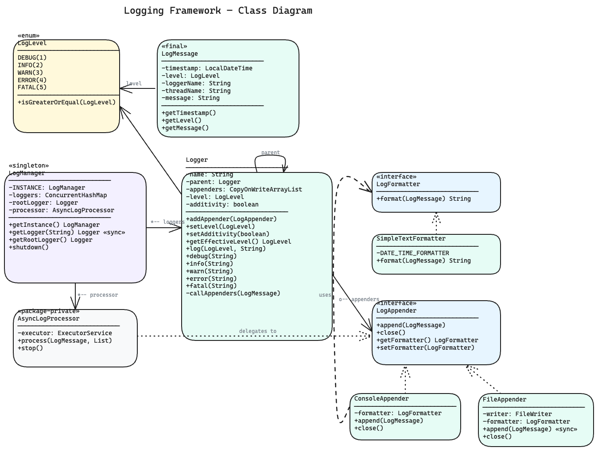
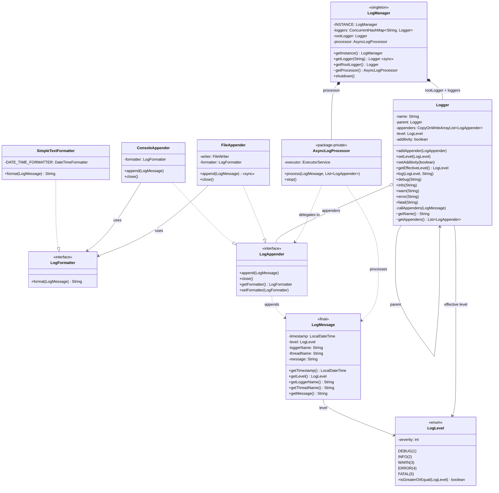

# Logging Framework — Low Level Design

A complete object-oriented design and Java implementation of a **Logging Framework** showcasing Singleton, Strategy, and Chain of Responsibility patterns with async processing and hierarchical loggers.

---

## Problem Statement

Design a logging framework that can:
- Support different log levels: DEBUG, INFO, WARN, ERROR, FATAL
- Log messages with timestamp, thread name, log level, logger name, and message content
- Support multiple output destinations (console, file) via pluggable appenders
- Support pluggable message formatters
- Provide hierarchical loggers (child inherits parent's level and appenders)
- Allow dynamic configuration of log level and appenders at runtime
- Be thread-safe for concurrent logging from multiple threads
- Process log writes asynchronously to avoid blocking the caller

---

## High-Level Flow

```
Application code
    │
    ▼
Logger.info("message")
    │
    │  1. Check: messageLevel >= getEffectiveLevel()?
    │     ├── NO  → message is discarded (filtered out)
    │     └── YES → create LogMessage(level, loggerName, message)
    │
    ▼
callAppenders(logMessage)
    │
    │  2. If this logger has appenders:
    │     └── Submit to AsyncLogProcessor (non-blocking)
    │           └── ExecutorService processes on background thread
    │                 └── For each LogAppender:
    │                       ├── LogFormatter.format(logMessage)    ← Strategy
    │                       └── Write formatted output             ← Strategy
    │                             ├── ConsoleAppender → System.out
    │                             └── FileAppender → FileWriter
    │
    │  3. If additivity=true AND parent != null:
    │     └── parent.callAppenders(logMessage)                     ← Propagate up
    │
    ▼
Done (caller returns immediately — async)

Logger Hierarchy:
    root                         (level=INFO, appenders=[ConsoleAppender])
     └── com                     (inherits from root)
          └── com.myapp          (inherits from com → root)
               ├── com.myapp.db       (inherits)
               └── com.myapp.service   (level=DEBUG, overrides)
                    └── com.myapp.service.UserService
```

---

## Class Diagram

> **Interactive:** Open [`class-diagram.excalidraw`](class-diagram.excalidraw) at [excalidraw.com](https://excalidraw.com) (File → Open) for the full interactive diagram with colors and layout.



<details>
<summary>Mermaid Class Diagram (click to expand)</summary>


</details>

---

## How to Approach This Problem (Smallest to Biggest)

When you get "Design a Logging Framework" in an interview, don't jump to `Logger` or `LogManager`. Start from the smallest atoms and build up. Each layer gives you a natural place to drop a design pattern or SOLID principle.

### Layer 1: The Vocabulary -- `LogLevel` enum

Before anything can be logged, the system needs a shared vocabulary for severity. **`LogLevel`** is a simple enum with five values: `DEBUG(1)`, `INFO(2)`, `WARN(3)`, `ERROR(4)`, `FATAL(5)`. Each carries a numeric severity, and the key method is `isGreaterOrEqual(LogLevel other)` -- this is the gatekeeper for the entire framework.

**Mental model:** Think of log levels as a bouncer at a club. The bouncer has a threshold (the logger's effective level). Any message whose severity is below the threshold gets turned away at the door. The bouncer doesn't care where the message goes or what it looks like -- just "are you important enough?"

**Interview power move:** "I'll start with `LogLevel` as an enum with a severity int, not a String. This gives me type safety, ordinal comparison via a custom method, and makes adding a new level (say `TRACE`) a one-line enum constant addition -- Open/Closed Principle from the very first class."

### Layer 2: The Envelope -- `LogMessage` value object

Once you know how to classify severity, you need a way to capture everything about a single log event. **`LogMessage`** is an immutable (`final` class, all `final` fields) data carrier that snapshots: timestamp (`LocalDateTime.now()`), level, logger name, thread name (`Thread.currentThread().getName()`), and the message string.

**Why immutable?** This object will be created on one thread and consumed on another (the async processor). If it were mutable, you'd have a race condition nightmare. Making it `final` with all `final` fields means it's inherently thread-safe -- no synchronization needed, no defensive copies.

**Mental model:** A `LogMessage` is like a sealed envelope. Once you write the letter (create the object), you lick it shut. The postal system (async processor, appenders) can carry it anywhere, hand it to anyone, and nobody can tamper with the contents.

**Interview power move:** "I'm making `LogMessage` a final class with all final fields -- not just for correctness but because the JIT can optimize immutable objects more aggressively. This also means I never need to worry about thread safety at this layer."

### Layer 3: The Formatting Strategy -- `LogFormatter` interface + `SimpleTextFormatter`

Now you have envelopes, but they need to be read by humans (or machines). The **`LogFormatter`** interface has a single method: `format(LogMessage) -> String`. **`SimpleTextFormatter`** is the default implementation producing lines like `2026-04-12 12:20:57.375 [main] INFO - com.myapp.Main: Application started`.

**Why an interface with one method?** This is the Strategy pattern at its purest. The formatter doesn't know where the output goes (console? file? network?). It just converts a `LogMessage` into a `String`. Want JSON logs for ELK? Write a `JsonFormatter`. Want XML? `XmlFormatter`. Zero changes to any existing class.

**Mental model:** The formatter is a translator. It takes the sealed envelope, reads its contents, and writes them out in whatever language (format) you want. The translator doesn't deliver the mail -- that's someone else's job.

**Interview power move:** "I'm separating formatting from output destination. This means a `FileAppender` can write JSON while a `ConsoleAppender` writes plain text -- same message, different formatters, completely independent. This is ISP and SRP working together."

### Layer 4: The Output Strategy -- `LogAppender` interface + `ConsoleAppender` / `FileAppender`

Formatting produces a string, but where does it go? The **`LogAppender`** interface defines `append(LogMessage)`, `close()`, `getFormatter()`, and `setFormatter(LogFormatter)`. Each appender owns a formatter and knows how to write to one specific destination.

**`ConsoleAppender`** is trivial -- `System.out.println(formatter.format(logMessage))`. **`FileAppender`** opens a `FileWriter` in append mode and has a `synchronized append()` method because file I/O from multiple threads would produce garbled output. It also flushes after every write -- if the app crashes, you don't lose the last log line.

**Why two separate strategies (formatter + appender)?** Because formatting and destination are two independent axes of variation. If you merged them, you'd need `ConsoleJsonAppender`, `ConsoleTextAppender`, `FileJsonAppender`, `FileTextAppender` -- a combinatorial explosion. By separating them, you get N formatters x M appenders with only N + M classes instead of N x M.

**Mental model:** Appenders are like delivery trucks. One truck goes to the console, another to a file, a future one to a database. Each truck can carry the same envelope but translated into different languages by its formatter. The truck doesn't care about the language -- it just delivers.

**Interview power move:** "I'm applying the Bridge pattern principle here: formatting and destination are orthogonal concerns. Composing them rather than inheriting avoids a class explosion. I can have 5 formatters and 5 appenders and serve 25 combinations with just 10 classes."

### Layer 5: The Workhorse -- `Logger`

This is the class your application code actually talks to. **`Logger`** holds a name (dot-separated like `com.myapp.service.UserService`), a parent reference (forming a tree), a list of appenders (`CopyOnWriteArrayList`), an optional level override, and an additivity flag.

The core flow is: `logger.info("message")` calls `log(LogLevel.INFO, message)`, which checks `messageLevel.isGreaterOrEqual(getEffectiveLevel())`. If the message passes, a `LogMessage` is created and `callAppenders()` fires. The appenders list is dispatched to the `AsyncLogProcessor`, and if `additivity` is true, the message propagates up to the parent's appenders.

**`getEffectiveLevel()`** walks up the parent chain until it finds a logger with an explicitly set level. This means `com.myapp.service.UserService` inherits from `com.myapp.service`, which inherits from `com.myapp`, which inherits from `com`, which inherits from `root`. Set the root to INFO and everything below is INFO -- unless explicitly overridden.

**`CopyOnWriteArrayList`** for appenders is a deliberate choice: appenders are added rarely (configuration time) but read on every log call (hot path). COWAL gives lock-free reads at the cost of expensive writes -- perfect for this access pattern.

**Mental model:** The Logger is like a manager in a corporate hierarchy. When a report (log message) comes in, the manager checks if it's important enough (level filtering). If yes, they hand it to their assistants (appenders) and CC their boss (parent logger, via additivity). The boss does the same thing, all the way up to the CEO (root logger).

**Interview power move:** "I'm using Chain of Responsibility for the logger hierarchy. Each logger decides whether to handle the message locally and whether to propagate upward. Additivity=false breaks the chain, which is how you get a file-only logger without console output. And I chose CopyOnWriteArrayList because the read-to-write ratio heavily favors reads."

### Layer 6: The Async Engine -- `AsyncLogProcessor`

Logging should never slow down your application. **`AsyncLogProcessor`** is a package-private class that wraps a single-thread `ExecutorService`. When `process(LogMessage, List<LogAppender>)` is called, it submits a task to the executor that iterates through appenders and calls `append()` on each.

**Why single-threaded?** A single thread serializes all log writes, which means appenders don't need to be thread-safe themselves (except `FileAppender`, which synchronizes as an extra safety measure). It also preserves log ordering -- messages appear in the order they were submitted.

**Why a daemon thread?** So the JVM can exit even if someone forgets to call `shutdown()`. The graceful `stop()` method does `executor.shutdown()` followed by `awaitTermination(2, SECONDS)` and then `shutdownNow()` if tasks are still pending.

**Mental model:** The async processor is like a mailroom. Application threads drop off envelopes at the mailroom window and walk away immediately (non-blocking). A single mailroom worker picks up envelopes one by one and hands them to the right delivery trucks (appenders). This way, the application never waits for a truck to finish its route.

**Interview power move:** "I'm decoupling log emission from log writing with a single-threaded executor. This gives me three things for free: non-blocking callers, preserved message ordering, and serialized I/O so appenders don't need internal locking. The daemon thread is a safety net for ungraceful shutdowns."

### Layer 7: The Singleton Orchestrator -- `LogManager`

**`LogManager`** is the top-level singleton that owns everything: the root logger, the `ConcurrentHashMap<String, Logger>` registry, and the `AsyncLogProcessor`. Its key method is `getLogger(String name)`, which is `synchronized` and uses recursive parent resolution: for `com.myapp.db`, it splits on the last dot to find parent `com.myapp`, then `com`, then `root`.

**Why eager initialization?** `private static final LogManager INSTANCE = new LogManager()` is initialized when the class is loaded. The JVM guarantees class loading is thread-safe, so you get a thread-safe singleton without `volatile` or double-checked locking. Simpler and faster.

**`shutdown()`** is the cleanup method: it stops the async processor (draining pending tasks), then iterates all loggers, collects all distinct appenders, and calls `close()` on each. This ensures file handles are released and buffers are flushed.

**Mental model:** The LogManager is like a corporate directory. When a department (class) needs a manager (logger), they look them up in the directory. If the manager doesn't exist yet, the directory creates them, assigns them a boss (parent), and registers them. There's only one directory for the whole company (singleton).

**Interview power move:** "I chose eager initialization over double-checked locking because LogManager is always needed -- there's no scenario where the app runs without it. The synchronized getLogger uses recursive parent resolution, which automatically builds the hierarchy tree on demand. And shutdown is the only place that iterates all loggers, so the ConcurrentHashMap's slightly slower iteration is a non-issue."

### Putting It All Together

The full flow in one sentence: Application calls `logger.info("msg")` -> level check passes -> `LogMessage` envelope is created -> `callAppenders` submits to `AsyncLogProcessor` -> background thread calls each `LogAppender.append()` -> appender delegates to its `LogFormatter.format()` -> formatted string goes to console/file -> if additivity is on, repeat up the parent chain.

> **Interview Summary:** "I'd build this bottom-up. Start with a `LogLevel` enum for severity comparison, then an immutable `LogMessage` value object for thread-safe event capture. Next, define two Strategy interfaces -- `LogFormatter` for formatting and `LogAppender` for output -- keeping them orthogonal to avoid class explosion. The `Logger` class does level filtering and appender dispatch, forming a parent-child hierarchy that acts as a Chain of Responsibility for message propagation. An `AsyncLogProcessor` wraps a single-thread executor to decouple log emission from I/O. Finally, a `LogManager` singleton owns the logger registry and handles hierarchical name resolution. The design is fully extensible: new format = new `LogFormatter`, new destination = new `LogAppender`, new level = new enum constant -- zero modifications to existing code."

---

## Project Structure

```
logging-framework/
├── pom.xml
├── README.md
└── src/main/java/com/loggingframework/
    ├── LoggingFrameworkDemo.java          # Entry point (main) — 5 demo scenarios
    │
    ├── model/                             # Domain models & core classes
    │   ├── LogManager.java                # Singleton — manages logger hierarchy
    │   ├── Logger.java                    # Hierarchical logger with level filtering
    │   ├── LogMessage.java                # Immutable log event (timestamp, level, thread, message)
    │   └── AsyncLogProcessor.java         # Package-private — async dispatch via ExecutorService
    │
    ├── enums/                             # Enumerations
    │   └── LogLevel.java                  # DEBUG, INFO, WARN, ERROR, FATAL with severity ordering
    │
    └── strategy/                          # Strategy pattern — appenders & formatters
        ├── LogAppender.java               # Interface — pluggable output destination
        ├── ConsoleAppender.java           # Writes formatted logs to System.out
        ├── FileAppender.java              # Writes formatted logs to file (synchronized)
        ├── LogFormatter.java              # Interface — pluggable message formatting
        └── SimpleTextFormatter.java       # Default format: timestamp [thread] LEVEL - logger: message
```

---

## Design Patterns Used

| Pattern | Where | Why |
|---------|-------|-----|
| **Singleton** | `LogManager` | One central registry of all loggers per JVM |
| **Strategy** | `LogAppender`, `LogFormatter` | Pluggable output destinations and message formats — new appender/formatter = new class, zero changes to Logger |
| **Chain of Responsibility** | Logger hierarchy (parent propagation) | Log messages propagate up the logger tree — each logger decides whether to handle and/or pass to parent |
| **Observer-like** | Appender list per Logger | Multiple appenders receive the same log message — one-to-many notification |

---

## SOLID Principles Applied

| Principle | How |
|-----------|-----|
| **SRP** | `Logger` handles level filtering + dispatch, `LogAppender` handles output, `LogFormatter` handles formatting, `AsyncLogProcessor` handles async execution, `LogMessage` is an immutable data carrier |
| **OCP** | New output destination = new `LogAppender` impl (e.g., `DatabaseAppender`). New format = new `LogFormatter` impl (e.g., `JsonFormatter`). No changes to existing code. |
| **LSP** | `ConsoleAppender` and `FileAppender` are fully interchangeable wherever `LogAppender` is expected. `SimpleTextFormatter` is substitutable for any `LogFormatter`. |
| **ISP** | `LogAppender` has exactly 4 focused methods. `LogFormatter` has a single `format()` method. No bloated interfaces. |
| **DIP** | `Logger` depends on `LogAppender` interface, not concrete appenders. Appenders depend on `LogFormatter` interface, not concrete formatters. |

---

## Thread Safety

- `LogManager.getLogger()` is `synchronized` to prevent duplicate logger creation during hierarchy resolution
- `Logger.appenders` uses `CopyOnWriteArrayList` — safe for concurrent reads with rare writes
- `FileAppender.append()` is `synchronized` — serializes file writes from the async processor
- `AsyncLogProcessor` uses a single-thread `ExecutorService` — all log writes are serialized on a dedicated background thread
- `LogManager` singleton uses eager initialization (class-loading guarantees thread safety)
- `LogMessage` is immutable (`final` class, all `final` fields) — safe to share across threads

---

## Extensibility

- **New log level** → add enum constant in `LogLevel` with appropriate severity value
- **New output destination** → implement `LogAppender` (e.g., `DatabaseAppender`, `SyslogAppender`) and attach to any logger
- **New message format** → implement `LogFormatter` (e.g., `JsonFormatter`, `XmlFormatter`) and set on any appender
- **Filtering** → add a `LogFilter` strategy interface on `LogAppender` for fine-grained message filtering
- **Log rotation** → create `RollingFileAppender` implementing `LogAppender` with size/time-based rotation
