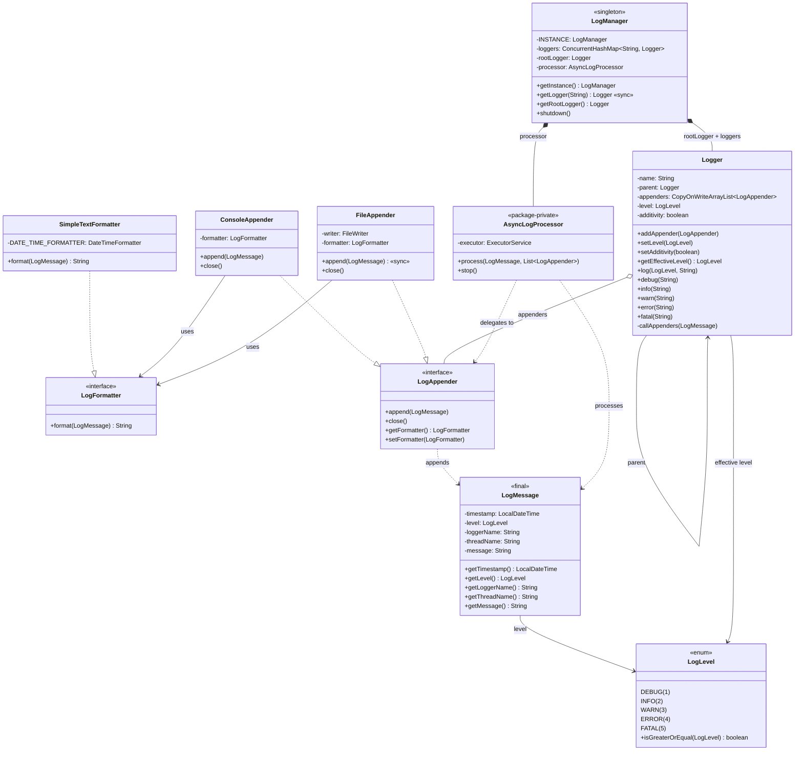

# Logging Framework — Low Level Design

A complete object-oriented design and Java implementation of a **Logging Framework** showcasing Singleton, Strategy, and Chain of Responsibility patterns with async processing and hierarchical loggers.

---

## Problem Statement

Design a logging framework that can:
- Support different log levels: DEBUG, INFO, WARN, ERROR, FATAL
- Log messages with timestamp, thread name, log level, logger name, and message content
- Support multiple output destinations (console, file) via pluggable appenders
- Support pluggable message formatters
- Provide hierarchical loggers (child inherits parent's level and appenders)
- Allow dynamic configuration of log level and appenders at runtime
- Be thread-safe for concurrent logging from multiple threads
- Process log writes asynchronously to avoid blocking the caller

---

## High-Level Flow

```
Application code
    │
    ▼
Logger.info("message")
    │
    │  1. Check: messageLevel >= getEffectiveLevel()?
    │     ├── NO  → message is discarded (filtered out)
    │     └── YES → create LogMessage(level, loggerName, message)
    │
    ▼
callAppenders(logMessage)
    │
    │  2. If this logger has appenders:
    │     └── Submit to AsyncLogProcessor (non-blocking)
    │           └── ExecutorService processes on background thread
    │                 └── For each LogAppender:
    │                       ├── LogFormatter.format(logMessage)    ← Strategy
    │                       └── Write formatted output             ← Strategy
    │                             ├── ConsoleAppender → System.out
    │                             └── FileAppender → FileWriter
    │
    │  3. If additivity=true AND parent != null:
    │     └── parent.callAppenders(logMessage)                     ← Propagate up
    │
    ▼
Done (caller returns immediately — async)

Logger Hierarchy:
    root                         (level=INFO, appenders=[ConsoleAppender])
     └── com                     (inherits from root)
          └── com.myapp          (inherits from com → root)
               ├── com.myapp.db       (inherits)
               └── com.myapp.service   (level=DEBUG, overrides)
                    └── com.myapp.service.UserService
```

---

## Class Diagram

> **Interactive:** Open [`class-diagram.excalidraw`](class-diagram.excalidraw) at [excalidraw.com](https://excalidraw.com) (File → Open) for the full interactive diagram with colors and layout.


<details>
<summary>Mermaid Class Diagram (click to expand)</summary>


</details>

---

## Project Structure

```
logging-framework/
├── pom.xml
├── README.md
└── src/main/java/com/loggingframework/
    ├── LoggingFrameworkDemo.java          # Entry point (main) — 5 demo scenarios
    │
    ├── model/                             # Domain models & core classes
    │   ├── LogManager.java                # Singleton — manages logger hierarchy
    │   ├── Logger.java                    # Hierarchical logger with level filtering
    │   ├── LogMessage.java                # Immutable log event (timestamp, level, thread, message)
    │   └── AsyncLogProcessor.java         # Package-private — async dispatch via ExecutorService
    │
    ├── enums/                             # Enumerations
    │   └── LogLevel.java                  # DEBUG, INFO, WARN, ERROR, FATAL with severity ordering
    │
    └── strategy/                          # Strategy pattern — appenders & formatters
        ├── LogAppender.java               # Interface — pluggable output destination
        ├── ConsoleAppender.java           # Writes formatted logs to System.out
        ├── FileAppender.java              # Writes formatted logs to file (synchronized)
        ├── LogFormatter.java              # Interface — pluggable message formatting
        └── SimpleTextFormatter.java       # Default format: timestamp [thread] LEVEL - logger: message
```

---

## Design Patterns Used

| Pattern | Where | Why |
|---------|-------|-----|
| **Singleton** | `LogManager` | One central registry of all loggers per JVM |
| **Strategy** | `LogAppender`, `LogFormatter` | Pluggable output destinations and message formats — new appender/formatter = new class, zero changes to Logger |
| **Chain of Responsibility** | Logger hierarchy (parent propagation) | Log messages propagate up the logger tree — each logger decides whether to handle and/or pass to parent |
| **Observer-like** | Appender list per Logger | Multiple appenders receive the same log message — one-to-many notification |

---

## SOLID Principles Applied

| Principle | How |
|-----------|-----|
| **SRP** | `Logger` handles level filtering + dispatch, `LogAppender` handles output, `LogFormatter` handles formatting, `AsyncLogProcessor` handles async execution, `LogMessage` is an immutable data carrier |
| **OCP** | New output destination = new `LogAppender` impl (e.g., `DatabaseAppender`). New format = new `LogFormatter` impl (e.g., `JsonFormatter`). No changes to existing code. |
| **LSP** | `ConsoleAppender` and `FileAppender` are fully interchangeable wherever `LogAppender` is expected. `SimpleTextFormatter` is substitutable for any `LogFormatter`. |
| **ISP** | `LogAppender` has exactly 4 focused methods. `LogFormatter` has a single `format()` method. No bloated interfaces. |
| **DIP** | `Logger` depends on `LogAppender` interface, not concrete appenders. Appenders depend on `LogFormatter` interface, not concrete formatters. |

---

## How to Build & Run

### Using Maven
```bash
mvn clean package
java -jar target/logging-framework-1.0.0.jar
```

### Using javac directly
```bash
javac -d target/classes \
    src/main/java/com/loggingframework/enums/*.java \
    src/main/java/com/loggingframework/model/*.java \
    src/main/java/com/loggingframework/strategy/*.java \
    src/main/java/com/loggingframework/*.java

java -cp target/classes com.loggingframework.LoggingFrameworkDemo
```

---

## Thread Safety

- `LogManager.getLogger()` is `synchronized` to prevent duplicate logger creation during hierarchy resolution
- `Logger.appenders` uses `CopyOnWriteArrayList` — safe for concurrent reads with rare writes
- `FileAppender.append()` is `synchronized` — serializes file writes from the async processor
- `AsyncLogProcessor` uses a single-thread `ExecutorService` — all log writes are serialized on a dedicated background thread
- `LogManager` singleton uses eager initialization (class-loading guarantees thread safety)
- `LogMessage` is immutable (`final` class, all `final` fields) — safe to share across threads

---

## Extensibility

- **New log level** → add enum constant in `LogLevel` with appropriate severity value
- **New output destination** → implement `LogAppender` (e.g., `DatabaseAppender`, `SyslogAppender`) and attach to any logger
- **New message format** → implement `LogFormatter` (e.g., `JsonFormatter`, `XmlFormatter`) and set on any appender
- **Filtering** → add a `LogFilter` strategy interface on `LogAppender` for fine-grained message filtering
- **Log rotation** → create `RollingFileAppender` implementing `LogAppender` with size/time-based rotation
