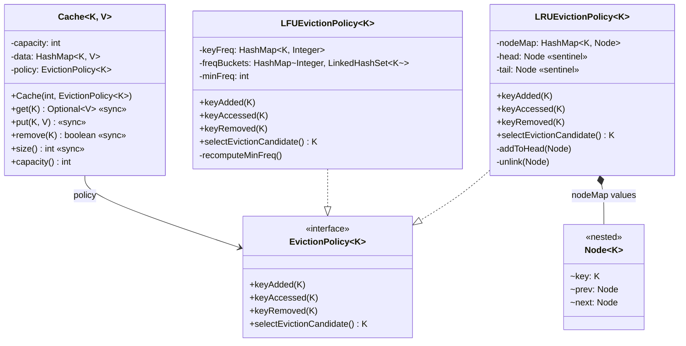

# LRU Cache — Low Level Design

A fixed-capacity, generic, thread-safe in-memory cache with **pluggable eviction policies** (LRU and LFU implemented out of the box).

---

## Problem Statement

Design an in-memory cache that:
- Stores up to `N` `<key, value>` pairs (capacity is fixed at construction time)
- Supports `get(key)`, `put(key, value)`, `remove(key)` in **O(1)**
- When full, evicts one entry to make room for a new key
- Allows the eviction policy to be swapped without touching the cache itself
- Ships with two ready policies: **Least Recently Used (LRU)** and **Least Frequently Used (LFU)**
- Is safe to call from multiple threads

---

## High-Level Flow

```
cache.get(key)
    |
    +-- data.get(key)
    |        |
    |        +-- miss --> return Optional.empty()
    |        |
    |        +-- hit  --> policy.keyAccessed(key) --> return Optional.of(value)
    |
cache.put(key, value)
    |
    +-- data.containsKey(key)?
    |        |
    |        +-- yes --> data.put(key, value); policy.keyAccessed(key); return
    |        |
    |        +-- no
    |              |
    |              +-- data.size() == capacity?
    |              |        |
    |              |        +-- yes --> K victim = policy.selectEvictionCandidate()
    |              |                    data.remove(victim); policy.keyRemoved(victim)
    |              |
    |              +-- data.put(key, value); policy.keyAdded(key)
    |
cache.remove(key)
    |
    +-- data.remove(key) != null --> policy.keyRemoved(key)
```

---

## Class Diagram


<details>
<summary>Mermaid Class Diagram (click to expand)</summary>


</details>

---

## How to Approach This Problem (Smallest to Biggest)

When an interviewer asks "design an LRU cache," resist the urge to start coding the DLL + HashMap straight away. The mark of a senior answer is to first decide *what is the cache* and *what is the eviction policy*, and explain why those two responsibilities should not live in the same class.

### Layer 1: The smallest insight -- get() is a write

**What**: Reading a key is **not** a side-effect-free operation. Every `get(key)` mutates the cache's internal state, because the policy needs to record "this key was just accessed."

**Why this matters**: It explains why even `get` needs locking under concurrency, why a `ReadWriteLock` doesn't help here (LRU has no real "read-only" operation), and why the whole cache must be synchronized on every public method.

**Mental model**: Think of the cache as a library where every time you *look at* a book, the librarian moves it to the front of the shelf. There is no "just browsing."

**Interview power move**: *"The first thing I want to call out: in an LRU or LFU cache, `get` is a mutating operation. It changes recency or frequency. That's why we can't treat reads and writes asymmetrically -- both need the same lock."*

### Layer 2: Two responsibilities, not one -- separate storage from order

**What**: A cache has **two distinct jobs** that change for different reasons:
1. Store key -> value pairs and answer reads/writes
2. Decide which key should be evicted when capacity is exceeded

**Why**: If you fuse them into one class (which is how 90% of candidates write it), every eviction policy change forces you to rewrite the cache. By splitting them, the cache *never* changes when the policy changes, and you can plug in LRU, LFU, FIFO, MRU, ARC, or any future scheme without touching `Cache.java`.

**Mental model**: A cache is a warehouse. The shelves (HashMap) hold the goods. The clipboard the foreman carries (EvictionPolicy) decides which crate gets thrown out first. Don't fuse the foreman into the warehouse.

**Interview power move**: *"I'm splitting this into two responsibilities -- the cache owns key->value storage, the policy owns the ordering. This is Single Responsibility plus Open/Closed: I can add LFU later without changing a single line of Cache."*

### Layer 3: The contract -- `EvictionPolicy<K>` interface

**What**: A four-method strategy interface:
- `keyAdded(K)` -- new key inserted
- `keyAccessed(K)` -- existing key read or value updated
- `keyRemoved(K)` -- key dropped (manual or evicted)
- `selectEvictionCandidate()` -- "who would you evict right now?"

**Why these four hooks specifically**: They cover every observable event the cache can trigger. Any eviction policy (LRU, LFU, FIFO, random, MRU, ARC, 2Q, ...) can be expressed using just these four signals. No policy needs to see the *value* -- only the *key* and the event.

**Design decision worth noting**: The policy is **passive**. It never reaches into the cache; the cache calls into the policy. This is Dependency Inversion -- the high-level cache and the low-level policy both depend on the abstraction, not on each other's internals.

**Interview power move**: *"Notice the policy never sees `V`. It only knows about keys. That's deliberate -- it keeps the policy generic over value type and makes the interface as small as possible. Interface Segregation."*

### Layer 4: LRU -- the canonical O(1) implementation

**What**: A doubly linked list of keys plus a `HashMap<K, Node>`. Head sentinel is "most recently used," tail sentinel is "least recently used."

```
head <-> [MRU] <-> [...] <-> [LRU] <-> tail
```

- `keyAdded`: create a node, splice it in right after head
- `keyAccessed`: HashMap gets the node, unlink it, splice it in right after head
- `keyRemoved`: HashMap pops the node, unlink it
- `selectEvictionCandidate`: read `tail.prev.key`

**Why a DLL and not a singly linked list**: When `keyAccessed` fires on a node in the middle of the list, you need to unlink it in O(1). That requires a back pointer. With a singly linked list, unlinking the middle is O(n).

**Why sentinels and not a real head/tail node**: Sentinels eliminate null checks at the boundaries of the list. The unlink and splice code becomes uniform whether you're touching the first node, the last node, or one in the middle.

**Why HashMap from key to node**: Without it, locating an existing key in the DLL during `keyAccessed` would be O(n). The HashMap makes it O(1).

**Mental model**: A line at a bank. Whenever you walk up to the teller (access), you cut to the front (head). The person at the very back of the line (tail.prev) is the one who's been waiting longest -- that's who gets kicked out first when the bank closes.

**Interview power move**: *"I'm using sentinels for head and tail. They cost two extra node allocations but they remove every null check from the unlink/splice code. The trade-off is overwhelmingly in favor of sentinels."*

### Layer 5: LFU -- the natural extension

**What**: Two HashMaps and a counter:
- `keyFreq: K -> Integer`         -- how many times each key has been accessed
- `freqBuckets: Integer -> LinkedHashSet<K>`  -- all keys grouped by their current frequency
- `minFreq: int`                  -- the smallest frequency currently in any bucket

On `keyAccessed`, the key moves from `bucket[f]` to `bucket[f+1]`. On eviction, drop the first element of `bucket[minFreq]` -- it has the lowest count, and within that count it's the oldest (LRU tiebreak).

**Why this is the right LFU shape**: The naive LFU implementation sorts a frequency map on every eviction, which is O(n log n). With the two-map approach, every operation including eviction is O(1) amortized.

**Why LinkedHashSet, not a plain HashSet**: Tiebreaking. If three keys all have the same frequency, you need to evict the one that hasn't been touched the longest. `LinkedHashSet` preserves insertion order, which is exactly LRU-within-frequency.

**Why `minFreq` is tracked as a field**: Otherwise `selectEvictionCandidate` would have to scan `freqBuckets.keySet()` for the smallest key, which is O(n). Tracking `minFreq` and incrementing it when the current minimum bucket is emptied keeps the lookup O(1).

**LFU's one nasty edge case worth mentioning**: When you remove a key with the only entry in `bucket[minFreq]`, the next `selectEvictionCandidate` will be wrong unless you recompute `minFreq`. The implementation handles this in `recomputeMinFreq()`, but it's a real gotcha worth calling out to the interviewer.

**Interview power move**: *"LFU is where most candidates trip up -- they use a single TreeMap and end up at O(log n). The trick is two HashMaps and a tracked minimum frequency. Now every operation is O(1), and the LinkedHashSet inside each bucket gives me LRU as a free tiebreaker."*

### Layer 6: The orchestrator -- `Cache<K, V>`

**What**: Holds a `HashMap<K, V>`, an `EvictionPolicy<K>`, and the `capacity`. Every public method is `synchronized`. On `put`, if the cache is full it asks the policy who to evict, removes that key, then inserts the new one.

**Why so thin**: The cache is a coordinator, not a doer. It knows nothing about access order, frequency counts, or eviction heuristics. It only knows: "I have a HashMap. If I'm full and a new key comes in, I ask the policy who to drop." This is exactly the same shape as `ParkingLot` in the parking-lot module -- a thin orchestrator that delegates everything.

**Why synchronized on every method, including reads**: See Layer 1. `get` mutates policy state, so it must hold the lock just like `put` does.

**Why `Optional<V>` from `get`**: We forbid null values (NPE on `put(null)`) so `Optional.empty()` unambiguously means "key not present." This is the same convention used in the parking-lot module.

**Mental model**: The cache is a hotel desk clerk. The clerk doesn't decide who gets kicked out when rooms are full -- they ask the manager (policy). They just store reservations and pass on questions.

**Interview power move**: *"The Cache class has zero policy logic. If you grep it for `LRU` or `LFU`, you'll find nothing. That's the whole point -- the cache and the policy evolve independently."*

### Layer 7: Why this design beats `LinkedHashMap` (a question interviewers love to ask)

**The naive answer**: "Just use `LinkedHashMap` with `accessOrder=true` and override `removeEldestEntry`."

**Why that's not enough**: It works for LRU, but:
- It hardcodes you to LRU forever -- you can't swap in LFU
- It's not thread-safe -- you'd wrap it in `Collections.synchronizedMap`, but the iteration order during `removeEldestEntry` is still LRU-only
- The interviewer is testing whether you understand the *mechanism*, not just whether you can use the library

**Interview power move**: *"`LinkedHashMap` with `accessOrder=true` is a perfectly fine production answer for LRU specifically, but it's a black box -- you can't pivot to LFU or any other policy. The hand-rolled design here is what I'd reach for if I were building a real cache library."*

### The Full Picture

```
Cache<K, V>                       (orchestrator -- HashMap<K,V> + capacity)
    |
    v
EvictionPolicy<K>                 (interface -- 4 hook methods)
    |
    +-- LRUEvictionPolicy<K>      (HashMap + DLL with sentinels)
    |
    +-- LFUEvictionPolicy<K>      (HashMap + freq buckets + minFreq)
    |
    +-- <future policy>           (FIFO, MRU, ARC, 2Q -- plug in without touching Cache)
```

> **Interview Summary**: *"I split the design into two responsibilities -- a generic `Cache<K, V>` that owns the key-to-value HashMap, and an `EvictionPolicy<K>` strategy that owns the access-order bookkeeping. The cache calls into the policy on every event (`keyAdded`, `keyAccessed`, `keyRemoved`) and asks the policy who to evict via `selectEvictionCandidate`. The LRU policy uses a doubly linked list with sentinels plus a key->node HashMap for O(1) operations. The LFU policy uses two HashMaps -- key->frequency and frequency->LinkedHashSet of keys -- plus a tracked `minFreq`, also O(1) on every operation, with LRU as a free tiebreaker thanks to LinkedHashSet's insertion order. Every public method on the cache is synchronized because even `get` mutates policy state. The whole design is Open/Closed -- I can add FIFO, MRU, or ARC tomorrow with zero changes to `Cache`."*

---

## Project Structure

```
lru-cache/
├── pom.xml
├── README.md
├── class-diagram.excalidraw
└── src/main/java/com/lrucache/
    ├── LruCacheDemo.java                # Entry point (main)
    │
    ├── model/
    │   └── Cache.java                   # Generic orchestrator — owns HashMap, delegates to policy
    │
    └── strategy/
        ├── EvictionPolicy.java          # Strategy interface (4 hook methods)
        ├── LRUEvictionPolicy.java       # DLL + nodeMap (Node is a private static nested class)
        └── LFUEvictionPolicy.java       # freqMap + freq->LinkedHashSet buckets + tracked minFreq
```

---

## Design Patterns Used

| Pattern | Where | Why |
|---------|-------|-----|
| **Strategy** | `EvictionPolicy` + `LRUEvictionPolicy` / `LFUEvictionPolicy` | Swap eviction algorithm without changing `Cache` |
| **Sentinel Node** | `LRUEvictionPolicy` head/tail | Removes null checks at DLL boundaries |
| **Composition** | `Cache` owns `EvictionPolicy` | Cache delegates ordering decisions |

---

## SOLID Principles Applied

| Principle | How |
|-----------|-----|
| **SRP** | `Cache` stores; `EvictionPolicy` decides order. Two reasons to change live in two classes. |
| **OCP** | Add FIFO / MRU / ARC by adding a new `EvictionPolicy` implementation -- no edits to `Cache`. |
| **LSP** | Anywhere `EvictionPolicy<K>` is expected, both LRU and LFU work identically. |
| **ISP** | Interface has exactly the four methods needed to express any access-order policy -- no fat. |
| **DIP** | `Cache` depends on `EvictionPolicy` abstraction, not on `LRUEvictionPolicy` concrete class. |

---

## Thread Safety

- All public methods on `Cache` are `synchronized` -- including `get`, because reads mutate policy state (recency/frequency tracking).
- The policies themselves are NOT thread-safe in isolation; safety relies on the cache holding the lock around every policy call. This is a deliberate trade-off: it keeps the policies simple and avoids double-locking.
- For a higher-concurrency variant, swap `synchronized` for a `ReentrantLock`, or shard the cache (a-la Guava `LoadingCache`) so each shard holds its own lock.

---

## Extensibility

- **New eviction policy** (FIFO, MRU, random, ARC, 2Q, ...) -> implement `EvictionPolicy<K>`. Zero changes to `Cache`.
- **Time-based expiry (TTL)** -> wrap the value in a `TimedValue<V>` record holding the insertion time, or add an `expiresAt` field on the policy's node and have the policy purge in `selectEvictionCandidate`.
- **Cache statistics** (hit rate, miss rate) -> add counters on `Cache` and expose `stats()`.
- **Listeners on eviction** -> add an `EvictionListener<K, V>` interface and call it from `Cache.put` right before `data.remove(victim)`.
- **Higher concurrency** -> replace `synchronized` with `ReentrantLock` (allows tryLock + timeout) or shard the cache by key hash so each shard locks independently.

---

## LFU Notes (Common Follow-Up)

LFU is the natural follow-up an interviewer will ask once you finish LRU. Treat it as an extension, not a separate problem.

**The key insight**: LFU is LRU + frequency tracking. Both policies fit the same `EvictionPolicy<K>` contract, which is why they live side-by-side in this module.

**The pitfall to avoid**: Don't use a `TreeMap<Integer, ...>` for the buckets -- that gives you O(log n) on every access. Use a plain `HashMap` plus a tracked `minFreq` field, and increment / recompute it on the rare cases where the minimum bucket empties out. That keeps every operation O(1) amortized.

**The interview-grade detail**: Frequency ties between keys are broken using LRU semantics -- the oldest entry at the lowest frequency goes first. We get this for free by using `LinkedHashSet` (which preserves insertion order) as the bucket type instead of plain `HashSet`.

**When to actually use LFU in production**: LFU is rare in practice -- it has a "scan resistance" weakness (one-off bursts inflate frequency counts permanently). Real systems use **W-TinyLFU** (Caffeine library) or **ARC** (adaptive replacement cache). For an LLD interview, classic LFU is plenty -- mention W-TinyLFU as the production-grade follow-up if you have time.

---

## Common Interview Questions (Rapid Fire)

These are the exact follow-ups interviewers ask once your code compiles. Have a one-paragraph answer ready for each.

### Q1. Why `LinkedHashSet` inside each LFU bucket and not a plain `HashSet`?

Because LFU has to tiebreak. When multiple keys share the lowest frequency, the convention is to evict the **oldest one at that frequency** -- i.e. LRU within frequency. `LinkedHashSet` preserves **insertion order**, so `bucket.iterator().next()` returns the key that entered the bucket first. A plain `HashSet` gives arbitrary order, which would make eviction non-deterministic and break the LRU-tiebreak contract. The cost difference is negligible (an extra doubly linked list of hash entries), and we get correct semantics for free.

### Q2. Why a doubly linked list in LRU and not a singly linked list?

`keyAccessed` needs to **unlink an arbitrary middle node in O(1)**. A singly linked list only knows the *next* pointer, so unlinking a middle node would require walking from the head to find its predecessor -- O(n). A doubly linked list carries back-pointers, so `node.prev.next = node.next` finishes the job in two pointer writes. The extra `prev` field per node is a tiny price for O(1) operations on every hit.

### Q3. Why sentinel `head` and `tail` nodes? Why not just track real head / tail references?

Sentinels eliminate **every null check** at the list boundaries. Without them, `addToHead` and `unlink` have to branch on "am I touching the only node? the first node? the last node?" -- four edge cases each. With sentinels, every real node has a real `prev` and a real `next`, so the same four pointer writes work for any position in the list. Two extra node allocations buys you branchless, uniform pointer surgery. It's a textbook win.

### Q4. Why do you need a `HashMap<K, Node>` in LRU? Can't the DLL track everything?

Without the map, `keyAccessed(key)` would have to walk the DLL to find the node holding that key -- O(n). The `nodeMap` makes that lookup O(1). The DLL gives you order; the HashMap gives you direct access. Both are needed -- this is the textbook "HashMap + DLL" pattern.

### Q5. Why is `get()` synchronized? It's just a read.

Because in LRU and LFU, **reads are writes**. `get(key)` calls `policy.keyAccessed(key)`, which mutates the policy's internal state (DLL pointers or frequency buckets). Two concurrent `get`s on the same key would race on those mutations and corrupt the DLL or the bucket maps. There is no "read-only" operation in this cache, so a `ReadWriteLock` doesn't help either.

### Q6. Why two HashMaps in LFU? Why not just a `TreeMap<Integer, LinkedHashSet<K>>` and call `firstKey()`?

`TreeMap` is O(log n) on every insert, remove, and lookup. The two-HashMap design with a tracked `minFreq` field is O(1) on every hot-path operation. The only price is that `minFreq` is mutable state we have to maintain carefully on every hook -- a small cost for an asymptotic win. If you ever expect heavy manual `remove()` traffic, *then* a `TreeMap` makes sense because manual removes are the one path where we currently scan to recompute `minFreq`.

### Q7. Why does a brand-new key in LFU start at frequency 1, not 0?

Two reasons. **Pragmatic**: if it started at 0, then the very next `keyAccessed` would put it at 1 -- which is the same state it would be in if you'd just started it at 1 directly. **Semantic**: the act of *inserting* a key counts as the first use. There's no reason to track keys that have been accessed zero times -- they wouldn't be in the cache in the first place. So freq = 1 on insert is both the simpler and the more correct convention.

### Q8. Why does `minFreq++` work on `keyAccessed`, but `keyRemoved` has to call `recomputeMinFreq()`?

On `keyAccessed`, the key didn't disappear -- it got *promoted* to bucket[f+1]. So if you just emptied bucket[minFreq], the smallest bucket can only be the promoted key's new home: f+1. Nothing else moved, so `minFreq++` is provably correct.

On `keyRemoved`, the key vanished entirely. There's no promotion. The next-smallest bucket could be at any frequency above the one we just emptied -- there could be a gap of 5 or 50. You can't guess it; you have to scan.

This is the single most-asked LFU edge case. Get it right and the interviewer relaxes.

### Q9. Why does `Cache.get` return `Optional<V>` instead of just `V`?

We forbid null values at insert time (`put` throws on null). That means `null` becomes a clean "absent" marker -- so we wrap it in `Optional.empty()`. The caller never has to ambiguously interpret "did `get` return null because the key is missing, or because the value is null?" Optional makes the API self-documenting and forces the caller to handle the miss explicitly.

### Q10. Why is `Node` a `private static final` nested class?

- **private** -- only `LRUEvictionPolicy` should ever see DLL pointers. Exposing `Node` would leak implementation details and let outsiders corrupt the list.
- **static** -- the nested class doesn't need a reference to its enclosing `LRUEvictionPolicy` instance. Making it static saves one hidden field per node (the synthetic `this$0` back-reference) and a tiny bit of memory per cache entry.
- **final** -- nobody should subclass it; the node is an internal data carrier, not a polymorphic entity.

### Q11. Can the policies be made thread-safe in isolation, without the Cache holding a lock?

Technically yes, but it's a bad design. You'd have to lock inside every policy method, and then `Cache.put` would also need a lock to maintain its own compound-transaction invariants (size check + eviction + insert must be atomic together). The result is **two locks held in nested order** -- harder to reason about, slower under contention, and prone to deadlock if the order isn't perfectly consistent. The current design uses a **single coarse lock at the Cache layer**, which covers both `data` and the policy in one shot. Simpler, faster, correct.

### Q12. What's LFU's main weakness vs LRU in production?

**Scan resistance / aging.** A key that was hit 10,000 times yesterday but is no longer relevant today still has a count of 10,000 -- it'll never be evicted, even though it's effectively dead weight. LRU naturally ages keys (anything not touched recently drops to the bottom), but LFU has no decay built in. Real systems use **W-TinyLFU** (Caffeine) which combines LFU's popularity signal with a sketch-based aging mechanism, or **ARC** which adaptively trades off between recency and frequency. Mention W-TinyLFU if the interviewer asks "would you actually use this in production?"

### Q13. Why is `policy.selectEvictionCandidate()` separate from `policy.keyRemoved()` -- why not one method?

Because **the cache owns the value storage**, not the policy. The flow has to be:
1. Cache asks policy: "who do I evict?" -- `selectEvictionCandidate` returns a key.
2. Cache removes that key from its `data` HashMap.
3. Cache tells policy: "I removed this key" -- `keyRemoved`.

If `selectEvictionCandidate` also removed the key from the policy's bookkeeping, the policy and the cache would drift out of sync between steps 1 and 2 -- if step 2 throws or is interrupted, the policy now believes a key is gone that's actually still in `data`. Two methods keeps the invariant repairable: the cache stays the source of truth, the policy is always told what happened.

### Q14. What changes if the cache needs TTL (time-to-live) support?

Two clean options, both keep the `EvictionPolicy` strategy intact:
- **Wrap the value**: `Cache<K, TimedValue<V>>` where `TimedValue` holds `value` + `insertedAt`. `get` checks the timestamp and treats expired entries as misses, calling `remove` lazily.
- **Add a separate expiry policy layer**: a background sweeper, or a `DelayQueue<K>` that fires on expiry and calls `cache.remove(key)`.

Don't fold TTL into `EvictionPolicy` -- TTL is *time-based eviction*, which is a different concern from *access-based eviction*. Mixing them violates SRP.

---

## Follow-Up: Why Not `ConcurrentHashMap`? (Common Interview Question)

The requirement says "thread-safe," so a natural question is: *why not just use `ConcurrentHashMap` for `data` and skip the `synchronized` keyword?*

Short answer: **`ConcurrentHashMap` solves the wrong problem.** It gives per-call atomicity, but a bounded cache needs *transaction-level* atomicity. Three independent reasons it falls short:

### Reason 1: `put` is a compound transaction, not a single call

Look at what `Cache.put` actually does when the cache is full:

```
1. check if key already exists
2. check if size == capacity
3. ask policy: who do we evict?
4. remove the victim from data
5. tell the policy the victim is gone
6. insert the new key into data
7. tell the policy a new key was added
```

That's a **7-step sequence** that must run as one unit. `ConcurrentHashMap` makes steps 4 and 6 individually atomic -- but cannot prevent the disaster between them.

**Concrete race** (capacity = 3, currently full):
- Thread A enters `put(4)`, sees `size == capacity`, asks policy -> "evict key 2"
- Thread B enters `put(5)` *at the same moment*, also sees `size == capacity`, also asks policy -> **also gets "evict key 2"**
- A removes key 2, inserts key 4. Size = 3.
- B tries to remove key 2 (already gone), inserts key 5. **Size = 4. Capacity violated.**

`ConcurrentHashMap` would happily allow this -- it never promised invariants across multiple calls.

### Reason 2: The policy itself is not thread-safe

Even if `ConcurrentHashMap` fixed `data`, look inside `LRUEvictionPolicy`:

```java
private final Map<K, Node<K>> nodeMap = new HashMap<>();
private final Node<K> head = ...;
private final Node<K> tail = ...;
```

That is a **doubly linked list with raw pointers**. Two threads simultaneously calling `keyAccessed` will splice nodes concurrently -> DLL pointer corruption, lost nodes, infinite loops on traversal. There is no library data structure that magically makes a hand-rolled DLL thread-safe.

So even with `ConcurrentHashMap` on `data`, we'd *still* need a lock around the policy. And once you're locking the policy, the data map's per-call atomicity becomes pure wasted overhead.

### Reason 3: `data` and `policy` must stay in lockstep

The two structures encode the same invariant: *the set of keys in `data` equals the set of keys the policy is tracking.* If thread A is mid-eviction -- having removed a key from `data` but not yet called `policy.keyRemoved` -- and thread B sneaks in and calls `policy.selectEvictionCandidate`, B might pick a key that no longer exists in `data`. `ConcurrentHashMap` cannot protect a *cross-structure* invariant.

### Why `synchronized` is the right call

We need **method-level atomicity**, not call-level. The cache's invariants span three things:
- The HashMap (`data`)
- The policy's internal bookkeeping (DLL or freq buckets)
- The "size <= capacity" rule

A single coarse lock covers all three in one shot. `ConcurrentHashMap` would give a false sense of safety while changing nothing about correctness.

### When *would* `ConcurrentHashMap` actually help?

If you **sharded** the cache -- e.g. 16 independent shards keyed by `hash(key) % 16`, each shard a fully-locked `Cache<K, V>` instance. Then within a shard you still use plain `HashMap` + `synchronized`, but a `ConcurrentHashMap<Integer, Shard>` could route lookups to the right shard without locking. That's roughly how Guava and Caffeine scale. For a single-shard LLD answer, plain `HashMap` + `synchronized` is correct.

### Interview Power Move

> *"`ConcurrentHashMap` gives per-call atomicity, but `put` in a bounded cache is a compound transaction -- check capacity, pick victim, remove, insert -- which has to be atomic as a whole. On top of that, the eviction policy's internal DLL or frequency buckets aren't thread-safe in any library, so we'd need a lock around them anyway. Using `ConcurrentHashMap` here would add overhead without removing the lock -- pure cost, no benefit. The scaling answer is sharding, not a fancier map."*
