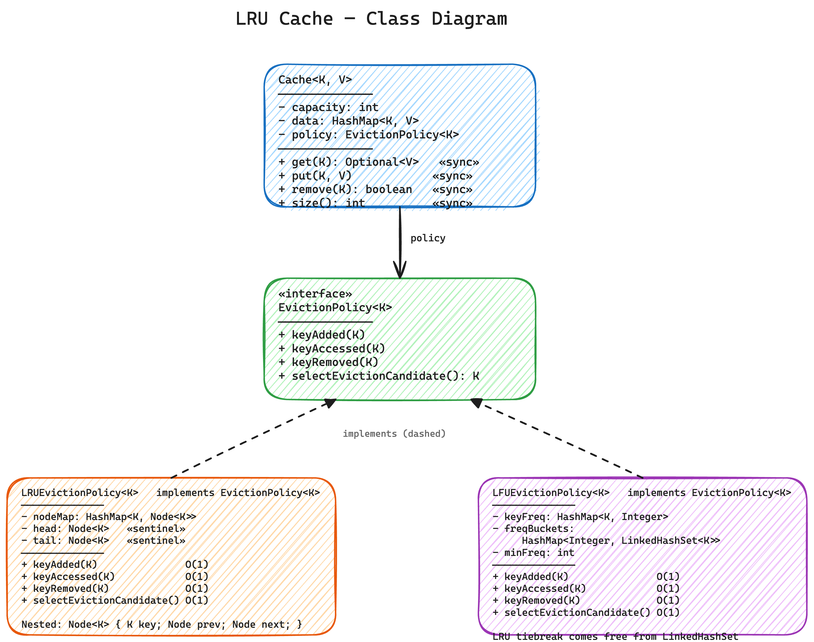

# LRU Cache — Low Level Design

A fixed-capacity, generic, thread-safe in-memory cache with **pluggable eviction policies** (LRU, LFU, FIFO and deadline-ordered TTL out of the box — plus a five-line `LinkedHashMap` LRU for contrast) and **optional per-entry TTL**.

---

## Problem Statement

Design an in-memory cache that:
- Stores up to `N` `<key, value>` pairs (capacity is fixed at construction time)
- Supports `get(key)`, `put(key, value)`, `remove(key)` in **O(1)**
- When full, evicts one entry to make room for a new key
- Allows the eviction policy to be swapped without touching the cache itself
- Ships with four ready policies -- **Least Recently Used (LRU)**, **Least Frequently Used (LFU)**, **First In First Out (FIFO)**, **nearest-deadline (TTL-ordered)** -- plus a `LinkedHashMap`-backed LRU that shows the library shortcut
- Supports **time-to-live**: a cache-wide default TTL, overridable per entry, with entries expiring whether or not the cache is full
- Is safe to call from multiple threads

**The two exit doors.** An entry leaves for one of two unrelated reasons, and the design keeps them apart:

| | Question it answers | Who decides | Where it lives |
|---|---|---|---|
| **Eviction** | "We are FULL — who leaves?" | `EvictionPolicy` (LRU / LFU / FIFO / TTL-ordered) | `strategy/` |
| **Expiry (TTL)** | "Is this entry still TRUE?" | the clock | `CacheEntry` + `Cache` |

A cache with free space must still refuse to serve a stale entry, so TTL cannot live inside a policy that only speaks up when the cache is full.

---

## High-Level Flow

```
cache.get(key)
    |
    +-- data.get(key)
    |        |
    |        +-- miss     --> return Optional.empty()
    |        |
    |        +-- EXPIRED  --> drop(key)  [data.remove + policy.keyRemoved]
    |        |                --> return Optional.empty()      (stale never counts as a hit)
    |        |
    |        +-- hit      --> policy.keyAccessed(key) --> return Optional.of(value)
    |
cache.put(key, value[, ttl])
    |
    +-- entry = new CacheEntry(value, ttl == null ? null : now + ttl)
    |
    +-- data.containsKey(key)?
    |        |
    |        +-- yes --> data.put(key, entry); policy.keyAccessed(key); return
    |        |           (an UPDATE: TTL restarts, nobody is evicted, no new policy node)
    |        |
    |        +-- no
    |              |
    |              +-- data.size() == capacity?
    |              |        |
    |              |        +-- yes --> purgeExpired(now)      (reclaim the dead first...)
    |              |
    |              +-- data.size() == capacity?
    |              |        |
    |              |        +-- yes --> K victim = policy.selectEvictionCandidate()
    |              |                    drop(victim)           (...only then kill a live one)
    |              |
    |              +-- data.put(key, entry); policy.keyAdded(key)
    |
cache.remove(key)
    |
    +-- data.remove(key) != null --> policy.keyRemoved(key)
    |
cache.purgeExpired()
    |
    +-- now = clock.instant()                (read ONCE, judge every entry against it)
    +-- collect expired keys, then drop(k) for each
```

---

## Class Diagram

```mermaid
classDiagram
    direction TB

    class Cache~K, V~ {
        -capacity: int
        -data: HashMap~K, CacheEntry~V~~
        -policy: EvictionPolicy~K~
        -defaultTtl: Duration «nullable»
        -clock: Clock «injected»
        +Cache(int, EvictionPolicy~K~)
        +Cache(int, EvictionPolicy~K~, Duration)
        +Cache(int, EvictionPolicy~K~, Duration, Clock)
        +get(K) Optional~V~ «sync»
        +put(K, V) «sync»
        +put(K, V, Duration) «sync»
        +remove(K) boolean «sync»
        +purgeExpired() int «sync»
        +size() int «sync»
        +capacity() int
        -drop(K)
        -purgeExpired(Instant) int
    }

    class CacheEntry~V~ {
        <<immutable>>
        -value: V
        -expiresAt: Instant «null = never»
        +value() V
        +expiresAt() Instant
        +isExpired(Instant) boolean
    }

    class EvictionPolicy~K~ {
        <<interface>>
        +keyAdded(K)
        +keyAccessed(K)
        +keyRemoved(K)
        +selectEvictionCandidate() K
    }

    class LRUEvictionPolicy~K~ {
        -nodeMap: HashMap~K, Node~
        -head: Node «sentinel»
        -tail: Node «sentinel»
        +keyAdded(K)
        +keyAccessed(K)
        +keyRemoved(K)
        +selectEvictionCandidate() K
        -addToHead(Node)
        -unlink(Node)
    }

    class Node~K~ {
        <<nested>>
        ~key: K
        ~prev: Node
        ~next: Node
    }

    class LFUEvictionPolicy~K~ {
        -keyFreq: HashMap~K, Integer~
        -freqBuckets: HashMap~Integer, LinkedHashSet~K~~
        -minFreq: int
        +keyAdded(K)
        +keyAccessed(K)
        +keyRemoved(K)
        +selectEvictionCandidate() K
        -recomputeMinFreq()
    }

    class LinkedHashMapLRUEvictionPolicy~K~ {
        -order: LinkedHashMap~K, Boolean~ «accessOrder=true»
        +keyAdded(K)
        +keyAccessed(K)
        +keyRemoved(K)
        +selectEvictionCandidate() K
    }

    class TTLEvictionPolicy~K~ {
        -clock: Clock
        -ttlResolver: Function~K, Duration~
        -byDeadline: TreeMap~Instant, LinkedHashSet~K~~
        -deadlines: HashMap~K, Instant~
        +keyAdded(K) «O(log n)»
        +keyAccessed(K) «no-op by design»
        +keyRemoved(K) «O(log n)»
        +selectEvictionCandidate() K «O(log n)»
    }

    class FIFOEvictionPolicy~K~ {
        -insertionOrder: LinkedHashSet~K~
        +keyAdded(K)
        +keyAccessed(K) «no-op by design»
        +keyRemoved(K)
        +selectEvictionCandidate() K
    }

    LRUEvictionPolicy ..|> EvictionPolicy
    LFUEvictionPolicy ..|> EvictionPolicy
    FIFOEvictionPolicy ..|> EvictionPolicy
    TTLEvictionPolicy ..|> EvictionPolicy
    LinkedHashMapLRUEvictionPolicy ..|> EvictionPolicy
    Cache --> EvictionPolicy : policy
    Cache *-- CacheEntry : data values
    LRUEvictionPolicy *-- Node : nodeMap values
```



<details>
<summary>Mermaid Class Diagram (click to expand)</summary>


</details>

---

## How to Approach This Problem (Smallest to Biggest)

When an interviewer asks "design an LRU cache," resist the urge to start coding the DLL + HashMap straight away. The mark of a senior answer is to first decide *what is the cache* and *what is the eviction policy*, and explain why those two responsibilities should not live in the same class.

### Layer 1: The smallest insight -- get() is a write

**What**: Reading a key is **not** a side-effect-free operation. Every `get(key)` mutates the cache's internal state, because the policy needs to record "this key was just accessed."

**Why this matters**: It explains why even `get` needs locking under concurrency, why a `ReadWriteLock` doesn't help here (LRU has no real "read-only" operation), and why the whole cache must be synchronized on every public method.

**Mental model**: Think of the cache as a library where every time you *look at* a book, the librarian moves it to the front of the shelf. There is no "just browsing."

**Interview power move**: *"The first thing I want to call out: in an LRU or LFU cache, `get` is a mutating operation. It changes recency or frequency. That's why we can't treat reads and writes asymmetrically -- both need the same lock."*

### Layer 2: Two responsibilities, not one -- separate storage from order

**What**: A cache has **two distinct jobs** that change for different reasons:
1. Store key -> value pairs and answer reads/writes
2. Decide which key should be evicted when capacity is exceeded

**Why**: If you fuse them into one class (which is how 90% of candidates write it), every eviction policy change forces you to rewrite the cache. By splitting them, the cache *never* changes when the policy changes, and you can plug in LRU, LFU, FIFO, MRU, ARC, or any future scheme without touching `Cache.java`.

**Mental model**: A cache is a warehouse. The shelves (HashMap) hold the goods. The clipboard the foreman carries (EvictionPolicy) decides which crate gets thrown out first. Don't fuse the foreman into the warehouse.

**Interview power move**: *"I'm splitting this into two responsibilities -- the cache owns key->value storage, the policy owns the ordering. This is Single Responsibility plus Open/Closed: I can add LFU later without changing a single line of Cache."*

### Layer 3: The contract -- `EvictionPolicy<K>` interface

**What**: A four-method strategy interface:
- `keyAdded(K)` -- new key inserted
- `keyAccessed(K)` -- existing key read or value updated
- `keyRemoved(K)` -- key dropped (manual or evicted)
- `selectEvictionCandidate()` -- "who would you evict right now?"

**Why these four hooks specifically**: They cover every observable event the cache can trigger. Any eviction policy (LRU, LFU, FIFO, random, MRU, ARC, 2Q, ...) can be expressed using just these four signals. No policy needs to see the *value* -- only the *key* and the event.

**Design decision worth noting**: The policy is **passive**. It never reaches into the cache; the cache calls into the policy. This is Dependency Inversion -- the high-level cache and the low-level policy both depend on the abstraction, not on each other's internals.

**Interview power move**: *"Notice the policy never sees `V`. It only knows about keys. That's deliberate -- it keeps the policy generic over value type and makes the interface as small as possible. Interface Segregation."*

### Layer 4: LRU -- the canonical O(1) implementation

**What**: A doubly linked list of keys plus a `HashMap<K, Node>`. Head sentinel is "most recently used," tail sentinel is "least recently used."

```
head <-> [MRU] <-> [...] <-> [LRU] <-> tail
```

- `keyAdded`: create a node, splice it in right after head
- `keyAccessed`: HashMap gets the node, unlink it, splice it in right after head
- `keyRemoved`: HashMap pops the node, unlink it
- `selectEvictionCandidate`: read `tail.prev.key`

**Why a DLL and not a singly linked list**: When `keyAccessed` fires on a node in the middle of the list, you need to unlink it in O(1). That requires a back pointer. With a singly linked list, unlinking the middle is O(n).

**Why sentinels and not a real head/tail node**: Sentinels eliminate null checks at the boundaries of the list. The unlink and splice code becomes uniform whether you're touching the first node, the last node, or one in the middle.

**Why HashMap from key to node**: Without it, locating an existing key in the DLL during `keyAccessed` would be O(n). The HashMap makes it O(1).

**Mental model**: A line at a bank. Whenever you walk up to the teller (access), you cut to the front (head). The person at the very back of the line (tail.prev) is the one who's been waiting longest -- that's who gets kicked out first when the bank closes.

**Interview power move**: *"I'm using sentinels for head and tail. They cost two extra node allocations but they remove every null check from the unlink/splice code. The trade-off is overwhelmingly in favor of sentinels."*

### Layer 5: LFU -- the natural extension

**What**: Two HashMaps and a counter:
- `keyFreq: K -> Integer`         -- how many times each key has been accessed
- `freqBuckets: Integer -> LinkedHashSet<K>`  -- all keys grouped by their current frequency
- `minFreq: int`                  -- the smallest frequency currently in any bucket

On `keyAccessed`, the key moves from `bucket[f]` to `bucket[f+1]`. On eviction, drop the first element of `bucket[minFreq]` -- it has the lowest count, and within that count it's the oldest (LRU tiebreak).

**Why this is the right LFU shape**: The naive LFU implementation sorts a frequency map on every eviction, which is O(n log n). With the two-map approach, every operation including eviction is O(1) amortized.

**Why LinkedHashSet, not a plain HashSet**: Tiebreaking. If three keys all have the same frequency, you need to evict the one that hasn't been touched the longest. `LinkedHashSet` preserves insertion order, which is exactly LRU-within-frequency.

**Why `minFreq` is tracked as a field**: Otherwise `selectEvictionCandidate` would have to scan `freqBuckets.keySet()` for the smallest key, which is O(n). Tracking `minFreq` and incrementing it when the current minimum bucket is emptied keeps the lookup O(1).

**LFU's one nasty edge case worth mentioning**: When you remove a key with the only entry in `bucket[minFreq]`, the next `selectEvictionCandidate` will be wrong unless you recompute `minFreq`. The implementation handles this in `recomputeMinFreq()`, but it's a real gotcha worth calling out to the interviewer.

**Interview power move**: *"LFU is where most candidates trip up -- they use a single TreeMap and end up at O(log n). The trick is two HashMaps and a tracked minimum frequency. Now every operation is O(1), and the LinkedHashSet inside each bucket gives me LRU as a free tiebreaker."*

### Layer 6: FIFO -- the policy that proves the abstraction

**What**: One `LinkedHashSet<K>` in arrival order. `keyAdded` appends to the back, `selectEvictionCandidate` returns the front, `keyRemoved` unlinks, and **`keyAccessed` does nothing at all**.

**Why the empty method is the whole point**: FIFO is defined by *when a key arrived*, never by how it was used. A key read a million times is still evicted the moment it becomes the oldest arrival. That deliberate no-op is what separates FIFO from LRU -- and it is the cheapest possible read path, because the hot path (`get`) does zero bookkeeping.

**Why it's the best proof that Layer 2 was right**: FIFO took ~15 lines and *zero* edits to `Cache`. If eviction logic had been fused into the cache, adding FIFO would have meant surgery on the class every other feature also depends on. This is Open/Closed demonstrated, not just claimed.

**Why `LinkedHashSet` and not `ArrayDeque`**: `ArrayDeque` gives O(1) `addLast`/`peekFirst`, but a manual `cache.remove(key)` has to delete an *arbitrary* key from the middle -- O(n) scan on a deque. `LinkedHashSet` is a hash set backed by a linked list of its entries: O(1) add, O(1) remove of any key, and iteration in insertion order. Every hook stays O(1).

**The trap to avoid**: don't "helpfully" re-insert the key in `keyAccessed`. `LinkedHashSet.add` on an existing key is a no-op, so it *looks* harmless -- but the moment someone "fixes" it to remove-then-add, FIFO silently becomes LRU. The empty body deserves a comment saying it is intentional.

**Mental model**: a queue at a ticket counter where nobody can cut the line. Being popular doesn't move you; only arriving later does.

**Interview power move**: *"FIFO's `keyAccessed` is intentionally empty -- that single no-op is the entire definition of the policy. And notice it needed no changes to `Cache` whatsoever; that's the payoff of the strategy split I made in the first two minutes."*

### Layer 7: TTL -- the second exit door, and why it is NOT a policy

**What**: Values are stored wrapped in an immutable `CacheEntry<V>` holding the value plus an absolute `expiresAt` instant (`null` = never). `Cache` takes an optional cache-wide `defaultTtl`, `put(k, v, ttl)` overrides it per entry, and an injected `java.time.Clock` supplies "now".

**Why TTL does not belong in `EvictionPolicy`**: eviction and expiry answer different questions. Eviction answers *"we are full -- who leaves?"*; TTL answers *"is this entry still true?"* A cache with plenty of free space must still refuse to serve a stale entry, so expiry cannot live in a component that only gets consulted under capacity pressure. Keeping it on the stored entry means **LRU, LFU, FIFO and any policy written next year get TTL for free**, with no changes and no duplicated logic. Folding it into the four-method interface would force every implementation to reimplement the same clock check -- a straight SRP violation.

**Why an absolute `expiresAt`, not a stored duration**: storing "expires at 10:04:31.2Z" makes the check one comparison against the clock. Storing "lives 5 minutes" forces arithmetic on every read and makes the answer depend on *when* the check happens to run.

**Why an injected `Clock`**: it is the standard Java seam for time. Tests hand in a fixed or hand-cranked clock and step time forward deterministically; without the seam every TTL test needs `Thread.sleep` and is both slow and flaky. `LruCacheDemo` uses a 20-line `SteppableClock` for exactly this reason -- the TTL demo runs instantly and always prints the same output.

**Why lazy expiry, not a sweeper thread**: expiry is enforced on read (an expired entry is a miss and is deleted on the spot) and opportunistically on write (a full cache purges dead entries *before* it evicts a live one). No background thread means no extra thread to lock, size, or shut down. The cost is that an expired entry nobody touches again occupies memory until something bumps into it -- which is precisely the trade-off Guava and Caffeine make. `purgeExpired()` is exposed for callers who want to reclaim eagerly.

**The ordering detail interviewers look for**: in `get`, the expiry check comes **before** `policy.keyAccessed`. Reading a stale entry must not count as a hit, or a dead key would be promoted to most-recently-used and outlive live ones. Likewise `put` on a full cache calls `purgeExpired` first -- letting an entry that died an hour ago push out a key written a second ago is defensible by the letter of the policy and indefensible in an interview.

**Why the expired entry is deleted on read rather than just skipped**: a key that is polled forever but never rewritten would otherwise leak permanently.

**Interview power move**: *"I'd push back on modelling TTL as an eviction policy. Eviction is about space, TTL is about truth -- a cache that's half empty still can't serve a stale value. So expiry rides on the stored entry and every policy inherits it for free. I'd inject a `Clock` rather than calling `Instant.now()`, so TTL is testable without sleeping."*

### Layer 8: The orchestrator -- `Cache<K, V>`

**What**: Holds a `HashMap<K, CacheEntry<V>>`, an `EvictionPolicy<K>`, the `capacity`, an optional `defaultTtl` and a `Clock`. Every public method is `synchronized`. On `put`, if the cache is full it first purges expired entries, then asks the policy who to evict, removes that key, and inserts the new one.

**Why so thin**: The cache is a coordinator, not a doer. It knows nothing about access order, frequency counts, or eviction heuristics. It only knows: "I have a HashMap. If I'm full and a new key comes in, I ask the policy who to drop." This is exactly the same shape as `ParkingLot` in the parking-lot module -- a thin orchestrator that delegates everything.

**Why synchronized on every method, including reads**: See Layer 1. `get` mutates policy state, so it must hold the lock just like `put` does.

**Why `Optional<V>` from `get`**: We forbid null values (NPE on `put(null)`) so `Optional.empty()` unambiguously means "key not present." This is the same convention used in the parking-lot module.

**Mental model**: The cache is a hotel desk clerk. The clerk doesn't decide who gets kicked out when rooms are full -- they ask the manager (policy). They just store reservations and pass on questions.

**Interview power move**: *"The Cache class has zero policy logic. If you grep it for `LRU` or `LFU`, you'll find nothing. That's the whole point -- the cache and the policy evolve independently."*

### Layer 9: The five-line `LinkedHashMap` version -- ship it, but never lead with it

**What**: `LinkedHashMapLRUEvictionPolicy` is the same LRU with the same complexity and the same eviction order, in five lines of real logic:

```java
private final LinkedHashMap<K, Boolean> order = new LinkedHashMap<>(16, 0.75f, true);

public void keyAdded(K key)    { order.put(key, Boolean.TRUE); }
public void keyAccessed(K key) { order.get(key); }              // get() reorders — that IS the promotion
public void keyRemoved(K key)  { order.remove(key); }
public K selectEvictionCandidate() {
    return order.isEmpty() ? null : order.keySet().iterator().next();   // head = LRU
}
```

The third constructor argument, `accessOrder = true`, is the entire policy. It flips `LinkedHashMap` from insertion-order to access-order, so every `get`/`put` re-threads that entry to the most-recently-used end and the head of the iteration order is always the LRU key. Flip that one boolean to `false` and this class silently becomes FIFO -- LRU and FIFO really are one boolean apart.

**Why it exists in this repo**: it drops into the same `Cache` and produces byte-identical demo output to the hand-rolled policy. That is the point: the `EvictionPolicy` interface is the boundary, so the algorithm underneath is free to be a hand-rolled DLL *or* a JDK class.

**Why you must not open with it in an interview**: "implement an LRU cache" is not a request for a cache. It is a request to build the doubly-linked-list-plus-hashmap structure that makes O(1) recency possible -- and `LinkedHashMap` **is** a HashMap whose entries are threaded onto a doubly linked list. Handing it over means the library performs the exact demonstration you were being graded on, and none of the reasoning (why a DLL and not a singly linked list, why sentinels, why a key->node map) ever gets said out loud. It reads as avoidance.

Two further weaknesses if the interviewer pushes:
- The famous one-class variant (`class LRUCache<K,V> extends LinkedHashMap<K,V>` overriding `removeEldestEntry`) hardcodes you to LRU forever -- there is no seam to swap in LFU or FIFO. The policy version above at least keeps the seam.
- It is not thread-safe; `Collections.synchronizedMap` locks the map but not the cross-structure invariant between `data` and the policy (see the `ConcurrentHashMap` section below).

**The right sequencing**: hand-roll the DLL first, then say the line below. Order matters -- said first it is a dodge, said second it is range.

**Interview power move**: *"That's the hand-rolled version, so you can see the mechanism. In production I'd write `new LinkedHashMap<>(16, 0.75f, true)` and override `removeEldestEntry` -- accessOrder=true is exactly this doubly linked list, already implemented and battle-tested in the JDK. I've kept both in this repo behind the same interface; they produce identical output. I led with the hand-rolled one because the DLL is the part you were asking about."*

### Layer 10: TTL-ordered eviction -- a second, narrower use of the clock

**What**: `TTLEvictionPolicy` evicts the key with the **nearest deadline** -- the entry about to die anyway, so losing it costs least. It is a real `EvictionPolicy`, and it is *not* the same thing as Layer 7's expiry.

| | Question | When it runs | Where |
|---|---|---|---|
| `Cache` + `CacheEntry` (Layer 7) | "is this entry still **true**?" | every read, full or not | correctness |
| `TTLEvictionPolicy` (this layer) | "we are **full** -- who goes?" | only under capacity pressure | performance |

They compose: a full `put` first purges what is already dead, then sacrifices whatever was going to die next.

**Why it needs a `TreeMap` when LFU gets away with `HashMap` + `minFreq`**: this is the sharpest comparison in the module. LFU's `minFreq++` trick works because its buckets are **dense integers that advance by exactly one** -- a promoted key always lands in `bucket[f+1]`, so the new minimum is knowable without looking. Deadlines are arbitrary `Instant`s: once the earliest empties, the next could be a millisecond or a week later, and nothing lands anywhere predictable. There is no "+1" to take, so the minimum has to come from a structure that sorts itself.

```
LFU  : HashMap + tracked minFreq  ->  O(1) hooks, but needs recomputeMinFreq() repair
TTL  : TreeMap by deadline        ->  O(log n) hooks, but never needs repair at all
```

**Be honest about the complexity**: this policy is O(log n), not O(1), and that is not fixable. "Give me the smallest of an arbitrary set of deadlines" is a priority-queue problem, and priority queues cost log n. Claiming O(1) here is the kind of thing that gets caught.

**The degenerate case worth naming**: if every key has the *same* TTL, deadlines rise monotonically with arrival, so nearest-deadline == oldest-arrival and this policy **is** FIFO -- at O(log n) instead of O(1). It only earns its log n when `session:*` lives 30 minutes and `config:*` lives 30 seconds. Reach for `FIFOEvictionPolicy` otherwise.

**Where the strategy interface starts to strain** (say this before the interviewer says it): the four hooks carry only a **key**, but this policy needs each key's **deadline**. The demo resolves it by handing the same `ttlFor(key)` function to both the cache and the policy -- one source of truth, passed twice. The alternative is widening `keyAdded(K)` to `keyAdded(K, EntryMetadata)`, which would force LRU, LFU and FIFO to accept a parameter none of them want. I chose duplication over widening because the cost lands on one policy instead of all four; if deadline-ordered eviction became the primary use case, widening would be the right call. Note the failure mode if the two disagree is a *worse victim choice*, never a stale read -- `Cache` remains the only authority on expiry.

**Interview power move**: *"There are two different TTL questions and they belong in different places. 'Is this entry still true?' is correctness -- that lives on the entry and every policy inherits it. 'Who leaves when we're full?' is a policy, and answering it with 'whoever expires soonest' needs a TreeMap, not the HashMap-plus-minimum trick LFU uses -- because deadlines aren't dense integers, so there's no +1 to take. That costs me O(log n), and I'd say so rather than pretend it's O(1)."*

### The Full Picture

```
Cache<K, V>                       (orchestrator -- capacity + defaultTtl + Clock)
    |
    +-- HashMap<K, CacheEntry<V>> (storage; CacheEntry = value + absolute expiresAt)
    |        ^
    |        +-- TTL / expiry lives HERE, not in the policy  ("is this still true?")
    |
    v
EvictionPolicy<K>                 (interface -- 4 hook methods; "who leaves when full?")
    |
    +-- LRUEvictionPolicy<K>      (HashMap + DLL with sentinels)
    |
    +-- LFUEvictionPolicy<K>      (HashMap + freq buckets + minFreq)
    |
    +-- FIFOEvictionPolicy<K>     (LinkedHashSet in arrival order; keyAccessed = no-op)
    |
    +-- TTLEvictionPolicy<K>      (TreeMap by deadline; evict whatever dies soonest, O(log n))
    |
    +-- <future policy>           (MRU, ARC, 2Q -- plug in without touching Cache)
```

> **Interview Summary**: *"I split the design into two responsibilities -- a generic `Cache<K, V>` that owns the key-to-entry HashMap, and an `EvictionPolicy<K>` strategy that owns the access-order bookkeeping. The cache calls into the policy on every event (`keyAdded`, `keyAccessed`, `keyRemoved`) and asks who to evict via `selectEvictionCandidate`. LRU uses a doubly linked list with sentinels plus a key->node HashMap for O(1) operations. LFU uses two HashMaps -- key->frequency and frequency->LinkedHashSet of keys -- plus a tracked `minFreq`, also O(1), with LRU as a free tiebreaker thanks to LinkedHashSet's insertion order. FIFO is a single LinkedHashSet in arrival order whose `keyAccessed` is deliberately empty -- that no-op is the whole policy, and it needed zero changes to `Cache`, which is the proof the split was right. TTL is deliberately NOT a policy: eviction answers 'we're full, who leaves?', TTL answers 'is this entry still true?', so expiry rides on an immutable `CacheEntry` holding an absolute `expiresAt`, and every policy inherits it for free. Expiry is lazy -- checked on read before the access is recorded, and a full cache purges dead entries before evicting a live one -- with an injected `Clock` so it's testable without sleeping. Every public method on the cache is synchronized because even `get` mutates policy state."*

---

## Project Structure

```
lru-cache/
├── pom.xml
├── README.md
├── class-diagram.excalidraw
└── src/main/java/com/lrucache/
    ├── LruCacheDemo.java                # Entry point (main) — LRU / LFU / FIFO / update / TTL demos
    │
    ├── model/
    │   ├── Cache.java                   # Generic orchestrator — owns HashMap + TTL, delegates eviction
    │   └── CacheEntry.java              # Immutable value + absolute expiresAt (null = never)
    │
    └── strategy/
        ├── EvictionPolicy.java          # Strategy interface (4 hook methods)
        ├── LRUEvictionPolicy.java       # DLL + nodeMap (Node is a private static nested class)
        ├── LFUEvictionPolicy.java       # freqMap + freq->LinkedHashSet buckets + tracked minFreq
        ├── FIFOEvictionPolicy.java      # LinkedHashSet in arrival order; keyAccessed is a no-op
        ├── TTLEvictionPolicy.java       # TreeMap by deadline — evicts whatever dies soonest, O(log n)
        └── LinkedHashMapLRUEvictionPolicy.java  # Same LRU in 5 lines — ship it, don't lead with it
```

---

## Design Patterns Used

| Pattern | Where | Why |
|---------|-------|-----|
| **Strategy** | `EvictionPolicy` + `LRU` / `LFU` / `FIFO` implementations | Swap eviction algorithm without changing `Cache` |
| **Sentinel Node** | `LRUEvictionPolicy` head/tail | Removes null checks at DLL boundaries |
| **Adapter (of a JDK type)** | `LinkedHashMapLRUEvictionPolicy` | Wraps `LinkedHashMap(accessOrder=true)` behind the same 4-method contract — proves the interface is the boundary, not the algorithm |
| **Composition** | `Cache` owns `EvictionPolicy` | Cache delegates ordering decisions |
| **Value Object** | `CacheEntry<V>` (immutable value + `expiresAt`) | TTL rides on the stored entry, so every policy inherits expiry for free |
| **Dependency Injection** | `Clock` passed into `Cache` | Makes TTL deterministic and testable without `Thread.sleep` |

---

## SOLID Principles Applied

| Principle | How |
|-----------|-----|
| **SRP** | `Cache` stores and enforces TTL; `EvictionPolicy` decides eviction order; `CacheEntry` knows only whether it is stale. Three reasons to change, three classes. |
| **OCP** | FIFO was added as a new `EvictionPolicy` implementation with **zero** edits to `Cache` -- MRU / ARC would be the same. |
| **LSP** | Anywhere `EvictionPolicy<K>` is expected, LRU, LFU and FIFO are all drop-in -- including FIFO, whose `keyAccessed` does nothing (a no-op honours the contract; it does not break it). |
| **ISP** | Interface has exactly the four methods needed to express any access-order policy -- no fat. |
| **DIP** | `Cache` depends on `EvictionPolicy` abstraction, not on `LRUEvictionPolicy` concrete class. |

---

## Thread Safety

- All public methods on `Cache` are `synchronized` -- including `get`, because reads mutate policy state (recency/frequency tracking).
- The policies themselves are NOT thread-safe in isolation; safety relies on the cache holding the lock around every policy call. This is a deliberate trade-off: it keeps the policies simple and avoids double-locking.
- For a higher-concurrency variant, swap `synchronized` for a `ReentrantLock`, or shard the cache (a-la Guava `LoadingCache`) so each shard holds its own lock.
- TTL adds no new locking: expiry is checked inside the already-synchronized `get` / `put`, and `purgeExpired()` is synchronized too. There is no sweeper thread, so there is no second thread to coordinate with.
- Each operation reads `clock.instant()` **once** and judges every entry it touches against that single instant, so a bulk purge can never be internally inconsistent (no entry surviving because time moved mid-loop).
- `purgeExpired` collects victim keys first and deletes afterwards -- `policy.keyRemoved` is a call into foreign code, and invoking it mid-iteration over `data` is how `ConcurrentModificationException` bugs are born.

---

## Extensibility

- **New eviction policy** (FIFO, MRU, random, ARC, 2Q, ...) -> implement `EvictionPolicy<K>`. Zero changes to `Cache`.
- **Time-based expiry (TTL)** -> **built in.** Pass a `defaultTtl` to the constructor, or a per-entry TTL to `put(k, v, ttl)`. Works with every policy because expiry lives on `CacheEntry`, not in `EvictionPolicy`.
- **Eager expiry** -> call `purgeExpired()` from a scheduler; or, for a push model, add a `DelayQueue<K>` fed on each `put` and drained by one sweeper thread that calls `cache.remove(key)`.
- **Expire-after-access instead of expire-after-write** -> refresh `expiresAt` inside `get` as well as `put` (Guava exposes both as separate knobs).
- **Cache statistics** (hit rate, miss rate) -> add counters on `Cache` and expose `stats()`.
- **Listeners on eviction** -> add an `EvictionListener<K, V>` interface and call it from `Cache.put` right before `data.remove(victim)`.
- **Higher concurrency** -> replace `synchronized` with `ReentrantLock` (allows tryLock + timeout) or shard the cache by key hash so each shard locks independently.

---

## LFU Notes (Common Follow-Up)

LFU is the natural follow-up an interviewer will ask once you finish LRU. Treat it as an extension, not a separate problem.

**The key insight**: LFU is LRU + frequency tracking. Both policies fit the same `EvictionPolicy<K>` contract, which is why they live side-by-side in this module.

**The pitfall to avoid**: Don't use a `TreeMap<Integer, ...>` for the buckets -- that gives you O(log n) on every access. Use a plain `HashMap` plus a tracked `minFreq` field, and increment / recompute it on the rare cases where the minimum bucket empties out. That keeps every operation O(1) amortized.

**The interview-grade detail**: Frequency ties between keys are broken using LRU semantics -- the oldest entry at the lowest frequency goes first. We get this for free by using `LinkedHashSet` (which preserves insertion order) as the bucket type instead of plain `HashSet`.

**When to actually use LFU in production**: LFU is rare in practice -- it has a "scan resistance" weakness (one-off bursts inflate frequency counts permanently). Real systems use **W-TinyLFU** (Caffeine library) or **ARC** (adaptive replacement cache). For an LLD interview, classic LFU is plenty -- mention W-TinyLFU as the production-grade follow-up if you have time.

---

## FIFO Notes

FIFO is the policy interviewers use to check whether your abstraction is real or decorative. It took ~15 lines and **zero** changes to `Cache`.

**The one line that matters**: `keyAccessed` is empty. FIFO orders by arrival, so reads must not reorder anything. Leave a comment saying the emptiness is deliberate, or the next person "fixes" it and silently turns FIFO into LRU.

**Why `LinkedHashSet` and not `ArrayDeque`**: a deque gives O(1) at both ends but O(n) removal of an arbitrary key, which `cache.remove(key)` needs. `LinkedHashSet` is a hash set whose entries are threaded on a linked list: O(1) add, O(1) remove of any key, iteration in insertion order.

**Its weakness**: no recency and no frequency awareness at all -- the hottest key in the cache is evicted the moment it becomes the oldest arrival. Its strength is the mirror image: the read path does *zero* bookkeeping, so it's the cheapest policy to run and the easiest to reason about. Real systems use it where entries are naturally uniform (fixed-size buffers, write-behind queues) or where the read path must stay allocation-free.

**LRU and FIFO are one boolean apart**: `new LinkedHashMap<>(16, 0.75f, true)` is LRU; `false` (the default) is FIFO. Worth saying out loud -- it shows you know what `accessOrder` actually toggles.

---

## TTL Notes

**The framing that wins the question**: eviction and expiry are different exit doors. Eviction answers *"we are full -- who leaves?"*; TTL answers *"is this entry still true?"* A half-empty cache must still refuse to serve a stale value, so TTL cannot live in a component only consulted under capacity pressure. That's why `expiresAt` sits on `CacheEntry` and **every policy inherits TTL for free**.

**Absolute deadline, not stored duration**: `expiresAt` is an `Instant`. Checking expiry is then one comparison; storing "lives 5 minutes" would need arithmetic on every read and would make the answer depend on when the check ran.

**Lazy expiry, no sweeper thread**: expired entries are dropped when read, and a full cache calls `purgeExpired` *before* evicting a live key. No background thread means nothing extra to lock or shut down; the cost is that an untouched expired entry holds memory until something bumps into it. Guava and Caffeine make the same trade. `purgeExpired()` is exposed for callers who want to reclaim on a schedule.

**Two ordering details worth saying out loud**:
1. In `get`, expiry is checked **before** `policy.keyAccessed` -- a stale read must never count as a hit, or a dead key gets promoted to MRU and outlives live ones.
2. In `put`, a full cache purges the dead **before** choosing a victim -- otherwise an entry that died an hour ago can push out a key written a second ago.

**Expire-after-write vs expire-after-access**: this implementation refreshes the deadline on write only. Refreshing it in `get` too gives expire-after-access (Guava exposes both as separate knobs) -- but then a key that is polled forever never expires, which is usually not what you want for cache invalidation.

**Two different TTL questions, two different places**: `Cache` + `CacheEntry` enforce *expiry* (never serve a stale value, full or not). `TTLEvictionPolicy` decides *eviction order* (when full, drop whatever dies soonest). The first is correctness and applies always; the second is performance and only runs under capacity pressure. They compose -- pair them and a full `put` purges the dead, then sacrifices the nearly-dead. Only the first is mandatory.

**Injected `Clock`**: TTL code that calls `Instant.now()` can only be tested with `Thread.sleep`. A `Clock` parameter makes expiry deterministic and instant to test -- `LruCacheDemo`'s `SteppableClock` is 20 lines and the TTL demo prints the same output every run.

---

## Correctness Traps (the bugs that actually fail candidates)

Both of these are in `Cache.put`, both compile, and both produce *plausible-looking* output until someone tests the exact case. `LruCacheDemo.runUpdateOnFullCache()` exists purely to guard them.

### Trap 1: `put` on an **existing** key must take the update path

A write to a key already in the cache is an **update**, not an insert. Falling through to the insert path breaks two things at once:

- **The capacity check fires** even though an update doesn't grow the cache -> an innocent key is evicted. On a full cache, `put(2, "new")` kills key 1 for no reason.
- **`policy.keyAdded` runs on an update** -> LRU builds a *second* `Node` for key 2 and overwrites `nodeMap[2]`. The old node is still linked into the DLL but is now unreachable from the map. The list has 4 nodes, the map has 3, and `tail.prev` is a stale orphan -- so the next eviction picks the **most** recently used key. Eviction order goes visibly wrong the moment an interviewer types one update into your `main`.

The fix is the early return:

```java
if (data.containsKey(key)) {
    data.put(key, entry);
    policy.keyAccessed(key);   // an access, NOT an add
    return;                    // no capacity check, no eviction
}
```

Note this is also why FIFO's `keyAccessed` being a no-op is correct: a rewrite is not a new arrival, so it must not move the key in the queue.

### Trap 2: don't call `keyRemoved` twice

```java
remove(victim);                 // the PUBLIC method — already calls policy.keyRemoved
policy.keyRemoved(victim);      // second call
```

LRU survives it silently (`nodeMap.remove` returns `null`, so the second call is a no-op), which is exactly why it lives so long in a codebase. LFU does not: any counter-based policy decrements twice and corrupts `minFreq`, so the *next* eviction picks the wrong victim. Latent, invisible under LRU, and precisely the thing a reviewer traces.

This implementation removes the possibility structurally: every deletion funnels through one private helper, so the "data and policy always agree" invariant has exactly one implementation to get right.

```java
private void drop(K key) {
    data.remove(key);           // the MAP's remove, not this.remove(...)
    policy.keyRemoved(key);
}
```

---

## Common Interview Questions (Rapid Fire)

These are the exact follow-ups interviewers ask once your code compiles. Have a one-paragraph answer ready for each.

### Q1. Why `LinkedHashSet` inside each LFU bucket and not a plain `HashSet`?

Because LFU has to tiebreak. When multiple keys share the lowest frequency, the convention is to evict the **oldest one at that frequency** -- i.e. LRU within frequency. `LinkedHashSet` preserves **insertion order**, so `bucket.iterator().next()` returns the key that entered the bucket first. A plain `HashSet` gives arbitrary order, which would make eviction non-deterministic and break the LRU-tiebreak contract. The cost difference is negligible (an extra doubly linked list of hash entries), and we get correct semantics for free.

### Q2. Why a doubly linked list in LRU and not a singly linked list?

`keyAccessed` needs to **unlink an arbitrary middle node in O(1)**. A singly linked list only knows the *next* pointer, so unlinking a middle node would require walking from the head to find its predecessor -- O(n). A doubly linked list carries back-pointers, so `node.prev.next = node.next` finishes the job in two pointer writes. The extra `prev` field per node is a tiny price for O(1) operations on every hit.

### Q3. Why sentinel `head` and `tail` nodes? Why not just track real head / tail references?

Sentinels eliminate **every null check** at the list boundaries. Without them, `addToHead` and `unlink` have to branch on "am I touching the only node? the first node? the last node?" -- four edge cases each. With sentinels, every real node has a real `prev` and a real `next`, so the same four pointer writes work for any position in the list. Two extra node allocations buys you branchless, uniform pointer surgery. It's a textbook win.

### Q4. Why do you need a `HashMap<K, Node>` in LRU? Can't the DLL track everything?

Without the map, `keyAccessed(key)` would have to walk the DLL to find the node holding that key -- O(n). The `nodeMap` makes that lookup O(1). The DLL gives you order; the HashMap gives you direct access. Both are needed -- this is the textbook "HashMap + DLL" pattern.

### Q5. Why is `get()` synchronized? It's just a read.

Because in LRU and LFU, **reads are writes**. `get(key)` calls `policy.keyAccessed(key)`, which mutates the policy's internal state (DLL pointers or frequency buckets). Two concurrent `get`s on the same key would race on those mutations and corrupt the DLL or the bucket maps. There is no "read-only" operation in this cache, so a `ReadWriteLock` doesn't help either.

### Q6. Why two HashMaps in LFU? Why not just a `TreeMap<Integer, LinkedHashSet<K>>` and call `firstKey()`?

`TreeMap` is O(log n) on every insert, remove, and lookup. The two-HashMap design with a tracked `minFreq` field is O(1) on every hot-path operation. The only price is that `minFreq` is mutable state we have to maintain carefully on every hook -- a small cost for an asymptotic win. If you ever expect heavy manual `remove()` traffic, *then* a `TreeMap` makes sense because manual removes are the one path where we currently scan to recompute `minFreq`.

### Q7. Why does a brand-new key in LFU start at frequency 1, not 0?

Two reasons. **Pragmatic**: if it started at 0, then the very next `keyAccessed` would put it at 1 -- which is the same state it would be in if you'd just started it at 1 directly. **Semantic**: the act of *inserting* a key counts as the first use. There's no reason to track keys that have been accessed zero times -- they wouldn't be in the cache in the first place. So freq = 1 on insert is both the simpler and the more correct convention.

### Q8. Why does `minFreq++` work on `keyAccessed`, but `keyRemoved` has to call `recomputeMinFreq()`?

On `keyAccessed`, the key didn't disappear -- it got *promoted* to bucket[f+1]. So if you just emptied bucket[minFreq], the smallest bucket can only be the promoted key's new home: f+1. Nothing else moved, so `minFreq++` is provably correct.

On `keyRemoved`, the key vanished entirely. There's no promotion. The next-smallest bucket could be at any frequency above the one we just emptied -- there could be a gap of 5 or 50. You can't guess it; you have to scan.

This is the single most-asked LFU edge case. Get it right and the interviewer relaxes.

### Q9. Why does `Cache.get` return `Optional<V>` instead of just `V`?

We forbid null values at insert time (`put` throws on null). That means `null` becomes a clean "absent" marker -- so we wrap it in `Optional.empty()`. The caller never has to ambiguously interpret "did `get` return null because the key is missing, or because the value is null?" Optional makes the API self-documenting and forces the caller to handle the miss explicitly.

### Q10. Why is `Node` a `private static final` nested class?

- **private** -- only `LRUEvictionPolicy` should ever see DLL pointers. Exposing `Node` would leak implementation details and let outsiders corrupt the list.
- **static** -- the nested class doesn't need a reference to its enclosing `LRUEvictionPolicy` instance. Making it static saves one hidden field per node (the synthetic `this$0` back-reference) and a tiny bit of memory per cache entry.
- **final** -- nobody should subclass it; the node is an internal data carrier, not a polymorphic entity.

### Q11. Can the policies be made thread-safe in isolation, without the Cache holding a lock?

Technically yes, but it's a bad design. You'd have to lock inside every policy method, and then `Cache.put` would also need a lock to maintain its own compound-transaction invariants (size check + eviction + insert must be atomic together). The result is **two locks held in nested order** -- harder to reason about, slower under contention, and prone to deadlock if the order isn't perfectly consistent. The current design uses a **single coarse lock at the Cache layer**, which covers both `data` and the policy in one shot. Simpler, faster, correct.

### Q12. What's LFU's main weakness vs LRU in production?

**Scan resistance / aging.** A key that was hit 10,000 times yesterday but is no longer relevant today still has a count of 10,000 -- it'll never be evicted, even though it's effectively dead weight. LRU naturally ages keys (anything not touched recently drops to the bottom), but LFU has no decay built in. Real systems use **W-TinyLFU** (Caffeine) which combines LFU's popularity signal with a sketch-based aging mechanism, or **ARC** which adaptively trades off between recency and frequency. Mention W-TinyLFU if the interviewer asks "would you actually use this in production?"

### Q13. Why is `policy.selectEvictionCandidate()` separate from `policy.keyRemoved()` -- why not one method?

Because **the cache owns the value storage**, not the policy. The flow has to be:
1. Cache asks policy: "who do I evict?" -- `selectEvictionCandidate` returns a key.
2. Cache removes that key from its `data` HashMap.
3. Cache tells policy: "I removed this key" -- `keyRemoved`.

If `selectEvictionCandidate` also removed the key from the policy's bookkeeping, the policy and the cache would drift out of sync between steps 1 and 2 -- if step 2 throws or is interrupted, the policy now believes a key is gone that's actually still in `data`. Two methods keeps the invariant repairable: the cache stays the source of truth, the policy is always told what happened.

### Q14. How does TTL work here, and why isn't it an `EvictionPolicy`?

Values are stored as an immutable `CacheEntry<V>` holding the value plus an absolute `expiresAt` instant (`null` = never). `Cache` takes an optional cache-wide `defaultTtl`; `put(k, v, ttl)` overrides it per entry. Expiry is lazy: `get` drops an expired entry and reports a miss, and a full `put` purges dead entries before evicting a live one. `purgeExpired()` is exposed for eager reclamation.

It is deliberately **not** an `EvictionPolicy`, because the two answer different questions: eviction answers *"we're full -- who leaves?"*, TTL answers *"is this entry still true?"* A cache with free space must still refuse a stale value, so expiry cannot live in something that's only consulted under capacity pressure. Putting it on the entry means LRU, LFU, FIFO and any future policy get TTL for free; folding it into the four-method interface would force every implementation to reimplement the same clock check -- a straight SRP violation.

### Q15. `FIFOEvictionPolicy.keyAccessed` is an empty method. Is that a bug?

No -- it is the entire definition of the policy. FIFO orders by *when a key arrived*, so a read must not change a key's position. A key hit a million times is still evicted the instant it becomes the oldest arrival. The method carries a comment saying the emptiness is intentional, because an empty body is exactly the kind of thing a well-meaning reviewer "fixes" -- and a remove-then-add in there would silently convert FIFO into LRU.

### Q16. Why would anyone pick FIFO over LRU?

Because FIFO's read path does *zero* bookkeeping -- no relinking, no counter, no allocation -- so it's the cheapest policy to run and the easiest to reason about under a lock. It fits workloads where entries are naturally uniform (fixed-size buffers, write-behind queues, replay windows). Its weakness is the flip side: no recency or frequency awareness whatsoever, so a hot key ages out on schedule like any other. Worth adding: `new LinkedHashMap<>(16, 0.75f, true)` is LRU and `false` is FIFO -- the two are one boolean apart.

### Q17. Why store an absolute `expiresAt` instead of the TTL duration plus an insertion time?

Because the check then costs one comparison against the clock, with no arithmetic on the read path, and the answer doesn't depend on *when* the check happens to run. Storing a duration means recomputing `insertedAt + ttl` on every single read for no benefit. The `null` case is also cleaner: `expiresAt == null` reads directly as "never expires".

### Q18. Why lazy expiry instead of a background sweeper thread?

A sweeper is a second thread that has to take the same lock, be sized, be shut down, and be reasoned about -- real complexity for a feature that lazy checks already deliver correctly. Lazily, an entry can never be *served* after its deadline, which is the actual correctness requirement; the only cost is that an expired entry nobody touches again occupies memory until something bumps into it. Guava and Caffeine make exactly this trade. `purgeExpired()` is exposed so a caller who cares can schedule reclamation, and the push-model alternative -- a `DelayQueue<K>` fed on each `put` and drained by one thread calling `cache.remove` -- is the answer if the interviewer wants eager expiry.

### Q19. Why does `size()` count entries that have already expired?

Because making it exact means an O(n) scan on a call every caller expects to be O(1). The method documents the behaviour and `purgeExpired()` gives you the exact live count on demand. This is the honest trade: an approximate O(1) `size` plus an explicit O(n) purge beats an O(n) `size` that hides its cost.

### Q20. Why does `Cache` take a `java.time.Clock` instead of calling `Instant.now()`?

Because otherwise every TTL test has to `Thread.sleep`, which makes the suite slow and flaky. `Clock` is the standard Java seam for time: tests inject a fixed or hand-cranked clock and step time forward deterministically -- `LruCacheDemo.SteppableClock` is 20 lines and the TTL demo runs instantly with identical output every time. A second benefit: each operation reads the clock **once** and judges every entry it touches against that one instant, so a bulk purge can't be internally inconsistent.

### Q21. `LinkedHashMap` with `accessOrder=true` is LRU in five lines. Why hand-roll the DLL?

For the interview, because "implement an LRU cache" is asking for the doubly-linked-list-plus-hashmap structure, and `LinkedHashMap` **is** that structure -- reaching for it means the library performs the exact demonstration you're being graded on, and the reasoning (why a DLL not a singly linked list, why sentinels, why key->node) never gets said. For production, you should use it: this repo ships `LinkedHashMapLRUEvictionPolicy` behind the same interface, and it produces identical output to the hand-rolled policy. The sequencing is what matters -- hand-roll it first, then mention the library version. Said first it's a dodge; said second it's range. Note also that the famous one-class variant (`extends LinkedHashMap` + `removeEldestEntry`) hardcodes you to LRU with no seam for LFU or FIFO, and isn't thread-safe.

### Concurrency questions (asked whenever your code uses `synchronized`)

> Interviewers treat these keywords as an invitation. The moment they spot `synchronized` on `get` / `put` in `Cache` they ask *"why that and not the alternative?"* See **[CONCURRENCY-GUIDE.md](../CONCURRENCY-GUIDE.md)** for full explanations; the rapid-fire versions:

### Q22. Why is `synchronized` on `get` **and** `put`, not just `put`?

Because in `Cache`, **a `get` is also a write**. `Cache.get` calls `policy.keyAccessed(key)`, which splices a `Node` to the head of `LRUEvictionPolicy`'s doubly linked list (or bumps a `freqBuckets` entry in `LFUEvictionPolicy`). That mutation races exactly like `put` does, so `get` needs the same lock. This is why a plain "read lock" or a `ConcurrentHashMap` on `data` is insufficient -- there is no truly read-only operation here, so guarding only the writes leaves the recency bookkeeping unprotected.

### Q23. Why one lock over **both** `data` and `policy` instead of locking each separately?

Because `Cache` maintains an invariant *across two structures*: the keys in the `data` HashMap must exactly match the keys the `policy` tracks (its DLL / freq buckets). A `put` does "evict victim from `data`, tell `policy.keyRemoved`, insert new key, tell `policy.keyAdded`" -- those steps must move together atomically. Two independently-locked concurrent structures would let a second thread observe `data` and `policy` mid-transaction (one updated, the other not) and pick a victim that no longer exists. The single `synchronized` monitor on `Cache` makes the whole compound operation one critical section, so the two structures can never diverge.

### Q24. The cache is correct but contended -- how would you reduce lock contention?

The standard move is **lock striping / sharding**: split into N independent `Cache` shards keyed by `hash(key) % N` (how `ConcurrentHashMap` and Caffeine scale), so unrelated keys never block each other while each shard keeps its own coarse `synchronized` lock over its `data` + `policy`. A `ReentrantReadWriteLock` is the usual second suggestion, but note the catch from Q22: **a `get` here still writes** (it reorders recency), so most reads would have to take the write lock anyway -- an RW-lock helps far less than usual and can even be slower due to its bookkeeping overhead. Sharding is the better answer for this design.

### Q25. You said TTL shouldn't be an `EvictionPolicy` -- but `TTLEvictionPolicy` exists. Which is it?

Both, because they answer different questions. *Expiry* ("is this entry still true?") is a correctness rule that must hold whether or not the cache is full, so it lives on `CacheEntry` and every policy inherits it -- that part genuinely does not belong in the strategy. *Eviction order* ("we're full, who goes?") is exactly what the strategy is for, and "whoever expires soonest" is a perfectly good answer to it, because an entry about to die is nearly worthless already. `TTLEvictionPolicy` implements only the second. Note it needs a `TreeMap` rather than LFU's HashMap-plus-tracked-minimum, because deadlines are arbitrary instants with no "+1" step -- so it's O(log n), and with a uniform TTL it degenerates into FIFO.

---

## Follow-Up: Why Not `ConcurrentHashMap`? (Common Interview Question)

The requirement says "thread-safe," so a natural question is: *why not just use `ConcurrentHashMap` for `data` and skip the `synchronized` keyword?*

Short answer: **`ConcurrentHashMap` solves the wrong problem.** It gives per-call atomicity, but a bounded cache needs *transaction-level* atomicity. Three independent reasons it falls short:

### Reason 1: `put` is a compound transaction, not a single call

Look at what `Cache.put` actually does when the cache is full:

```
1. check if key already exists
2. check if size == capacity
3. ask policy: who do we evict?
4. remove the victim from data
5. tell the policy the victim is gone
6. insert the new key into data
7. tell the policy a new key was added
```

That's a **7-step sequence** that must run as one unit. `ConcurrentHashMap` makes steps 4 and 6 individually atomic -- but cannot prevent the disaster between them.

**Concrete race** (capacity = 3, currently full):
- Thread A enters `put(4)`, sees `size == capacity`, asks policy -> "evict key 2"
- Thread B enters `put(5)` *at the same moment*, also sees `size == capacity`, also asks policy -> **also gets "evict key 2"**
- A removes key 2, inserts key 4. Size = 3.
- B tries to remove key 2 (already gone), inserts key 5. **Size = 4. Capacity violated.**

`ConcurrentHashMap` would happily allow this -- it never promised invariants across multiple calls.

### Reason 2: The policy itself is not thread-safe

Even if `ConcurrentHashMap` fixed `data`, look inside `LRUEvictionPolicy`:

```java
private final Map<K, Node<K>> nodeMap = new HashMap<>();
private final Node<K> head = ...;
private final Node<K> tail = ...;
```

That is a **doubly linked list with raw pointers**. Two threads simultaneously calling `keyAccessed` will splice nodes concurrently -> DLL pointer corruption, lost nodes, infinite loops on traversal. There is no library data structure that magically makes a hand-rolled DLL thread-safe.

So even with `ConcurrentHashMap` on `data`, we'd *still* need a lock around the policy. And once you're locking the policy, the data map's per-call atomicity becomes pure wasted overhead.

### Reason 3: `data` and `policy` must stay in lockstep

The two structures encode the same invariant: *the set of keys in `data` equals the set of keys the policy is tracking.* If thread A is mid-eviction -- having removed a key from `data` but not yet called `policy.keyRemoved` -- and thread B sneaks in and calls `policy.selectEvictionCandidate`, B might pick a key that no longer exists in `data`. `ConcurrentHashMap` cannot protect a *cross-structure* invariant.

### Why `synchronized` is the right call

We need **method-level atomicity**, not call-level. The cache's invariants span three things:
- The HashMap (`data`)
- The policy's internal bookkeeping (DLL or freq buckets)
- The "size <= capacity" rule

A single coarse lock covers all three in one shot. `ConcurrentHashMap` would give a false sense of safety while changing nothing about correctness.

### When *would* `ConcurrentHashMap` actually help?

If you **sharded** the cache -- e.g. 16 independent shards keyed by `hash(key) % 16`, each shard a fully-locked `Cache<K, V>` instance. Then within a shard you still use plain `HashMap` + `synchronized`, but a `ConcurrentHashMap<Integer, Shard>` could route lookups to the right shard without locking. That's roughly how Guava and Caffeine scale. For a single-shard LLD answer, plain `HashMap` + `synchronized` is correct.

### Interview Power Move

> *"`ConcurrentHashMap` gives per-call atomicity, but `put` in a bounded cache is a compound transaction -- check capacity, pick victim, remove, insert -- which has to be atomic as a whole. On top of that, the eviction policy's internal DLL or frequency buckets aren't thread-safe in any library, so we'd need a lock around them anyway. Using `ConcurrentHashMap` here would add overhead without removing the lock -- pure cost, no benefit. The scaling answer is sharding, not a fancier map."*
