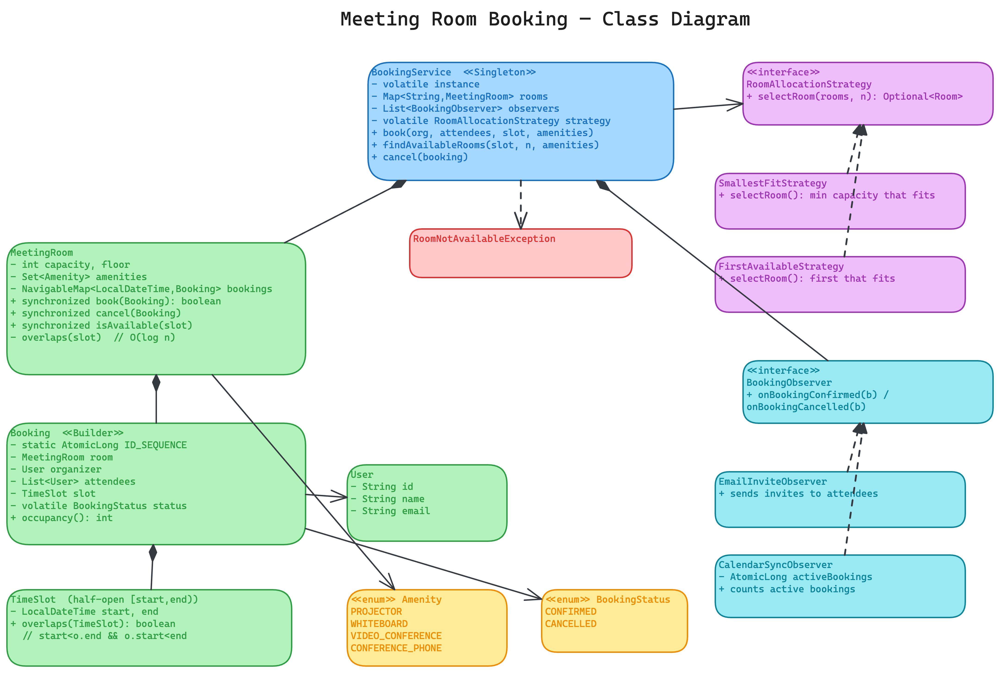
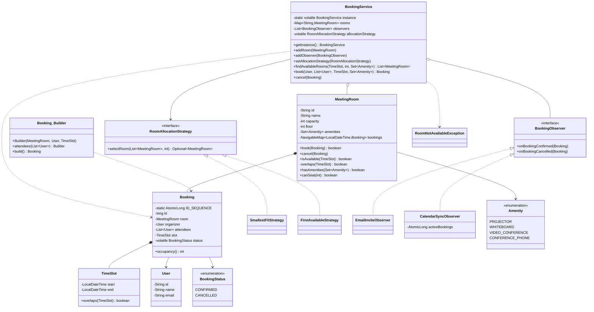

# Meeting Room Booking — Low Level Design

Reserve a meeting room for a time interval — with overlap-free booking, capacity/amenity matching, pluggable room-allocation policy, and safe concurrent reservations.

---

## Problem Statement

Design a meeting room booking system that:
- Books a **room** for a **time interval** on behalf of an organizer + attendees
- Never allows two bookings of the **same room** to **overlap** in time
- Allows **back-to-back** meetings (09:00–10:00 and 10:00–11:00 are not a conflict)
- Finds rooms by **capacity** and **required amenities** (projector, whiteboard, …)
- Picks **which** free room to use via a swappable policy (e.g. smallest room that fits)
- Lets bookings be **cancelled**, freeing the slot
- Notifies independent concerns (invites, calendar sync, audit) on each booking change
- Is safe to call from **multiple threads** (no double-booking under a race)

---

## High-Level Flow

```
service.book(organizer, attendees, slot, requiredAmenities)
    |
    +-- findAvailableRooms(slot, headcount, amenities)
    |        +-- filter rooms by capacity >= headcount
    |        +-- filter rooms that have all required amenities
    |        +-- filter rooms where room.isAvailable(slot)   (TreeMap overlap check, O(log n))
    |
    +-- loop while candidates remain:
    |        +-- room = allocationStrategy.selectRoom(candidates, headcount)   (e.g. smallest-fit)
    |        +-- room.book(booking)   <-- synchronized on the room: atomic check-then-act
    |        |        +-- true  -> reserved
    |        |        +-- false -> lost the race; drop room, try next best
    |        +-- on success: observers.onBookingConfirmed(booking)  -> invites, calendar sync
    |
    +-- none worked -> throw RoomNotAvailableException

service.cancel(booking)
    +-- room.cancel(booking)          (remove from TreeMap; slot is free again)
    +-- booking.status = CANCELLED
    +-- observers.onBookingCancelled(booking)
```

---

## Class Diagram

[Interactive Excalidraw source](class-diagram.excalidraw)



<details>
<summary>Mermaid Class Diagram (click to expand)</summary>



</details>

---

## How to Approach This Problem (Smallest → Biggest)

### Layer 1: A booking is just a half-open interval `[start, end)`
Strip away rooms, users and amenities and the entire problem is one question: *do two time intervals overlap?* The single most important decision is making the interval **half-open** — `end` is exclusive. That one choice is what makes 09:00–10:00 and 10:00–11:00 *not* conflict, so consecutive meetings are bookable. Get this wrong (closed intervals) and the system can never schedule back-to-back meetings. `TimeSlot.overlaps` is the whole kernel: `start < other.end && other.start < end`.

### Layer 2: Overlap detection belongs to the room, not the service
Each `MeetingRoom` owns its own bookings and answers "am I free for this slot?" itself. The `BookingService` should not reach into a room's schedule to check conflicts — that would scatter the booking invariant across two classes. Giving the room sole authority over its calendar is **SRP**: the room is the one place that can change how it decides availability.

### Layer 3: Store a room's bookings in a `TreeMap`, not a list
A `List<Booking>` forces an O(n) scan of every booking on every check. Keying a `TreeMap` (a `NavigableMap`) by **start time** keeps bookings sorted, so a conflict can only come from the **two neighbours** of the candidate slot — the booking starting just before it (does it run past our start?) and the one starting just after (does it begin before our end?). That's an O(log n) `floorEntry`/`ceilingEntry` lookup instead of a linear sweep. This is the data-structure insight interviewers want to hear.

### Layer 4: "Which room is free" and "which room to pick" are different jobs
Finding the set of candidate rooms is a filter (capacity, amenities, availability). *Choosing* among them is a policy — and policies change. Smallest-fit (put a 3-person meeting in the smallest room that fits, keeping big rooms free) is the sensible default, but cost-based or floor-preference selection is equally valid. Pulling selection into a `RoomAllocationStrategy` keeps the booking flow closed for modification and open to new policies (**Strategy + OCP**).

### Layer 5: The concurrency trap — check-then-act double-booking
Booking is a **check-then-act**: "is the room free? then reserve it." Two threads can both pass the check and both reserve the same room for overlapping slots — the classic race. The fix is to make check+insert **atomic** by `synchronized`-ing `MeetingRoom.book()`. Crucially the lock is **per room**, so two people booking *different* rooms never block each other (lock granularity). And because the service's `findAvailableRooms` query can go stale between filtering and reserving, `book()` re-checks under the lock and returns `false` if it lost the race — the service just tries the next-best candidate. The room lock, not the availability query, is the real guarantee.

### Layer 6: Everything after a booking is a side concern
Sending invites, syncing calendars, auditing — none of that is the service's job. The service publishes `onBookingConfirmed` / `onBookingCancelled` to `BookingObserver`s and stays ignorant of email and calendar clients (**Observer**). Add a "Slack reminder" reaction by writing one observer, with zero edits to the booking logic.

> ### Interview summary (say this verbatim)
> "I model a booking as a half-open time interval, because that's the one decision that makes back-to-back meetings work and double-bookings detectable. Each room owns its bookings in a TreeMap keyed by start time, so an overlap check is O(log n) — I only inspect the slot's two neighbours, not the whole schedule. Finding candidate rooms (capacity + amenities + free) is separate from choosing one, which I delegate to a pluggable allocation strategy like smallest-fit. The core concurrency risk is a check-then-act double-booking, so the reserve step is synchronized per room — that keeps the invariant atomic while still letting different rooms be booked in parallel — and the service retries the next room if it loses the race. Cross-cutting concerns like invites and calendar sync are observers, so the booking flow never imports them."

---

## Project Structure

```
meeting-room-booking/
├── pom.xml
├── README.md
├── class-diagram.excalidraw
└── src/main/java/com/meetingroombooking/
    ├── MeetingRoomBookingDemo.java        # Entry point — 5 scenarios
    ├── model/
    │   ├── TimeSlot.java                   # Half-open interval + overlap test (the kernel)
    │   ├── User.java                       # Organizer / attendee
    │   ├── MeetingRoom.java                # Owns bookings (TreeMap), per-room locked booking
    │   ├── Booking.java                    # Reservation (Builder, volatile status)
    │   └── BookingService.java             # Singleton orchestrator
    ├── enums/
    │   ├── Amenity.java                     # PROJECTOR / WHITEBOARD / ...
    │   └── BookingStatus.java               # CONFIRMED / CANCELLED
    ├── strategy/
    │   ├── RoomAllocationStrategy.java       # Selection policy interface
    │   ├── SmallestFitStrategy.java          # Best-fit (default)
    │   └── FirstAvailableStrategy.java       # First that fits
    ├── observer/
    │   ├── BookingObserver.java              # React to confirm / cancel
    │   ├── EmailInviteObserver.java          # Sends invites
    │   └── CalendarSyncObserver.java         # Stateful: counts active bookings
    └── exception/
        └── RoomNotAvailableException.java
```

---

## Design Patterns Used

| Pattern | Where | Why |
|---------|-------|-----|
| **Singleton** | `BookingService` | One system-wide facility owning rooms, strategy, observers (double-checked locking, `volatile` instance) |
| **Strategy** | `RoomAllocationStrategy` (+ `SmallestFitStrategy`, `FirstAvailableStrategy`) | Swap the room-selection policy without touching the booking flow |
| **Observer** | `BookingObserver` (+ `EmailInviteObserver`, `CalendarSyncObserver`) | Invites / calendar sync / audit react to booking changes; service stays unaware |
| **Builder** | `Booking.Builder` | Required (room/organizer/slot) vs optional (attendees) construction, immutable result |

---

## SOLID Principles Applied

| Principle | How it's applied |
|-----------|------------------|
| **SRP** | `TimeSlot` knows overlap; `MeetingRoom` owns its calendar; `RoomAllocationStrategy` chooses; observers react; `BookingService` only orchestrates |
| **OCP** | New allocation policy = new `RoomAllocationStrategy`; new reaction = new `BookingObserver` — no edits to existing classes |
| **LSP** | Any `RoomAllocationStrategy` / `BookingObserver` is substitutable; the service treats them only through their interface |
| **ISP** | Small focused interfaces — `selectRoom` is one method; `BookingObserver` only confirm/cancel |
| **DIP** | `BookingService` depends on the `RoomAllocationStrategy` and `BookingObserver` abstractions, never concrete policies/reactions |

---

## Thread Safety

- **Per-room booking lock** — `MeetingRoom.book()` / `cancel()` / `isAvailable()` are `synchronized`, making the check-then-act on the room's `TreeMap` atomic. The lock is per room, so different rooms book concurrently.
- **Room registry** — `ConcurrentHashMap`: read on every booking, written at startup.
- **Observer registry** — `CopyOnWriteArrayList`: iterated on every booking, mutated rarely; safe iteration during a concurrent add.
- **Booking id** — static `AtomicLong` sequence guarantees unique ids across threads.
- **Booking status** — `volatile`, so a cancel on one thread is visible to a reader on another (simple flag, no read-modify-write).
- **Active-booking counter** — `AtomicLong` in `CalendarSyncObserver` so concurrent confirm/cancel don't race.
- **Swappable strategy** — `allocationStrategy` is `volatile` so a runtime reassignment is visible to all threads.

---

## Extensibility

- **New allocation policy** (cost-based, floor-preference, load-balancing) → implement `RoomAllocationStrategy`, `setAllocationStrategy(...)`.
- **New reaction** (Slack reminder, dead-letter on failure, usage analytics) → implement `BookingObserver`, `addObserver(...)`.
- **Recurring meetings** → expand a recurrence rule into multiple `TimeSlot`s and book each; the per-slot core is unchanged.
- **Waitlist / auto-rebook on cancel** → an observer on `onBookingCancelled` that re-attempts queued requests for the freed slot.
- **Multi-location / time zones** → store `TimeSlot` in UTC (`Instant`/`ZonedDateTime`); overlap logic is identical.
- **Buffer/cleanup time between meetings** → widen the slot by the buffer before the overlap check, no change to `MeetingRoom`.

---

## Common Interview Questions (Rapid Fire)

### Q1. Why model the slot as a half-open interval `[start, end)`?
So **back-to-back** meetings don't collide. With an exclusive end, 09:00–10:00 and 10:00–11:00 share the 10:00 instant without overlapping, so the room frees up exactly when the meeting ends. Closed intervals `[start, end]` would flag the shared boundary as a conflict and make consecutive bookings impossible. The whole overlap test reduces to `start < other.end && other.start < end`.

### Q2. How do you detect an overlap efficiently — why a `TreeMap` over a `List`?
A `List` needs an O(n) scan of all bookings. A `TreeMap` keyed by start time keeps them sorted, so a conflict can only involve the candidate's **two neighbours** — `floorEntry(start)` (starts at/before us: does it end after our start?) and `ceilingEntry(start)` (starts at/after us: does it begin before our end?). That's **O(log n)** per check.

### Q3. Why split "find available rooms" from "pick a room"?
Filtering (capacity + amenities + free) is a fixed query; **selection** is a policy that changes (smallest-fit, cost, floor preference). Separating them lets the selection swap via `RoomAllocationStrategy` without touching the booking flow — **Strategy + Open/Closed**. Smallest-fit is the default because it keeps large rooms free for large meetings (less fragmentation).

### Q4. Why is the allocation policy smallest-fit and not just first-found?
Putting a 3-person standup in a 12-person boardroom strands the boardroom for a meeting that actually needs it. Smallest-fit picks the tightest room that still seats everyone — the same reasoning as best-fit allocation — reducing fragmentation. It's a `Strategy`, so `FirstAvailableStrategy` is a one-line swap when packing efficiency doesn't matter.

### Concurrency questions (asked whenever your code uses `volatile`, `Atomic*`, `synchronized`, or a `Concurrent*` / `CopyOnWrite*` collection)

> Interviewers treat these keywords as an invitation. The moment they spot `synchronized MeetingRoom.book()` or the `volatile` booking status they ask *"why that and not the alternative?"* See **[CONCURRENCY-GUIDE.md](../CONCURRENCY-GUIDE.md)** for full explanations; the rapid-fire versions:

### Q5. How do you stop two people booking the same room at the same time?
Reserving is a **check-then-act** ("is the slot free? then insert it") — two threads can both pass the check and both insert. `MeetingRoom.book()` is `synchronized`, so the check and the `TreeMap.put` happen atomically under the room's lock; the second thread sees the slot taken and returns `false`. A `ConcurrentHashMap`/concurrent structure alone would NOT fix this — per-entry atomicity doesn't make a *compound* check-then-act atomic.

### Q6. Why lock per room instead of one global lock on the service?
A single global lock would serialize *all* bookings — booking room A would block booking room B. Locking on the individual `MeetingRoom` keeps the critical section as narrow as the invariant requires (one room's calendar), so bookings on different rooms proceed in parallel. That's lock **granularity**: lock the smallest thing that preserves correctness.

### Q7. The service checks `isAvailable` then calls `book` — isn't that still a race?
Yes — the availability seen by `findAvailableRooms` can go stale before the reservation. That's deliberate: the query is only a *filter* to narrow candidates. The real guarantee is `book()` re-checking under the room lock and returning `false` if it lost the race; the service then drops that room and tries the next-best candidate. Never trust a check made outside the lock that protects the act.

### Q8. Why is `Booking.status` `volatile` but the room's booking map guarded by `synchronized`?
`status` is a single flag flipped once (CONFIRMED → CANCELLED) and read by other threads — it needs only the **visibility** guarantee, which `volatile` gives cheaply with no lock. The booking map needs a **compound** check-then-act to stay atomic, which `volatile` can't provide — so it requires a `synchronized` block. Match the tool to whether the operation is a single read/write or a multi-step mutation.

### Q9. Why `CopyOnWriteArrayList` for observers and `ConcurrentHashMap` for rooms?
Observers are iterated on **every** booking but registered rarely — `CopyOnWriteArrayList` gives lock-free snapshot iteration (a concurrent add can't break an in-flight notification) and pays its O(n) copy only on the rare write. The room registry is read constantly and written at startup — `ConcurrentHashMap` gives concurrent reads/writes far more cheaply than a `synchronized` map.
