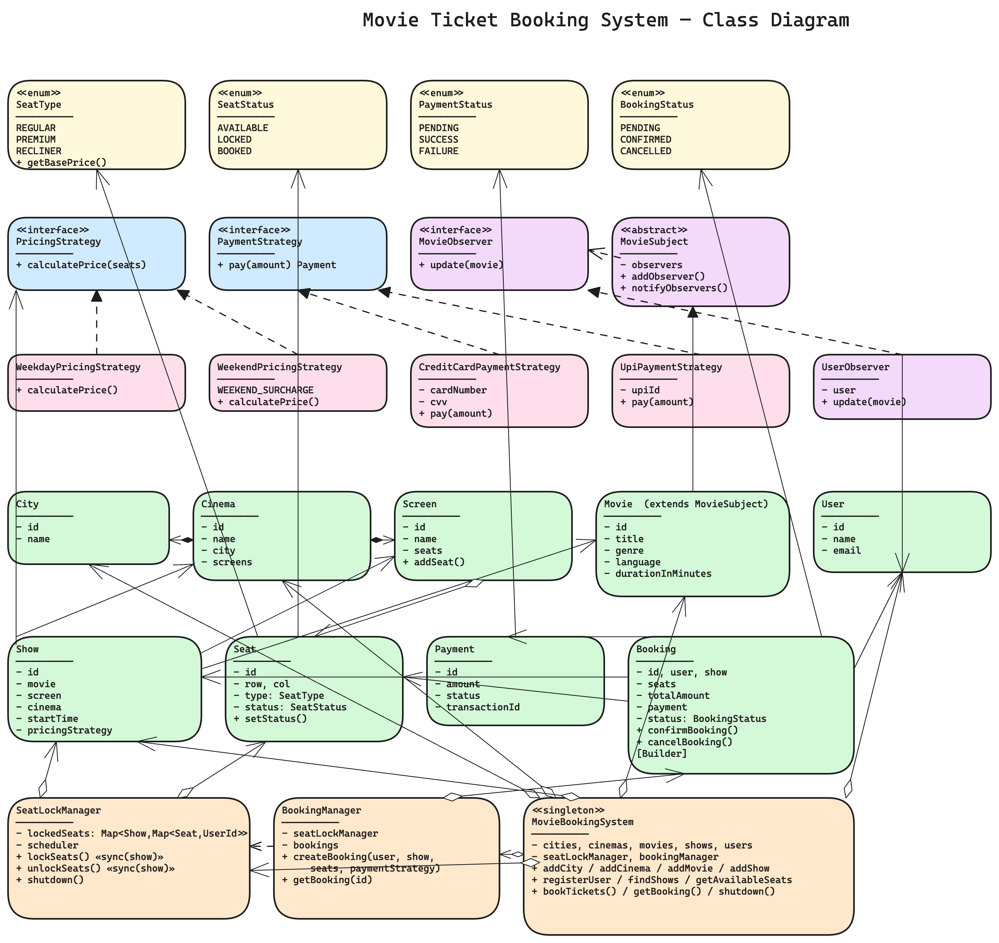
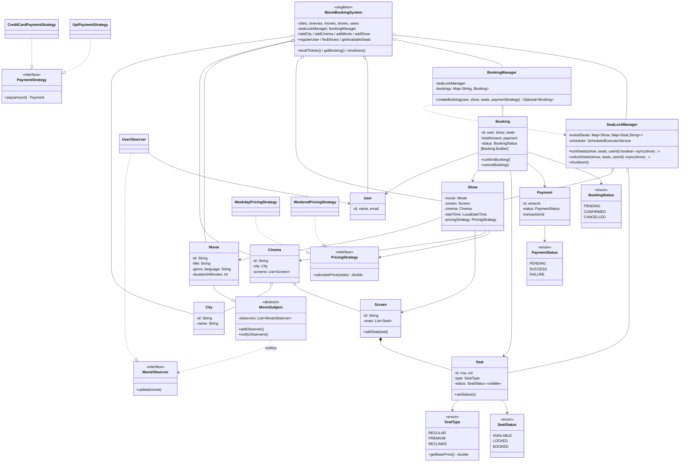

# Movie Ticket Booking System — Low Level Design

A BookMyShow-style ticket reservation platform showing how to build a **concurrent, race-condition-free seat booking** system using Singleton, Builder, Strategy, Observer, and a custom seat-lock manager with timeout-based recovery.

---

## Problem Statement

Design a system that lets users browse and book movie tickets across cities, cinemas, and shows. The system must support:

- Viewing the list of movies playing in different cinemas and cities
- Picking a movie, cinema, and show timing for a reservation
- Showing the seat layout for a chosen show and letting the user pick seats
- Processing payment and confirming the booking on success
- **Concurrent bookings** — two users cannot grab the same seat. Seat availability updates in real time
- Different seat types (regular, premium, recliner) and pricing variations (weekday vs weekend)
- Administrative ops — admins can add/remove cities, cinemas, screens, seats, movies, shows
- Be scalable enough to handle many concurrent users

Plus the interview-grade nuance most candidates miss:

- A user who has selected seats must **hold** them for a short window before payment completes — otherwise a slow payment opens a race where someone else can grab the same seat. Holds **must auto-expire** if the user abandons the flow.

---

## High-Level Flow

```
Admin sets up the catalog                            User books a ticket
        │                                                       │
        ▼                                                       ▼
   [MovieBookingSystem]  ◄────── singleton facade ──────►  [MovieBookingSystem]
        │                                                       │
        │ addCity / addCinema / addMovie                        │ findShows(title, city)
        │ addShow(movie, cinema, screen, time,                  │ getAvailableSeats(showId)
        │         pricingStrategy)                              │
        │ registerUser                                          │ bookTickets(user, show,
        │                                                       │             seats, paymentStrategy)
        ▼                                                       ▼
   cities / cinemas / movies / shows / users          ┌─► [BookingManager.createBooking]
                                                      │
                                                      │  1. SeatLockManager.lockSeats(show, seats, userId)
                                                      │       synchronized(show)
                                                      │         all seats AVAILABLE? → mark LOCKED
                                                      │         schedule auto-release in N seconds
                                                      │       else → return false  ✘
                                                      │
                                                      │  2. total = show.pricingStrategy.calculatePrice(seats)
                                                      │
                                                      │  3. payment = paymentStrategy.pay(total)
                                                      │       SUCCESS  → continue
                                                      │       FAILURE  → unlockSeats, return empty  ✘
                                                      │
                                                      │  4. booking = Booking.Builder()....build()
                                                      │     booking.confirmBooking()
                                                      │       → seats[*].status = BOOKED
                                                      │       → booking.status = CONFIRMED
                                                      │     unlockSeats(show, seats, userId)
                                                      │     bookings[id] = booking
                                                      │
                                                      └─► Optional<Booking>

Movie release notification (Observer)
   admin: matrix.notifyObservers()
        │
        ▼
   for obs in observers: obs.update(movie)   ── e.g. UserObserver prints/sends mail
```

---

## Class Diagram

> **Interactive:** Open [`class-diagram.excalidraw`](class-diagram.excalidraw) at [excalidraw.com](https://excalidraw.com) (File → Open) for the full interactive diagram.



<details>
<summary>Mermaid Class Diagram (click to expand)</summary>


</details>

---

## How to Approach This Problem (Smallest → Biggest)

### Layer 1: The core ambiguity — *Movie vs Show vs Seat*

Three things sound similar and candidates conflate them:

- **`Movie`** — the *film itself*. "The Matrix, 2h 16m, Sci-Fi". One instance regardless of how many cinemas screen it.
- **`Show`** — a specific *screening of a movie at a screen at a time*. Different cinemas, different times, different prices → different `Show` instances. The thing the user actually books a ticket *for*.
- **`Seat`** — a *physical seat* belonging to a `Screen`. Each seat has its own `SeatStatus` (AVAILABLE / LOCKED / BOOKED) **per-show**…

That last bit is the trap. Naively, `Seat.status` is per-seat. But A1 might be booked for the 6pm show and free for the 9pm show. In this design — matching the canonical reference — we keep status on `Seat` and rely on the fact that **a `Show` has its own `Screen` reference**, which the admin must give it a fresh seat layout for. For an industrial-scale system you'd factor this into a `ShowSeat` mapping `(showId, seatId) → status`. Call that out in interviews.

### Layer 2: Cinema hierarchy — Geography to a single seat

```
City  ─→ Cinema  ─→ Screen  ─→ Seat
```

Aggregation, not composition: a `Cinema` doesn't *own* its `City`, it just belongs to one. A `Screen` *composes* its `Seat`s — kill the screen, the seats vanish. Cinema *aggregates* screens for the same reason.

### Layer 3: The seat-locking race — the real interview question

Two users click on seat A1 at the same instant. Both pass "is it AVAILABLE?". Both start payment. Both succeed. Now both have booked the same seat. **That is the bug** the system must prevent.

The fix has two parts:

1. **`synchronized(show)` block** — the check ("are all seats AVAILABLE?") and the mutation ("mark them LOCKED") happen atomically. Per-`show` granularity, not global — bookings for different shows never block each other.
2. **Auto-expiring locks** — if user A locks A1 but their payment hangs / they walk away, A1 should auto-revert to AVAILABLE so someone else can try. The `SeatLockManager` uses a `ScheduledExecutorService` to release each lock after N seconds.

Two important details:

- The auto-release only flips seats that are *still* `LOCKED`. If the booking already completed and the seat is `BOOKED`, the scheduled task is a no-op. (Tracked by the `lockedSeats` map + status check.)
- The unlock check verifies that the userId still matches — so if the lock was already cleared (by completion or by an earlier release), a stale scheduled task can't accidentally unlock someone else's later lock on the same seat.

This is the single most important piece of code in the design — every other class is plumbing around it.

### Layer 4: BookingManager — orchestration over locking + payment

The `BookingManager.createBooking` flow is a **transactional sequence**:

```
lockSeats(...)              ── short window, blocks competitors
   │ failed → return empty
   ▼
calculatePrice(seats)       ── via show.pricingStrategy
   │
   ▼
paymentStrategy.pay(amt)    ── external call
   │ failed → unlockSeats, set seats AVAILABLE, return empty
   ▼
Booking.Builder…build()
booking.confirmBooking()    ── seats → BOOKED, status → CONFIRMED
unlockSeats(...)            ── clear lock-map entry (seat status stays BOOKED)
return booking
```

The key invariant: **at the end of any path, no seat is left stuck in LOCKED**. Success → BOOKED, failure → back to AVAILABLE.

### Layer 5: Strategy — pricing AND payment

Two independent strategies live on different layers:

- **`PricingStrategy`** — attached to the *show* (the cinema chose it when scheduling the show). Weekday vs weekend (25% surcharge), and trivially extensible to "holiday", "first-day-first-show", per-show overrides, dynamic pricing.
- **`PaymentStrategy`** — chosen by the *user* at the booking call site. Credit card, UPI, wallet, net banking — each is a tiny class implementing `pay(amount) → Payment`.

Splitting them on different ownership boundaries is deliberate: pricing is a *property of the show*, payment is a *user choice per booking*.

### Layer 6: Observer — *"notify me when the movie releases"*

`Movie` extends `MovieSubject`, which holds `List<MovieObserver>`. A user who wants to be notified registers a `UserObserver` wrapping their `User`. When the admin marks the movie released, `notifyObservers()` fires and each observer's `update(movie)` runs.

Why a wrapper class (`UserObserver`) and not making `User` implement `MovieObserver` directly? Two reasons: the *channel* of notification (print to console, email, SMS, push) shouldn't live on the `User` entity (SRP); and a single user might want multiple channels — wrap once for email, once for SMS, register both.

### Layer 7: Builder — Booking has too many required fields

`Booking` has 6 final fields. A 6-argument constructor is unreadable and error-prone (especially with two adjacent `String` ids and a `double`). `Booking.Builder` makes the call site self-documenting:

```java
new Booking.Builder()
    .user(user).show(show).seats(seats)
    .totalAmount(total).payment(payment)
    .build();
```

It also gives you one chokepoint (`build()`) to validate required-field presence — and is where you'd add stricter invariants later (e.g. seats non-empty, all seats belong to `show.screen`).

### Layer 8: The Facade — `MovieBookingSystem`

A singleton that owns the five concurrent maps (cities, cinemas, movies, shows, users) and the two services (`SeatLockManager`, `BookingManager`). Every public method either:
- registers an entity in a map, or
- delegates to the booking pipeline.

The complexity lives in `SeatLockManager` and `BookingManager`; `MovieBookingSystem` is a thin facade so callers don't need to know.

### Interview summary (say this verbatim)

> "Three entities: Movie is the film, Show is *one screening* (movie × screen × cinema × time), Seat is physical. The interesting bit is the race when two users grab the same seat — I solve it with a SeatLockManager that does the AVAILABLE-check-and-LOCK atomically inside `synchronized(show)`, plus a scheduled executor that auto-releases stale locks after a timeout. BookingManager orchestrates lock → price → payment → confirm, ensuring no seat is ever stuck in LOCKED. Pricing is a Strategy on the Show, payment is a Strategy at the booking call site — different owners. Movie release notifications use Observer; users register a UserObserver wrapper instead of implementing the interface on User, so the *channel* (email/SMS/console) is separable. Booking has many required fields, so Builder. The whole thing sits behind a Singleton facade — MovieBookingSystem — with ConcurrentHashMaps for catalog reads. The critical piece is the lock manager; everything else is plumbing."

---

## Project Structure

```
movie-ticket-booking-system/
├── pom.xml
├── README.md
├── class-diagram.excalidraw
└── src/main/java/com/movieticketbookingsystem/
    ├── MovieTicketBookingDemo.java        # Entry point — full booking scenario
    ├── MovieBookingSystem.java            # Singleton facade — catalog + services
    ├── BookingManager.java                # lock → pay → confirm pipeline
    ├── SeatLockManager.java               # per-show synchronized lock + auto-release
    │
    ├── model/                             # Domain entities
    │   ├── City.java                      # Geography
    │   ├── Cinema.java                    # Belongs to a city, has screens
    │   ├── Screen.java                    # Composes seats
    │   ├── Seat.java                      # Row/col, SeatType, SeatStatus
    │   ├── Movie.java                     # Extends MovieSubject (observable)
    │   ├── Show.java                      # Movie × Screen × Cinema × Time + PricingStrategy
    │   ├── User.java                      # Booker
    │   ├── Payment.java                   # Immutable receipt
    │   └── Booking.java                   # With static Builder + confirm/cancel
    │
    ├── enums/
    │   ├── SeatType.java                  # REGULAR/PREMIUM/RECLINER + basePrice
    │   ├── SeatStatus.java                # AVAILABLE / LOCKED / BOOKED
    │   ├── PaymentStatus.java             # PENDING / SUCCESS / FAILURE
    │   └── BookingStatus.java             # PENDING / CONFIRMED / CANCELLED
    │
    ├── observer/                          # Observer pattern — movie-release notifications
    │   ├── MovieObserver.java             # interface
    │   ├── MovieSubject.java              # abstract base — Movie extends this
    │   └── UserObserver.java              # concrete — wraps a User
    │
    └── strategy/
        ├── payment/                       # User picks at booking time
        │   ├── PaymentStrategy.java
        │   ├── CreditCardPaymentStrategy.java
        │   └── UpiPaymentStrategy.java
        │
        └── pricing/                       # Attached to a Show at creation
            ├── PricingStrategy.java
            ├── WeekdayPricingStrategy.java
            └── WeekendPricingStrategy.java
```

---

## Design Patterns Used

| Pattern | Where | Why |
|---------|-------|-----|
| **Singleton** | `MovieBookingSystem` | One global catalog and one shared `SeatLockManager` — double-checked locking with `volatile` |
| **Builder** | `Booking.Builder` | Booking has 6 required fields with adjacent same-typed args — readable construction + validation chokepoint |
| **Strategy** | `PricingStrategy`, `PaymentStrategy` | Swappable pricing per show, swappable payment per booking call. Adding holiday-pricing or wallet-payment = new class, zero changes elsewhere |
| **Observer** | `MovieSubject` ← `Movie`, `MovieObserver` ← `UserObserver` | Movie-release notifications decoupled from `User`. New channel = new observer class |
| **Facade** | `MovieBookingSystem` | Hides the dance of lookup → lock → pay → confirm behind `bookTickets(...)` |
| **(Scheduled) Lock Manager** | `SeatLockManager` | Domain-specific pattern — atomic check-and-lock under `synchronized(show)` + timeout-based auto-release via `ScheduledExecutorService` |

---

## SOLID Principles Applied

| Principle | How |
|-----------|-----|
| **SRP** | `SeatLockManager` only does seat-locking. `BookingManager` only orchestrates the booking pipeline. `Booking` holds booking state. `Payment` is an immutable receipt. `MovieBookingSystem` is a facade — no business logic inside |
| **OCP** | New pricing rule = new `PricingStrategy` impl. New payment method = new `PaymentStrategy` impl. New notification channel = new `MovieObserver` impl. New seat type = new `SeatType` enum value with a base price. None require edits to existing classes |
| **LSP** | Anywhere `PricingStrategy` is expected, any concrete strategy works. `UserObserver` substitutes anywhere `MovieObserver` is expected. `Movie` substitutes anywhere `MovieSubject` is expected |
| **ISP** | `PricingStrategy.calculatePrice()` is a single method. `PaymentStrategy.pay()` is a single method. `MovieObserver.update()` is a single method. No god interfaces |
| **DIP** | `BookingManager` depends on `SeatLockManager` (concrete service, fine) and `PaymentStrategy` *interface*. `Show` depends on `PricingStrategy` *interface*. `MovieSubject` holds `List<MovieObserver>` — not `List<UserObserver>` |

---

## Thread Safety

- `MovieBookingSystem` maps (`cities`, `cinemas`, `movies`, `shows`, `users`) are `ConcurrentHashMap` — safe lookups and registrations across threads
- `BookingManager.bookings` is a `ConcurrentHashMap`
- `SeatLockManager.lockedSeats` is a `ConcurrentHashMap<Show, ConcurrentHashMap<Seat, String>>`
- **`SeatLockManager.lockSeats` and `unlockSeats` are inside `synchronized(show)`** — the critical *check-AVAILABLE-then-mark-LOCKED* sequence is atomic per show. Two different shows don't block each other
- `Seat.status` is `volatile` — visible across threads without further locking on simple reads
- `Screen.seats` and `MovieSubject.observers` use `CopyOnWriteArrayList` — safe iteration during notification
- A single-thread `ScheduledExecutorService` runs lock-release tasks; release runs inside `synchronized(show)` so it cannot interleave with an in-flight `lockSeats`/`unlockSeats`

Chosen lock granularity: **per-show**. Two cinemas, two different shows, two different rooms — all proceed in parallel. Only contention on the same show serializes.

---

## Extensibility

- **New pricing rule** (holiday, dynamic, member-discount) → new `PricingStrategy` impl, attach at `addShow` time
- **New payment method** (wallet, net-banking, Apple Pay) → new `PaymentStrategy` impl, pass at `bookTickets` call site
- **New notification channel** (Email, SMS, push) → new `MovieObserver` impl alongside `UserObserver`
- **New seat type** (VIP, lounger, couples-only) → new `SeatType` enum value with its base price
- **Per-show seat status** (so the same physical seat can be free for 9pm but booked for 6pm) → introduce a `ShowSeat(showId, seatId, status)` registry, replace `Seat.status` reads with `show.getShowSeat(seat).getStatus()`
- **Seat-hold UX in the UI** → expose the lock TTL from `SeatLockManager`, push a countdown to the client
- **Cancellation + refund** → `Booking.cancelBooking()` already flips seats back; add a `RefundStrategy` paired with `PaymentStrategy` for the reverse leg
- **Fairness / queueing under high load** → replace `synchronized(show)` with a fair `ReentrantLock(true)` per show, or move to a per-show single-writer actor
