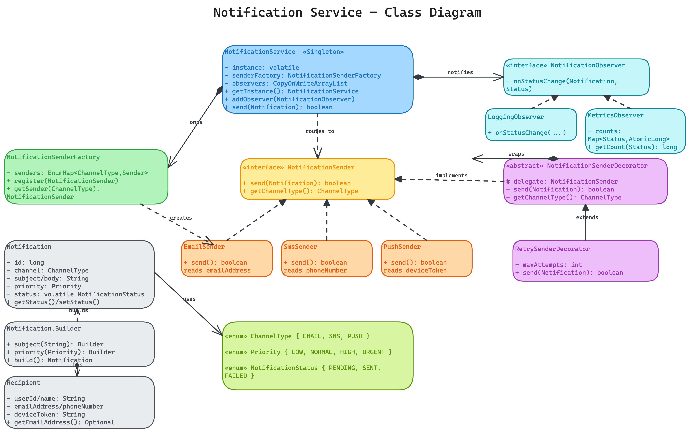
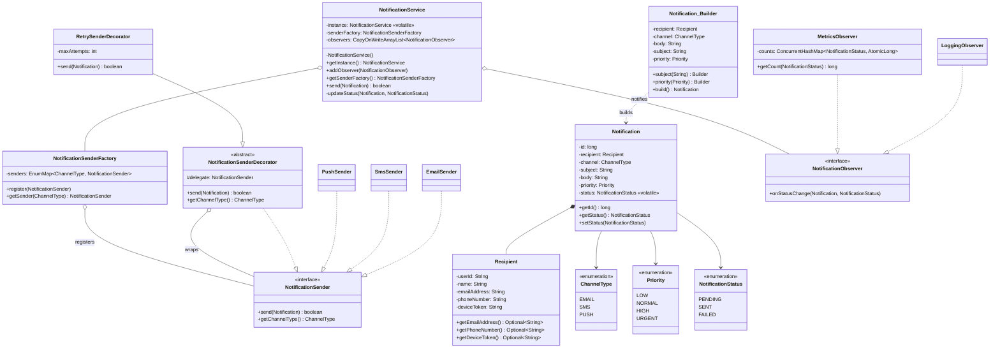

# Notification Service — Low Level Design

A multi-channel notification service that delivers a message over **Email, SMS, or Push** through a single, channel-agnostic entry point — with pluggable channels, transparent retry, and observable delivery status.

---

## Problem Statement

Design a notification service that:
- Sends a notification to a recipient over a chosen **channel** (Email / SMS / Push)
- Lets new channels be **added without touching existing code**
- Retries **transient delivery failures** without each channel reimplementing retry
- Tracks each notification's **lifecycle** (PENDING → SENT / FAILED) and lets independent components (logging, metrics, audit) react to it
- Exposes **one simple entry point** (`send(notification)`) regardless of channel
- Is safe to call from multiple threads

---

## High-Level Flow

```
service.send(notification)
    |
    +-- updateStatus(PENDING) --> fan out to every observer
    |                                 +-- LoggingObserver  (writes a log line)
    |                                 +-- MetricsObserver  (increments a counter)
    |
    +-- sender = senderFactory.getSender(notification.getChannel())
    |        |
    |        +-- EMAIL -> EmailSender
    |        +-- SMS   -> SmsSender
    |        +-- PUSH  -> PushSender   (may be wrapped in RetrySenderDecorator)
    |
    +-- delivered = sender.send(notification)
    |        |
    |        +-- RetrySenderDecorator: loop up to maxAttempts
    |        |        +-- delegate.send() == true  -> return true
    |        |        +-- false / throw            -> try again
    |        |
    |        +-- concrete sender: read the channel-specific address, deliver
    |
    +-- updateStatus(SENT | FAILED) --> fan out to every observer
```

---

## Class Diagram



<details>
<summary>Mermaid Class Diagram (click to expand)</summary>


</details>

---

## How to Approach This Problem (Smallest → Biggest)

The trap in "design a notification service" is to start writing an `EmailService` class. The senior move is to realise the *service* and the *channel* are two different things, and that almost every requirement after the first one ("send an email") is really a request to bolt a new concern onto the side without rewriting what's already there. Build it in that order.

### Layer 1: The smallest insight — "send over Email/SMS/Push" is one verb with swappable nouns

**What**: Sending an email, an SMS, and a push notification are the *same operation* — `send(notification)` — differing only in the transport. That's the textbook signature of the **Strategy pattern**: one interface (`NotificationSender`), many interchangeable implementations.

**Why it matters**: It stops you from writing three unrelated service classes with duplicated orchestration. The thing that varies (the transport) gets isolated behind an interface; everything that doesn't vary (status tracking, retry, logging) is written once.

**Power move**: *"Email, SMS and push aren't three features — they're three implementations of one `send` contract. I'll model the channel as a Strategy."*

### Layer 2: The service must not know how to construct a channel — Factory

**What**: The service knows it wants `EMAIL`; it must not know that `EMAIL` means `new EmailSender()`. A `NotificationSenderFactory` maps `ChannelType → NotificationSender`.

**Why**: If the service `switch`es on channel type to `new` up senders, then every new channel edits the service. Centralising creation in a factory means a new channel is one `register(...)` call and the service never changes (Open/Closed). The factory uses an `EnumMap` because the key is an enum — tightest, fastest map there is.

**Power move**: *"The service depends on the `NotificationSender` interface and the `ChannelType` enum, never on a concrete sender. The factory owns the `enum → implementation` decision."*

### Layer 3: A notification has required and optional fields — Builder

**What**: A notification always needs a recipient, a channel, and a body; it *optionally* has a subject and a priority. `Notification.Builder` makes the required fields mandatory (they're constructor args of the builder) and the optional ones fluent.

**Why**: A telescoping constructor `new Notification(r, EMAIL, body, subject, HIGH)` is unreadable — what's the 4th argument? — and a setter-based POJO can't be immutable. The builder gives named, validated, order-independent construction *and* a final object. Everything except `status` is `final`.

**Power move**: *"Builder, because there are more optional fields than I want in a constructor, and I want the result immutable apart from the one field that genuinely changes — status."*

### Layer 4: Status is the one thing that changes — and other components care about it

**What**: A notification moves PENDING → SENT or PENDING → FAILED. Logging and metrics need to *react* to those transitions — but logging is not the service's job, and neither is counting.

**Why this is the Observer pattern**: The service's single responsibility is *delivering*. Bolting `System.out.println` and a metrics counter into `send()` would give the service three reasons to change. Instead the service keeps a list of `NotificationObserver`s and fans every status change out to them. Logging, metrics, audit, dead-letter capture — each is a separate observer, added with zero edits to the service.

**Why `CopyOnWriteArrayList`**: observers are registered once at startup but iterated on *every* send. COW gives lock-free reads and pays the copy cost only on the rare write — exactly this read-heavy profile.

**Power move**: *"Status changes are events. The service publishes them; logging and metrics subscribe. That keeps delivery, logging and metering as three independent classes."*

### Layer 5: Retry is a cross-cutting concern — Decorator, not a loop in every sender

**What**: Delivery fails transiently (gateway blip, network hiccup). Retrying usually fixes it. But retry applies *equally* to email, SMS and push — so where does the loop live?

**Why a decorator**: If each sender has its own retry loop, the logic is triplicated and each sender violates SRP (its job is to send *once*). Instead, `RetrySenderDecorator` **wraps** any `NotificationSender` and re-invokes it up to `maxAttempts`. Because the decorator implements the same interface it wraps, the service (and the factory) can't tell a decorated sender from a bare one — you can even register the wrapped sender back into the factory and nothing else changes.

**The interview-grade detail**: real retries need **exponential backoff + jitter** between attempts, or a downstream outage gets hammered by synchronised retries. The code calls this out where the sleep would go.

**Power move**: *"Retry is cross-cutting, so it's a Decorator — one class, wraps any channel, and the service is oblivious because the wrapper IS a `NotificationSender`."*

### Layer 6: One way in — Singleton service as a thin router

**What**: `NotificationService` is the single public entry point. It owns the factory and the observer registry, and it's a double-checked-locking **Singleton** with a `volatile` instance.

**Why it stays thin**: `send()` does exactly four things — mark PENDING, look up the sender, delegate, mark SENT/FAILED — and *nothing else*. Grep it for `"smtp"` or `"retry"` and you find nothing: channels live in senders, retry lives in a decorator, logging/metrics live in observers. That emptiness is the whole design paying off.

**The concurrency story**: the singleton uses `volatile` + double-checked locking; the observer list is copy-on-write; the metrics counters are `AtomicLong`; the notification id is an `AtomicLong`; `status` is `volatile`. Each shared-state touchpoint has a deliberate, minimal synchronisation choice.

**Power move**: *"The service is a router. It knows the *sequence* — pending, send, done — but delegates every *decision* to a strategy, a decorator, or an observer."*

### The Full Picture

```
NotificationService (Singleton)                  one entry point: send(notification)
    |  owns
    +-- NotificationSenderFactory   (Factory)    ChannelType -> NotificationSender
    |        +-- EmailSender / SmsSender / PushSender   (Strategy)
    |        +-- RetrySenderDecorator(...)              (Decorator wraps a sender)
    |
    +-- List<NotificationObserver>  (Observer)   reacts to every status change
             +-- LoggingObserver
             +-- MetricsObserver

Notification (built via Builder)  --carries-->  Recipient, ChannelType, Priority, status
```

> **Interview Summary**: *"I split the design into a thin `NotificationService` orchestrator and the concerns hanging off it. Each delivery channel is a `NotificationSender` Strategy, and a `NotificationSenderFactory` maps the `ChannelType` enum to the right sender so adding a channel never edits the service. A `Notification` is built with a Builder because it has required plus optional fields and should be immutable apart from its status. Status transitions (PENDING → SENT/FAILED) are published to `NotificationObserver`s, so logging and metrics live outside the service as independent subscribers. Retry is a cross-cutting concern, so it's a `RetrySenderDecorator` that wraps any sender transparently — with exponential backoff and jitter in production. The service itself is a double-checked-locking Singleton that just sequences pending → send → done and delegates every actual decision. The whole thing is Open/Closed: new channel = new sender, new reaction = new observer, new reliability policy = new decorator, with zero edits to the orchestrator."*

---

## Project Structure

```
notification-service/
├── pom.xml
├── README.md
├── class-diagram.excalidraw
└── src/main/java/com/notificationservice/
    ├── NotificationServiceDemo.java              # Entry point — runs all scenarios
    │
    ├── model/
    │   ├── NotificationService.java              # Singleton orchestrator (the one entry point)
    │   ├── Notification.java                     # Message + Builder (immutable except status)
    │   └── Recipient.java                         # Addressee — email / phone / device token
    │
    ├── enums/
    │   ├── ChannelType.java                       # EMAIL, SMS, PUSH
    │   ├── Priority.java                          # LOW, NORMAL, HIGH, URGENT
    │   └── NotificationStatus.java                # PENDING, SENT, FAILED
    │
    ├── channel/                                   # Strategy pattern
    │   ├── NotificationSender.java                # Strategy interface (send + getChannelType)
    │   ├── EmailSender.java                        # Reads emailAddress
    │   ├── SmsSender.java                          # Reads phoneNumber (no subject)
    │   └── PushSender.java                         # Reads deviceToken
    │
    ├── factory/
    │   └── NotificationSenderFactory.java         # ChannelType -> sender (EnumMap, register())
    │
    ├── decorator/                                 # Decorator pattern
    │   ├── NotificationSenderDecorator.java       # Abstract base, forwards to delegate
    │   └── RetrySenderDecorator.java              # Adds retry to ANY sender
    │
    └── observer/                                  # Observer pattern
        ├── NotificationObserver.java              # Observer interface
        ├── LoggingObserver.java                    # Logs every status transition
        └── MetricsObserver.java                    # Counts SENT / FAILED per status
```

---

## Design Patterns Used

| Pattern | Where | Why |
|---------|-------|-----|
| **Singleton** | `NotificationService` | One system-wide service; double-checked locking with `volatile` |
| **Strategy** | `NotificationSender` + Email/SMS/Push | Swap delivery channel without changing the service |
| **Factory** | `NotificationSenderFactory` | Maps `ChannelType` → sender; new channel = one `register()`, no service edit |
| **Builder** | `Notification.Builder` | Required + optional fields, validated, yielding an immutable object |
| **Observer** | `NotificationObserver` + Logging/Metrics | Logging & metrics react to status changes without the service knowing |
| **Decorator** | `RetrySenderDecorator` | Adds retry to any sender transparently; the service can't tell it's wrapped |

---

## SOLID Principles Applied

| Principle | How |
|-----------|-----|
| **SRP** | Service routes; senders deliver; decorator retries; observers log/meter; builder constructs. Each has one reason to change. |
| **OCP** | New channel → new `NotificationSender` + `register()`. New reaction → new observer. New reliability policy → new decorator. Zero edits to `NotificationService`. |
| **LSP** | Every `NotificationSender` (bare or decorated) is substitutable; the service never type-checks. A `RetrySenderDecorator` stands in wherever a sender is expected. |
| **ISP** | `NotificationSender` has two focused methods; `NotificationObserver` has one. No fat interfaces. |
| **DIP** | `NotificationService` depends on the `NotificationSender` and `NotificationObserver` abstractions and the factory, never on a concrete sender. |

---

## Thread Safety

- **Singleton creation** — `NotificationService.getInstance()` uses double-checked locking with a `volatile` instance field so a half-constructed instance can never be published to another thread.
- **Observer registry** — `CopyOnWriteArrayList`: registration is rare, iteration (per send) is frequent and lock-free. No `ConcurrentModificationException` even if an observer is added mid-broadcast.
- **Metrics counters** — an `AtomicLong` per status inside a `ConcurrentHashMap`, so concurrent increments from many sending threads never race.
- **Notification id** — a static `AtomicLong` sequence guarantees unique ids across threads.
- **Status visibility** — `Notification.status` is `volatile` so a status written by the sending thread is visible to any thread that reads it.
- **Senders are stateless** — one shared instance per channel is safe; there's no per-call mutable state to protect.

---

## Extensibility

- **New channel** (WhatsApp, Slack, voice call) → implement `NotificationSender`, call `factory.register(...)`. No changes to the service.
- **New reaction to delivery** (audit trail, dead-letter queue, Slack alert on failure) → implement `NotificationObserver`, call `service.addObserver(...)`.
- **New reliability policy** (rate limiting, circuit breaker, deduplication) → write another `NotificationSenderDecorator` and stack it: `new RateLimitDecorator(new RetrySenderDecorator(sender, 3))`.
- **User preferences / channel fallback** ("try push, fall back to SMS, then email") → a **Chain of Responsibility** of senders, or a `PreferenceResolver` consulted before routing. The strategy/factory split makes this a layer on top, not a rewrite.
- **Async / high throughput** → enqueue notifications onto a queue and have a worker pool call `send()`; priority drives queue ordering. The `Priority` enum is already in place for this.
- **Templating** → add a `MessageTemplate` + a Template Method or a formatter Strategy to render `body`/`subject` from a template id + variables.

---

## Common Interview Questions (Rapid Fire)

### Q1. Why is the channel a Strategy and not just an `if/else` on an enum?
An `if/else` (or `switch`) on channel type concentrates every channel's logic in one method and forces an edit there for every new channel — the opposite of Open/Closed. A Strategy puts each channel's quirks (email has a subject, SMS doesn't, push needs a device token) in its own class, and the factory resolves the enum to the implementation. New channel = new class + one `register()`.

### Q2. Why a Factory on top of the Strategy — isn't the interface enough?
The interface decouples *use* from *implementation*; the factory decouples *selection* from *construction*. Without it, the service would `new EmailSender()` itself and thus depend on concrete classes (a DIP violation) and edit itself for every channel (an OCP violation). The factory is the single place that knows `enum → concrete sender`.

### Q3. Why is retry a Decorator instead of a method on the service or a loop in each sender?
Retry is cross-cutting — it applies to every channel identically. A loop in each sender triplicates the logic and makes "send once" senders also own a retry policy (SRP violation). A method on the service hard-codes one policy for everyone. A Decorator wraps any sender, lives in one class, is independently testable, and stacks with other decorators (rate limit, circuit breaker). Because it implements `NotificationSender`, nothing downstream knows it's there.

### Q4. How does the service stay unaware of logging and metrics?
Observer pattern. The service publishes status transitions to a list of `NotificationObserver`s and calls `onStatusChange`. Logging and metrics are just subscribers. The service has no `import` of any logger or metrics library — adding or removing a reaction never touches it.

### Q5. Why Builder for `Notification` rather than constructors?
Three required fields and two optional ones means either a telescoping set of constructors (unreadable call sites) or a mutable POJO (no immutability). The Builder makes required fields un-skippable, optional fields fluent and self-documenting, validates in `build()`, and produces an object that's immutable apart from `status`.

### Q6. How would you add "send over the user's preferred channel, falling back if it fails"?
Model the fallback as a **Chain of Responsibility** of senders (push → SMS → email), each forwarding to the next on failure; or resolve the ordered channel list from a `PreferenceResolver` and loop. Either way it's a layer *above* the existing strategy/factory — no change to the senders themselves.

### Q7. How does this scale to millions of notifications a second?
Make it asynchronous: `send()` enqueues onto a (possibly distributed) queue keyed by `Priority`, and a worker pool drains it calling the same senders. Add backpressure and batching at the gateway. The synchronous core here is the per-notification logic; the queue is an orthogonal throughput concern that reuses every class unchanged.

### Q8. What happens to a notification that fails every retry?
It ends in `FAILED`, and the status change is broadcast to observers — so a `DeadLetterObserver` could persist it for later replay, and a metrics/alerting observer could fire if the failure rate crosses a threshold. The point is that handling failure is *also* just another observer, not new logic inside the service.

---

### Concurrency questions (asked whenever your code uses `volatile`, `Atomic*`, or `synchronized`)

> Interviewers treat these keywords as an invitation. The moment they spot `volatile NotificationStatus status` or `AtomicLong`, they ask *"why that and not the other?"* See **[CONCURRENCY-GUIDE.md](../CONCURRENCY-GUIDE.md)** for the full explanations; the rapid-fire versions:

### Q9. `Notification.status` is `volatile` — why, and what does it actually guarantee?
`volatile` gives the **visibility guarantee**: a write is flushed to main memory immediately and every read goes to main memory, not a per-core CPU cache. So once the sending thread sets `SENT`, any thread that reads afterwards sees `SENT`, never a stale `PENDING`. It does **not** make compound actions atomic — it's right here only because `status` is a simple flag written by one thread and read by others.

### Q10. When is `volatile` *not* enough — when do you need `synchronized` / `Atomic`?
When you do a **read-modify-write** (`x = next(x)`, `count++`) or must update **several fields together**. `volatile` orders single reads/writes but `count++` is three steps (read, add, write) and two threads can interleave and lose an update. Then you need `synchronized` (lock) or an `Atomic*` (lock-free CAS).

### Q11. Why `AtomicLong` for the id sequence instead of a plain `long counter++`?
`counter++` is read-add-write — two threads can both read `5`, both write `6`, producing **duplicate ids**. `AtomicLong.getAndIncrement()` performs that as one atomic, uninterruptible operation, so every caller gets a unique, gap-free number under concurrency. (Note: `getAndIncrement()` returns the value *before* bumping, so `new AtomicLong(1)` makes the first id `1`.)

### Q12. `AtomicLong` vs a `synchronized` counter — which and why?
Both are correct. `synchronized` takes a **lock** (other threads block); `AtomicLong` is **lock-free**, using a hardware compare-and-swap. For a single-variable counter the atomic is cheaper and never blocks. Reach for `synchronized` when you must coordinate **multiple fields** or a multi-step operation as one unit.

### Q13. How does `AtomicLong` work internally with no lock?
A `volatile long value` (visibility) + **CAS (compare-and-swap)**, a single CPU instruction (`LOCK CMPXCHG`) that sets the value *only if it still equals what was last read*. `getAndIncrement()` loops: read, compute next, CAS; if another thread won the race the CAS fails and it retries. No thread sleeps — that's "optimistic, lock-free" concurrency vs `synchronized`'s "pessimistic" locking.

### Q14. Why double-checked locking + `volatile` on the singleton instance?
The first null-check avoids taking the lock on the hot path; the lock + second check ensure only one instance is built. The `instance` field is `volatile` so a **half-constructed** object (object reference assigned before its constructor finishes, due to instruction reordering) can never be seen by another thread.

### Q15. Why `CopyOnWriteArrayList` for observers instead of a plain `ArrayList` or a `synchronized` list?
Observers are registered rarely (startup) but iterated on **every send**. COW gives lock-free, snapshot reads and pays the copy cost only on the rare write — and you can't get a `ConcurrentModificationException` if an observer is added mid-broadcast. A `synchronized` list would lock on every read for no benefit given this read-heavy profile.
