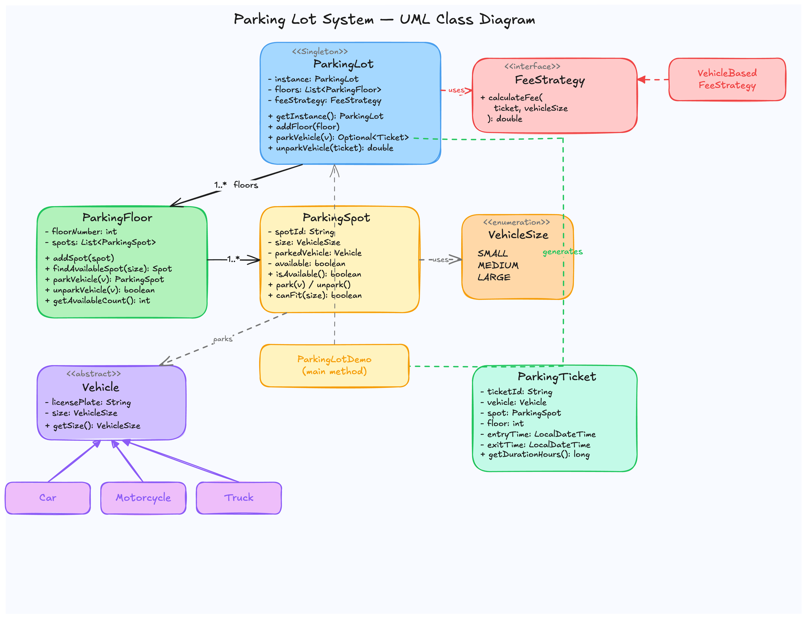
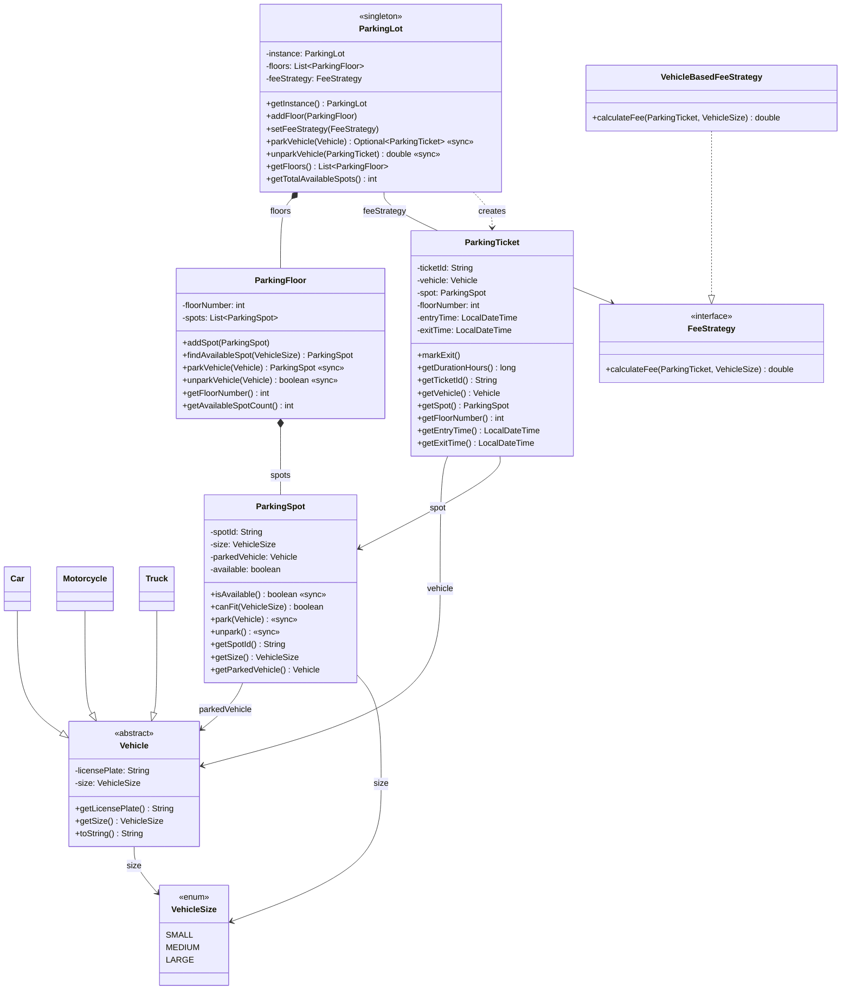

# Parking Lot System — Low Level Design

A complete object-oriented design and Java implementation of a **Parking Lot Management System**.

---

## Problem Statement

Design a parking lot system that can:
- Manage multiple floors, each with multiple parking spots of different sizes
- Park and unpark vehicles (Car, Motorcycle, Truck) based on size compatibility
- Generate tickets on entry and calculate fees on exit
- Handle concurrent access safely
- Support pluggable fee calculation strategies

---

## High-Level Flow

```
Vehicle arrives
    │
    ▼
ParkingLot.parkVehicle(vehicle)
    │
    ├── Iterate floors ──> ParkingFloor.parkVehicle(vehicle)
    │                           │
    │                           ├── findAvailableSpot(vehicleSize)
    │                           │       │
    │                           │       └── spot.isAvailable() && spot.canFit(size)
    │                           │
    │                           └── spot.park(vehicle)
    │
    ├── Found spot ──> Create ParkingTicket ──> return ticket
    │
    └── No spot ──> return empty

    ─ ─ ─ ─ ─ ─ ─ ─ ─ ─ ─ ─

Vehicle exits
    │
    ▼
ParkingLot.unparkVehicle(ticket)
    │
    ├── ticket.getSpot().unpark()
    ├── ticket.markExit()
    └── feeStrategy.calculateFee(ticket, vehicleSize) ──> return fee
```

---

## Class Diagram

https://excalidraw.com/#json=fvtswdhfQckVGfT_XENf1,LNGZyP4X3YUOxj4kMeN_Kw



<details>
<summary>Mermaid Class Diagram (click to expand)</summary>


</details>

---

## How to Approach This Problem (Smallest to Biggest)

When an interviewer says "Design a parking lot system," don't jump to the `ParkingLot` class. Start from the atoms and build up. This is how you show that your design is *grounded*, not hand-wavy.

### Layer 1: The Enum -- `VehicleSize`

**What**: A simple enum with three values -- `SMALL`, `MEDIUM`, `LARGE`.

**Why**: Before you model anything, you need a shared vocabulary for "how big is this thing?" Both vehicles *and* spots have a size, and this enum is the contract between them. Without it, you'd be passing strings around and praying nobody types `"medium"` with a lowercase m.

**Mental model**: Think of it as the label on a shoe box -- it tells you what fits inside without you having to try every shoe.

**Interview power move**: *"I'm starting with the enum because it's the shared language between vehicles and spots. This is the type-safe glue of the system."*

### Layer 2: The Things That Enter -- `Vehicle`, `Car`, `Motorcycle`, `Truck`

**What**: **`Vehicle`** is an abstract base class with `licensePlate` and `size` (both `private final` -- immutable). **`Car`**, **`Motorcycle`**, and **`Truck`** are concrete subclasses that hardcode their size via `super(licensePlate, VehicleSize.MEDIUM)`, etc.

**Why**: A vehicle is the *input* to the system. It's something you receive, not something you create internally. Making it abstract enforces that nobody instantiates a raw `Vehicle` -- you must commit to a type. The subclasses are trivially simple (one-liner constructors), and that's the point: the polymorphism lives in the `VehicleSize` they carry, not in overridden behavior.

**Mental model**: A vehicle is like a letter arriving at a post office. The letter itself doesn't decide which mailbox it goes into -- it just has a size label.

**Interview power move**: *"I'm using an abstract class instead of an interface because vehicles share state (licensePlate, size), not just behavior. Fields plus the protected constructor make `Vehicle` the right choice over an interface here."*

### Layer 3: The Smallest Container -- `ParkingSpot`

**What**: A single parking space with a `spotId`, a `size` (what size vehicle it can hold), a `parkedVehicle` reference, and an `available` flag. The key methods: `canFit(VehicleSize)` checks size compatibility, `park(Vehicle)` occupies the spot, `unpark()` frees it. All mutating methods are `synchronized`.

**Why**: This is the atomic unit of the system. Every higher-level operation (floor search, lot-wide parking) ultimately bottoms out at "can I park in *this* spot?" By making `ParkingSpot` self-contained and thread-safe at the individual level, you don't need to worry about race conditions leaking upward.

**Design decision worth noting**: `canFit()` uses strict equality (`this.size == vehicleSize`), not "anything smaller fits." This is a deliberate design choice -- a motorcycle doesn't get a truck-sized spot. In an interview, mention this and say you could relax it if the requirements change.

**Mental model**: A parking spot is like a USB port -- it has a specific shape, and only the matching plug goes in.

**Interview power move**: *"I'm synchronizing at the spot level, not the floor level. This gives maximum concurrency -- two threads can park in two different spots simultaneously."*

### Layer 4: The Grouping Layer -- `ParkingFloor`

**What**: A floor holds a `List<ParkingSpot>` and knows its `floorNumber`. It provides `findAvailableSpot(VehicleSize)` to locate a matching spot, and `parkVehicle(Vehicle)` which finds and occupies in one synchronized step.

**Why**: Floors exist because a real parking lot is physically organized this way, and because they create a natural search boundary. Instead of the lot scanning every spot across every floor, it delegates to each floor: "You handle your spots." This is classic **composition** -- the floor *owns* its spots (composition, filled diamond in UML), and spots don't exist without a floor.

**Mental model**: A floor is like a row of lockers in a gym. Each locker (spot) is independent, but the row (floor) is how you organize and search them.

**Interview power move**: *"The floor is a composition relationship -- if you demolish a floor, its spots go with it. That's why it's a filled diamond in the class diagram, not a hollow one."*

### Layer 5: The Record of a Transaction -- `ParkingTicket`

**What**: Created when a vehicle parks successfully. Holds references to the `Vehicle`, the `ParkingSpot`, the `floorNumber`, and timestamps (`entryTime`, `exitTime`). Generates a random `ticketId` via UUID. `markExit()` stamps the exit time, `getDurationHours()` calculates how long the vehicle stayed (minimum 1 hour).

**Why**: The ticket is the *bridge between entry and exit*. Without it, when a vehicle leaves, you'd have to search the entire lot to find where it's parked. The ticket remembers the spot, the vehicle, and the time -- everything needed to calculate a fee and free the spot.

**Design decision worth noting**: The ticket holds a direct reference to the `ParkingSpot`, not just a spot ID. This means unparking is O(1) -- you go straight to the spot instead of searching. Trade-off: if spots were reassigned or moved, you'd have stale references. For a parking lot, this is a safe bet.

**Mental model**: Think of a coat check token. You hand in your coat (vehicle), get a token (ticket) with a number (spot reference). When you leave, you hand back the token and they know exactly where your coat is.

**Interview power move**: *"The ticket is intentionally not just an ID lookup -- it holds direct object references for O(1) unpark. I'd only change this if spots could be reassigned during a vehicle's stay."*

### Layer 6: The Strategy -- `FeeStrategy` and `VehicleBasedFeeStrategy`

**What**: **`FeeStrategy`** is a one-method interface: `calculateFee(ParkingTicket, VehicleSize) -> double`. **`VehicleBasedFeeStrategy`** implements it with hourly rates (SMALL=10, MEDIUM=20, LARGE=30).

**Why**: Fee calculation is the most likely thing to change. Weekday vs. weekend pricing, surge pricing, loyalty discounts -- every new business rule is a new implementation. By extracting this into a Strategy, the `ParkingLot` never changes when pricing changes. This is the **Open/Closed Principle** in its purest form.

**Mental model**: The strategy is like a cashier's rate card. The cashier (ParkingLot) doesn't decide the rates -- they just read whatever card (strategy) management gave them today.

**Interview power move**: *"I'm injecting the fee strategy into the lot rather than hardcoding it. If the interviewer asks 'what if we need surge pricing?' -- I just implement a new strategy. Zero changes to ParkingLot."*

### Layer 7: The Orchestrator -- `ParkingLot` (Singleton)

**What**: The top-level class. Holds a `List<ParkingFloor>` and a `FeeStrategy`. Singleton via double-checked locking with `volatile`. `parkVehicle(Vehicle)` iterates floors and returns an `Optional<ParkingTicket>`. `unparkVehicle(ParkingTicket)` frees the spot, stamps exit time, and calculates the fee.

**Why**: This is the single entry point for the entire system. It doesn't *do* the work -- it *delegates*. Parking? Delegated to floors. Fee calculation? Delegated to the strategy. The lot is a coordinator, not a doer. That's why it's so thin -- and that's a sign of good design.

**Why Singleton**: There's only one physical parking lot. The double-checked locking pattern with `volatile` ensures thread-safe lazy initialization without synchronizing every `getInstance()` call.

**Why `Optional`**: `parkVehicle` returns `Optional<ParkingTicket>` instead of `null`. This forces callers to explicitly handle the "lot is full" case -- no `NullPointerException` surprises.

**Mental model**: The parking lot is like a hotel front desk. It doesn't clean rooms or set prices -- it delegates to housekeeping (floors) and the rate card (strategy). It just coordinates.

**Interview power move**: *"Notice the lot is a thin orchestrator -- it doesn't know how to find a spot or calculate a fee. It delegates everything. If you look at the class, there's almost no business logic in it, and that's by design."*

### The Full Picture

```
VehicleSize (shared vocabulary)
    |
    v
Vehicle / Car / Motorcycle / Truck (the inputs -- carry a size label)
    |
    v
ParkingSpot (atomic container -- knows if it can fit a vehicle)
    |
    v
ParkingFloor (groups spots -- searches within one floor)
    |
    v
ParkingTicket (transaction record -- bridges entry and exit)
    |
    v
FeeStrategy (pluggable pricing -- keeps pricing decoupled)
    |
    v
ParkingLot (orchestrator -- ties everything together, delegates everything)
```

> **Interview Summary**: *"I start with `VehicleSize` as the shared vocabulary, then model vehicles as immutable inputs. `ParkingSpot` is the atomic unit -- self-contained and thread-safe. Floors group spots and own them via composition. When a vehicle parks, the lot creates a `ParkingTicket` that holds direct references for O(1) unpark. Fee calculation is behind a `FeeStrategy` interface so pricing can change without touching the lot. The lot itself is a Singleton orchestrator -- it delegates everything and contains almost no business logic. The whole design is built bottom-up so every class has exactly one reason to change."*

---

## Project Structure

```
parking-lot/
├── pom.xml
├── README.md
└── src/main/java/com/parkinglot/
    ├── ParkingLotDemo.java              # Entry point (main)
    │
    ├── model/                           # Domain models / entities
    │   ├── ParkingLot.java              # Singleton — orchestrates the system
    │   ├── ParkingFloor.java            # Manages spots on one floor
    │   ├── ParkingSpot.java             # Individual spot with availability
    │   ├── ParkingTicket.java           # Ticket generated on entry
    │   ├── Vehicle.java                 # Abstract base class
    │   ├── Car.java                     # size = MEDIUM
    │   ├── Motorcycle.java              # size = SMALL
    │   └── Truck.java                   # size = LARGE
    │
    ├── enums/                           # Enumerations
    │   └── VehicleSize.java             # SMALL, MEDIUM, LARGE
    │
    └── strategy/                        # Strategy pattern implementations
        ├── FeeStrategy.java             # Strategy interface
        └── VehicleBasedFeeStrategy.java # Hourly rate by vehicle size
```

---

## Design Patterns Used

| Pattern | Where | Why |
|---------|-------|-----|
| **Singleton** | `ParkingLot` | One parking lot instance system-wide (double-checked locking with `volatile`) |
| **Strategy** | `FeeStrategy` interface | Pluggable fee calculation — swap algorithms without changing `ParkingLot` |
| **Template Method** | `Vehicle` abstract class | Common state/behavior in base, concrete subclasses set their size |

---

## SOLID Principles Applied

| Principle | How |
|-----------|-----|
| **SRP** | `ParkingSpot` manages spot state, `ParkingTicket` tracks time, `FeeStrategy` handles pricing |
| **OCP** | New fee logic = new `FeeStrategy` impl. New vehicle = new subclass + enum value. No existing code changes. |
| **LSP** | `Car`, `Motorcycle`, `Truck` are all substitutable wherever `Vehicle` is used |
| **ISP** | `FeeStrategy` has one method — no bloated interfaces |
| **DIP** | `ParkingLot` depends on `FeeStrategy` interface, not `VehicleBasedFeeStrategy` concrete class |

---

## Thread Safety

- `parkVehicle()` and `unparkVehicle()` in `ParkingLot` are `synchronized`
- `park()`, `unpark()`, `isAvailable()` in `ParkingSpot` are `synchronized`
- Singleton uses `volatile` + double-checked locking

---

## Extensibility

- **New vehicle type** → add enum value in `VehicleSize` + new subclass extending `Vehicle`
- **New fee logic** → implement `FeeStrategy` interface
- **Entry/exit gates, observer pattern, payment** — all plug in cleanly without modifying existing classes
