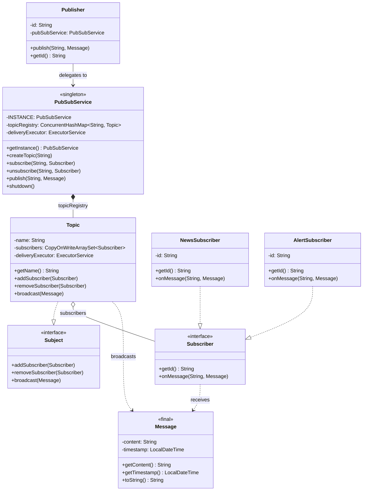

# Pub-Sub System — Low Level Design

A complete object-oriented design and Java implementation of a **Publish-Subscribe Messaging System** showcasing Singleton, Observer, and Strategy-like patterns with asynchronous message delivery and thread-safe topic management.

---

## Problem Statement

Design a publish-subscribe messaging system that can:
- Allow publishers to publish messages to specific named topics
- Allow subscribers to subscribe/unsubscribe to topics of interest
- Deliver messages to **all** subscribers of a topic asynchronously (non-blocking)
- Support multiple publishers and multiple subscribers per topic (fan-out)
- Support different subscriber behaviors (news feed, alert, etc.)
- Handle concurrent access and ensure thread safety
- Provide graceful shutdown with pending message drain

---

## High-Level Flow

```
Publisher                                PubSubService (Singleton)
   │                                          │
   │  publish("SPORTS", message)              │
   └─────────────────────────────────────────►│
                                              │  1. Lookup topic in ConcurrentHashMap
                                              │     ├── NOT FOUND → throw IllegalArgumentException
                                              │     └── FOUND → topic.broadcast(message)
                                              │
                                              ▼
                                         Topic "SPORTS"
                                              │
                                              │  2. For each subscriber in CopyOnWriteArraySet:
                                              │     └── Submit to ExecutorService (non-blocking)
                                              │           └── subscriber.onMessage(topicName, message)
                                              │
                                              ▼
                              ┌───────────────┼───────────────┐
                              │               │               │
                         SportsFan1      AllReader       SystemAdmin
                         (News)          (News)          (Alert)
                              │               │               │
                         prints msg      prints msg      prints !!!ALERT!!!


Topic Registry:
    "SPORTS"  ──► Topic { subscribers: [SportsFan1, AllReader, SystemAdmin] }
    "TECH"    ──► Topic { subscribers: [Techie, AllReader] }
    "WEATHER" ──► Topic { subscribers: [WeatherWatcher] }
```

---

## Class Diagram

> **Interactive:** Open [`class-diagram.excalidraw`](class-diagram.excalidraw) at [excalidraw.com](https://excalidraw.com) (File → Open) for the full interactive diagram with colors and layout.


<details>
<summary>Mermaid Class Diagram (click to expand)</summary>


</details>

---

## Project Structure

```
pub-sub-system/
├── pom.xml
├── README.md
└── src/main/java/com/pubsubsystem/
    ├── PubSubSystemDemo.java              # Entry point (main) — 5 demo scenarios
    │
    ├── model/                             # Domain models & core classes
    │   ├── PubSubService.java             # Singleton — manages topic registry & delivery
    │   ├── Topic.java                     # Named channel with subscriber set & broadcast
    │   ├── Publisher.java                 # Named publisher — thin wrapper over PubSubService
    │   └── Message.java                   # Immutable message (content + timestamp)
    │
    └── observer/                          # Observer pattern — subject & subscriber contracts
        ├── Subject.java                   # Interface — addSubscriber() + removeSubscriber() + broadcast()
        ├── Subscriber.java                # Interface — getId() + onMessage()
        ├── NewsSubscriber.java            # Prints messages in standard news format
        └── AlertSubscriber.java           # Prints messages as urgent alerts
```

---

## Design Patterns Used

| Pattern | Where | Why |
|---------|-------|-----|
| **Singleton** | `PubSubService` | One central topic registry and delivery engine per JVM — prevents duplicate topic state |
| **Observer** | `Subject` + `Subscriber` interfaces, `Topic` as concrete subject | Classic one-to-many: `Topic` implements `Subject` to manage observers, `Subscriber` defines the observer contract. New subscriber types = new class, zero changes to Topic |
| **Strategy-like** | Different `Subscriber` implementations | `NewsSubscriber` and `AlertSubscriber` handle the same message differently — behavior is swappable per subscriber |

---

## SOLID Principles Applied

| Principle | How |
|-----------|-----|
| **SRP** | `Topic` manages subscriber membership + broadcast, `PubSubService` manages the registry, `Publisher` provides a publishing API, `Message` is an immutable data carrier, `Subject` defines the subject contract, `Subscriber` defines the observer contract |
| **OCP** | New subscriber type (e.g., `EmailSubscriber`, `SlackSubscriber`) = new class implementing `Subscriber`. No changes to `Topic`, `PubSubService`, or any existing code. |
| **LSP** | `NewsSubscriber` and `AlertSubscriber` are fully interchangeable wherever `Subscriber` is expected. Topic doesn't know or care which concrete type it's notifying. |
| **ISP** | `Subject` has 3 focused methods (add/remove/broadcast). `Subscriber` has exactly 2 focused methods (`getId()` + `onMessage()`). Each interface has a single responsibility — no bloated contracts. |
| **DIP** | `Topic` depends on the `Subscriber` interface, not concrete classes. `PubSubService` depends on `Subject` (via `Topic implements Subject`), not on concrete topic logic. `Publisher` depends on `PubSubService` for routing, not on `Topic` directly. |

---

## How to Build & Run

### Using Maven
```bash
mvn clean package
java -jar target/pub-sub-system-1.0.0.jar
```

### Using javac directly
```bash
javac -d target/classes \
    src/main/java/com/pubsubsystem/model/Message.java \
    src/main/java/com/pubsubsystem/observer/Subject.java \
    src/main/java/com/pubsubsystem/observer/Subscriber.java \
    src/main/java/com/pubsubsystem/observer/NewsSubscriber.java \
    src/main/java/com/pubsubsystem/observer/AlertSubscriber.java \
    src/main/java/com/pubsubsystem/model/Topic.java \
    src/main/java/com/pubsubsystem/model/PubSubService.java \
    src/main/java/com/pubsubsystem/model/Publisher.java \
    src/main/java/com/pubsubsystem/PubSubSystemDemo.java

java -cp target/classes com.pubsubsystem.PubSubSystemDemo
```

---

## Thread Safety

- `PubSubService.topicRegistry` uses `ConcurrentHashMap` — thread-safe topic creation and lookup without explicit locks
- `Topic.subscribers` uses `CopyOnWriteArraySet` — safe for concurrent iteration during broadcast with rare subscribe/unsubscribe writes
- `Topic.broadcast()` submits each delivery to an `ExecutorService` — publisher thread is never blocked by slow subscribers
- `PubSubService` singleton uses eager initialization (`static final`) — class loading guarantees thread safety
- `Message` is immutable (`final` class, all `final` fields) — safe to share across threads without synchronization
- Delivery threads are daemon threads — JVM can exit even if deliveries are in-flight

---

## Extensibility

- **New subscriber type** → implement `Subscriber` interface (e.g., `EmailSubscriber`, `SlackSubscriber`, `DatabaseSubscriber`) and subscribe to any topic
- **Message filtering** → add a `MessageFilter` interface on `Topic` so subscribers only receive messages matching criteria
- **Message persistence** → add a `MessageStore` strategy to `Topic` that archives messages before/after broadcast
- **Replay / durable subscriptions** → store messages per topic and allow late subscribers to catch up from an offset
- **Priority topics** → use a `PriorityBlockingQueue` in the executor for high-priority message delivery
- **Dead letter queue** → catch delivery failures in `Topic.broadcast()` and route failed messages to a DLQ topic
