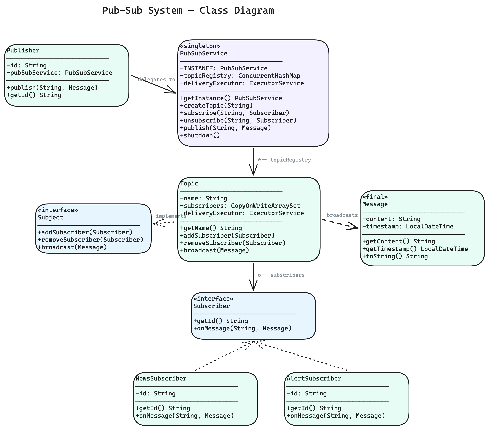
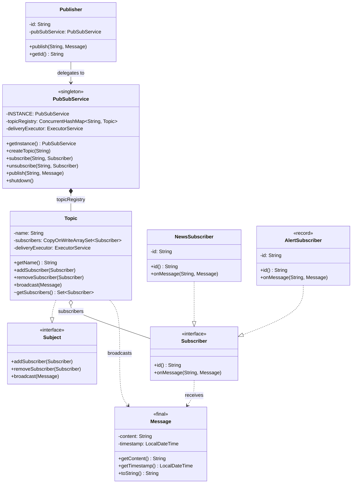

# Pub-Sub System — Low Level Design

A complete object-oriented design and Java implementation of a **Publish-Subscribe Messaging System** showcasing Singleton, Observer, and Strategy-like patterns with asynchronous message delivery and thread-safe topic management.

---

## Problem Statement

Design a publish-subscribe messaging system that can:
- Allow publishers to publish messages to specific named topics
- Allow subscribers to subscribe/unsubscribe to topics of interest
- Deliver messages to **all** subscribers of a topic asynchronously (non-blocking)
- Support multiple publishers and multiple subscribers per topic (fan-out)
- Support different subscriber behaviors (news feed, alert, etc.)
- Handle concurrent access and ensure thread safety
- Provide graceful shutdown with pending message drain

---

## High-Level Flow

```
Publisher                                PubSubService (Singleton)
   │                                          │
   │  publish("SPORTS", message)              │
   └─────────────────────────────────────────►│
                                              │  1. Lookup topic in ConcurrentHashMap
                                              │     ├── NOT FOUND → throw IllegalArgumentException
                                              │     └── FOUND → topic.broadcast(message)
                                              │
                                              ▼
                                         Topic "SPORTS"
                                              │
                                              │  2. For each subscriber in CopyOnWriteArraySet:
                                              │     └── Submit to ExecutorService (non-blocking)
                                              │           └── subscriber.onMessage(topicName, message)
                                              │
                                              ▼
                              ┌───────────────┼───────────────┐
                              │               │               │
                         SportsFan1      AllReader       SystemAdmin
                         (News)          (News)          (Alert)
                              │               │               │
                         prints msg      prints msg      prints !!!ALERT!!!


Topic Registry:
    "SPORTS"  ──► Topic { subscribers: [SportsFan1, AllReader, SystemAdmin] }
    "TECH"    ──► Topic { subscribers: [Techie, AllReader] }
    "WEATHER" ──► Topic { subscribers: [WeatherWatcher] }
```

---

## Class Diagram

> **Interactive:** Open [`class-diagram.excalidraw`](class-diagram.excalidraw) at [excalidraw.com](https://excalidraw.com) (File → Open) for the full interactive diagram with colors and layout.



<details>
<summary>Mermaid Class Diagram (click to expand)</summary>


</details>

---

## How to Approach This Problem (Smallest → Biggest)

When an interviewer says "Design a Pub-Sub System," don't jump to the big picture. Start from the smallest atoms and build up. This bottom-up approach proves you understand *why* each piece exists, not just *what* it does.

### Layer 1: The Immutable Payload — **`Message`**

Start here because nothing in a messaging system makes sense without defining what a message actually *is*.

**`Message`** is a `final` class with two `final` fields: `content` (the payload) and `timestamp` (when it was created). That's it. No setters, no mutation, no behavior beyond carrying data.

**Why immutable?** A single message gets broadcast to N subscribers across N threads. If any subscriber could mutate the message mid-flight, you'd have a race condition nightmare. Immutability is your free thread-safety pass — no locks, no copies, no worries.

**Mental model:** Think of a `Message` like a printed newspaper. Once it's printed, every reader gets the same edition. Nobody can scribble on their copy and change what others read.

> **Interview power move:** "I'm making `Message` a `final` class with all `final` fields. Since it's shared across delivery threads, immutability gives us thread safety without any synchronization overhead — it's the cheapest concurrency guarantee we can get."

### Layer 2: The Observer Contract — **`Subject`** and **`Subscriber`**

Before building any concrete classes, define the *contracts*. This is where you show the interviewer you think in abstractions.

**`Subject`** is an interface with three methods: `addSubscriber()`, `removeSubscriber()`, and `broadcast(Message)`. It's the classic Observer pattern's "observable" side — anything that can be watched.

**`Subscriber`** is an interface with two methods: `id()` for identification and `onMessage(String topicName, Message message)` for the callback. It's the "observer" side — anything that wants to react to events.

**Why interfaces first?** Because the whole power of pub-sub is decoupling. The thing that *sends* messages should never know *who* receives them or *how* they handle them. Interfaces enforce that boundary at compile time.

**Mental model:** `Subject` is a radio tower. `Subscriber` is a radio receiver. The tower broadcasts on a frequency — it doesn't know or care if there are 0 receivers or 10,000. The receiver tunes in and decides what to do with the signal.

> **Interview power move:** "I'm separating `Subject` and `Subscriber` as interfaces in an `observer/` package. This is textbook Observer pattern — but more importantly, it means `Topic` depends on the `Subscriber` abstraction, not on `NewsSubscriber` or `AlertSubscriber` concretely. That's Dependency Inversion in action."

### Layer 3: Concrete Observers — **`NewsSubscriber`** and **`AlertSubscriber`**

Now show how the `Subscriber` interface enables polymorphic behavior without any conditional logic.

**`NewsSubscriber`** is a standard class that implements `Subscriber` and prints messages in a calm, informational format. **`AlertSubscriber`** is a Java `record` that implements `Subscriber` and prints messages as urgent `!!!ALERT!!!` notifications.

Same interface, wildly different behavior. When `Topic` iterates its subscriber set and calls `onMessage()`, it has zero knowledge of which concrete type it's invoking. That's LSP (Liskov Substitution) working exactly as intended.

**Why a `record` for `AlertSubscriber`?** It's a pure data carrier with identity — `record` gives you `equals()`, `hashCode()`, and the accessor for free. It shows the interviewer you know modern Java idioms and pick the right tool for the shape of the data.

**Mental model:** These are like different apps on your phone that all receive push notifications. The Weather app shows a gentle banner. The Emergency Alert app blares a siren. Same notification pipeline, different reactions.

> **Interview power move:** "Adding a new subscriber type — say `EmailSubscriber` or `SlackSubscriber` — is just a new class implementing `Subscriber`. Zero changes to `Topic`, `PubSubService`, or any existing code. That's the Open/Closed Principle — open for extension, closed for modification."

### Layer 4: The Named Channel — **`Topic`**

This is the heart of the system. `Topic` implements `Subject` and represents a named channel that subscribers attach to.

Internally it holds a **`CopyOnWriteArraySet<Subscriber>`** for thread-safe subscriber management and a reference to a shared **`ExecutorService`** for async delivery. When `broadcast()` is called, it iterates the subscriber set and submits each `onMessage()` call as a task to the executor — the publisher thread returns immediately.

**Why `CopyOnWriteArraySet`?** The read-to-write ratio is heavily skewed: broadcasts (reads/iterations) happen constantly, while subscribe/unsubscribe (writes) are rare. `CopyOnWriteArraySet` is optimized for exactly this pattern — iteration never blocks, writes copy the entire array (acceptable cost for rare mutations).

**Why submit to an `ExecutorService` instead of calling `onMessage()` directly?** If a subscriber is slow (network call, disk I/O, heavy processing), calling it synchronously would block the publisher *and* delay delivery to all subsequent subscribers. Async submission isolates each subscriber's latency.

**Mental model:** A `Topic` is a WhatsApp group. When someone posts a message, WhatsApp doesn't wait for each member to read it before delivering to the next — it fires off all notifications in parallel.

> **Interview power move:** "The `Topic` constructor takes an `ExecutorService` as a dependency rather than creating its own. This is Dependency Injection — the `PubSubService` controls the thread pool lifecycle, so all topics share one pool instead of each topic spinning up its own threads. It also makes `Topic` testable — you can inject a same-thread executor in tests."

### Layer 5: The Thin Publisher Wrapper — **`Publisher`**

**`Publisher`** is intentionally simple — it holds an `id` and a reference to the `PubSubService` singleton. Its `publish()` method just delegates to `pubSubService.publish(topicName, message)`.

**Why does it exist if it's just a wrapper?** Identity and API clarity. In a real system, publishers need authentication, rate limiting, audit trails. Having a `Publisher` entity gives you a place to hang those concerns later without touching `PubSubService`. It also makes the demo code read naturally: `weatherBot.publish("WEATHER", message)` instead of `PubSubService.getInstance().publish("WEATHER", message)`.

**Mental model:** A `Publisher` is like a journalist with a press badge. The badge (id) identifies them, but the actual distribution is handled by the news wire service (`PubSubService`). The journalist writes the story; the wire service decides which outlets (topics/subscribers) get it.

> **Interview power move:** "The `Publisher` doesn't know about `Topic` or `Subscriber` at all — it only talks to `PubSubService`. This means the publishing side and the subscribing side are completely decoupled. You could swap out the entire delivery mechanism inside `PubSubService` and no publisher would need a single line change."

### Layer 6: The Singleton Orchestrator — **`PubSubService`**

The top of the pyramid. **`PubSubService`** is a Singleton that owns two things: a **`ConcurrentHashMap<String, Topic>`** (the topic registry) and a shared **`ExecutorService`** (the delivery thread pool).

It exposes five operations: `createTopic()`, `subscribe()`, `unsubscribe()`, `publish()`, and `shutdown()`. Each one looks up the topic by name in the registry and delegates to the `Topic` object. The `shutdown()` method implements a graceful two-phase termination: first `shutdown()` to stop accepting new tasks, then `awaitTermination()` with a timeout, and finally `shutdownNow()` if tasks are still stuck.

**Why Singleton?** There should be exactly one topic registry per JVM. Multiple registries would mean topics with the same name could exist independently — subscribers on one registry would miss messages from another. Eager initialization (`static final INSTANCE`) avoids the complexity of double-checked locking while being inherently thread-safe via the class loader.

**Why `ConcurrentHashMap`?** Multiple threads can create topics, subscribe, and publish simultaneously. `ConcurrentHashMap` gives lock-free reads and segment-level locking on writes — far better throughput than synchronizing on the entire map.

**Mental model:** `PubSubService` is the post office. It knows every P.O. box (topic) in the system, it receives letters (messages) from senders (publishers), and it distributes them to the right boxes. There's only one post office in town (Singleton), and it has multiple delivery trucks running in parallel (thread pool).

> **Interview power move:** "I'm using eager initialization for the Singleton — `static final` guarantees the instance is created exactly once when the class is loaded, with thread safety baked in by the JVM spec. No `volatile`, no `synchronized`, no broken double-checked locking edge cases. For a system-wide service like this, eager init is the cleanest choice."

### The Full Picture

```
Layer 1:  Message (immutable payload — the data that flows)
Layer 2:  Subject + Subscriber interfaces (the contracts — decoupled by design)
Layer 3:  NewsSubscriber, AlertSubscriber (concrete behaviors — strategy-like polymorphism)
Layer 4:  Topic (the channel — Subject impl with async fan-out delivery)
Layer 5:  Publisher (thin identity wrapper — delegates to the service)
Layer 6:  PubSubService (singleton orchestrator — registry + thread pool + lifecycle)
```

The key insight: each layer only depends on the layer below it (or on abstractions). `PubSubService` knows about `Topic` and `Subscriber`, but `Topic` doesn't know about `PubSubService`. `Subscriber` implementations don't know about `Topic`. `Message` doesn't know about anything. This layered dependency structure is what makes the system extensible — you can swap, extend, or replace any layer without ripple effects.

> **Interview Summary:**
> "I'd build this bottom-up. Start with an immutable `Message` for thread-safe data sharing. Define `Subject` and `Subscriber` interfaces to establish the Observer contract. Add concrete subscribers like `NewsSubscriber` and `AlertSubscriber` for polymorphic delivery. Build `Topic` as the concrete subject with a `CopyOnWriteArraySet` for thread-safe fan-out and an `ExecutorService` for async delivery. Wrap the publishing API in a `Publisher` class for identity and clean ergonomics. Finally, tie it all together with a `PubSubService` Singleton that owns the topic registry as a `ConcurrentHashMap` and manages the shared thread pool lifecycle with graceful shutdown."

---

## Project Structure

```
pub-sub-system/
├── pom.xml
├── README.md
└── src/main/java/com/pubsubsystem/
    ├── PubSubSystemDemo.java              # Entry point (main) — 5 demo scenarios
    │
    ├── model/                             # Domain models & core classes
    │   ├── PubSubService.java             # Singleton — manages topic registry & delivery
    │   ├── Topic.java                     # Named channel with subscriber set & broadcast
    │   ├── Publisher.java                 # Named publisher — thin wrapper over PubSubService
    │   └── Message.java                   # Immutable message (content + timestamp)
    │
    └── observer/                          # Observer pattern — subject & subscriber contracts
        ├── Subject.java                   # Interface — addSubscriber() + removeSubscriber() + broadcast()
        ├── Subscriber.java                # Interface — getId() + onMessage()
        ├── NewsSubscriber.java            # Prints messages in standard news format
        └── AlertSubscriber.java           # Prints messages as urgent alerts
```

---

## Design Patterns Used

| Pattern | Where | Why |
|---------|-------|-----|
| **Singleton** | `PubSubService` | One central topic registry and delivery engine per JVM — prevents duplicate topic state |
| **Observer** | `Subject` + `Subscriber` interfaces, `Topic` as concrete subject | Classic one-to-many: `Topic` implements `Subject` to manage observers, `Subscriber` defines the observer contract. New subscriber types = new class, zero changes to Topic |
| **Strategy-like** | Different `Subscriber` implementations | `NewsSubscriber` and `AlertSubscriber` handle the same message differently — behavior is swappable per subscriber |

---

## SOLID Principles Applied

| Principle | How |
|-----------|-----|
| **SRP** | `Topic` manages subscriber membership + broadcast, `PubSubService` manages the registry, `Publisher` provides a publishing API, `Message` is an immutable data carrier, `Subject` defines the subject contract, `Subscriber` defines the observer contract |
| **OCP** | New subscriber type (e.g., `EmailSubscriber`, `SlackSubscriber`) = new class implementing `Subscriber`. No changes to `Topic`, `PubSubService`, or any existing code. |
| **LSP** | `NewsSubscriber` and `AlertSubscriber` are fully interchangeable wherever `Subscriber` is expected. Topic doesn't know or care which concrete type it's notifying. |
| **ISP** | `Subject` has 3 focused methods (add/remove/broadcast). `Subscriber` has exactly 2 focused methods (`getId()` + `onMessage()`). Each interface has a single responsibility — no bloated contracts. |
| **DIP** | `Topic` depends on the `Subscriber` interface, not concrete classes. `PubSubService` depends on `Subject` (via `Topic implements Subject`), not on concrete topic logic. `Publisher` depends on `PubSubService` for routing, not on `Topic` directly. |

---

## Thread Safety

- `PubSubService.topicRegistry` uses `ConcurrentHashMap` — thread-safe topic creation and lookup without explicit locks
- `Topic.subscribers` uses `CopyOnWriteArraySet` — safe for concurrent iteration during broadcast with rare subscribe/unsubscribe writes
- `Topic.broadcast()` submits each delivery to an `ExecutorService` — publisher thread is never blocked by slow subscribers
- `PubSubService` singleton uses eager initialization (`static final`) — class loading guarantees thread safety
- `Message` is immutable (`final` class, all `final` fields) — safe to share across threads without synchronization
- Delivery threads are daemon threads — JVM can exit even if deliveries are in-flight

---

## Extensibility

- **New subscriber type** → implement `Subscriber` interface (e.g., `EmailSubscriber`, `SlackSubscriber`, `DatabaseSubscriber`) and subscribe to any topic
- **Message filtering** → add a `MessageFilter` interface on `Topic` so subscribers only receive messages matching criteria
- **Message persistence** → add a `MessageStore` strategy to `Topic` that archives messages before/after broadcast
- **Replay / durable subscriptions** → store messages per topic and allow late subscribers to catch up from an offset
- **Priority topics** → use a `PriorityBlockingQueue` in the executor for high-priority message delivery
- **Dead letter queue** → catch delivery failures in `Topic.broadcast()` and route failed messages to a DLQ topic
