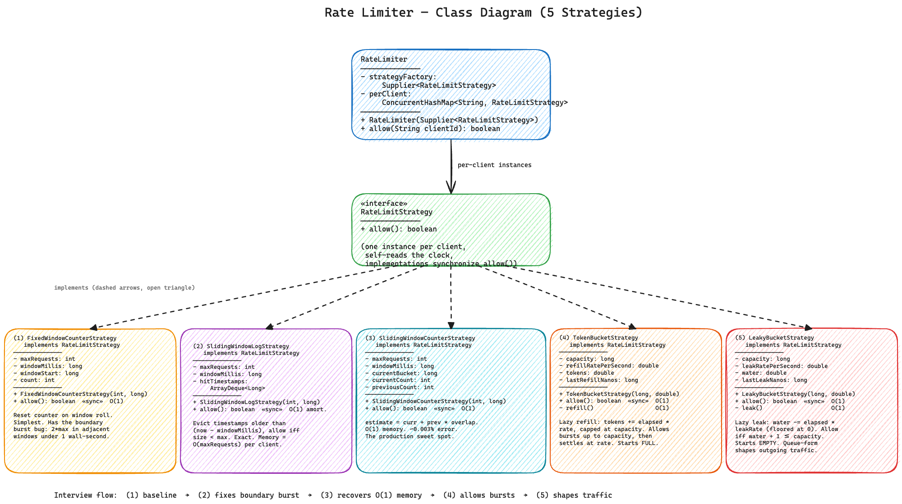

# Rate Limiter — Low Level Design

A per-client, thread-safe rate limiter with **five pluggable algorithms** behind a single Strategy interface — implemented in the exact order an interviewer will ask you to build them.

---

## Problem Statement

Design a rate limiter that:
- Decides whether each incoming request from a client (IP, user-id, API key) should be **allowed** or **denied** based on a configured limit
- Supports **multiple algorithms** that can be swapped without changing the limiter itself
- Maintains **independent state per client** — one noisy client cannot drain another's quota
- Is safe to call from many threads at once
- Ships with the five algorithms most commonly asked in big-tech LLD rounds

---

## Interview Flow — The Order Follow-Up Questions Are Asked

This is the single most important section in the file. In a real LLD round, the interviewer almost never asks for one algorithm — they walk you through an escalating series of "but what about…" questions, and each question forces a new algorithm. Read the strategies in **this exact order** and you will be ready for the natural conversation flow.

```
Interviewer's opener: "Design a rate limiter."
       |
       v
  +----------------------------+   "Walk me through the simplest correct version."
  | 1. Fixed Window Counter    |   You write a counter that resets every windowMillis.
  +-------------+--------------+
                |
                |  "But what if a client fires N requests at the END of one window
                |   and N more at the START of the next? They just did 2N in a
                |   second -- your limiter only saw N each time."
                v
  +----------------------------+   The boundary burst bug.
  | 2. Sliding Window Log      |   Keep a Deque of every allowed timestamp; evict
  +-------------+--------------+   anything older than (now - windowMillis).
                |
                |  "Nice. Now imagine 10 million users at 1000 req/min each --
                |   that's 10 billion timestamps in memory. Can you do better?"
                v
  +----------------------------+   Memory blowup.
  | 3. Sliding Window Counter  |   Keep just TWO bucket counts (previous + current)
  +-------------+--------------+   and a weighted blend. O(1) memory, ~0.003% error.
                |
                |  "Good. What if I want to allow short BURSTS -- five requests
                |   back-to-back is fine, but the long-term rate must hold?"
                v
  +----------------------------+   Burst budgets.
  | 4. Token Bucket            |   Bucket of tokens that refills at a fixed rate;
  +-------------+--------------+   capacity is the burst budget. Production default.
                |
                |  "Last one: what if I want the OUTPUT to be uniform -- I don't
                |   just want to allow/deny, I want to shape outgoing traffic?"
                v
  +----------------------------+   Traffic shaping vs rate limiting.
  | 5. Leaky Bucket            |   Bucket fills on each request, leaks at fixed
  +-------------+--------------+   rate; rejects on overflow. The "metering" cousin
                |                  of token bucket. (Queue form smooths output.)
                |
                v
        "And how would you scale this across N service replicas?"
        Discuss: Redis + atomic Lua scripts, sharded counters, eventual consistency.
```

### Algorithm-to-class map (use this as the reading order)

| Order | Question the interviewer is probing | Algorithm | Class |
|-------|-------------------------------------|-----------|-------|
| **1** | Can you write the simplest correct version? | Fixed Window Counter | [`FixedWindowCounterStrategy`](src/main/java/com/ratelimiter/strategy/FixedWindowCounterStrategy.java) |
| **2** | Do you spot the boundary burst bug, and can you fix it precisely? | Sliding Window Log | [`SlidingWindowLogStrategy`](src/main/java/com/ratelimiter/strategy/SlidingWindowLogStrategy.java) |
| **3** | Can you keep accuracy without paying O(maxRequests) memory? | Sliding Window Counter | [`SlidingWindowCounterStrategy`](src/main/java/com/ratelimiter/strategy/SlidingWindowCounterStrategy.java) |
| **4** | Do you understand burst budgets and lazy refill? | Token Bucket | [`TokenBucketStrategy`](src/main/java/com/ratelimiter/strategy/TokenBucketStrategy.java) |
| **5** | Do you know rate-limiting vs traffic-shaping? | Leaky Bucket | [`LeakyBucketStrategy`](src/main/java/com/ratelimiter/strategy/LeakyBucketStrategy.java) |

> If you only have time to memorise two: **Token Bucket** (the production default everyone reaches for) and **Sliding Window Counter** (the right answer when accuracy matters at scale). Fixed Window is the warm-up, Sliding Window Log is the intuitive-but-fat fix, and Leaky Bucket is the conceptual comparison the interviewer uses to test whether you can distinguish *limiting* from *shaping*.

---

## High-Level Flow

```
limiter.allow(clientId)
    |
    +-- perClient.computeIfAbsent(clientId, k -> strategyFactory.get())
    |        |
    |        +-- first time for this client --> create fresh strategy instance
    |        |
    |        +-- subsequent calls         --> reuse existing instance
    |
    +-- strategy.allow()
             |
             +-- Fixed Window Counter
             |        +-- if (now - windowStart) >= windowMillis : reset counter
             |        +-- count < max ? count++, return true : return false
             |
             +-- Sliding Window Log
             |        +-- drop timestamps older than (now - windowMillis)
             |        +-- size < max ? record now, return true : return false
             |
             +-- Sliding Window Counter
             |        +-- roll bucket pointer if a window boundary was crossed
             |        +-- estimate = currentCount + previousCount * overlapFraction
             |        +-- estimate < max ? currentCount++, return true : return false
             |
             +-- Token Bucket
             |        +-- lazy refill: tokens += elapsed * refillRate (capped at capacity)
             |        +-- tokens >= 1 ? consume 1, return true : return false
             |
             +-- Leaky Bucket
                      +-- lazy leak: water -= elapsed * leakRate (floored at 0)
                      +-- water + 1 <= capacity ? water++, return true : return false
```

---

## Class Diagram

```mermaid
classDiagram
    direction TB

    class RateLimiter {
        -strategyFactory: Supplier~RateLimitStrategy~
        -perClient: ConcurrentHashMap~String, RateLimitStrategy~
        +RateLimiter(Supplier~RateLimitStrategy~)
        +allow(String clientId) boolean
    }

    class RateLimitStrategy {
        <<interface>>
        +allow() boolean
    }

    class FixedWindowCounterStrategy {
        -maxRequests: int
        -windowMillis: long
        -windowStart: long
        -count: int
        +FixedWindowCounterStrategy(int, long)
        +allow() boolean «sync»
    }

    class SlidingWindowLogStrategy {
        -maxRequests: int
        -windowMillis: long
        -hitTimestamps: ArrayDeque~Long~
        +SlidingWindowLogStrategy(int, long)
        +allow() boolean «sync»
    }

    class SlidingWindowCounterStrategy {
        -maxRequests: int
        -windowMillis: long
        -currentBucket: long
        -currentCount: int
        -previousCount: int
        +SlidingWindowCounterStrategy(int, long)
        +allow() boolean «sync»
    }

    class TokenBucketStrategy {
        -capacity: long
        -refillRatePerSecond: double
        -tokens: double
        -lastRefillNanos: long
        +TokenBucketStrategy(long, double)
        +allow() boolean «sync»
        -refill()
    }

    class LeakyBucketStrategy {
        -capacity: long
        -leakRatePerSecond: double
        -water: double
        -lastLeakNanos: long
        +LeakyBucketStrategy(long, double)
        +allow() boolean «sync»
        -leak()
    }

    FixedWindowCounterStrategy ..|> RateLimitStrategy
    SlidingWindowLogStrategy ..|> RateLimitStrategy
    SlidingWindowCounterStrategy ..|> RateLimitStrategy
    TokenBucketStrategy ..|> RateLimitStrategy
    LeakyBucketStrategy ..|> RateLimitStrategy
    RateLimiter --> RateLimitStrategy : per-client instances
    RateLimiter ..> RateLimitStrategy : factory creates
```



<details>
<summary>Mermaid Class Diagram (click to expand)</summary>


</details>

---

## How to Approach This Problem (Smallest to Biggest)

When an interviewer says "design a rate limiter," the worst opening move is to start writing token-bucket code immediately. The mark of a senior answer is to first decide *what is the limiter* and *what is the algorithm*, and explain why those two responsibilities should not live in the same class. Then walk through the algorithms in the order the interviewer would naturally escalate.

### Layer 1: The smallest insight — every rate limiter is `(clientId) -> boolean`

**What**: At its core, a rate limiter is a function `allow(clientId) -> boolean`. That's the whole public API. Everything else is *how* that function decides.

**Why this matters**: It tells you the limiter has to do two things — pick the right per-client bookkeeping (state lookup), and run an algorithm on it (the decision). Those are two different responsibilities, which means two classes. This is the same SRP split as `Cache` + `EvictionPolicy` in the LRU module.

**Mental power move**: *"The public API is a one-liner. Everything we design is either the per-client state plumbing or the per-call algorithm — let's split it that way."*

### Layer 2: Per-client state is non-negotiable

**What**: A rate limiter that holds a single shared counter across all clients is not a rate limiter — it's a global throttle. Client A's traffic should never affect client B's quota.

**Why**: Every algorithm has mutable state (tokens, hit log, counter, water level). If two clients share that state, one chatty client can deny service to everyone else. So each client needs its OWN state instance.

**Design decision**: We give each client its own `RateLimitStrategy` instance, not a shared one. The strategy *is* the per-client state container.

**Interview power move**: *"Each client gets a fresh strategy instance. That's the cleanest way to get true isolation without putting clientId into every algorithm's bookkeeping maps."*

### Layer 3: How does the limiter spawn per-client state? — `Supplier<RateLimitStrategy>`

**What**: The limiter holds a `Supplier<RateLimitStrategy>` (a factory). The first time a clientId arrives, the limiter calls the factory to build a fresh strategy and stores it in `Map<String, RateLimitStrategy>`. Subsequent calls reuse it.

**Why a factory, not a class reference**: Because the algorithm's *config* lives outside the limiter. Token Bucket needs `capacity` and `refillRate`; Sliding Window needs `maxRequests` and `windowMillis`. The factory lambda closes over those values, so the limiter never has to know they exist.

```java
new RateLimiter(() -> new FixedWindowCounterStrategy(100, 60_000));
new RateLimiter(() -> new TokenBucketStrategy(5, 2.0));
new RateLimiter(() -> new SlidingWindowCounterStrategy(100, 60_000));
```

**Interview power move**: *"I pass in a Supplier rather than a Class<? extends Strategy>. That way the configuration travels with the lambda — the limiter stays oblivious to algorithm parameters, which is exactly the Open/Closed split we want."*

### Layer 4: The contract — `RateLimitStrategy` has ONE method

**What**: The interface is a single method:

```java
interface RateLimitStrategy { boolean allow(); }
```

No clientId parameter (each instance is already bound to one client). No timestamp parameter (the strategy reads the clock itself). No "reset" hook (a fresh instance is the reset).

**Why so minimal**: Interface Segregation. All five of our algorithms — fixed window, sliding window log, sliding window counter, token bucket, leaky bucket — fit this contract without modification. If we added `peek()` or `tokensRemaining()` it would force every algorithm to expose internals that don't generalise (sliding window has no notion of "tokens left").

**Why the strategy reads the clock itself**: Two reasons. First, security — callers can't replay an old timestamp to slip past the limit. Second, encapsulation — different algorithms want different clock sources (`nanoTime` for token-bucket and leaky-bucket deltas, `currentTimeMillis` for sliding-window absolute timestamps).

**Interview power move**: *"The interface is `boolean allow()`. One method. Anything more would either leak algorithm-specific state or hand the clock to the caller — both are mistakes."*

### Layer 5: Fixed Window Counter — the naive baseline (and the bug it leaves behind)

**What**: Chop time into fixed `windowMillis` intervals. Each interval has one counter. Allow until the counter reaches `maxRequests`, then deny until the window rolls.

```
state per client: (windowStart, count)
allow():
  if (now - windowStart) >= windowMillis:
      windowStart = aligned to multiples of windowMillis
      count = 0
  if count < max: count++; return true
  else: return false
```

**Why we snap windowStart to multiples of `windowMillis` rather than to `now`**: Otherwise every client ends up on its own private window grid. Two clients hitting the limiter 30s apart would land on offset boundaries, which makes the algorithm's behaviour depend on first-call timing — not what anyone wants.

**The bug interviewers ALWAYS attack**: A client fires `maxRequests` at second 59.9 of window 1 (counter saturates and then rolls), then another `maxRequests` at second 0.1 of window 2 (fresh counter, restarts). Wall-clock view: `2 * maxRequests` in 0.2 seconds. Each fixed window saw only `maxRequests`, so the limiter says everything is fine. This is exactly what Sliding Window Log fixes.

**Interview power move**: *"Fixed window is the cheapest correct version, but it has a known boundary burst bug: two adjacent windows can stack into one wall-clock interval. That's the door to sliding window."*

### Layer 6: Sliding Window Log — the precise fix

**What**: A Deque of timestamps, one per allowed request inside the rolling window.

```
state per client: (hits: Deque<Long>)
allow():
  cutoff = now - windowMillis
  while hits.peekFirst() <= cutoff: hits.pollFirst()
  if hits.size() < max: hits.offerLast(now); return true
  else: return false
```

**Why this fixes the boundary bug**: The window's reference frame is "now", not a wall-clock boundary. At second 59.5 the window covers seconds 58.5 to 59.5; at second 0.5 it covers seconds 59.5 to 0.5 — and any over-limit traffic gets dropped because the older hits are still inside the rolling window. There is no boundary for the attacker to align with.

**Why `ArrayDeque`, not `LinkedList`**: Contiguous backing array → tight memory, fast `pollFirst` / `offerLast`. LinkedList would box every Long into a node object — wasteful when we may carry up to `maxRequests` entries per client.

**Why the eviction loop terminates fast**: The deque is naturally sorted by time (we only ever append `now`, which monotonically increases). So we can stop scanning the moment we hit a fresh-enough entry — no full scan.

**Amortized O(1)**: Each timestamp is inserted exactly once and evicted exactly once. The total work across N calls is 2N pointer operations → O(1) per call on average.

**The trap door (which leads to Layer 7)**: Memory is O(maxRequests) per client. For a 1000 req/min/user limit at 1M users, that's 60 GB of timestamps in the worst case. Not OK.

**Interview power move**: *"Log is exact, but it carries up to `maxRequests` timestamps per client. The next algorithm trades a tiny bit of accuracy for O(1) memory."*

### Layer 7: Sliding Window Counter — the production hybrid

**What**: Keep TWO counters — the current fixed-window bucket and the previous one — plus a weighted blend.

```
state per client: (currentBucket, currentCount, previousCount)
allow():
  bucket = now / windowMillis
  if bucket > currentBucket: roll (previousCount = currentCount, currentCount = 0, ...)
  elapsedInCurrent = now - currentBucket * windowMillis
  overlap = 1 - elapsedInCurrent / windowMillis
  estimate = currentCount + previousCount * overlap
  if estimate < max: currentCount++; return true
  else: return false
```

**The intuition**: Assume the previous window's traffic was spread uniformly. So `overlap`'s worth of it "still counts" toward the rolling window — exactly the linear interpolation you'd draw on a whiteboard.

**Why this is the right default at scale**: O(1) memory (just two ints and a long per client), O(1) CPU (two multiplies and a compare), and the accuracy error vs. log is around 0.003% on typical traffic. Cloudflare publishes that exact figure in their rate-limiting blog post.

**When the approximation hurts**: If the previous window was hyper-bursty (all requests in the last 1% of it), the uniform-spread assumption over-estimates how much of it has "already passed" and we let too many through. Worst case: clients can sneak ~ (burstiness_factor) extra requests right after the boundary. For most workloads this is invisible.

**Interview power move**: *"Sliding Window Counter keeps two bucket counts and weighted-blends them. O(1) memory, ~0.003% error, and it's what Cloudflare actually runs in production."*

### Layer 8: Token Bucket — the burst-friendly classic

**What**: A bucket of `capacity` tokens that refills at `refillRatePerSecond`. Every allowed request consumes one token. If the bucket is empty, deny.

```
state per client: (tokens: double, lastRefillNanos: long)
allow():
  elapsed = now - lastRefillNanos
  tokens = min(capacity, tokens + elapsed * rate)
  lastRefillNanos = now
  if tokens >= 1: tokens -= 1; return true
  else: return false
```

**The lazy-refill trick**: We do NOT spawn a background thread to top up tokens. On every `allow()` we compute "how many tokens *would* have arrived since the last call" and add them in one shot. Same math, zero scheduling overhead.

**Why `tokens` is a double, not a long**: At 10 tokens/sec, two calls 50 ms apart should add 0.5 tokens each. If we used a long we'd round down to 0 every time and the rate would silently collapse to zero.

**Why `nanoTime`, not `currentTimeMillis`**: It's monotonic. NTP rewinds the wall clock occasionally; token-bucket math gets very ugly when elapsed comes out negative. `nanoTime` cannot go backwards.

**Why start with the bucket full**: An empty initial state means every fresh client has to wait one refill interval before any request — almost never what we want. Full means "you get a burst on first use," which matches every production rate limiter (AWS, GitHub, Stripe).

**Interview power move**: *"Token bucket allows controlled bursts up to capacity, then settles into the refill rate. Lazy refill keeps us O(1) per call with zero background threads — important if you're running 100k clients."*

### Layer 9: Leaky Bucket — the traffic-shaping cousin

**What**: A bucket of `capacity` that drains (leaks) at `leakRatePerSecond`. Each incoming request fills it by 1. If filling would overflow, deny.

```
state per client: (water: double, lastLeakNanos: long)
allow():
  elapsed = now - lastLeakNanos
  water = max(0, water - elapsed * leakRate)
  lastLeakNanos = now
  if water + 1 <= capacity: water += 1; return true
  else: return false
```

**Honest comparison with Token Bucket**: The counter form of leaky bucket and token bucket are **mathematically equivalent** — same compare, same outcome, just flipped bookkeeping. The interviewer is testing whether you can articulate the *intent* difference:

| | Token Bucket | Leaky Bucket (counter) |
|--|---------------|------------------------|
| **State starts** | full | empty |
| **Request action** | spend 1 token | add 1 unit of water |
| **Background dynamic** | tokens refill at `r/sec` | water leaks at `r/sec` |
| **Deny condition** | tokens < 1 | water + 1 > capacity |
| **Conceptual question** | "do I have a token to pay with?" | "is there room in the bucket?" |

**The real difference is the queue form**: A true queue-based leaky bucket holds accepted requests in a FIFO and dispatches them at a *fixed output rate*. That is **traffic shaping**, not just rate limiting — even allowed requests come out smoothed. Token bucket has no equivalent because it never reshapes output, only decides allow/deny. This is the answer the interviewer wants when they ask "but aren't these the same?".

**When to pick leaky bucket**: When you actually need to smooth outgoing traffic (network packet schedulers, telecom voice circuits, anti-burst egress to a downstream service). When you only need allow/deny, Token Bucket's burst-budget framing is clearer.

**Interview power move**: *"Counter-form leaky bucket is mathematically a token bucket with reversed bookkeeping. The genuine traffic-shaping leaky bucket is the queue form — it dispatches requests at a fixed output rate and smooths bursts. Token bucket can't do that."*

### Layer 10: The orchestrator — `RateLimiter`

**What**: Holds a `Supplier<RateLimitStrategy>` factory and a `ConcurrentHashMap<String, RateLimitStrategy>`. `allow(clientId)` does `computeIfAbsent` to find-or-create the strategy and calls `strategy.allow()`.

**Why so thin**: The limiter is a router, not an algorithm. It knows nothing about tokens, windows, water, or clocks. It only knows: "first request from this client? build a fresh strategy. Otherwise reuse the existing one. Then forward the call."

**Why `ConcurrentHashMap` here but `synchronized` inside the strategy**: Two different contention domains. `computeIfAbsent` is contended *across* clients (many threads inserting different keys). The strategy's `allow()` body is contended *within* a single client (many threads hitting the same key). ConcurrentHashMap shines at the first; a coarse `synchronized` shines at the second. Mixing them gives us the best of both.

**Why no expiry / sweeper for cold clients**: A client that hasn't called in a week still occupies a map entry. For a small client population (thousands) this is fine. For a huge population (millions of IPs) you'd add a TTL eviction layer — but that's a different concern and belongs in a separate component, not in `RateLimiter`. SRP again.

**Interview power move**: *"The RateLimiter has zero algorithm knowledge. Grep it for `token` or `window` — you'll find nothing. Adding a new algorithm tomorrow means writing a new RateLimitStrategy class, never editing RateLimiter."*

### Layer 11: Why not Redis / a distributed counter?

This is the inevitable closing question. Have a one-paragraph answer ready.

**The honest answer**: In-process Java limiters work great for a single instance. The moment you have N replicas of your service behind a load balancer, each replica has its own state, and a client distributed across them effectively gets `N * limit`. The fix is a shared store — Redis with `INCR` + `EXPIRE` for fixed window, Lua scripts for atomic sliding-window or token-bucket logic. The strategy interface above stays exactly the same; you just write a `RedisTokenBucketStrategy` that holds a Redis client instead of local fields.

**Interview power move**: *"For multi-instance services this design extends naturally — same `RateLimitStrategy` interface, but the implementation calls a Redis Lua script instead of mutating local fields. The orchestrator doesn't change at all. That's the Open/Closed payoff."*

### The Full Picture

```
RateLimiter                          (orchestrator -- ConcurrentHashMap<clientId, strategy>)
    |
    | computeIfAbsent + factory
    v
RateLimitStrategy                    (interface -- single method: allow())
    |
    +-- FixedWindowCounterStrategy     (1) simplest baseline; boundary burst bug
    |
    +-- SlidingWindowLogStrategy       (2) fixes the bug; O(maxRequests) memory
    |
    +-- SlidingWindowCounterStrategy   (3) O(1) memory hybrid; ~0.003% error
    |
    +-- TokenBucketStrategy            (4) allows bursts up to capacity; production default
    |
    +-- LeakyBucketStrategy            (5) traffic-shaping cousin of token bucket
```

> **Interview Summary**: *"I split this into two responsibilities — a `RateLimiter` orchestrator that owns the per-client lookup, and a `RateLimitStrategy` interface that owns the actual algorithm. The limiter holds a `Supplier<RateLimitStrategy>` factory and a `ConcurrentHashMap<clientId, strategy>` so each client gets its own state instance with no cross-client interference. I'd walk through the five algorithms in escalating order: Fixed Window for the simplest correct version, Sliding Window Log to fix its boundary burst bug, Sliding Window Counter to recover O(1) memory with a weighted previous/current blend, Token Bucket to allow controlled bursts via lazy refill, and Leaky Bucket to contrast rate-limiting against traffic-shaping. Each strategy synchronizes its own `allow()` body because it's a read-modify-write on shared mutable state, while the orchestrator uses ConcurrentHashMap for per-client lazy creation. The whole design is Open/Closed — adding a Redis-backed strategy means writing one class with no edits to `RateLimiter`."*

---

## Project Structure

```
rate-limiter/
├── pom.xml
├── README.md
├── class-diagram.excalidraw
└── src/main/java/com/ratelimiter/
    ├── RateLimiterDemo.java                       # Entry point — runs all 5 strategies
    │
    ├── model/
    │   └── RateLimiter.java                       # Orchestrator — ConcurrentHashMap<clientId, strategy>
    │
    └── strategy/
        ├── RateLimitStrategy.java                 # Strategy interface (single allow() method)
        ├── FixedWindowCounterStrategy.java        # (1) Simplest baseline; rolls every windowMillis
        ├── SlidingWindowLogStrategy.java          # (2) ArrayDeque of timestamps; exact, fat
        ├── SlidingWindowCounterStrategy.java      # (3) Previous + current bucket; weighted blend
        ├── TokenBucketStrategy.java               # (4) Lazy refill, capacity, double tokens
        └── LeakyBucketStrategy.java               # (5) Lazy leak, water level, double precision
```

---

## Design Patterns Used

| Pattern | Where | Why |
|---------|-------|-----|
| **Strategy** | `RateLimitStrategy` + 5 concrete implementations | Swap rate-limit algorithm without changing `RateLimiter` |
| **Factory (Supplier)** | `Supplier<RateLimitStrategy>` passed into `RateLimiter` | Per-client strategy instances built on demand; configuration travels with the lambda |
| **Composition** | `RateLimiter` holds `Map<clientId, strategy>` | Orchestrator delegates the actual decision to the per-client strategy |

---

## SOLID Principles Applied

| Principle | How |
|-----------|-----|
| **SRP** | `RateLimiter` routes by clientId; each strategy owns one algorithm's state and decision. Two reasons to change live in two layers. |
| **OCP** | All five algorithms ship without a single edit to `RateLimiter`. A future Redis-backed or GCRA strategy is the same pattern — new class, zero edits. |
| **LSP** | Any `RateLimitStrategy` drops in wherever the interface is expected; the orchestrator never type-checks. |
| **ISP** | Interface has exactly one method (`allow()`) — no fat, no algorithm-specific leakage like `tokensRemaining()`. |
| **DIP** | `RateLimiter` depends on the `RateLimitStrategy` abstraction (and a `Supplier` of it), never on a concrete strategy. |

---

## Thread Safety

- `RateLimiter.allow` uses `ConcurrentHashMap.computeIfAbsent` for atomic lazy creation of per-client strategy instances — no global lock on the limiter.
- Each strategy's `allow()` is `synchronized` because the body is a read-modify-write on shared mutable state (counter / hit log / blended estimate / tokens / water). Two unsynchronized threads on the same client could both see "one slot left" and both decrement to zero — one slips past the limit.
- The two locks compose naturally: contention between different clients is handled by `ConcurrentHashMap`'s segmented locking; contention within the same client is handled by the strategy's intrinsic lock.
- For very high per-client contention, swap `synchronized` for `ReentrantLock` (allows `tryLock` + timeout), or use a CAS loop on the bucket's `tokens` field via `AtomicReference<Double>`.

---

## Extensibility

- **New algorithm** (GCRA, Redis-backed, custom hierarchical bucket) → implement `RateLimitStrategy`. Zero changes to `RateLimiter`.
- **TTL eviction of cold clients** → wrap `perClient` with a Caffeine cache that expires entries after N minutes idle. The strategy interface stays unchanged.
- **Per-route limits** (`/login` allows 5/min, `/search` allows 100/min) → key the map on `(clientId, route)` instead of just `clientId`, or compose multiple `RateLimiter` instances behind a router.
- **Distributed limiting** (across many service replicas) → implement `RedisTokenBucketStrategy` that runs an atomic Lua script. The orchestrator is unchanged.
- **Observability** → wrap any strategy with a `MeteredRateLimitStrategy` decorator that increments hit/miss counters before delegating.

---

## Algorithm Cheat Sheet (memorise this table)

| Dimension | Fixed Window | Sliding Window Log | Sliding Window Counter | Token Bucket | Leaky Bucket |
|-----------|--------------|--------------------|------------------------|--------------|--------------|
| **Allows bursts?** | Up to `maxRequests` per window (boundary leak: 2x possible) | No — exactly `maxRequests` per rolling window | Approx — within ~0.003% | Yes, up to `capacity` | Up to `capacity` (counter form) / smoothed to `leakRate` (queue form) |
| **Memory per client** | O(1) — counter + windowStart | O(maxRequests) — one timestamp per hit | O(1) — two ints + a long | O(1) — two numbers | O(1) — two numbers |
| **CPU per call** | O(1) | O(1) amortized | O(1) | O(1) | O(1) |
| **Accuracy** | Loose (boundary burst) | Exact | ~0.003% error | Exact within model | Exact within model |
| **Clock source** | `currentTimeMillis` | `currentTimeMillis` | `currentTimeMillis` | `nanoTime` (monotonic deltas) | `nanoTime` (monotonic deltas) |
| **Best for** | Internal cheap throttles | Billing-grade precision at small scale | Public APIs at scale | Chatty APIs with burst SLAs | Traffic shaping, packet/voice schedulers |
| **Production examples** | Redis `INCR`+`EXPIRE` quick fixes | Some audit/billing systems | Cloudflare's published rate limiter | AWS API Gateway, GitHub, Stripe | Network egress shapers, telecom |

---

## Common Interview Questions (Rapid Fire)

These are the exact follow-ups interviewers ask once your code compiles. Have a one-paragraph answer ready for each.

### Q1. Why a `Supplier<RateLimitStrategy>` factory instead of just passing a `Class` reference?

The strategy needs configuration — `capacity` for token bucket, `windowMillis` for sliding window — and that configuration is algorithm-specific. A `Class<? extends RateLimitStrategy>` would force the limiter to know how to call each constructor, which means the limiter has to special-case every algorithm. A `Supplier<RateLimitStrategy>` lambda closes over the configuration at construction time, so the limiter only ever calls `factory.get()` and stays oblivious to algorithm parameters. It's the Open/Closed payoff: a new algorithm with new config types ships without a single edit to the limiter.

### Q2. Why `nanoTime` in Token/Leaky Bucket but `currentTimeMillis` in the window-based algorithms?

The bucket algorithms only care about *deltas* — how many nanoseconds since the last refill/leak. `nanoTime` is monotonic, so the delta is always non-negative even when NTP rewinds the wall clock. The window-based algorithms care about *absolute* cutoffs — "drop everything older than `now - 1000 ms`". For that to work across restarts and configuration changes you need wall-clock values, so `currentTimeMillis`. The two families genuinely need different clock sources; conflating them would break one or the other.

### Q3. Why is `tokens` (and `water`) a `double` and not a `long`?

At 10 tokens/sec, two calls 50 ms apart should each add 0.5 tokens. With a `long` we'd round down to 0 on every call and the effective rate would silently drop to zero. With a `double` the fractional accumulation works cleanly between calls, and the visible "tokens >= 1" check still requires whole tokens for a request. The cost is one floating-point compare per call — negligible.

### Q4. Why does the token bucket start full but the leaky bucket start empty?

Token bucket's "tokens" represent *credit available to spend*. Starting full means a fresh client gets the full burst budget on first use — terrible UX otherwise. Leaky bucket's "water" represents *debt the client has incurred*. Starting empty means a fresh client owes us nothing, which is the correct initial state. Same intuition, opposite sign — token bucket counts credit, leaky bucket counts debt.

### Q5. What's the boundary burst bug, in one sentence, and which algorithms fix it?

Fixed Window resets at wall-clock boundaries, so a client can stack `maxRequests` at the end of one window and another `maxRequests` at the start of the next — `2 * maxRequests` in a sub-second wall-clock interval. Sliding Window Log fixes it exactly (the window is anchored to "now"); Sliding Window Counter fixes it approximately with O(1) memory.

### Q6. Sliding Window Counter is an approximation. When does it lie?

When traffic inside the *previous* window was hyper-bursty rather than uniform. The algorithm assumes a uniform spread, so if the previous window's hits all happened in its last 10%, our overlap-fraction over-estimates how much of them has "already left" — and we let a few extra through right after the boundary. For typical traffic the error is around 0.003%; for pathological burst patterns it can briefly let through ~`maxRequests` extra. Mention this trade-off and the interviewer will nod.

### Q7. Sliding Window Log uses O(maxRequests) memory per client. Why not just always use it?

Because at scale that memory dominates everything else. A 1000 req/min limit at 1M users carries up to 60M timestamps — easily 1+ GB of headroom you don't need. Sliding Window Counter gets you ~0.003% accuracy at O(1) memory per client; that's why Cloudflare and the other big shops ship the counter, not the log. Use the log when *exact* counts matter (billing, audit) and the client population is small enough to afford the memory.

### Q8. Counter-form leaky bucket and token bucket — aren't they literally the same algorithm?

Mathematically, yes — same compare, same outcome, just flipped bookkeeping (water rising vs. tokens falling). The real distinction is the *queue-form* leaky bucket: it accepts requests into a FIFO and dispatches them at a fixed output rate, which smooths bursts on the OUTPUT side. That is traffic shaping. Token bucket never reshapes output — it only decides allow/deny. If the interviewer asks "but aren't these the same?" the right answer is "counter form yes, queue form no — that one actually shapes traffic."

### Q9. Why is `allow()` synchronized inside the strategy and not at the RateLimiter level?

Two reasons. First, granularity — synchronizing at the RateLimiter level serializes ALL clients through a single lock, even though traffic from client A has no business blocking client B. Second, separation of concerns — the limiter shouldn't know that the strategy has mutable state; that's the strategy's problem to solve. By putting the lock inside the strategy, the limiter stays algorithm-agnostic and the contention scope is exactly one client. ConcurrentHashMap handles the "many threads, many clients" path; the strategy's intrinsic lock handles the "many threads, one client" path.

### Q10. Why doesn't the strategy take a `clientId` parameter?

Because each strategy instance is already bound to one client. The orchestrator does the lookup; by the time you're calling `strategy.allow()` the instance you're holding is *this client's*. Adding a `clientId` parameter would either be ignored (smelly) or force every strategy to maintain its own internal `Map<clientId, state>` (duplicating the orchestrator). Keeping the parameter out of the interface is what lets the strategy be genuinely per-client and keeps the contract one-method-wide.

### Q11. How would you extend this to a distributed multi-replica deployment?

Same `RateLimitStrategy` interface, different implementation. Write a `RedisTokenBucketStrategy` that calls a Lua script on Redis: the script atomically refills, decrements, and returns allow/deny. The script must be atomic because non-atomic check-then-set on Redis re-introduces the exact race we just fixed locally. `RateLimiter` doesn't change at all — `computeIfAbsent` still maps `clientId -> strategy`, but now the strategy is stateless from the JVM's perspective; the state lives in Redis. This is the Open/Closed payoff: a brand-new deployment topology, zero edits to the orchestrator.

### Q12. What happens to memory if a client never returns?

The `ConcurrentHashMap` entry stays around forever, holding a (mostly idle) strategy instance. For a small client population this is fine. For an unbounded population (e.g. rate-limiting by remote IP on a public service) you'd add a TTL eviction layer — a Caffeine `Cache` instead of a raw `ConcurrentHashMap`, with `expireAfterAccess(N minutes)`. The strategy interface stays unchanged. Don't bake the TTL into the strategy itself — that mixes two different lifecycle concerns (per-call rate-limit vs per-client retention). SRP again.

### Q13. Could you use `ConcurrentHashMap.compute` to do the whole rate-limit check atomically?

You could, and it would even work — the lambda passed to `compute` runs under the hashmap's per-bin lock, so the strategy state would be updated atomically without `synchronized` inside the strategy. But it forces the strategy to be a "pure function of state" which is awkward for clock-reading algorithms, and it holds a CHM bin lock across the entire algorithm — which can block unrelated keys that happen to hash into the same bin. The `computeIfAbsent + synchronized inside strategy` split is cleaner: CHM only locks during lookup, the strategy locks during the actual decision. Different responsibilities, different locks, lower contention.

### Concurrency questions (asked whenever your code uses `synchronized` or a `Concurrent*` collection)

> Interviewers treat these keywords as an invitation. The moment they spot `synchronized boolean allow()` on every strategy and the `ConcurrentHashMap<String, RateLimitStrategy> perClient` in `RateLimiter`, they ask *"why that and not the alternative?"* See **[CONCURRENCY-GUIDE.md](../CONCURRENCY-GUIDE.md)** for full explanations; the rapid-fire versions:

### Q14. Why is each strategy's `allow()` declared `synchronized`?

Because every strategy's body is a **read-modify-write** on its own mutable state, and the read, the modify, and the write must be one indivisible step. In `TokenBucketStrategy` it's `refill()` then read `tokens`, check `>= 1.0`, decrement — in `FixedWindowCounterStrategy` it's roll-`windowStart`-and-reset-`count`, check `count < maxRequests`, then `count++` — in `SlidingWindowLogStrategy` it's evict-stale-from-`hitTimestamps` then size-check then append. Without the lock, two requests for the same client interleave: both see the last slot free and both take it. That's the **lost-update / over-admit race** — the limiter admits past its own limit, which is the one bug that makes a rate limiter pointless. One lock around the whole sequence closes it.

### Q15. Why isn't a single `AtomicLong` count enough instead of `synchronized`?

Because refill (or window-roll, or eviction) and consume must move **together**, and an `AtomicLong` only makes *one* operation atomic. In `TokenBucketStrategy`, `refill()` computes elapsed nanos and adds tokens, then `allow()` checks and decrements — that's at least two dependent steps reading and writing `tokens` *and* `lastRefillNanos`. An `AtomicLong` could make the single decrement atomic, but two threads could still both refill-then-take past `capacity` because nothing keeps the refill+consume pair indivisible. A CAS loop could in principle bundle it, but it would have to atomically update two fields (`tokens` + `lastRefillNanos`) at once — that needs an `AtomicReference` to a snapshot object plus retry logic, far more code than one `synchronized`.

### Q16. Why `ConcurrentHashMap` for `perClient` and not a `HashMap` or `Collections.synchronizedMap`?

Because many **distinct** clients hit the limiter concurrently, and the create-on-first-request path must be atomic per key. `perClient.computeIfAbsent(clientId, k -> strategyFactory.get())` atomically builds a fresh strategy the first time a client appears and returns the existing one thereafter — under `ConcurrentHashMap` this happens under a per-bin lock, so two threads racing the *same* new client get one shared instance (never two). A plain `HashMap` would corrupt its internal table under concurrent puts; `Collections.synchronizedMap` would serialize *every* client through one global monitor, so client A's lookup needlessly blocks client B's. `ConcurrentHashMap` gives per-bin striping — concurrent clients proceed in parallel.

### Q17. Per-key locking vs one global lock — how do the two locks compose?

They cover two different contention domains. `ConcurrentHashMap` handles contention **across** clients (many threads inserting/looking up different keys, in parallel). Each strategy's `synchronized allow()` handles contention **within** one client (many threads hammering the same `clientId`, serialized). The map gives per-bucket *isolation* — client A's lock never touches client B — but isolation alone isn't safety: each bucket's own refill+consume still needs its lock, because two threads on the *same* key share one strategy instance and would otherwise race its `tokens`/`count`/`hitTimestamps`. A single global lock would be correct but would serialize unrelated clients; the two-level scheme keeps the only serialized scope at exactly "one client's own requests," which is the contention you actually want to throttle.
