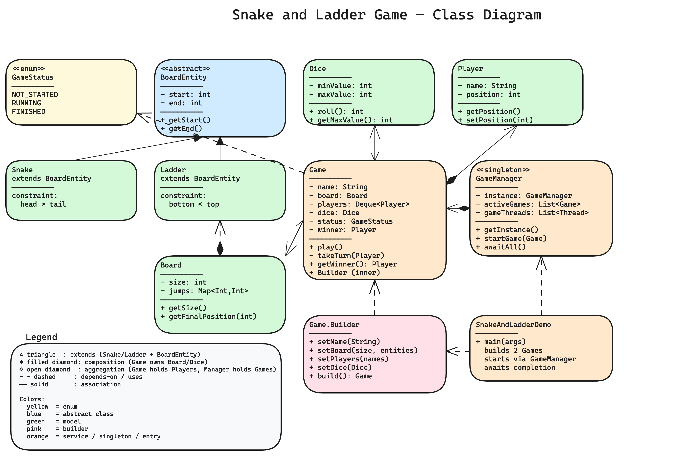
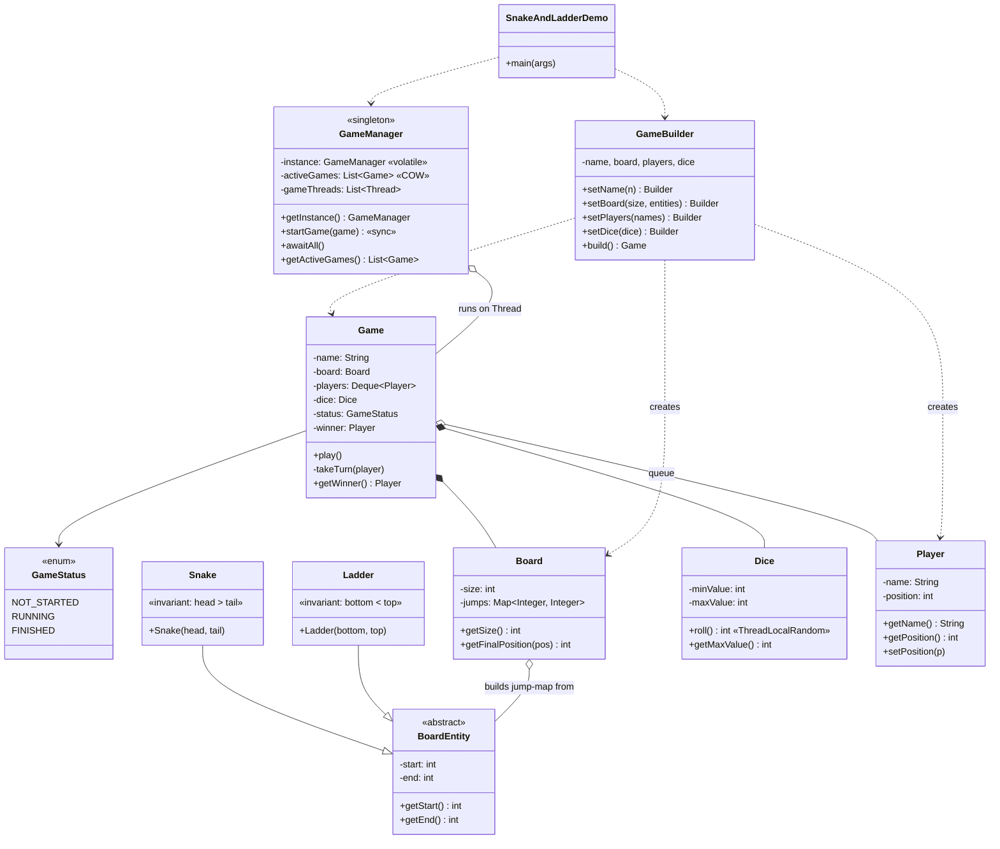

# Snake and Ladder Game — Low Level Design

A classic Snake and Ladder game with a fixed-size board, configurable snakes/ladders, multiple players, and support for **multiple concurrent game sessions** running on independent threads.

## Problem Statement

- Game is played on a board with numbered cells (default 100).
- Board has a predefined set of snakes and ladders connecting cells.
- 2+ players take turns rolling a dice (default 1–6) and move forward.
- Landing on a snake head slides the player down to its tail.
- Landing on a ladder bottom climbs the player up to its top.
- Rolling the max face value grants another turn.
- A player must land **exactly** on the final cell to win; an over-shot is a skipped turn.
- The first player to reach the final cell wins.
- The system supports multiple sessions running concurrently for different player groups.

## High-Level Flow

```
┌──────────────────────────────────────────────────────────┐
│ Demo: build games via Game.Builder                       │
│   • boardSize + snakes/ladders                           │
│   • player names                                         │
│   • dice (min, max)                                      │
└──────────────┬───────────────────────────────────────────┘
               │
               ▼
┌──────────────────────────────────────────────────────────┐
│ GameManager.startGame(game)  → spawns a Thread per game  │
└──────────────┬───────────────────────────────────────────┘
               │
               ▼
┌──────────────────────────────────────────────────────────┐
│ Game.play()  (loop until FINISHED)                       │
│                                                          │
│   poll next player from queue                            │
│        │                                                 │
│        ▼                                                 │
│   roll dice ──► compute nextPosition = pos + roll        │
│        │                                                 │
│        ├─ nextPosition >  size  → over-shoot, skip turn  │
│        ├─ nextPosition == size  → WINNER, status=FINISHED│
│        └─ else: finalPos = board.getFinalPosition(next)  │
│                  • finalPos > next  ⇒ Ladder climb       │
│                  • finalPos < next  ⇒ Snake bite         │
│                  • finalPos == next ⇒ normal move        │
│                                                          │
│   if roll == dice.maxValue → same player rolls again     │
│   else → push player back to queue                       │
└──────────────────────────────────────────────────────────┘
```

## Class Diagram

> **Interactive:** Open [`class-diagram.excalidraw`](class-diagram.excalidraw) at [excalidraw.com](https://excalidraw.com) (File → Open) for the full interactive diagram.



<details>
<summary>Mermaid Class Diagram (click to expand)</summary>


</details>

---

## How to Approach This Problem (Smallest → Biggest)

### Layer 1: The smallest brick — *what is a "snake" or "ladder"?*

A snake and a ladder are the **same thing**: a directed jump from one cell to another. A snake is "head 17 → tail 7", a ladder is "bottom 3 → top 38". Only the **direction** (down vs up) and a sanity invariant (`head > tail`, `bottom < top`) differ.

That single observation kills the duplication trap most candidates fall into: writing two parallel `Map<Integer,Integer>` (`snakes`, `ladders`) and checking both. Instead — one abstract `BoardEntity(start, end)`, two subclasses that only enforce the invariant in their constructor. The `Board` then dumps both into **one** `Map<start, end>`, and at lookup time the *direction* is derived (`finalPos > pos` ⇒ ladder, `finalPos < pos` ⇒ snake). One data structure, zero branches.

This is the Liskov bit: anywhere code holds a `BoardEntity`, it doesn't care whether it's a snake or a ladder.

### Layer 2: The Board — a jump table, nothing more

`Board` looks like it should be a 100-element array. It isn't — it's a `Map<Integer, Integer>` of cells that *do something* (≈8 entries for a typical board). The other 92 cells aren't represented at all; `getFinalPosition(pos)` returns the position unchanged via `getOrDefault(pos, pos)`.

The only validation worth doing at construction time:
- positions are within `(1, size-1)` — a snake on cell 0 or 100 makes no sense,
- no two entities share a start cell — two snakes both starting at 17 is a data bug, not "the second one wins silently".

Catch these in the constructor and the rest of the system never needs to defend against them.

### Layer 3: The Dice — why it's a class at all

A 6-sided die feels like it should be a hardcoded `1 + random.nextInt(6)` inside `Game`. Making it a class buys three things you'll be asked about:

1. **Configurable range** — a 12-sided die for a bigger board is `new Dice(1, 12)`, not a rewrite.
2. **The "extra turn on max" rule keys off `dice.getMaxValue()`**, not a literal `6`. Change the die, the rule still works.
3. **Testability** — substitute a fake `Dice` that returns a scripted sequence and you can deterministic-test the entire game loop. Hardcoded `Math.random()` calls inside `Game` would make that impossible.

`Math.random()` was deliberately swapped for `ThreadLocalRandom` — when several game sessions roll on different threads concurrently, the global `Random` becomes a contention point.

### Layer 4: Turn rules — three independent decisions in one method

`Game.takeTurn` looks short but encodes three orthogonal rules. Pull them apart in your head before writing code:

1. **Over-shoot rule** — `pos + roll > size` ⇒ turn is forfeit. (Some variants instead "bounce back" — call this out as a swap point.)
2. **Exact-landing wins** — `pos + roll == size` is the *only* terminal state. Setting position and status here, then `return`, means no further snake/ladder lookup on the winning cell. (If cell `size` itself had a ladder, we never trigger it — winning beats anything else.)
3. **Snake-or-ladder lookup happens after the move, on the landed cell** — never on the *starting* cell. Otherwise a player parked at a ladder bottom would never leave it.

The "roll-again on max" rule is **outside** the move logic — it's a loop on `takeTurn` itself. Two important details there:
- It's a **`while` loop, not recursion** — three sixes in a row is fine; thirty sixes shouldn't blow the stack.
- The re-roll only happens if `status == RUNNING` after the move — winning on a six does *not* trigger another turn.

### Layer 5: Turn order — Queue vs List

The turn order is a **rotating queue**, not an indexed list:

```
poll() → take turn → if game still running, add() back to tail
```

`Deque<Player>` makes "next player" O(1) and "put me at the end" O(1). An `ArrayList` + `(idx + 1) % size` also works, but the queue makes the "skip / repeat" rules cleaner — `takeTurn` returns without re-adding when something special happens (right now, only on win).

Worth noting: when a player rolls max and gets another turn, we *don't* poll/add — we just call `takeTurn` again on the same player inside the same iteration. That's why max-rolls keep the queue undisturbed.

### Layer 6: Builder — Game has 4 required collaborators

`Game` needs board (size + entities), players, dice, and a session name. A 4-argument constructor with two `List`s next to each other is a foot-gun. `Game.Builder` makes the call site self-documenting:

```java
new Game.Builder()
    .setName("Session-A")
    .setBoard(100, boardEntities)
    .setPlayers(List.of("Alice", "Bob"))
    .setDice(new Dice(1, 6))
    .build();
```

The Builder is the single chokepoint where presence-of-required-fields is checked (`build()` throws if any are null). It also hides the fact that `Player` instances are created from raw names — callers pass `List<String>`, not `List<Player>`, because the caller shouldn't have to know about the `Player` class to start a game.

### Layer 7: Concurrent sessions — *the* requirement people miss

The problem statement says "support multiple game sessions concurrently". This is the interview-grade requirement, and it shapes three decisions:

1. **One thread per `Game`** — `GameManager.startGame(game)` spawns `new Thread(game::play)`. Sessions run in true parallel, not interleaved in a single loop.
2. **Per-game state is fully isolated** — each `Game` owns its own `Board`, `Dice`, `Deque<Player>`. No shared mutable state across sessions ⇒ `Game.play()` itself needs **zero synchronization**. This is the cheapest concurrency model: don't share anything.
3. **The only thing actually shared is the dice's random source** — that's why `Dice.roll()` uses `ThreadLocalRandom`, not `Math.random()` (which sits on a single contended `Random` inside the JDK).

`GameManager` is a `volatile` + double-checked-locking singleton. The list-of-games and list-of-threads updates inside `startGame` are wrapped in `synchronized` to keep them atomic together, and `activeGames` is a `CopyOnWriteArrayList` so `getActiveGames()` readers don't need to lock at all. `awaitAll()` exists because the main thread otherwise exits before sessions finish.

### Layer 8: The Demo — what to actually print

The demo runs two sessions in parallel; both write to `System.out`. To keep their output legible, every line is prefixed `[<session-name>]` — that's the only thing `Game.name` is for. In a real system this prefix would be a per-session logger; here it's the minimum that makes the interleaved output readable in a single terminal.

### Interview summary (say this verbatim)

> "A snake and a ladder are the same thing — a directed jump — so one abstract `BoardEntity` with two subclasses, and the `Board` is a single `Map<start, end>`. Direction is derived at lookup time. `Game.play()` is a rotating-queue loop: poll a player, take a turn, push them back unless they won. `takeTurn` encodes three independent rules — over-shoot forfeits, exact-landing wins, otherwise look up the jump map. The 'roll again on max' rule is a `while` loop *around* the move, not recursion, and keys off `dice.getMaxValue()` so it works for any die size. The dice is a class (not inline `Math.random()`) so we can swap die sizes and write deterministic tests. The interesting requirement is concurrent sessions — `GameManager` is a singleton that spawns one thread per `Game`, but the sessions share no mutable state, so `Game.play()` needs zero locks. The only thread-safety touch is using `ThreadLocalRandom` inside `Dice` to avoid contention on the JDK's global `Random`. `Game.Builder` exists because Game has four required collaborators and a 4-arg constructor is unreadable."

---

## Project Structure

```
snake-and-ladder/
├── pom.xml
├── README.md
├── class-diagram.excalidraw
└── src/main/
    ├── java/com/snakeandladder/
    │   ├── SnakeAndLadderDemo.java     # main() — runs two concurrent sessions
    │   ├── Game.java                   # single session + inner Builder
    │   ├── GameManager.java            # singleton, manages threaded sessions
    │   ├── enums/
    │   │   └── GameStatus.java         # NOT_STARTED / RUNNING / FINISHED
    │   └── model/
    │       ├── BoardEntity.java        # abstract base for snakes & ladders
    │       ├── Snake.java              # head > tail invariant
    │       ├── Ladder.java             # bottom < top invariant
    │       ├── Board.java              # size + jump-map (start → end)
    │       ├── Dice.java               # configurable min/max, thread-safe roll
    │       └── Player.java             # name + current position
    └── resources/
        └── img.png                     # exported class diagram (3x)
```

## Design Patterns Used

| Pattern | Where | Why |
|---------|-------|-----|
| **Singleton** | `GameManager` (double-checked locking with `volatile`) | One process-wide owner of all active sessions and their threads |
| **Builder** | `Game.Builder` | `Game` needs board, players, dice, name — Builder keeps construction readable and forces required fields at `build()` |
| **Template via inheritance** | `BoardEntity` → `Snake`, `Ladder` | Shared `(start, end)` data + invariant checks pushed into subclasses |
| **Strategy-lite (via Dice)** | `Dice(min, max)` injected into `Game` | Swap dice ranges or implementations (loaded dice for tests) without touching `Game` |

> Note: We did **not** introduce a full Strategy interface for movement rules because the requirements are fixed. If new rules emerged (e.g., "roll-of-6 grants extra turn", "exact-landing optional"), a `MovementStrategy` would be the natural next step — currently those rules live inside `Game.takeTurn`.

## SOLID Principles Applied

| Principle | How it's applied |
|-----------|------------------|
| **SRP** | `Board` only resolves jump lookups, `Dice` only produces a roll, `Player` only tracks position, `Game` only drives the turn loop, `GameManager` only manages session lifecycle |
| **OCP** | New `BoardEntity` subtypes (e.g., a teleporter) can be added without touching `Board` or `Game` — both work on the abstraction. New dice variants (weighted, multi-die) extend by replacing `Dice` |
| **LSP** | `Snake` and `Ladder` are fully substitutable for `BoardEntity` — `Board` treats them uniformly via `getStart()`/`getEnd()` |
| **ISP** | No god interfaces — `Dice` exposes only `roll()` + `getMaxValue()`; `Board` exposes only `getSize()` + `getFinalPosition()` |
| **DIP** | `Game` depends on the abstract `BoardEntity`, not on `Snake`/`Ladder` concretely; `Board` is built from a `List<BoardEntity>` |

## Thread Safety

- **Multiple sessions run in parallel** — each `Game` runs on its own thread launched by `GameManager.startGame()`.
- **Per-game state is isolated**: each `Game` has its own `Board`, `Dice`, and `Deque<Player>` — no shared mutable state across sessions, so `Game.play()` does not need synchronization.
- `Dice.roll()` uses `ThreadLocalRandom` instead of `Math.random()` to avoid contention on the global `Random` instance when many sessions roll concurrently.
- `GameManager`:
  - `instance` is `volatile` + double-checked locking → safe lazy singleton.
  - `activeGames` is a `CopyOnWriteArrayList` — `startGame()` is also `synchronized` to keep the games-list and threads-list updates atomic together.
  - `awaitAll()` joins every spawned thread before returning so callers see all winners.

## Extensibility

- **New board entities** (e.g., teleporters, trampolines): subclass `BoardEntity`, add to the list — `Board` and `Game` need no changes.
- **Different dice rules**: pass a different `Dice(min, max)` — e.g., `Dice(1, 12)` for a 12-sided die — the "roll again on max" rule keys off `dice.getMaxValue()`, not a hardcoded 6.
- **Different board sizes**: `Game.Builder.setBoard(size, entities)` accepts any size; the "exact landing" rule keys off `board.getSize()`.
- **Movement rules** (no extra turn on max, no exact landing, etc.): extract `Game.takeTurn` into a `MovementStrategy` interface — currently inlined because requirements are fixed.
- **Persistent sessions / multiplayer over network**: `GameManager` already exposes `getActiveGames()` and per-session names — wire those to a REST/WebSocket layer without touching `Game`.

## Sample Run

```
[Session-A] Game started with 3 players.
[Session-A] Alice's turn. Rolled 3.
[Session-A] Alice climbed a ladder from 3 to 38.
[Session-B] Game started with 2 players.
[Session-B] Dave's turn. Rolled 6.
[Session-B] Dave moved from 0 to 6.
[Session-B] Dave rolled max and gets another turn!
...
[Session-A] Charlie reached 100 and won!
[Session-A] Game Finished!
[Session-A] Winner: Charlie

All sessions complete.
  Session-A -> winner: Charlie
  Session-B -> winner: Eve
```

## Common Interview Questions (Rapid Fire)

### Concurrency questions (asked whenever your code uses `volatile`, `synchronized`, `ThreadLocal`, or a `CopyOnWrite*` collection)

> Interviewers treat these keywords as an invitation. The moment they spot `ThreadLocalRandom.current()` in `Dice.roll()`, a `volatile GameManager instance`, a `synchronized startGame()`, and a `CopyOnWriteArrayList activeGames` they ask *"why that and not the alternative?"* See **[CONCURRENCY-GUIDE.md](../CONCURRENCY-GUIDE.md)** for full explanations; the rapid-fire versions:

### Q1. What is `ThreadLocal` (and `ThreadLocalRandom`), and why is it used in `Dice.roll()`?

`ThreadLocal` gives each thread its **own private copy** of a value — there is no shared state, so there is nothing to lock. `Dice.roll()` calls `ThreadLocalRandom.current().nextInt(...)`, which hands every game thread its **own** `Random`-like generator. With one thread per `Game`, each session rolls against an isolated RNG and never touches another session's. The win over `synchronized` is the key point: instead of *guarding* one shared object, you *eliminate sharing*, so threads never contend at all.

### Q2. Why `ThreadLocalRandom` instead of `Math.random()` or a shared `Random`?

`Math.random()` and a single shared `Random` are thread-**safe** but **contended** — every thread fights over one internal seed via a CAS/lock, which serializes rolls under load. `ThreadLocalRandom` keeps a per-thread seed, so concurrent sessions roll in true parallel with zero coordination. Right when each thread can have its own RNG (dice rolls don't need to agree on a value); wrong if threads had to draw from one shared, reproducible sequence.

### Q3. Why is `GameManager.startGame()` `synchronized`?

`startGame()` does a multi-step read-modify-write — `activeGames.add(game)`, build a `Thread`, `gameThreads.add(thread)`, then `thread.start()` — and those steps must happen as **one atomic unit**. `gameThreads` is a plain `ArrayList`, so two callers starting games at once could interleave and corrupt it. `synchronized` serializes the whole method so the two lists stay consistent with each other. A finer-grained alternative (locking each list separately) wouldn't keep the *pair* of updates atomic.

### Q4. Why is the singleton `instance` field `volatile`?

`instance` is read on the hot path **without** a lock (double-checked locking), so it must be `volatile` to guarantee **visibility** and to forbid reordering: a writer assigning `instance = new GameManager()` must publish the **fully-constructed** object, never a half-initialized reference. Without `volatile`, another thread could see a non-null but partially-built instance. The `synchronized (GameManager.class)` block still does the actual mutual exclusion on first init; `volatile` is what makes the unlocked read safe.

### Q5. Why is `activeGames` a `CopyOnWriteArrayList`?

`activeGames` is **read-heavy, write-rare** — games are added occasionally in `startGame()`, but `getActiveGames()` may iterate at any time from other threads. `CopyOnWriteArrayList` lets readers take a lock-free **snapshot** that never throws `ConcurrentModificationException` while a write swaps in a fresh copy underneath. Chosen over a `synchronized` list (readers would block) or `Collections.synchronizedList` (iteration still needs external locking). The trade-off — every write copies the whole array — is fine here because writes are infrequent.
