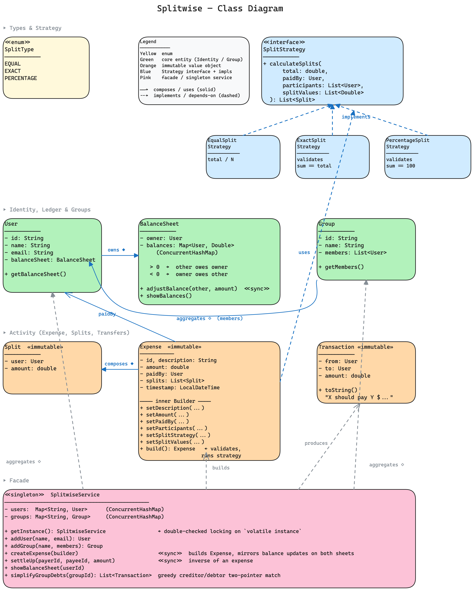
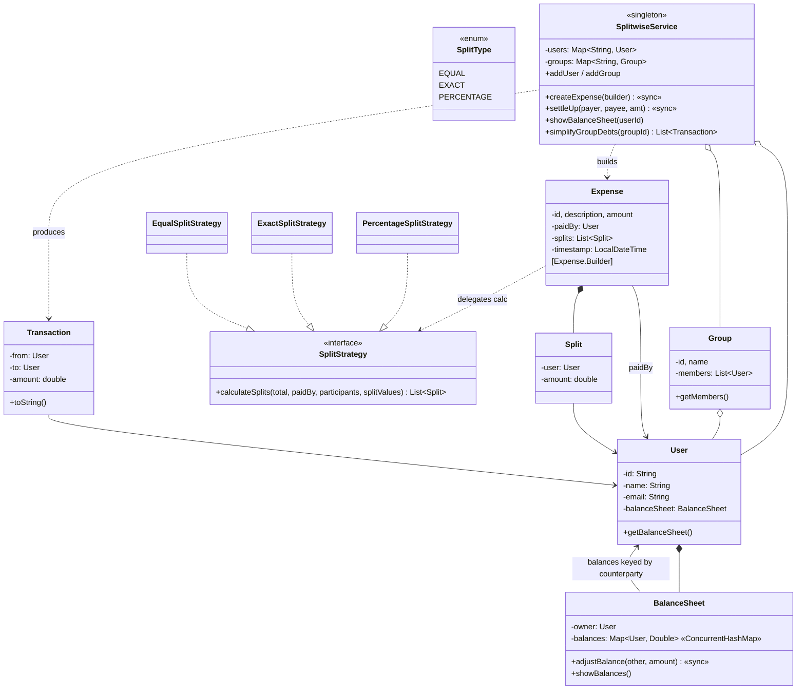

# Splitwise — Low Level Design

An expense-sharing system that lets friends split bills (equal / exact / percentage), tracks who owes whom, and **simplifies the resulting tangle of debts into the minimum set of cash transfers**.

---

## Problem Statement

Design a system that lets users share expenses with friends and groups. The system must support:

- **Account Management** — create users with name and email
- **Group Operations** — form groups (trip, roommates, office) with a set of members
- **Expense Tracking** — record an expense: who paid, how much, who participated, how to split
- **Multiple Split Methods** — three first-class strategies:
  - **Equal** — divide the total evenly across participants
  - **Exact** — caller specifies the precise amount each participant owes
  - **Percentage** — caller specifies each participant's percentage share (sum must be 100)
- **Balance Management** — every user maintains a sparse ledger of "what I owe / what I'm owed" per counterparty
- **Settlement** — users can pay each other back, partially or in full
- **Debt Simplification** — given a group's tangled balances, output the **minimum number of transactions** that net everyone to zero
- **Concurrency** — many users may create expenses or settle up simultaneously; balance sheets must stay consistent

---

## High-Level Flow

```
Admin / setup                                         User creates an expense
       │                                                       │
       ▼                                                       ▼
   [SplitwiseService]  ◄────── singleton facade ──────►  [SplitwiseService]
       │                                                       │
       │ addUser(name, email)                                  │ createExpense(builder)
       │ addGroup(name, members)                               │   description, amount, paidBy,
       │                                                       │   participants, splitStrategy,
       ▼                                                       │   [splitValues]
   users / groups (ConcurrentHashMap)                          ▼
                                              ┌─► Expense.Builder.build()
                                              │       splitStrategy.calculateSplits(...)
                                              │         ── EQUAL: total / N per head
                                              │         ── EXACT: validates sum == total
                                              │         ── PERCENTAGE: validates sum == 100
                                              │
                                              │  for each Split (participant, amount):
                                              │     if participant != paidBy:
                                              │        paidBy.sheet[participant]     += +amount
                                              │        participant.sheet[paidBy]     += -amount
                                              │     (synchronized — two-sided update atomic)
                                              │
                                              └─► both ledgers in sync

Settle up                                             Simplify group debts
       │                                                       │
       ▼                                                       ▼
   settleUp(payer, payee, amount)                  simplifyGroupDebts(groupId)
       payee.sheet[payer] -= amount                 1. compute each member's NET balance
       payer.sheet[payee] += amount                    (only against other group members)
       (the reverse of an expense)                  2. split into creditors / debtors,
                                                       sort by magnitude
                                                    3. two-pointer greedy:
                                                       match biggest creditor with
                                                       biggest debtor, settle
                                                       min(|c|, |d|), advance whichever
                                                       hits ~0
                                                    → List<Transaction>  (≤ N-1 transfers)
```

---

## Class Diagram

> **Interactive:** Open [`class-diagram.excalidraw`](class-diagram.excalidraw) at [excalidraw.com](https://excalidraw.com) (File → Open) for the full interactive diagram.



<details>
<summary>Mermaid Class Diagram (click to expand)</summary>


</details>

---

## How to Approach This Problem (Smallest → Biggest)

### Layer 1: The core ambiguity — *who owes whom, and where do we store it?*

Three plausible places to store balances:

1. **Global ledger** — one giant `Map<(UserA, UserB), Double>`. Simple but hard to render per-user views without scanning the whole map.
2. **Inside each `Expense`** — recompute balances on every read. Correct but pathologically slow once a user has thousands of expenses.
3. **Per-user `BalanceSheet`** — each user owns a sparse `Map<User, Double>` of net balances against counterparties. Reads are O(counterparties); writes touch exactly two sheets per expense.

We pick #3. The price is the **two-sided update invariant**: every expense must mutate *both* sides' sheets in mirror. If you only update one, the two users disagree about who owes what — a class of "ledger drift" bug that's hell to diagnose later. `SplitwiseService.createExpense` is `synchronized` precisely to make that mirrored pair atomic.

### Layer 2: Sign convention — pick one and stick to it

`balanceSheet.balances.get(other) > 0` means **the owner is owed money by `other`**. Negative means **the owner owes `other`**. Once you commit to this:

- `adjustBalance(other, +amount)` on `paidBy.sheet` says *other owes paidBy more*
- `adjustBalance(paidBy, -amount)` on `other.sheet` says *the negative side grew* — i.e. other owes paidBy more

Two views, one truth. Settling up is the inverse: payer's side moves toward 0, payee's side also moves toward 0 (symmetric reductions).

### Layer 3: The three split strategies

All three return `List<Split>`, where each `Split = (user, amount)`. The strategies differ only in **how the amount column is computed and validated**:

| Strategy | Caller supplies | Validates | Distribution |
|----------|----------------|-----------|--------------|
| **EQUAL** | nothing extra | participants.size > 0 | total ÷ N per head |
| **EXACT** | `List<Double>` amounts | sum(amounts) ≈ total | each amount as-is |
| **PERCENTAGE** | `List<Double>` percentages | sum(pcts) ≈ 100 | total × pct ÷ 100 per head |

The "≈" is a deliberate $0.01 tolerance — exact `==` on doubles rejects valid splits like `33.33 + 33.33 + 33.34 == 100.00`. Each strategy self-validates (SRP) so `SplitwiseService` never grows a switch on split type. Add a fourth strategy (e.g. **SHARE** — weighted by integer "shares" like "Alice 2, Bob 3, Charlie 1") and the only new code is a new `SplitStrategy` impl. That's OCP earning its rent.

### Layer 4: Builder for `Expense`

`Expense` has 7 inputs (id, description, amount, paidBy, participants, splitStrategy, splitValues). Several are same-typed (description vs paidBy.name as Strings if you string-id them; amount vs splitValues entries as doubles). A 7-arg constructor is unreadable and easy to mis-order.

The Builder gives:

```java
new Expense.Builder()
    .setDescription("Dinner")
    .setAmount(1000)
    .setPaidBy(alice)
    .setParticipants(List.of(alice, bob, charlie, david))
    .setSplitStrategy(new EqualSplitStrategy())
    .build();    // ← one chokepoint for validation + split computation
```

`build()` is the *only* place an `Expense` becomes valid — splits are computed exactly once, then frozen. The Builder is throwaway; the resulting `Expense` is immutable.

### Layer 5: Debt simplification — the algorithm interviewers actually want to see

Naive ledger of N people can have up to N(N-1)/2 outstanding pair-wise debts. Most of those collapse: if A owes B $10 and B owes C $10, A owes C $10 and B is square. Generalising:

```
1. For each member: net intra-group balance = Σ balance[other]  for other in group
2. Bucket: creditors (net > 0), debtors (net < 0). Sort by magnitude (biggest first).
3. Two-pointer greedy:
       while both buckets non-empty:
           x = min(creditor.amount, |debtor.amount|)
           emit Transaction(debtor → creditor, x)
           creditor -= x;  debtor += x
           if creditor ≈ 0: advance creditor pointer
           if debtor   ≈ 0: advance debtor pointer
```

Each iteration retires at least one user, so the loop runs ≤ N times → at most N-1 transactions, which is provably the **minimum** when no balance configuration is "degenerate" (in pathological cases — like a balanced cycle — you can do strictly better with subset-sum, which is NP-hard; the greedy is the standard interview answer).

Two FP-noise guards that matter in practice:

- Filter creditors/debtors to `|balance| > 0.01` up front — otherwise you carry users with $0.00000001 through the entire loop.
- Compare against the same epsilon when deciding whether a side hit zero — without it the loop can spin on residue values like `1e-12`.

### Layer 6: Why settleUp is the *inverse of an expense*, not a new entity type

A settlement is just "payer gives payee cash; payer's debt shrinks". That's the same shape as an expense — touch two balance sheets symmetrically — with the signs flipped. We don't model `Settlement` as a separate class; we just call `adjustBalance` twice with the inverse signs. Less code, fewer entities, same correctness.

(If you needed an audit trail of every settlement for compliance, you'd persist `Transaction` records to a list inside the service. Easy extension.)

### Layer 7: Concurrency — what's actually under contention?

- **`users`, `groups`** maps — `ConcurrentHashMap`. Many threads can register / look up at once.
- **`BalanceSheet.balances`** — `ConcurrentHashMap` + `merge` is atomic per entry.
- **`createExpense` / `settleUp`** — `synchronized` on the service. Why coarse-grained here? Because the invariant we're protecting is a *pair* of writes across two sheets. ConcurrentHashMap.merge is atomic per entry, but the pair isn't. Two concurrent expenses involving the same (paidBy, participant) pair could interleave their mirrored updates and produce a sheet pair that doesn't agree.

A finer-grained alternative (per-pair lock keyed by `(userA.id, userB.id)` after sorting the IDs) gives more parallelism. For interview level, "service-level synchronized + ConcurrentHashMap inside sheets" is the right answer with a 1-sentence note about how you'd shard later.

### Interview summary (say this verbatim)

> "Users own their own BalanceSheet — a sparse Map of net balances per counterparty. The trick is the **two-sided update invariant**: every expense and settlement mutates exactly two sheets in mirror with opposite signs, inside a `synchronized` block on the service, so the two sides never disagree. Splitting is a Strategy — Equal, Exact, Percentage — each self-validating, so the service has no `switch` over types and a new split rule means one new class. Expense uses a Builder because it has seven inputs and several are same-typed. The headline algorithm is the greedy debt simplification: compute each group member's net balance, sort creditors descending and debtors ascending, two-pointer match biggest with biggest, settle the min each round. That's at most N-1 transactions and is the canonical interview answer. Concurrency: ConcurrentHashMap for the catalogs and sheets, plus service-level `synchronized` to keep the paired writes atomic."

---

## Project Structure

```
splitwise/
├── pom.xml
├── README.md
├── class-diagram.excalidraw
└── src/main/java/com/splitwise/
    ├── SplitwiseDemo.java                  # Entry point — all three split strategies + simplification
    ├── SplitwiseService.java               # Singleton facade — catalogs, expense flow, settle, simplify
    │
    ├── model/                              # Domain entities (all immutable except BalanceSheet)
    │   ├── User.java                       # Identity + owns one BalanceSheet
    │   ├── Group.java                      # Named member list (scoping for simplification)
    │   ├── Expense.java                    # Frozen line items; static Builder inside
    │   ├── Split.java                      # (user, amount) value object
    │   ├── Transaction.java                # Settle-up or suggested transfer record
    │   └── BalanceSheet.java               # Per-user sparse ledger; synchronized adjustments
    │
    ├── enums/
    │   └── SplitType.java                  # EQUAL / EXACT / PERCENTAGE
    │
    └── strategy/
        ├── SplitStrategy.java              # interface: calculateSplits(...)
        ├── EqualSplitStrategy.java         # total ÷ N
        ├── ExactSplitStrategy.java         # validates sum == total
        └── PercentageSplitStrategy.java    # validates sum == 100
```

---

## Design Patterns Used

| Pattern | Where | Why |
|---------|-------|-----|
| **Singleton** | `SplitwiseService` | One global view of users / groups / balances — double-checked locking with `volatile` |
| **Builder** | `Expense.Builder` | 7 inputs, several same-typed, single chokepoint to validate + trigger split computation |
| **Strategy** | `SplitStrategy` ← `Equal` / `Exact` / `Percentage` | Swappable splitting rules; new rule = new class, no edits to `SplitwiseService` or `Expense` |
| **Facade** | `SplitwiseService` | Hides the dance of "build expense → run strategy → mirror-update two ledgers" behind one call |
| **Immutable Value Object** | `Split`, `Transaction`, `Expense` | Once computed, line items don't drift; safe to share across threads without locks |

---

## SOLID Principles Applied

| Principle | How |
|-----------|-----|
| **SRP** | `User` holds identity; `BalanceSheet` holds money relationships; `Expense` records "what happened"; `SplitStrategy` does math; `SplitwiseService` orchestrates. None of them do each other's job |
| **OCP** | Adding a new split type (e.g., SHARE-weighted) = new `SplitStrategy` impl. Adding a settlement-audit log = new field in the service. No existing class needs editing |
| **LSP** | Anywhere `SplitStrategy` is expected, any of the three concrete impls works — the Expense Builder doesn't know which one it has |
| **ISP** | `SplitStrategy.calculateSplits` is a single method. No god interface with optional methods per split type |
| **DIP** | `Expense` depends on the `SplitStrategy` interface, not on any concrete strategy. The Builder accepts whichever the caller injects |

---

## Thread Safety

- `SplitwiseService.users` / `groups` are `ConcurrentHashMap` — safe concurrent reads + registrations
- `BalanceSheet.balances` is `ConcurrentHashMap` — `merge` is atomic per entry
- `BalanceSheet.adjustBalance` is `synchronized` — defensive when two threads target the same key
- `SplitwiseService.createExpense` and `settleUp` are `synchronized` — protects the **two-sided update invariant**: the paired writes across two sheets must not interleave with another paired write touching the same pair of users
- All immutable value objects (`Split`, `Transaction`, `Expense`, `User`, `Group` snapshots) are inherently safe to share

The chosen granularity is service-level synchronization for *mutating* operations and lock-free `ConcurrentHashMap` for *reads*. This is intentional — reads (balance views, simplification queries) vastly outnumber writes in real Splitwise usage, and the two-sided write needs a single critical section anyway.

---

## Extensibility

- **New split type** (SHARE-weighted, ITEMIZED) → new `SplitStrategy` impl
- **Currency support** → add `Currency` to `Expense` and `Split`; `BalanceSheet.balances` becomes `Map<User, Map<Currency, Double>>`
- **Group-scoped balances** (vs. global) → introduce a `GroupBalanceSheet` per `(group, user)` pair so personal balances and group balances are tracked separately
- **Settlement audit log** → append every `settleUp` call into a per-user `List<Transaction>` for history view
- **Expense edits / deletes** → wrap each mutation as a `LedgerOperation` and apply/reverse symmetrically; balance sheet becomes a reducer over the operation log
- **Subset-sum optimal simplification** (strictly fewer than N-1 transactions when balances form cancellable cycles) → replace the greedy in `simplifyGroupDebts` with the NP-hard subset-sum variant, behind a flag
- **Concurrent fine-grained locking** → replace the service `synchronized` with a per-pair lock keyed by `(min(idA,idB), max(idA,idB))` so unrelated expenses don't block each other
- **Notifications** (e.g. "you've been added to a group", "X paid for Y") → introduce an Observer hierarchy on `User` and notify on every `createExpense` / `settleUp`
