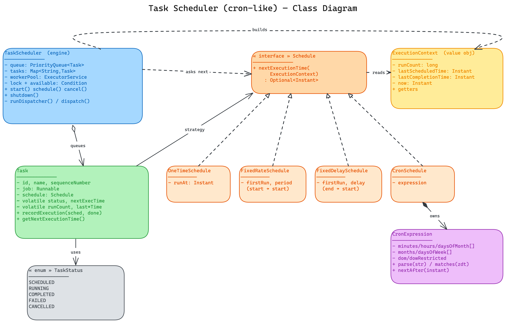
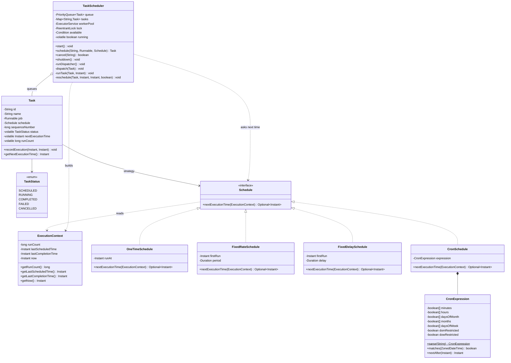

# Task Scheduler (cron-like) — Low Level Design

An in-memory scheduler that runs jobs once, at a fixed rate, after a fixed delay, or on a cron expression — built around a priority queue, a single dispatcher thread, and a worker pool (the same architecture as the JDK's `ScheduledThreadPoolExecutor`, written out explicitly).

## Problem Statement

Build a scheduler that can:

- Accept a unit of work (a `Runnable`) together with a **schedule** describing when it should run.
- Support multiple cadences: **one-time**, **fixed-rate** (start-to-start), **fixed-delay** (end-to-start), and **cron** (minute-resolution, 5 fields).
- Fire each task **as close as possible to its due time**, running due jobs **concurrently** on a worker pool.
- Let a newly submitted task that is due *sooner* than everything else **pre-empt** the wait.
- Support **cancellation** and **clean shutdown**.
- Be **thread-safe** under concurrent submission, cancellation, and execution.

Out of scope (in-memory LLD): persistence/durability across restarts, distributed coordination, misfire policies beyond the simple catch-up behaviour described below.

## High-Level Flow

```
 submit(job, schedule)
        │
        ▼
 schedule.nextExecutionTime(ctx=runCount 0)  ──► empty? ──► mark COMPLETED (never runs)
        │ present
        ▼
 set nextExecutionTime, push into PriorityQueue (min-heap by fire time)   ── signalAll ─┐
        │                                                                                │
        ▼                                                                                │
 ┌─────────────────────────  DISPATCHER THREAD (single)  ───────────────────────────┐   │
 │  loop:                                                                            │   │
 │    queue empty?  ── await() ──────────────────────────────────────────────◄──────┼───┘ (wakes on new task)
 │    peek head                                                                      │
 │    head due now?                                                                  │
 │      yes → poll, mark RUNNING, workerPool.submit(run)                             │
 │      no  → await(timeUntilHead)   ◄── wakes early if an earlier task is added ────┘
 └───────────────────────────────────────────────────────────────────────────────────┘
        │ submit
        ▼
 ┌──────────── WORKER POOL (N threads) ────────────┐
 │  run job  →  reschedule(scheduledTime, now)      │
 │     schedule.nextExecutionTime(ctx)              │
 │        present → set next, push back to queue ───┼──► (signalAll, dispatcher re-evaluates)
 │        empty   → mark COMPLETED / FAILED         │
 └──────────────────────────────────────────────────┘
```

## Task Lifecycle (`TaskStatus`)

The five states are **not** a straight line — they form a loop with three exit doors. A recurring task spends its whole life cycling `SCHEDULED ⇄ RUNNING`; it only reaches a terminal state when its `Schedule` returns empty (or it's cancelled).

```
          ┌─────────────────────────────┐
          │                             │
          ▼                             │
     SCHEDULED ───────► RUNNING ────────┘   (recurring: go back to SCHEDULED)
          │                 │
          │                 ├──► COMPLETED   (schedule returned empty, no error)
          │                 ├──► FAILED      (schedule returned empty, after a throw)
          │                 │
          └────────────────►└──► CANCELLED   (caller cancelled it)
```

- **Transient (the loop):** `SCHEDULED`, `RUNNING` — a recurring task oscillates between these forever.
- **Terminal (exit doors):** `COMPLETED`, `FAILED`, `CANCELLED` — the task is retired and never runs again.
- `COMPLETED` vs `FAILED` records *how* the last run ended (clean vs threw); `CANCELLED` is reachable from **both** transient states — even mid-run — which is exactly what forces the two-phase cancellation in the engine (remove from the queue if still there, else a status flag makes the worker skip the requeue).

## Class Diagram

[Interactive Excalidraw source](class-diagram.excalidraw)



<details>
<summary>Mermaid Class Diagram (click to expand)</summary>



</details>

## How to Approach This Problem (Smallest → Biggest)

### Layer 1: "Recurring is just one-time that keeps producing a next time"
The smallest insight collapses four seemingly different features into one. A one-time task, a fixed-rate task, and a cron job are not three engines — they are one engine asking a single question after every run: *"given what just happened, when (if ever) do I run next?"* That question is the **`Schedule`** interface: `Optional<Instant> nextExecutionTime(ctx)`. `Optional.empty()` means "retire me". With this, the scheduler core never contains an `if (oneTime) … else if (cron) …` branch — it just loops "run, ask for next, requeue if present". Everything else is built on this one method.

### Layer 2: The fire time belongs on the task, because the queue is ordered by it
At any moment the only task that matters is the one due soonest. That screams **min-heap** (`PriorityQueue`) keyed by fire time: O(1) to peek the soonest, O(log n) to insert/remove. For the heap to order tasks, each `Task` must *carry* its own `nextExecutionTime` — so the scheduling state (next time, status, run count) lives on the task, while identity/job/schedule stay immutable. A tie-breaker `sequenceNumber` makes two tasks due at the same instant fire in submission order (FIFO) instead of arbitrarily.

### Layer 3: A dispatcher must *sleep until due* — but wake when something sooner arrives
The naïve loop `peek; Thread.sleep(untilDue); run` has a fatal bug: if a new task due in 1s is submitted while the dispatcher sleeps for 60s, it fires 59s late. The fix is a **`ReentrantLock` + `Condition`**: the dispatcher does a *timed* `available.await(delay)`, and every queue mutation (`schedule`, `cancel`, `reschedule`) calls `signalAll()`. So "a sooner task arrived" wakes the dispatcher to recompute the nearest deadline. This is precisely the `DelayQueue` / `ScheduledThreadPoolExecutor` leader-wait pattern, and it's the single most important concurrency idea in the problem.

### Layer 4: The dispatcher decides *when*; a worker pool does *the work*
If the dispatcher ran a job itself, one slow job would freeze every future tick. So the dispatcher only **hands off** due tasks to an `ExecutorService` and immediately returns to watching the clock. Deciding-when is decoupled from doing-the-work — and it's why you see jobs running on `task-worker-N` threads while the single `task-scheduler-dispatcher` keeps ticking.

### Layer 5: Fixed-rate vs fixed-delay is *which timestamp you anchor on*
This is the favourite interview trap, and the `ExecutionContext` makes it a one-line difference:
- **Fixed-rate** = `lastScheduledTime + period` → ticks land on fixed slots (T, T+p, T+2p…) regardless of run duration; a slow run causes catch-up.
- **Fixed-delay** = `lastCompletionTime + delay` → always `delay` of quiet time between runs; can never pile up.

Same engine, same interface — the *strategy* chooses the anchor timestamp. The demo shows it: the fixed-rate heartbeat stays on 1s slots while the fixed-delay cleanup (600ms job) spaces its runs ~1.6s apart.

### Layer 6: The heap invariant — never mutate a key while it's in the heap
A binary heap breaks if you change an element's ordering key while it sits inside. `nextExecutionTime` *does* change for recurring tasks — so the discipline is: only mutate it **out of the queue** (before the first `add`, or after `poll` and before re-`add` in `reschedule`). Every queue operation happens under the lock. State this rule explicitly; it's the kind of subtle correctness point that separates a working design from a hand-wave.

### Layer 7 (the cron trap): day-of-month AND day-of-week
Cron parsing is mostly mechanical, but one rule surprises people: if **both** the day-of-month and day-of-week fields are restricted (neither is `*`), a time matches when **either** matches (OR, not AND). `0 9 13 * 5` means "9am on the 13th *or* any Friday", not "Friday the 13th". `CronExpression.matches` encodes exactly that. Also worth saying: `nextAfter` walks minute-by-minute (bounded to ~4 years) rather than field-jumping — O(minutes-until-match), chosen for obvious correctness over cleverness in an interview.

### Interview summary (say this verbatim)

> I model the scheduler around one abstraction — a `Schedule` strategy with a single method `nextExecutionTime(context)` returning an `Optional<Instant>`, so one-time, fixed-rate, fixed-delay, and cron are all the same engine asking "when next?" after each run, with empty meaning "retire". Tasks carry their own next-fire time and live in a min-heap priority queue ordered by it, with a sequence-number tie-break for FIFO fairness. A single dispatcher thread peeks the soonest task and does a timed `condition.await` until it's due; any submission or cancellation calls `signalAll` so a sooner task pre-empts the wait — the `DelayQueue` pattern. The dispatcher never runs jobs itself; it hands due tasks to a worker pool so a slow job can't stall the clock. Fixed-rate vs fixed-delay is just whether the strategy anchors the next time on the last *scheduled* slot or the last *completion*. The one invariant I'm careful about is never mutating a task's fire time while it sits in the heap — I only change it while the task is out of the queue, under the lock.

## Project Structure

```
task-scheduler/
├── pom.xml
├── README.md
├── class-diagram.excalidraw                 # interactive UML source
└── src/main/
    ├── resources/
    │   └── img.png                           # exported class diagram (3x)
    └── java/com/taskscheduler/
        ├── TaskSchedulerDemo.java            # runnable walkthrough (main)
        ├── enums/
        │   └── TaskStatus.java               # SCHEDULED/RUNNING/COMPLETED/FAILED/CANCELLED
        ├── strategy/
        │   ├── Schedule.java                 # the one extension point: nextExecutionTime
        │   ├── ExecutionContext.java         # inputs a Schedule needs (run count, last times, now)
        │   ├── OneTimeSchedule.java          # fire once
        │   ├── FixedRateSchedule.java        # start-to-start cadence
        │   ├── FixedDelaySchedule.java       # end-to-start cadence
        │   ├── CronSchedule.java             # adapts CronExpression to Schedule
        │   └── CronExpression.java           # 5-field cron parser + nextAfter()
        └── model/
            ├── Task.java                     # job + schedule + scheduling state
            └── TaskScheduler.java            # heap + dispatcher + worker pool engine
```

## Design Patterns Used

| Pattern | Where | Why |
|---------|-------|-----|
| **Strategy** | `Schedule` + the four implementations | Swap the "when does it run next?" policy without touching the engine (OCP). |
| **Priority Queue (min-heap)** | `TaskScheduler.queue` | O(1) peek-soonest, O(log n) insert — the natural structure for "earliest deadline next". |
| **Producer–Consumer / Leader-wait** | dispatcher + `Condition` + worker pool | One thread watches the clock and hands work to a pool; `signalAll` lets a sooner task pre-empt the wait. |
| **Adapter** | `CronSchedule` wrapping `CronExpression` | Bridges a standalone cron parser to the `Schedule` contract. |
| **Value Object** | `ExecutionContext` | Bundles the strategy's inputs immutably instead of a 4-arg method. |

## SOLID Principles Applied

| Principle | How it's applied here |
|-----------|------------------------|
| **SRP** | `CronExpression` only parses/matches; `CronSchedule` only adapts; `Task` only holds state; `TaskScheduler` only orchestrates timing. |
| **OCP** | A new cadence (e.g. exponential backoff) is a new `Schedule` class — zero engine changes. |
| **LSP** | Every `Schedule` is interchangeable; the engine treats `OneTime` and `Cron` identically through the interface. |
| **ISP** | `Schedule` has exactly one method — nothing implements a method it doesn't need. |
| **DIP** | `TaskScheduler`/`Task` depend on the `Schedule` abstraction, never on a concrete schedule. |

## Thread Safety

| Mechanism | Where | Why this and not the alternative |
|-----------|-------|----------------------------------|
| `ReentrantLock` + `Condition` | dispatcher wait/wake, all queue mutations | Need a **timed wait that can be woken early** by a sooner task. `Thread.sleep` can't be cancelled cleanly; `wait/notify` would work but `Lock`/`Condition` is the idiomatic, more flexible form. |
| Single **dispatcher** thread | `runDispatcher` | Only one thread touches the non-thread-safe `PriorityQueue` for timing decisions → no heap corruption, and a single clear "who fires next" owner. |
| **Worker pool** (`ExecutorService`) | `dispatch` → `runTask` | Jobs run off the dispatcher so a slow job can't stall scheduling; pool bounds concurrency. |
| `volatile` fields on `Task` | `status`, `nextExecutionTime`, `runCount`, last-times | Written by a worker, read by the dispatcher → need visibility. They're only *mutated* under the lock, so no read-modify-write race despite being plain volatiles. |
| `AtomicLong` | `Task` id sequence, worker thread ids | Lock-free unique counter under concurrent submission. |
| `ConcurrentHashMap` | `tasks` registry | Looked up by `cancel` (any thread) while the dispatcher/worker mutate it. |
| `volatile boolean running` | shutdown flag | Cheap, visible stop signal the dispatcher polls each loop. |

**The race it closes:** without the lock, two threads could submit tasks while the dispatcher reads the head, corrupting the heap; or the dispatcher could sleep past a newly-added sooner task. Holding the lock for every queue read/write plus `signalAll`-on-change makes "compute the soonest deadline and wait for it" atomic and pre-emptable.

## Extensibility

- **New cadence** → implement `Schedule` (e.g. `BackoffSchedule` that grows the delay on each failure using `ExecutionContext.runCount`). No engine change.
- **Retry/misfire policy** → a `Schedule` can inspect failure via context, or wrap the `Runnable`; the engine already continues recurring tasks past a failed run.
- **Priorities** → extend the queue comparator to consider a task priority before `sequenceNumber`.
- **Persistence** → snapshot the `tasks` map + each task's `nextExecutionTime` on shutdown and replay on start; the `Schedule` objects are serialisable state.
- **Seconds-resolution cron** → add a 6th field to `CronExpression`; nothing else changes.
```
